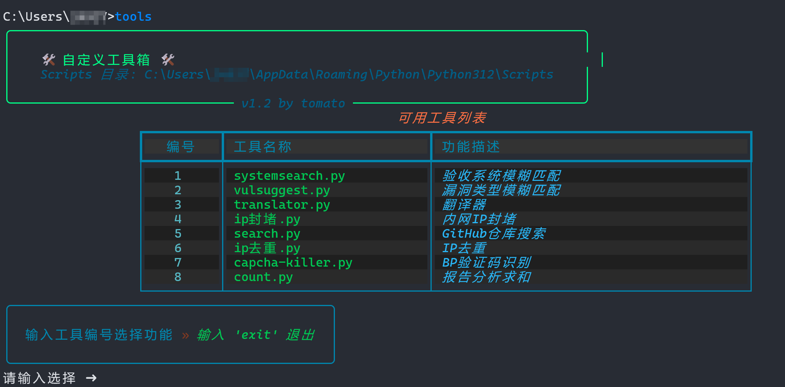

# **🛠️ 自定义工具箱 使用指南**

## **📌 项目介绍**(具体功能自己加,只是示例)

本工具提供了快速运行自己python自定义的工具。用户可以通过 **命令行界面** 选择需要的工具并运行。下面这些功能是示例,具体根据自己需求加,将自己的python文件放入到`C:\Users\xxx\AppData\Roaming\Python\Python312\Scripts\`目录下然后修改代码即可,如:`(9,'test.py','测试')`

**📂 示例功能**

| **编号** | **工具名称**     | **功能描述**     |
| -------- | ---------------- | ---------------- |
| 1        | systemsearch.py  | 验收系统模糊匹配 |
| 2        | vulsuggest.py    | 漏洞类型模糊匹配 |
| 3        | translator.py    | 翻译器           |
| 4        | ip封堵.py        | 内网 IP 封堵     |
| 5        | search.py        | GitHub 仓库搜索  |
| 6        | ip去重.py        | IP 去重          |
| 7        | capcha-killer.py | BP 验证码识别    |
| 8        | count.py         | 报告分析求和     |

------

## **📥 环境配置**

### **1️⃣ 安装 Python**

本工具依赖 **Python 3.12** 及以上版本，请确保你的系统已安装 Python。

🔹 **检查 Python 版本**

```sh
python --version
```

如果 Python 版本 **低于 3.12**，请前往 [Python 官网](https://www.python.org/downloads/) 下载并安装最新版本。

------

### **2️⃣ 安装依赖库**

本工具使用了 `rich` 进行美化输出，需先安装相关库。

🔹 **安装 rich**

```sh
pip install rich
```

------

### **3️⃣ 配置环境变量**

确保 `Python` 和 `Scripts` 目录已添加到 `PATH`，否则可能无法直接运行 `pip` 或 `Python` 脚本。

#### **✅ 方法 1：自动获取 `Scripts` 目录**

运行以下 Python 代码，自动获取 `Scripts` 目录：

```python
import subprocess
result = subprocess.run(["where", "pip"], capture_output=True, text=True, shell=True)
paths = result.stdout.strip().split("\n")

for path in paths:
    print(path.strip())  # 输出 pip.exe 所在目录
```

**正确的 Scripts 目录示例：**

```
C:\Users\xxx\AppData\Roaming\Python\Python312\Scripts\
```

将该路径添加到 `PATH` 环境变量中。

#### **✅ 方法 2：手动配置**

1. **打开环境变量设置**
   - **Windows 11/10**：按 `Win + R`，输入 `sysdm.cpl`，回车 ➜ 选择 **高级** ➜ **环境变量**
   - **Windows 7**：右键 **计算机** ➜ **属性** ➜ **高级系统设置** ➜ **环境变量**
2. **找到 `Path` 变量**
   - 在 **系统变量** 或 **用户变量** 中找到 `Path`，点击 **编辑**
3. **添加 Python `Scripts` 目录**
   - 例如：`C:\Users\xxx\AppData\Roaming\Python\Python312\Scripts\`
   - 也可以添加 `C:\Program Files\Python312\Scripts\`
4. **点击确定，并重启命令行**，使更改生效。

------

## **🚀 运行工具**

🔹 **启动工具菜单**

```sh
python tools.py
```

运行后，你会看到如下界面：



🔹 **选择工具** 直接输入对应的 **编号**，例如：

```
请输入选择 ➜  2
```

如果 `vulsuggest.py` 存在，则程序会自动运行它。

------

## **❓ 常见问题**

### **1️⃣ 运行时报错：找不到 Python**

如果运行 `python main.py` 时提示 `Python: command not found` 或 `python 不是内部或外部命令`，请确认：

- 是否正确安装了 Python
- 是否已将 Python 和 `Scripts` 目录添加到 `PATH`

**解决方法：**

- **检查 Python 安装路径**

  ```sh
  where python
  ```

- **手动指定 Python**

  ```sh
  C:\Users\xxx\AppData\Local\Programs\Python\Python312\python.exe main.py
  ```

------

### **2️⃣ 运行时报错：ModuleNotFoundError**

如果运行时报错：

```
ModuleNotFoundError: No module named 'rich'
```

**解决方案：**

```sh
pip install rich
```

------

### **3️⃣ 运行后找不到工具**

如果选择某个编号后提示：

```
❗ 文件不存在: xxxxx.py
请检查 C:\Users\2xxx\AppData\Roaming\Python\Python312\Scripts 目录是否正确
```

**解决方案：**

1. **检查 `Scripts` 目录是否正确**
    运行：

   ```sh
   python -c "import os; print(os.path.join(os.path.dirname(sys.executable), 'Scripts'))"
   ```

   确保 `Scripts` 目录正确。

2. **检查 Python 是否匹配**
    运行：

   ```sh
   python --version
   ```

   确保 Python 版本与你安装 `pip` 的版本一致。

------

## **📌 其他说明**

- 如果你希望添加新的工具，只需将 Python 脚本放入 **Scripts 目录**，然后在 `TOOLS` 列表中添加对应项即可。

- 如果遇到问题，可以尝试手动运行：

  ```sh
  python "C:\Users\xxx\AppData\Roaming\Python\Python312\Scripts\your_script.py"
  ```

  看是否能正常运行。

------

## **🎉 结语**

感谢使用 **自定义工具箱** 🎯
 如果有任何问题，欢迎交流！ 🚀