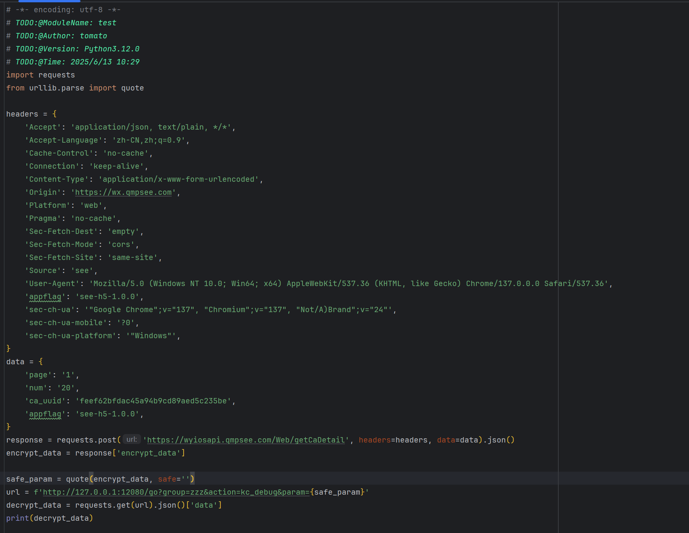

# 调用文档

#### I 远程调用0：

##### 接口传js代码让浏览器执行

浏览器已经连接上通信后 调用execjs接口就行

```
import requests

js_code = """
(function(){
    console.log("test")
    return "执行成功"
})()
"""

url = "http://localhost:12080/execjs"
data = {
    "group": "zzz",
    "code": js_code
}
res = requests.post(url, data=data)
print(res.text)
```

#### Ⅱ 远程调用1： 浏览器预先注册js方法 传递函数名调用

##### 远程调用1：无参获取值

```
// 注册一个方法 第一个参数hello为方法名，
// 第二个参数为函数，resolve里面的值是想要的值(发送到服务器的)
demo.regAction("hello", function (resolve) {
    //这样每次调用就会返回“好困啊+随机整数”
    var Js_sjz = "好困啊"+parseInt(Math.random()*1000);
    resolve(Js_sjz);
})
```

访问接口，获得js端的返回值http://127.0.0.1:12080/go?group=zzz&action=hello

##### 远程调用2：带参获取值

```
//写一个传入字符串，返回base64值的接口(调用内置函数btoa)
demo.regAction("hello2", function (resolve,param) {
    //这样添加了一个param参数，http接口带上它，这里就能获得
    var base666 = btoa(param)
    resolve(base666);
})
```

访问接口，获得js端的返回值 http://127.0.0.1:12080/go?group=zzz&action=hello2&param=123456

##### 远程调用3：带多个参获 并且使用post方式 取值

```
//假设有一个函数 需要传递两个参数
function hlg(User,Status){
    return User+"说："+Status;
}

demo.regAction("hello3", function (resolve,param) {
    //这里还是param参数 param里面的key 是先这里写，但到时候传接口就必须对应的上
    res=hlg(param["user"],param["status"])
    resolve(res);
})
```

访问接口，获得js端的返回值

```
url = "http://127.0.0.1:12080/go"
data = {
    "group": "zzz",
    "action": "hello3",
    "param": json.dumps({"user":"黑脸怪","status":"好困啊"})
}
print(data["param"]) #dumps后就是长这样的字符串{"user": "\u9ed1\u8138\u602a", "status": "\u597d\u56f0\u554a"}
res=requests.post(url, data=data) #这里换get也是可以的
print(res.text)
```

##### 远程调用4：获取页面基础信息

```
resp = requests.get("http://127.0.0.1:12080/page/html?group=zzz")     # 直接获取当前页面的html
resp = requests.get("http://127.0.0.1:12080/page/cookie?group=zzz")   # 直接获取当前页面的cookie
```

# 案例

### 第一步:断点定义函数

```js
// 给 Kc 包装一个调试版本
window.kc_debug = function(data) {
    console.log("[kc_debug] 输入参数:", data);
    let result = Kc(data);
    console.log("[kc_debug] 解密结果:", result);
    return result;
};
```


******

### 第二步:放掉断点注入环境

```js
var rpc_client_id, Hlclient = function (wsURL) {
    this.wsURL = wsURL;
    this.handlers = {
        _execjs: function (resolve, param) {
            var res = eval(param)
            if (!res) {
                resolve("没有返回值")
            } else {
                resolve(res)
            }
        }
    };
    this.socket = undefined;
    if (!wsURL) {
        throw new Error('wsURL can not be empty!!')
    }
    this.connect()
}
Hlclient.prototype.connect = function () {
    if (this.wsURL.indexOf("clientId=") === -1 && rpc_client_id) {
        this.wsURL += "&clientId=" + rpc_client_id
    }
    console.log('begin of connect to wsURL: ' + this.wsURL);
    var _this = this;
    try {
        this.socket = new WebSocket(this.wsURL);
        this.socket.onmessage = function (e) {
            _this.handlerRequest(e.data)
        }
    } catch (e) {
        console.log("connection failed,reconnect after 10s");
        setTimeout(function () {
            _this.connect()
        }, 10000)
    }
    this.socket.onclose = function () {
        console.log('rpc已关闭');
        setTimeout(function () {
            _this.connect()
        }, 10000)
    }
    this.socket.addEventListener('open', (event) => {
        console.log("rpc连接成功");
    });
    this.socket.addEventListener('error', (event) => {
        console.error('rpc连接出错,请检查是否打开服务端:', event.error);
    })
};
Hlclient.prototype.send = function (msg) {
    this.socket.send(msg)
}
Hlclient.prototype.regAction = function (func_name, func) {
    if (typeof func_name !== 'string') {
        throw new Error("an func_name must be string");
    }
    if (typeof func !== 'function') {
        throw new Error("must be function");
    }
    console.log("register func_name: " + func_name);
    this.handlers[func_name] = func;
    return true
}
Hlclient.prototype.handlerRequest = function (requestJson) {
    var _this = this;
    try {
        var result = JSON.parse(requestJson)
    } catch (error) {
        console.log("请求信息解析错误", requestJson);
        return
    }
    if (result["registerId"]) {
        rpc_client_id = result['registerId']
        return
    }
    if (!result['action'] || !result["message_id"]) {
        console.warn('没有方法或者消息id,不处理');
        return
    }
    var action = result["action"], message_id = result["message_id"]
    var theHandler = this.handlers[action];
    if (!theHandler) {
        this.sendResult(action, message_id, 'action没找到');
        return
    }
    try {
        if (!result["param"]) {
            theHandler(function (response) {
                _this.sendResult(action, message_id, response);
            })
            return
        }
        var param = result["param"]
        try {
            param = JSON.parse(param)
        } catch (e) {
        }
        theHandler(function (response) {
            _this.sendResult(action, message_id, response);
        }, param)
    } catch (e) {
        console.log("error: " + e);
        _this.sendResult(action, message_id, e);
    }
}
Hlclient.prototype.sendResult = function (action, message_id, e) {
    if (typeof e === 'object' && e !== null) {
        try {
            e = JSON.stringify(e)
        } catch (v) {
            console.log(v)//不是json无需操作
        }
    }
    this.send(JSON.stringify({"action": action, "message_id": message_id, "response_data": e}));
}
```


******

### 第三步:建立连接

- 本地监听


- 建立连接

```js
var demo = new Hlclient("ws://127.0.0.1:12080/ws?group=zzz");
```


******

### 第四步:注册动作

```js
// 注意这个注册动作的名字
demo.regAction("kc_debug", function (resolve, param) {
    try {
        let result = kc_debug(param);  // 或者直接用 Kc(param)
        resolve(result);
    } catch (e) {
        resolve("解密失败：" + e.toString());
    }
});
```


******

### 第五步:调用

- `get`请求,动作需要和注册的动作一致

```py
from urllib.parse import quote

safe_param = quote(encrypt_data, safe='')
url = f'http://127.0.0.1:12080/go?group=zzz&action=kc_debug&param={safe_param}'
decrypt_data = requests.get(url).json()['data']
print(decrypt_data)
```

```py
# -*- encoding: utf-8 -*-
# TODO:@ModuleName: test
# TODO:@Author: tomato
# TODO:@Version: Python3.12.0
# TODO:@Time: 2025/6/13 10:29
import requests
from urllib.parse import quote

headers = {
    'Accept': 'application/json, text/plain, */*',
    'Accept-Language': 'zh-CN,zh;q=0.9',
    'Cache-Control': 'no-cache',
    'Connection': 'keep-alive',
    'Content-Type': 'application/x-www-form-urlencoded',
    'Origin': 'https://wx.qmpsee.com',
    'Platform': 'web',
    'Pragma': 'no-cache',
    'Sec-Fetch-Dest': 'empty',
    'Sec-Fetch-Mode': 'cors',
    'Sec-Fetch-Site': 'same-site',
    'Source': 'see',
    'User-Agent': 'Mozilla/5.0 (Windows NT 10.0; Win64; x64) AppleWebKit/537.36 (KHTML, like Gecko) Chrome/137.0.0.0 Safari/537.36',
    'appflag': 'see-h5-1.0.0',
    'sec-ch-ua': '"Google Chrome";v="137", "Chromium";v="137", "Not/A)Brand";v="24"',
    'sec-ch-ua-mobile': '?0',
    'sec-ch-ua-platform': '"Windows"',
}
data = {
    'page': '1',
    'num': '20',
    'ca_uuid': 'feef62bfdac45a94b9cd89aed5c235be',
    'appflag': 'see-h5-1.0.0',
}
response = requests.post('https://wyiosapi.qmpsee.com/Web/getCaDetail', headers=headers, data=data).json()
encrypt_data = response['encrypt_data']

safe_param = quote(encrypt_data, safe='')
url = f'http://127.0.0.1:12080/go?group=zzz&action=kc_debug&param={safe_param}'
decrypt_data = requests.get(url).json()['data']
print(decrypt_data)
```



- 效果如图


******