### 对密文解密

> “内容仅用于学习,非法使用`与作者无关`”
>
> https://wx.qmpsee.com/articleDetail?id=feef62bfdac45a94b9cd89aed5c235be

- 正常情况下获取响应内容是密文,具体内容如下

```py
import requests

headers = {
    'Accept': 'application/json, text/plain, */*',
    'Accept-Language': 'zh-CN,zh;q=0.9',
    'Cache-Control': 'no-cache',
    'Connection': 'keep-alive',
    'Content-Type': 'application/x-www-form-urlencoded',
    'Origin': 'https://wx.qmpsee.com',
    'Platform': 'web',
    'Pragma': 'no-cache',
    'Sec-Fetch-Dest': 'empty',
    'Sec-Fetch-Mode': 'cors',
    'Sec-Fetch-Site': 'same-site',
    'Source': 'see',
    'User-Agent': 'Mozilla/5.0 (Windows NT 10.0; Win64; x64) AppleWebKit/537.36 (KHTML, like Gecko) Chrome/134.0.0.0 Safari/537.36',
    'sec-ch-ua': '"Chromium";v="134", "Not:A-Brand";v="24", "Google Chrome";v="134"',
    'sec-ch-ua-mobile': '?0',
    'sec-ch-ua-platform': '"Windows"',
}

data = {
    'page': '1',
    'num': '20',
    'ca_uuid': 'feef62bfdac45a94b9cd89aed5c235be',
}
response = requests.post('https://wyiosapi.qmpsee.com/Web/getCaDetail', headers=headers, data=data)
print(response.text)
```

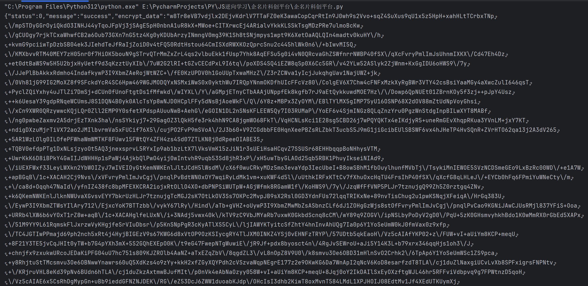

*****

### 断点调试

> 访问站点,定位关键字进行断点调试

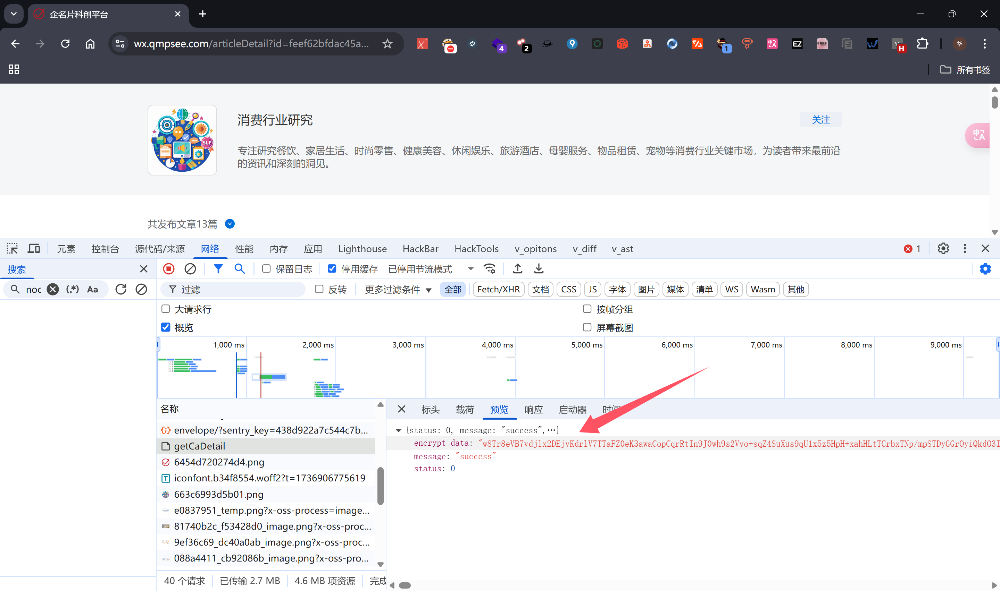

- 分析载荷,发现`encrypt_data`不就是我们响应内容里的`encrypt_data`吗
- 尝试搜索定位该关键字

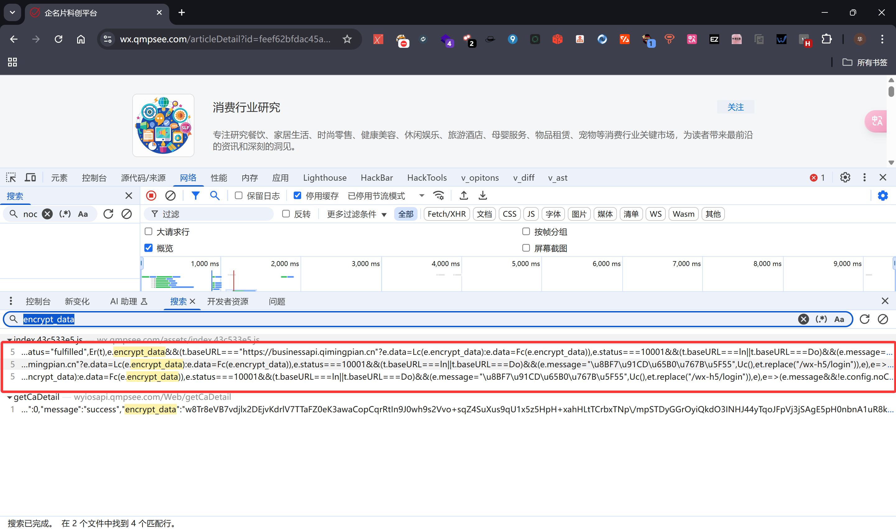

- 打上断点,刷新网页

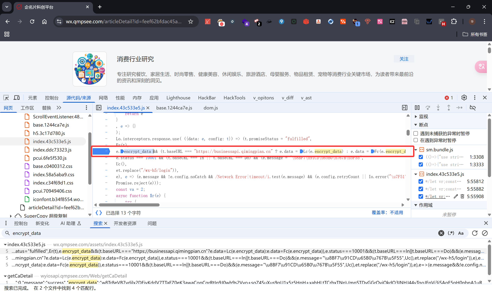

- 发现停在了`Fc()`这里

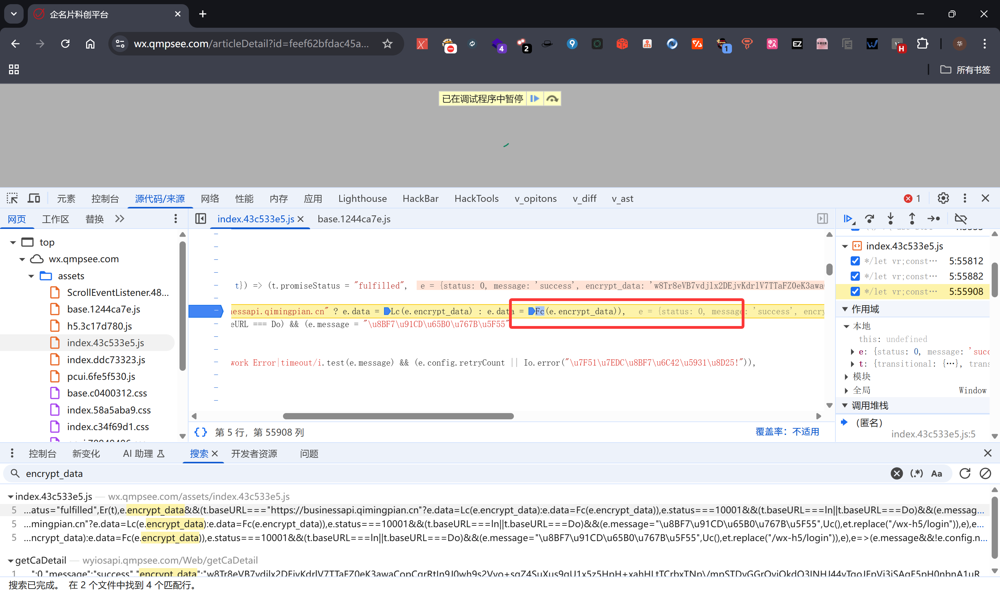

- 在控制台打印`e`和`e.encrypt_data`

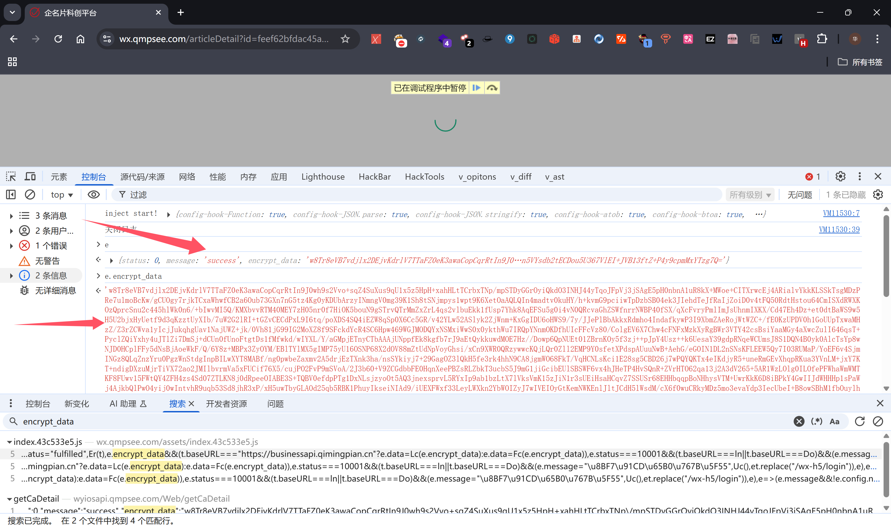

- 可以发现`e`就是response获取的响应内容,`e.encrypt_data`即在响应内容里提取的`encrypt_data`,关键代码实现如下

```py
encrypt_data = response.json()['encrypt_data']
```

- 步入下一个函数调用,发现`e`被传入`FC()`函数,打上断点

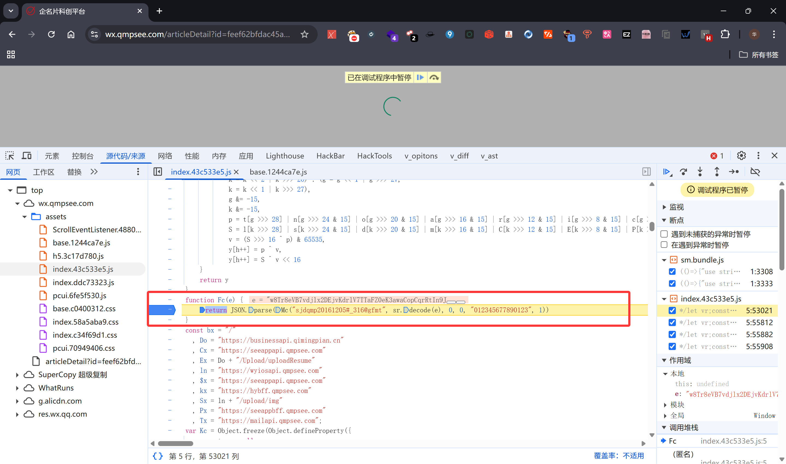

- 在控制台打印`Fc(e.encrypt_data)`发现打印不了,打印`F(e)`看一下

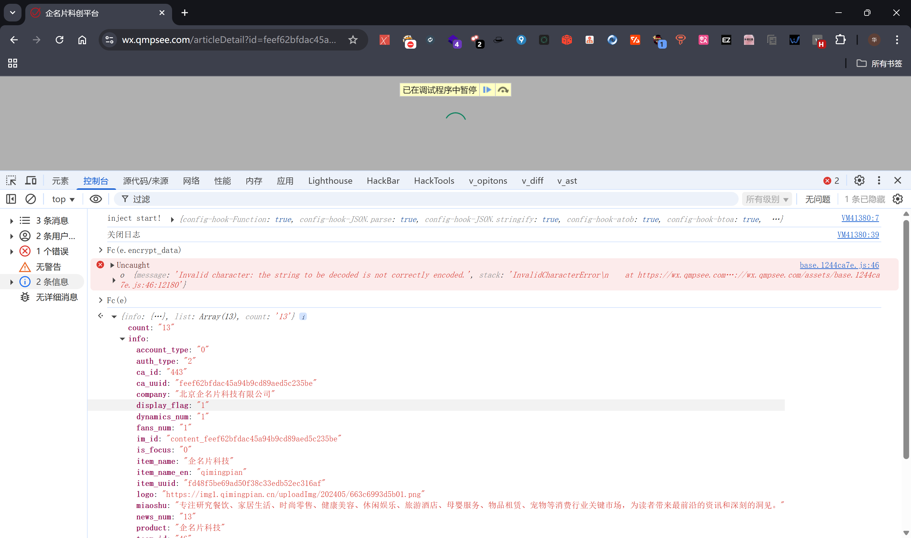

- 发现是解密后的内容

*****

### 尝试补环境

- 将`Fc()`和`密文`复制到本地用`console.log()`打印

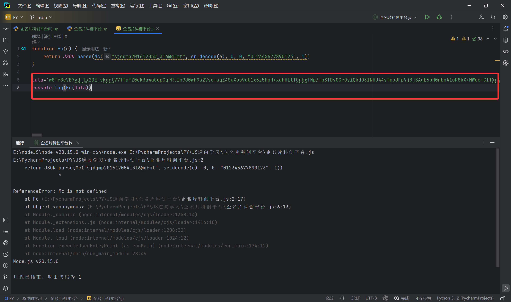

- 发现报错了,`Mc is not defined`,继续将`Mc()`复制到本地

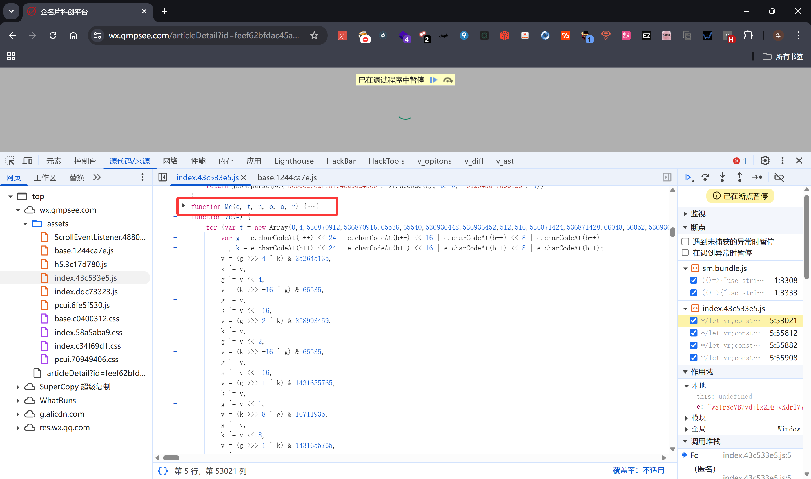

- 继续运行js,发现报错`sr is not defined`

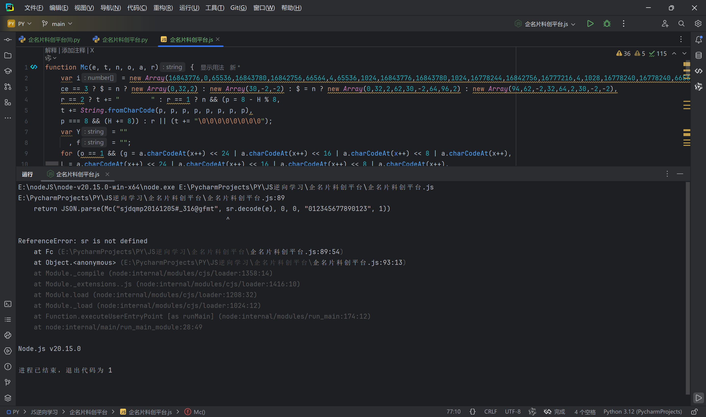

- 步入,发现`sr`这里调用了一个`function(p)`,但是不叫`sr`而是`l`

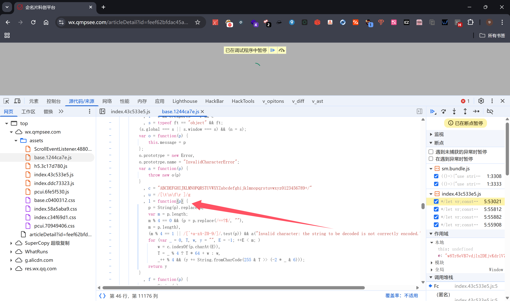

- 继续运行发现`u`又没有定义

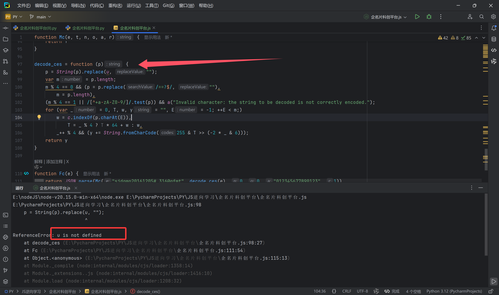

- 仔细观察`u`就在`function(p)`前面一点,复制进js,然后运行又发现`c`也没定义

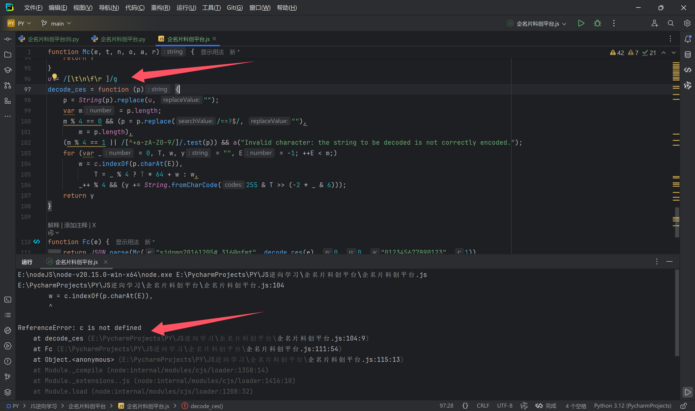

- 现在是`Vc()`也没有定义

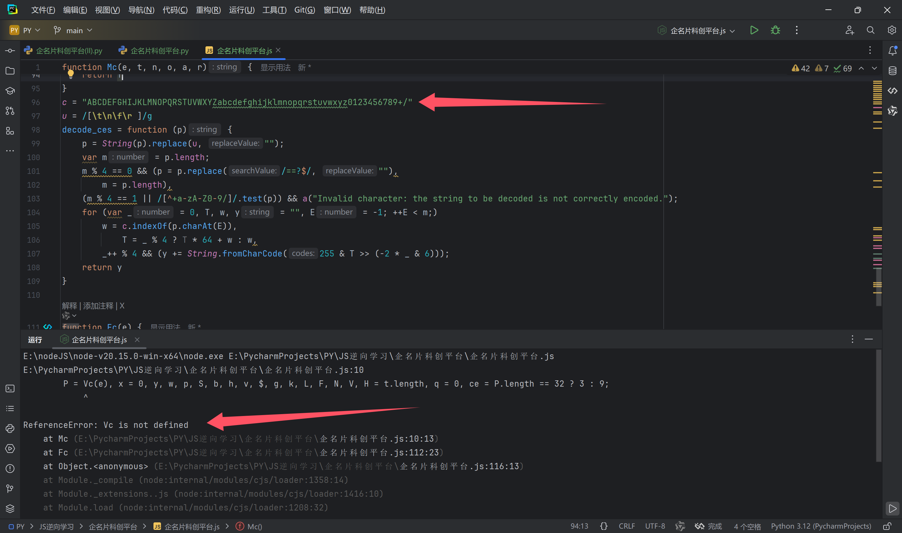

- 把`Vc()`复制进js

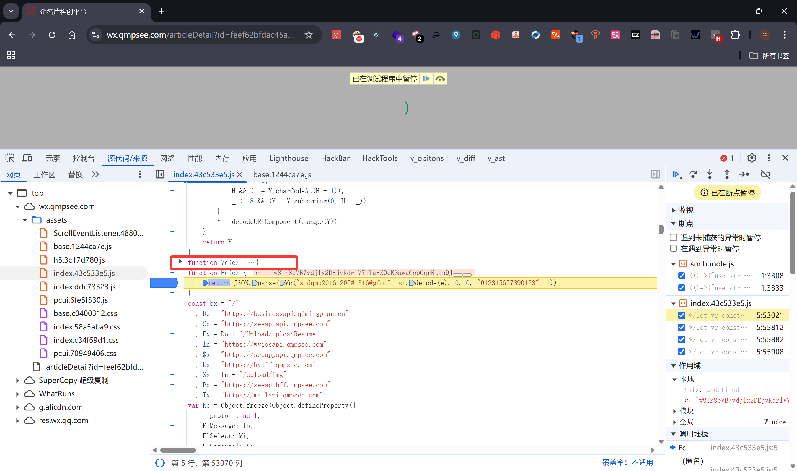

- 成功拿到数据

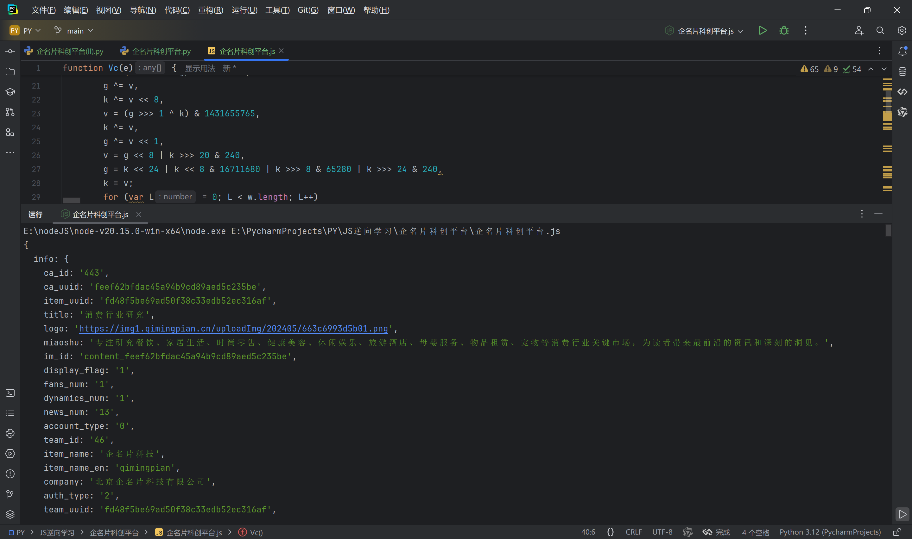

*****

### 开始编写Python动态解密

- 这里不用`excjs`因为长期没有维护,有很多bug,用`py_mini_racer`

```py
import requests
from py_mini_racer import py_mini_racer

headers = {
    'Accept': 'application/json, text/plain, */*',
    'Accept-Language': 'zh-CN,zh;q=0.9',
    'Cache-Control': 'no-cache',
    'Connection': 'keep-alive',
    'Content-Type': 'application/x-www-form-urlencoded',
    'Origin': 'https://wx.qmpsee.com',
    'Platform': 'web',
    'Pragma': 'no-cache',
    'Sec-Fetch-Dest': 'empty',
    'Sec-Fetch-Mode': 'cors',
    'Sec-Fetch-Site': 'same-site',
    'Source': 'see',
    'User-Agent': 'Mozilla/5.0 (Windows NT 10.0; Win64; x64) AppleWebKit/537.36 (KHTML, like Gecko) Chrome/134.0.0.0 Safari/537.36',
    'sec-ch-ua': '"Chromium";v="134", "Not:A-Brand";v="24", "Google Chrome";v="134"',
    'sec-ch-ua-mobile': '?0',
    'sec-ch-ua-platform': '"Windows"',
}

data = {
    'page': '1',
    'num': '20',
    'ca_uuid': 'feef62bfdac45a94b9cd89aed5c235be',
}

response = requests.post('https://wyiosapi.qmpsee.com/Web/getCaDetail', headers=headers, data=data)
# TODO:截取encrypt_data
encrypt_data = response.json()['encrypt_data']
# TODO:创建py_mini_racer实例并执行JS代码
decrypt_data = py_mini_racer.MiniRacer()

with open('企名片科创平台.js', encoding='utf-8') as f:
    decrypt_data.eval(f.read())

# TODO:然后用 ctx.call 来调用函数
decrypt_data = decrypt_data.call('Fc', encrypt_data)

print(decrypt_data)
```

- 关键代码

```py
response = requests.post('https://wyiosapi.qmpsee.com/Web/getCaDetail', headers=headers, data=data)
# TODO:截取encrypt_data
encrypt_data = response.json()['encrypt_data']
# TODO:创建py_mini_racer实例并执行JS代码
decrypt_data = py_mini_racer.MiniRacer()

with open('企名片科创平台.js', encoding='utf-8') as f:
    decrypt_data.eval(f.read())

# TODO:然后用 ctx.call 来调用函数
decrypt_data = decrypt_data.call('Fc', encrypt_data)

print(decrypt_data)
```

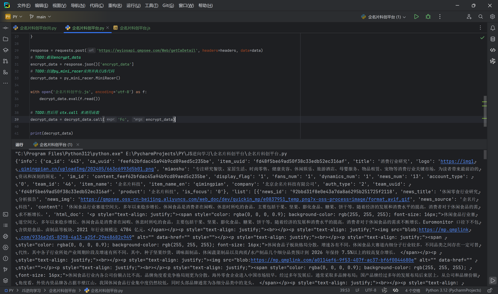

### 面向对象编程

```py
# -*- encoding: utf-8 -*-
# TODO:@ModuleName: 企名片科创平台(II) -->面向对象
# TODO:@Author: tomato
# TODO:@Version: Python3.12.0
# TODO:@Time: 2025/4/6 00:44

import requests
from py_mini_racer import py_mini_racer


class QMPDecryptor:
    """
    加载js解密
    """

    def __init__(self, js_file: str):
        self.js_file = js_file
        self.ctx = py_mini_racer.MiniRacer()
        with open(js_file, encoding='utf-8') as f:
            js_code = f.read()
        self.ctx.eval(js_code)

    def decrypt(self, encrypt_data: str):
        """
        :param encrypt_data:
        :return:
        """
        return self.ctx.call('Fc', encrypt_data)


class QMPRequest:
    """
    QMP “企名片” 科创平台 API 客户端，封装请求和解密流程。
    """
    BASE_URL = 'https://wyiosapi.qmpsee.com/Web/getCaDetail'

    def __init__(self, decryptor):
        self.decryptor = decryptor
        self.headers = {
            'Accept': 'application/json, text/plain, */*',
            'Accept-Language': 'zh-CN,zh;q=0.9',
            'Cache-Control': 'no-cache',
            'Connection': 'keep-alive',
            'Content-Type': 'application/x-www-form-urlencoded',
            'Origin': 'https://wx.qmpsee.com',
            'Platform': 'web',
            'Pragma': 'no-cache',
            'Sec-Fetch-Dest': 'empty',
            'Sec-Fetch-Mode': 'cors',
            'Sec-Fetch-Site': 'same-site',
            'Source': 'see',
            'User-Agent': 'Mozilla/5.0 (Windows NT 10.0; Win64; x64) '
                          'AppleWebKit/537.36 (KHTML, like Gecko) '
                          'Chrome/134.0.0.0 Safari/537.36',
            'sec-ch-ua': '"Chromium";v="134", "Not:A-Brand";v="24", "Google Chrome";v="134"',
            'sec-ch-ua-mobile': '?0',
            'sec-ch-ua-platform': '"Windows"',
        }

    def get_detail(self, page: int, num: int, ca_uuid: str) -> dict:
        """
        请求 getCaDetail 接口并返回解密后的数据。

        :param page: 页码
        :param num: 每页数量
        :param ca_uuid: ca_uuid 参数
        :return: 解密后的 Python dict
        """
        payload = {
            'page': str(page),
            'num': str(num),
            'ca_uuid': ca_uuid,
        }
        resp = requests.post(self.BASE_URL, headers=self.headers, data=payload)
        resp.raise_for_status()
        body = resp.json()
        encrypt_data = body.get('encrypt_data')
        if not encrypt_data:
            raise ValueError("接口返回数据中缺少 'encrypt_data'")
        return self.decryptor.decrypt(encrypt_data)


if __name__ == '__main__':
    # 1. 初始化解密器，传入 JS 文件路径
    decrypt = QMPDecryptor('企名片科创平台.js')
    # 2. 初始化请求客户端
    client = QMPRequest(decrypt)
    # 3. 调用接口并打印解密结果
    result = client.get_detail(1, 20, 'feef62bfdac45a94b9cd89aed5c235be')
    print(result)
```

