### sign签证逆向

> 仅用于学习,一切非法用途与作者`无关`

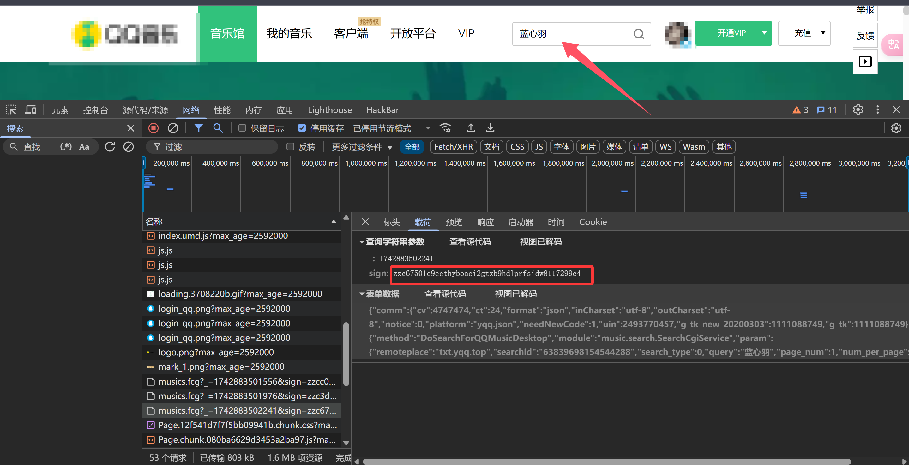

- 在登录以后尝试搜索关键字,发现在请求载荷里对`sign`进行加密处理
- 尝试利用`搜索`+`断点`进一步判断`sign`的加密逻辑
- 经过测试发现每次请求拿到的sign都是不一样的,说明有`时间戳`-->`_`:1742883502241

*****

### 时间戳生成

- 时间戳只有默认只有`10`位整数位,图中的时间戳有13位,说明`*1000`了然后取出整数位

```python
import time

temp = round(time.time() * 1000)
print(temp)
```

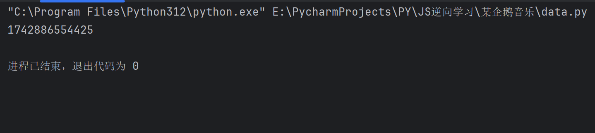

*****

### 搜索sign打断点

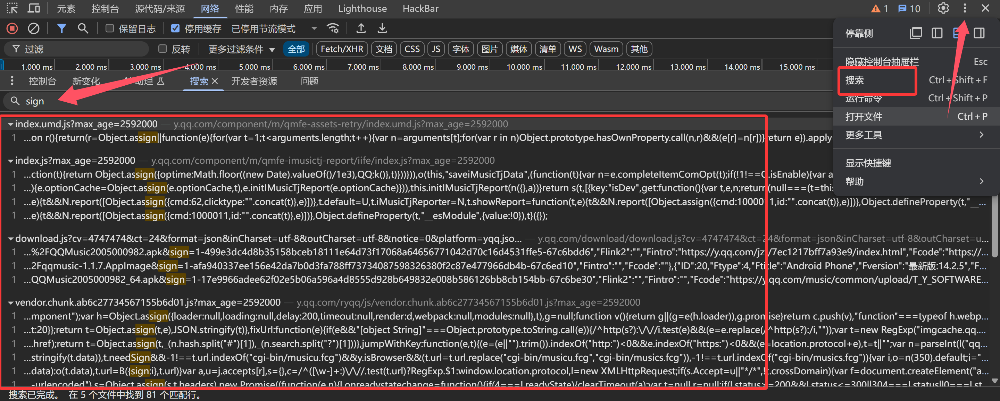

- 在5个文件中找到81个匹配行,不算多,可以手动打断点进行调试

- 第一处可疑的sign,打上断点

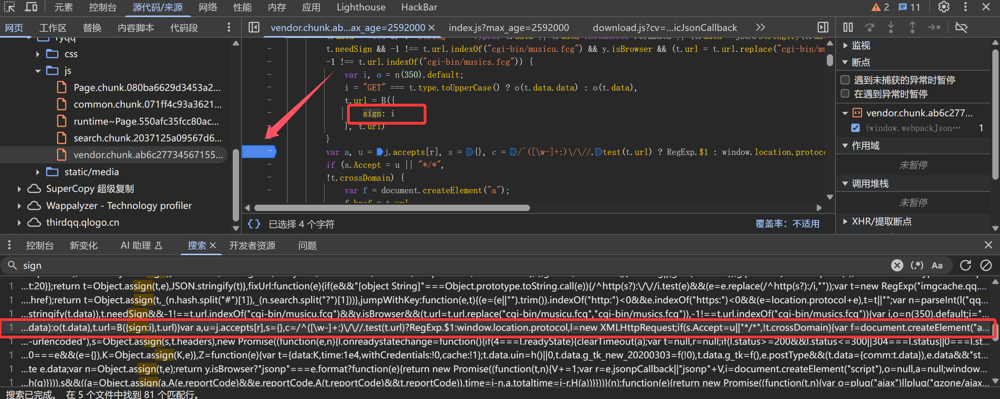

- 打上断点后

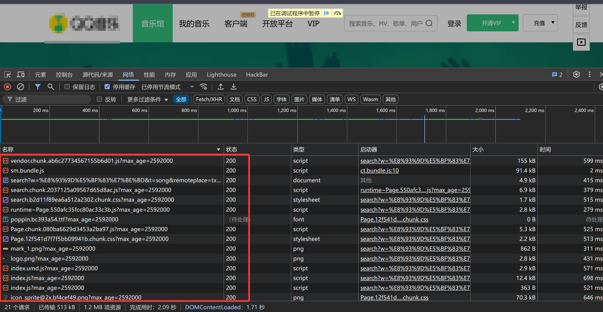

- 放行

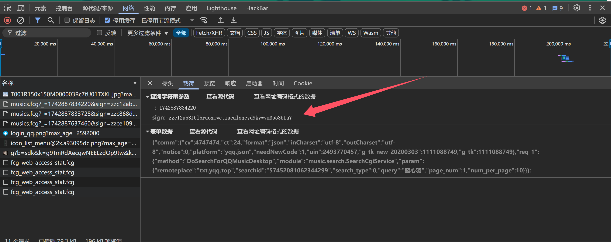

- 说明这个地方就是我们要找的地方,关键代码如下

```js
            var i, o = n(350).default;
            i = "GET" === t.type.toUpperCase() ? o(t.data.data) : o(t.data),
            t.url = B({
                sign: i
            }, t.url)
```

### 补环境本地调试

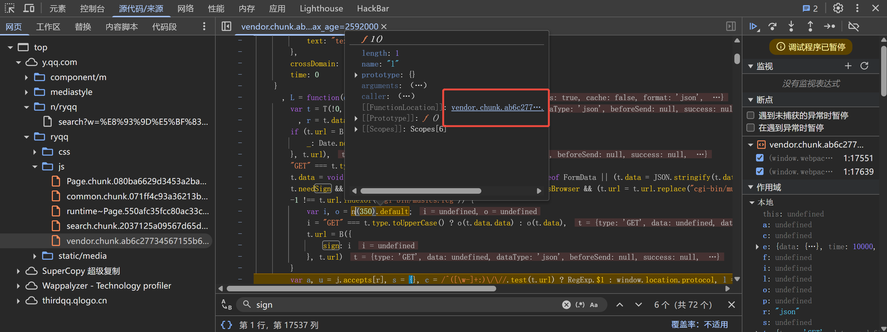

- 将`vendor.chunk.ab6c27734567155b6d01.js?max_age=2592000`下载到本地命名`demo1.js`(需要node.js环境),即当前js
- 将`runtime~Page.550afc35fcc80ac33c3b.js?max_age=2592000`也下载到本地命名`demo2.js`

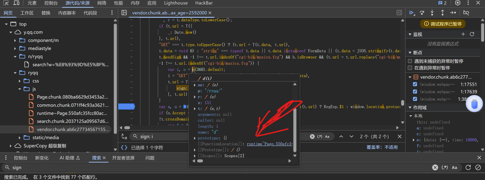

### 调用js获取sign

- 编辑`demo2.js`尝试调用获取sign

```js
function get_sign(data){
    // data = '{"comm":{"cv":4747474,"ct":24,"format":"json","inCharset":"utf-8","outCharset":"utf-8","notice":0,"platform":"yqq.json","needNewCode":1,"uin":403411124,"g_tk_new_20200303":1298293341,"g_tk":1298293341},"req_1":{"method":"DoSearchForQQMusicDesktop","module":"music.search.SearchCgiService","param":{"remoteplace":"txt.yqq.center","searchid":"58242797440520127","search_type":0,"query":"张杰","page_num":1,"num_per_page":10}}}'
    o = aef(350).default;
    return o(data)
}

data = '{"comm":{"cv":4747474,"ct":24,"format":"json","inCharset":"utf-8","outCharset":"utf-8","notice":0,"platform":"yqq.json","needNewCode":1,"uin":2493770457,"g_tk_new_20200303":1111088749,"g_tk":1111088749},"req_1":{"method":"DoSearchForQQMusicDesktop","module":"music.search.SearchCgiService","param":{"remoteplace":"txt.yqq.top","searchid":"63839698154544288","search_type":0,"query":"蓝心羽","page_num":1,"num_per_page":10}}}'
console.log(get_sign(data))
```

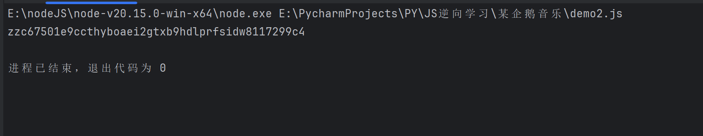

- 最终完整的`demo2.js`如下(demo1.js不变)

```js

// TODO:防止检测
window = global
document = {}
navigator = {
    userAgent: "Mozilla/5.0 (Windows NT 10.0; Win64; x64) AppleWebKit/537.36 (KHTML, like Gecko) Chrome/128.0.0.0 Safari/537.36"
}
location = {
    "ancestorOrigins": {},
    "href": "https://y.qq.com/n/ryqq/search?w=%E5%BC%A0%E6%9D%B0&t=song&remoteplace=txt.yqq.center",
    "origin": "https://y.qq.com",
    "protocol": "https:",
    "host": "y.qq.com",
    "hostname": "y.qq.com",
    "port": "",
    "pathname": "/n/ryqq/search",
    "search": "?w=%E5%BC%A0%E6%9D%B0&t=song&remoteplace=txt.yqq.center",
    "hash": ""
}
// TODO:防止检测，添加上述代码

var aef;
require('./demo1')
!function(e) {
    function t(t) {
        for (var r, n, d = t[0], f = t[1], i = t[2], l = 0, b = []; l < d.length; l++)
            n = d[l],
            Object.prototype.hasOwnProperty.call(o, n) && o[n] && b.push(o[n][0]),
            o[n] = 0;
        for (r in f)
            Object.prototype.hasOwnProperty.call(f, r) && (e[r] = f[r]);
        for (u && u(t); b.length; )
            b.shift()();
        return c.push.apply(c, i || []),
        a()
    }
    function a() {
        for (var e, t = 0; t < c.length; t++) {
            for (var a = c[t], r = !0, n = 1; n < a.length; n++) {
                var f = a[n];
                0 !== o[f] && (r = !1)
            }
            r && (c.splice(t--, 1),
            e = d(d.s = a[0]))
        }
        return e
    }
    var r = {}
      , n = {
        21: 0
    }
      , o = {
        21: 0
    }
      , c = [];
    function d(t) {
        if (r[t])
            return r[t].exports;
        var a = r[t] = {
            i: t,
            l: !1,
            exports: {}
        };
        return e[t].call(a.exports, a, a.exports, d),
        a.l = !0,
        a.exports
    }
    d.e = function(e) {
        var t = [];
        n[e] ? t.push(n[e]) : 0 !== n[e] && {
            1: 1,
            3: 1,
            4: 1,
            5: 1,
            6: 1,
            7: 1,
            8: 1,
            9: 1,
            10: 1,
            11: 1,
            12: 1,
            13: 1,
            14: 1,
            15: 1,
            16: 1,
            17: 1,
            18: 1,
            19: 1,
            20: 1,
            22: 1,
            23: 1,
            24: 1,
            25: 1,
            26: 1
        }[e] && t.push(n[e] = new Promise((function(t, a) {
            for (var r = "css/" + ({
                1: "common",
                3: "album",
                4: "albumDetail",
                5: "album_mall",
                6: "category",
                7: "cmtpage",
                8: "download_detail",
                9: "index",
                10: "msg_center",
                11: "mv",
                12: "mvList",
                13: "mv_toplist",
                14: "notfound",
                15: "player",
                16: "player_radio",
                17: "playlist",
                18: "playlist_edit",
                19: "profile",
                20: "radio",
                22: "search",
                23: "singer",
                24: "singer_list",
                25: "songDetail",
                26: "toplist"
            }[e] || e) + "." + {
                1: "092d215c4a601df90f9f",
                3: "5cf0d69eaf29bcab23d2",
                4: "798353db5b0eb05d5358",
                5: "df4c243f917604263e58",
                6: "20d532d798099a44bc88",
                7: "e3bedf2b5810f8db0684",
                8: "e3bedf2b5810f8db0684",
                9: "ea0adb959fef9011fc25",
                10: "020422608fe8bfb1719a",
                11: "8bdb1df6c5436b790baa",
                12: "47ce9300786df1b70584",
                13: "4aee33230ba2d6b81dce",
                14: "e6f63b0cf57dd029fbd6",
                15: "1d2dbefbea113438324a",
                16: "d893492de07ce97d8048",
                17: "9484fde660fe93d9f9f0",
                18: "67fb85e7f96455763c83",
                19: "5e8c651e74b13244f7cf",
                20: "3befd83c10b19893ec66",
                22: "b2d11f89ea6a512a2302",
                23: "c7a38353c5f4ebb47491",
                24: "df0961952a2d3f022894",
                25: "4c080567e394fd45608b",
                26: "8edb142553f97482e00f"
            }[e] + ".chunk.css?max_age=2592000", o = d.p + r, c = document.getElementsByTagName("link"), f = 0; f < c.length; f++) {
                var i = (u = c[f]).getAttribute("data-href") || u.getAttribute("href");
                if ("stylesheet" === u.rel && (i === r || i === o))
                    return t()
            }
            var l = document.getElementsByTagName("style");
            for (f = 0; f < l.length; f++) {
                var u;
                if ((i = (u = l[f]).getAttribute("data-href")) === r || i === o)
                    return t()
            }
            var b = document.createElement("link");
            b.rel = "stylesheet",
            b.type = "text/css",
            b.onload = t,
            b.onerror = function(t) {
                var r = t && t.target && t.target.src || o
                  , c = new Error("Loading CSS chunk " + e + " failed.\n(" + r + ")");
                c.code = "CSS_CHUNK_LOAD_FAILED",
                c.request = r,
                delete n[e],
                b.parentNode.removeChild(b),
                a(c)
            }
            ,
            b.href = o,
            0 !== b.href.indexOf(window.location.origin + "/") && (b.crossOrigin = "anonymous"),
            document.getElementsByTagName("head")[0].appendChild(b)
        }
        )).then((function() {
            n[e] = 0
        }
        )));
        var a = o[e];
        if (0 !== a)
            if (a)
                t.push(a[2]);
            else {
                var r = new Promise((function(t, r) {
                    a = o[e] = [t, r]
                }
                ));
                t.push(a[2] = r);
                var c, f = document.createElement("script");
                f.charset = "utf-8",
                f.timeout = 120,
                d.nc && f.setAttribute("nonce", d.nc),
                f.src = function(e) {
                    return d.p + "js/" + ({
                        1: "common",
                        3: "album",
                        4: "albumDetail",
                        5: "album_mall",
                        6: "category",
                        7: "cmtpage",
                        8: "download_detail",
                        9: "index",
                        10: "msg_center",
                        11: "mv",
                        12: "mvList",
                        13: "mv_toplist",
                        14: "notfound",
                        15: "player",
                        16: "player_radio",
                        17: "playlist",
                        18: "playlist_edit",
                        19: "profile",
                        20: "radio",
                        22: "search",
                        23: "singer",
                        24: "singer_list",
                        25: "songDetail",
                        26: "toplist"
                    }[e] || e) + ".chunk." + {
                        1: "de6581f2def9617ccbbf",
                        3: "083f4bedea27bd759fa8",
                        4: "ddb07cf19055a507f7bc",
                        5: "1958372c747f2e6cab81",
                        6: "ecf851c256300da945cd",
                        7: "06df487767ec387cb697",
                        8: "3568dd068a186940085d",
                        9: "faabfe3b5c0102491424",
                        10: "9c9c3c33cb00d9d71b5d",
                        11: "9fa7beb93273a759fa9d",
                        12: "37887713f06998591141",
                        13: "ac1d62f1b9b3292720ea",
                        14: "e65157daad9e48c61b29",
                        15: "3f539e43b1d679ab6d96",
                        16: "10a8710fe2935062a299",
                        17: "43f0560edb8cff5e7258",
                        18: "fdc86ec0aacb6de9e87b",
                        19: "c8815a6c337766f72d71",
                        20: "e637843ca60a6c453ffa",
                        22: "120d19c56811449607a6",
                        23: "ac19afeac81ab4813117",
                        24: "cec4a79a413936ab70b1",
                        25: "7d00629b646020806591",
                        26: "189feec95fe1254dd16c"
                    }[e] + ".js?max_age=2592000"
                }(e),
                0 !== f.src.indexOf(window.location.origin + "/") && (f.crossOrigin = "anonymous");
                var i = new Error;
                c = function(t) {
                    f.onerror = f.onload = null,
                    clearTimeout(l);
                    var a = o[e];
                    if (0 !== a) {
                        if (a) {
                            var r = t && ("load" === t.type ? "missing" : t.type)
                              , n = t && t.target && t.target.src;
                            i.message = "Loading chunk " + e + " failed.\n(" + r + ": " + n + ")",
                            i.name = "ChunkLoadError",
                            i.type = r,
                            i.request = n,
                            a[1](i)
                        }
                        o[e] = void 0
                    }
                }
                ;
                var l = setTimeout((function() {
                    c({
                        type: "timeout",
                        target: f
                    })
                }
                ), 12e4);
                f.onerror = f.onload = c,
                document.head.appendChild(f)
            }
        return Promise.all(t)
    }
    ,
    d.m = e,
    d.c = r,
    d.d = function(e, t, a) {
        d.o(e, t) || Object.defineProperty(e, t, {
            enumerable: !0,
            get: a
        })
    }
    ,
    d.r = function(e) {
        "undefined" !== typeof Symbol && Symbol.toStringTag && Object.defineProperty(e, Symbol.toStringTag, {
            value: "Module"
        }),
        Object.defineProperty(e, "__esModule", {
            value: !0
        })
    }
    ,
    d.t = function(e, t) {
        if (1 & t && (e = d(e)),
        8 & t)
            return e;
        if (4 & t && "object" === typeof e && e && e.__esModule)
            return e;
        var a = Object.create(null);
        if (d.r(a),
        Object.defineProperty(a, "default", {
            enumerable: !0,
            value: e
        }),
        2 & t && "string" != typeof e)
            for (var r in e)
                d.d(a, r, function(t) {
                    return e[t]
                }
                .bind(null, r));
        return a
    }
    ,
    d.n = function(e) {
        var t = e && e.__esModule ? function() {
            return e.default
        }
        : function() {
            return e
        }
        ;
        return d.d(t, "a", t),
        t
    }
    ,
    d.o = function(e, t) {
        return Object.prototype.hasOwnProperty.call(e, t)
    }
    ,
    d.p = "/ryqq/",
    d.oe = function(e) {
        throw e
    }
    ;
    var f = window.webpackJsonp = window.webpackJsonp || []
      , i = f.push.bind(f);
    f.push = t,
    f = f.slice();
    for (var l = 0; l < f.length; l++)
        t(f[l]);
    var u = i;
    a()
    aef = d
}([]);

//TODO:创建函数本地调用
function get_sign(data){
    // data = '{"comm":{"cv":4747474,"ct":24,"format":"json","inCharset":"utf-8","outCharset":"utf-8","notice":0,"platform":"yqq.json","needNewCode":1,"uin":403411124,"g_tk_new_20200303":1298293341,"g_tk":1298293341},"req_1":{"method":"DoSearchForQQMusicDesktop","module":"music.search.SearchCgiService","param":{"remoteplace":"txt.yqq.center","searchid":"58242797440520127","search_type":0,"query":"张杰","page_num":1,"num_per_page":10}}}'
    o = aef(350).default;
    return o(data)
}

data = '{"comm":{"cv":4747474,"ct":24,"format":"json","inCharset":"utf-8","outCharset":"utf-8","notice":0,"platform":"yqq.json","needNewCode":1,"uin":2493770457,"g_tk_new_20200303":1111088749,"g_tk":1111088749},"req_1":{"method":"DoSearchForQQMusicDesktop","module":"music.search.SearchCgiService","param":{"remoteplace":"txt.yqq.top","searchid":"63839698154544288","search_type":0,"query":"蓝心羽","page_num":1,"num_per_page":10}}}'
console.log(get_sign(data))
```

### 在py中调用

```python
import execjs
import time

data = '{"comm":{"cv":4747474,"ct":24,"format":"json","inCharset":"utf-8","outCharset":"utf-8","notice":0,"platform":"yqq.json","needNewCode":1,"uin":2493770457,"g_tk_new_20200303":1111088749,"g_tk":1111088749},"req_1":{"method":"DoSearchForQQMusicDesktop","module":"music.search.SearchCgiService","param":{"remoteplace":"txt.yqq.top","searchid":"63839698154544288","search_type":0,"query":"蓝心羽","page_num":1,"num_per_page":10}}}'
temp = int(time.time() * 1000)
with open('demo2.js', 'r', encoding='utf-8') as f:
    js = execjs.compile(f.read())
params = {
    '_': temp,
    'sign': js.call('get_sign', data),
}
print(params)
```

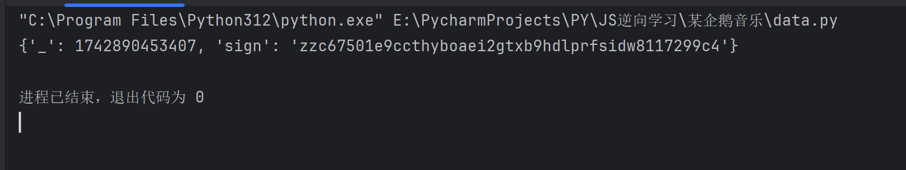

### 最终完整的爬虫代码

```py
import execjs
import time
import requests

# TODO:生成时间戳
temp = round(time.time() * 1000)

cookies = {
    'qq_domain_video_guid_verify': '9a93a915cdd5f09f',
    '_qimei_uuid42': '18408122826100dd5f38f6744a81019c72aa7e4f64',
    '_qimei_fingerprint': '9114f62c86c2518d13892e1ed49b83df',
    '_qimei_q36': '',
    '_qimei_h38': '2db8c1775f38f6744a81019c0200000cf18408',
    'RK': 'Mw/Z2+fi17',
    'ptcz': '93e1ceb64ae737477667352083426c87ba05cd8c73c9724eba3f89dc1a7f1249',
    'eas_sid': '41N7R1k5f8k7M5j9N3A4u7l6P3',
    'LW_uid': 'k1P7Y1r5U8a7b6T2A821E6g3y9',
    'LW_sid': 'Y1b7S1Z8w7U8H7P3F5v4e3y1C9',
    'pgv_pvid': '7052159198',
    'fqm_pvqid': 'c73f16a9-94d2-4f9a-99c1-22692c6fddca',
    'ts_refer': 'www.baidu.com/link',
    'ts_uid': '427273887',
    'fqm_sessionid': '5711fb4b-4411-44a3-b594-7342621238ec',
    'pgv_info': 'ssid=s3589111690',
    '_qpsvr_localtk': '0.6864062856093633',
    'ptui_loginuin': '403411124',
    'login_type': '1',
    'psrf_qqaccess_token': '4F7EF764FA92D178357FB82E2AFE3177',
    'psrf_access_token_expiresAt': '1734605605',
    'psrf_musickey_createtime': '1726829605',
    'wxopenid': '',
    'psrf_qqopenid': 'FDBCD66A37B20B608EF1F6048C22702D',
    'qm_keyst': 'Q_H_L_63k3N_ESg9c-cTJyjzyR14h3IP0RsOFBvjPVkUfTtw_xs5R-dQRgfuqyTtWGF1t5dEwzN0IXRQBD-o-RoDlY6Xg',
    'tmeLoginType': '2',
    'wxunionid': '',
    'psrf_qqrefresh_token': '00446E9574D2C3E2B675581C2BCA0F59',
    'wxrefresh_token': '',
    'euin': '7eni7e65oK-P',
    'music_ignore_pskey': '202306271436Hn@vBj',
    'qqmusic_key': 'Q_H_L_63k3N_ESg9c-cTJyjzyR14h3IP0RsOFBvjPVkUfTtw_xs5R-dQRgfuqyTtWGF1t5dEwzN0IXRQBD-o-RoDlY6Xg',
    'psrf_qqunionid': 'F0BEC60816CFE96B66BC61F36AA1659A',
    'uin': '403411124',
    'ts_last': 'y.qq.com/n/ryqq/search',
}
# TODO:请求头部
headers = {
    'accept': 'application/json',
    'accept-language': 'zh-CN,zh;q=0.9',
    'cache-control': 'no-cache',
    'content-type': 'application/x-www-form-urlencoded',
    'origin': 'https://y.qq.com',
    'pragma': 'no-cache',
    'priority': 'u=1, i',
    'referer': 'https://y.qq.com/',
    'sec-ch-ua': '"Chromium";v="128", "Not;A=Brand";v="24", "Google Chrome";v="128"',
    'sec-ch-ua-mobile': '?0',
    'sec-ch-ua-platform': '"Windows"',
    'sec-fetch-dest': 'empty',
    'sec-fetch-mode': 'cors',
    'sec-fetch-site': 'same-site',
    'user-agent': 'Mozilla/5.0 (Windows NT 10.0; Win64; x64) AppleWebKit/537.36 (KHTML, like Gecko) Chrome/128.0.0.0 Safari/537.36',
}
# TODO:请求参数
data = '{"comm":{"cv":4747474,"ct":24,"format":"json","inCharset":"utf-8","outCharset":"utf-8","notice":0,"platform":"yqq.json","needNewCode":1,"uin":2493770457,"g_tk_new_20200303":1111088749,"g_tk":1111088749},"req_1":{"method":"DoSearchForQQMusicDesktop","module":"music.search.SearchCgiService","param":{"remoteplace":"txt.yqq.top","searchid":"63839698154544288","search_type":0,"query":"蓝心羽","page_num":1,"num_per_page":10}}}'

# TODO:使用UTF-8读取js文件
with open('demo2.js', 'r', encoding='utf-8') as f:
    js = execjs.compile(f.read())

params = {
    '_': temp,
    'sign': js.call('get_sign', data),
}
print(params)
response = requests.post('https://u6.y.qq.com/cgi-bin/musics.fcg', params=params, cookies=cookies, headers=headers, data=data.encode())
print(response.content.decode())
```

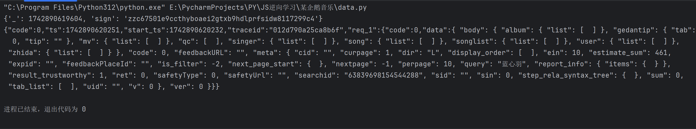

- 成功拿到响应内容!