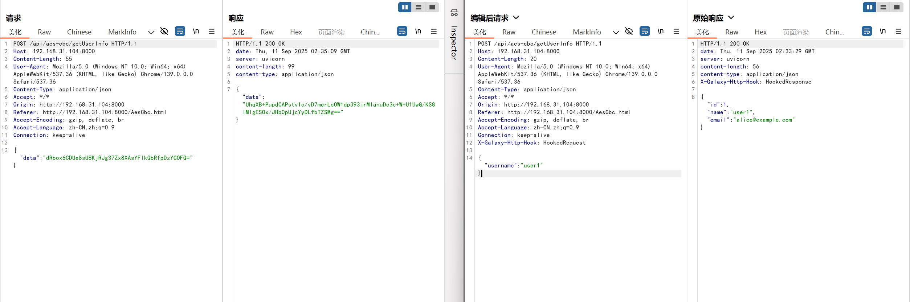
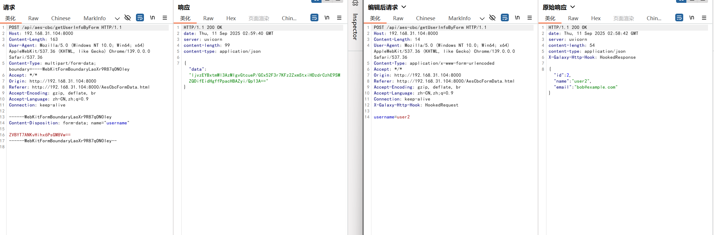
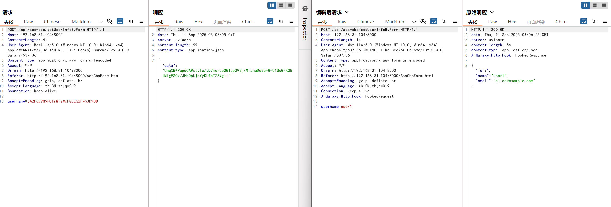
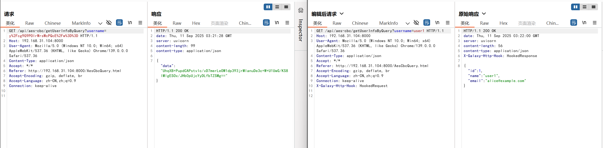
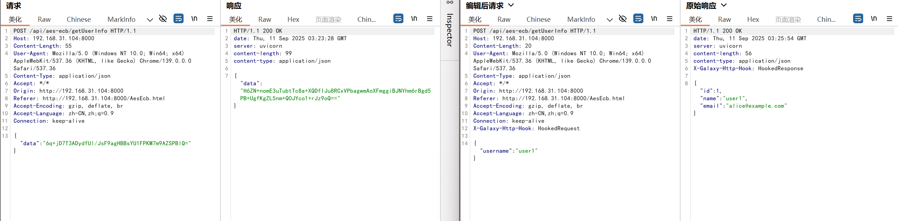
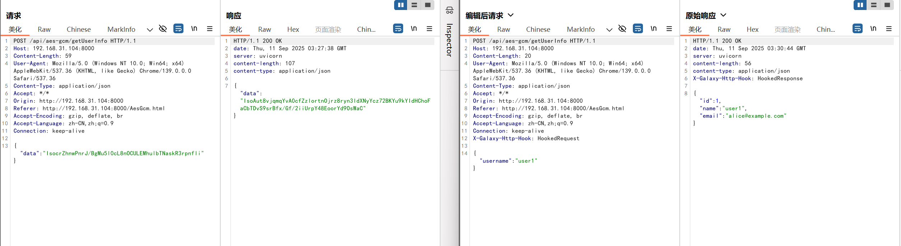
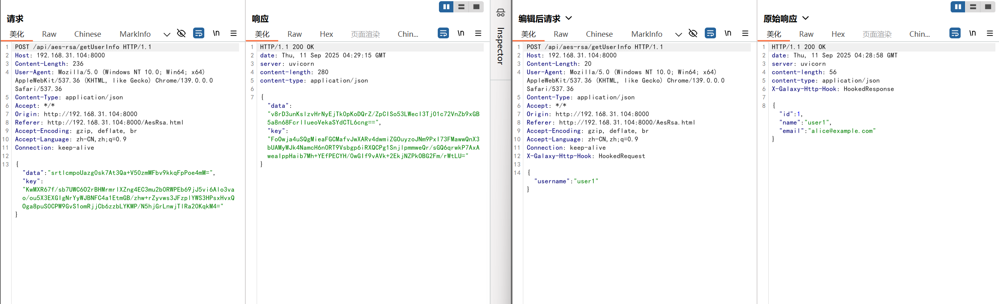
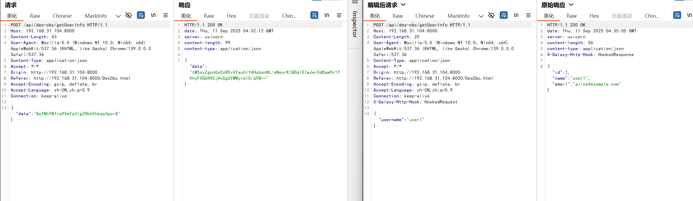
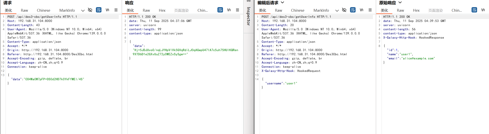

### 聚合脚本

```
import json
import base64
import time
import hashlib
from fastapi import FastAPI
from Crypto.Cipher import AES
from Crypto.Util.Padding import pad, unpad
from _base_classes import *
from urllib.parse import parse_qs, urlencode

# TODO: 配置选项
ENCODING_METHOD = "hex"  # 加解密的参数类型,可选择 "base64" 或 "hex"
KEY = b"xxxxxxxxoooooooo"  # 根据实际情况修改
IV = b"0123456789ABCDEF"  # 根据实际情况修改

# 使用数字映射简化配置, 只需修改 ENCRYPTION_FORMAT_CHOICE 的值
ENCRYPTION_FORMAT_MAP = {
    "0": "JSON_WRAPPED",
    "1": "RAW_BODY",
    "2": "FORM_ENCODED",
}
ENCRYPTION_FORMAT_CHOICE = "0"  # <-- 在这里修改: 0=JSON, 1=原始报文, 2=表单
ENCRYPTION_FORMAT = ENCRYPTION_FORMAT_MAP.get(ENCRYPTION_FORMAT_CHOICE, "RAW_BODY")  # 获取实际格式

# 当 ENCRYPTION_FORMAT = "0" 时, 此项有效
JSON_KEY = "r"
# 当 ENCRYPTION_FORMAT = "2" 时, 此项有效
FORM_ENCRYPTION_KEY = "s"

# TODO: 开关 (已更新为映射简化版)
SWITCH_MAP = {"0": False, "1": True}
# --- 在这里修改: 0=关闭, 1=开启 ---
ENABLE_REQUEST_ENCRYPTION_CHOICE = "0"  # TODO: 是否开启请求体加解密
ENABLE_RESPONSE_ENCRYPTION_CHOICE = "0"  # TODO: 是否开启响应体加解密
ENABLE_PARAMETER_MODIFICATION_CHOICE = "1"  # TODO: 统一控制所有动态参数修改-->用于伪造请求,请求体或者请求头亦或是请求接口参数携带签名需要单独处理
# ------------------------------------
ENABLE_REQUEST_ENCRYPTION = SWITCH_MAP.get(ENABLE_REQUEST_ENCRYPTION_CHOICE, False)
ENABLE_RESPONSE_ENCRYPTION = SWITCH_MAP.get(ENABLE_RESPONSE_ENCRYPTION_CHOICE, False)
ENABLE_PARAMETER_MODIFICATION = SWITCH_MAP.get(ENABLE_PARAMETER_MODIFICATION_CHOICE, True)

app = FastAPI()


def modify_dynamic_parameters(request: RequestModel) -> RequestModel:
    """
    用于伪造请求,请求体或者请求头亦或是请求接口参数携带签名需要单独处理
    # TODO: 更新请求路径参数
    request.query.update({"x": ["your_new_x_value"]})

    # TODO: 获取请求路径
    path = request.path

    # TODO:获取请求头
    user_agent = request.headers.get("User-Agent", [""])[0]

    # TODO: 更新请求头
    request.headers.update({"T": ["your_new_T_value"]})

    # TODO: 获取请求体键的值
    # page = ""  # 默认值
    # body_json = json.loads(request.content.decode('utf-8'))
    # page = body_json.get("page")

    # TODO: 更新请求体
    # body_json.update({"T": "your_new_T_value"})
    # request.content = json.dumps(body_json).encode('utf-8')

    :param request:
    :return: request
    """
    print("[+] 正在应用统一参数修改...")
    pass
    return request


def decrypt(content: bytes) -> bytes:
    """解密函数"""
    cipher = AES.new(KEY, AES.MODE_CBC, IV)
    return unpad(cipher.decrypt(content), AES.block_size)


def encrypt(content: bytes) -> bytes:
    """加密函数"""
    cipher = AES.new(KEY, AES.MODE_CBC, IV)
    return cipher.encrypt(pad(content, AES.block_size))


@app.post("/hookRequestToBurp", response_model=RequestModel)
async def hook_request_to_burp(request: RequestModel):
    """HTTP请求从客户端到达Burp时被调用。在此处完成请求解密的代码就可以在Burp中看到明文的请求报文。"""
    print(f"[+] hookRequestToBurp 已被调用. 请求: {request.model_dump_json()}")

    if not ENABLE_REQUEST_ENCRYPTION:
        print("[!] 请求体解密已禁用，跳过")
        return request

    try:
        encrypted_data: bytes = get_data(request.content)
        data: bytes = decrypt(encrypted_data)
        request.content = data
    except (KeyError, ValueError, json.JSONDecodeError) as e:
        print(f"[!] 请求数据未加密，跳过解密: {e}")

    return request


@app.post("/hookRequestToServer", response_model=RequestModel)
async def hook_request_to_server(request: RequestModel):
    """HTTP请求从Burp将要发送到Server时被调用。在此处完成请求加密的代码就可以将加密后的请求报文发送到Server。"""
    print(f"[+] hookRequestToServer 已被调用. 请求: {request.model_dump_json()}")

    # 调用统一的参数修改函数
    if ENABLE_PARAMETER_MODIFICATION:
        request = modify_dynamic_parameters(request)

    if not ENABLE_REQUEST_ENCRYPTION:
        print("[!] 请求体加密已禁用，跳过")
        return request

    try:
        try:
            body_json = json.loads(request.content)
            if JSON_KEY in body_json:
                print("[!] 请求数据已加密，跳过加密")
                return request
        except (json.JSONDecodeError, TypeError):
            pass

        data: bytes = request.content
        encrypted_data: bytes = encrypt(data)
        body: bytes = to_data(encrypted_data)
        request.content = body
    except Exception as e:
        print(f"[!] 加密失败: {e}")

    return request


@app.post("/hookResponseToBurp", response_model=ResponseModel)
async def hook_response_to_burp(response: ResponseModel):
    """HTTP响应从Server到达Burp时被调用。在此处完成响应解密的代码就可以在Burp中看到明文的响应报文。"""
    print(f"[+] hookResponseToBurp 已被调用. 响应: {response.model_dump_json()}")

    if not ENABLE_RESPONSE_ENCRYPTION:
        print("[!] 响应体解密已禁用，跳过")
        return response

    try:
        encrypted_data: bytes = get_data(response.content)
        data: bytes = decrypt(encrypted_data)
        response.content = data
    except (KeyError, ValueError, json.JSONDecodeError) as e:
        print(f"[!] 响应数据未加密，跳过解密: {e}")

    return response


@app.post("/hookResponseToClient", response_model=ResponseModel)
async def hook_response_to_client(response: ResponseModel):
    """HTTP响应从Burp将要发送到Client时被调用。在此处完成响应加密的代码就可以将加密后的响应报文返回给Client。"""
    print(f"[+] hookResponseToClient 已被调用. 响应: {response.model_dump_json()}")

    if not ENABLE_RESPONSE_ENCRYPTION:
        print("[!] 响应体加密已禁用，跳过")
        return response

    try:
        try:
            body_json = json.loads(response.content)
            if JSON_KEY in body_json:
                print("[!] 响应数据已加密，跳过加密")
                return response
        except (json.JSONDecodeError, TypeError):
            pass

        data: bytes = response.content
        encrypted_data: bytes = encrypt(data)
        body: bytes = to_data(encrypted_data)
        response.content = body
    except Exception as e:
        print(f"[!] 加密失败: {e}")

    return response


def get_data(content: bytes) -> bytes:
    """从请求/响应中提取需要解密的数据 (已更新)"""
    print(f"    - [解密] 使用格式: {ENCRYPTION_FORMAT}")

    if ENCRYPTION_FORMAT == "JSON_WRAPPED":
        body_json = json.loads(content)
        if JSON_KEY not in body_json:
            raise KeyError(f"Key '{JSON_KEY}' not found in JSON data")
        encrypted_hex = body_json[JSON_KEY]

    elif ENCRYPTION_FORMAT == "RAW_BODY":
        # 对于原始报文体, 内容就是加密数据本身
        encrypted_hex = content.decode('utf-8')

    elif ENCRYPTION_FORMAT == "FORM_ENCODED":
        # 解析表单数据, e.g., "s=...&dd=..."
        parsed = parse_qs(content.decode('utf-8'))
        if FORM_ENCRYPTION_KEY not in parsed:
            raise KeyError(f"Key '{FORM_ENCRYPTION_KEY}' not found in form data")
        encrypted_hex = parsed[FORM_ENCRYPTION_KEY][0]

    else:
        raise ValueError(f"未知的 ENCRYPTION_FORMAT: {ENCRYPTION_FORMAT}")

    # 根据 ENCODING_METHOD (hex/base64) 解码字符串为字节
    if ENCODING_METHOD == "base64":
        return base64.b64decode(encrypted_hex)
    else:  # hex
        return bytes.fromhex(encrypted_hex)


def to_data(content: bytes) -> bytes:
    """将加密后的数据转换为API需要的格式 (已更新)"""
    print(f"    - [加密] 使用格式: {ENCRYPTION_FORMAT}")

    # 首先将加密后的字节转换为 hex 或 base64 字符串
    if ENCODING_METHOD == "base64":
        encrypted_str = base64.b64encode(content).decode()
    else:  # hex
        encrypted_str = content.hex()

    if ENCRYPTION_FORMAT == "JSON_WRAPPED":
        body = {JSON_KEY: encrypted_str}
        return json.dumps(body).encode()

    elif ENCRYPTION_FORMAT == "RAW_BODY":
        # 对于原始报文体, 直接返回加密后的字符串
        return encrypted_str.encode()

    elif ENCRYPTION_FORMAT == "FORM_ENCODED":
        # 构建表单格式的字符串, e.g., "s=..."
        body = {FORM_ENCRYPTION_KEY: encrypted_str}
        return urlencode(body).encode()

    else:
        raise ValueError(f"未知的 ENCRYPTION_FORMAT: {ENCRYPTION_FORMAT}")


if __name__ == "__main__":
    import uvicorn

    uvicorn.run(app, host="0.0.0.0", port=5000)

```


### AES_CBC



```py
import json
import base64
import typing as t
from fastapi import FastAPI
from Crypto.Cipher import AES
from Crypto.Util.Padding import pad, unpad
from _base_classes import *

# TODO: 根据您的脚本将 KEY 修改为实际值
KEY = b"32byteslongsecretkeyforaes256!aa"
# TODO: 根据您的脚本将 IV 修改为实际值
IV = b"16byteslongiv456"
# TODO: 根据您的请求/响应体将 JSON_KEY 修改为实际的加密字段名 'data'
JSON_KEY = "data"
app = FastAPI()


@app.post("/hookRequestToBurp", response_model=RequestModel)
async def hook_request_to_burp(request: RequestModel):
    """HTTP请求从客户端到达Burp时被调用。在此处完成请求解密的代码就可以在Burp中看到明文的请求报文。"""
    print(f"[+] hookRequestToBurp be called. request: {request.model_dump_json()}")
    # 获取需要解密的数据
    encrypted_data: bytes = get_data(request.content)
    # 调用函数解密
    data: bytes = decrypt(encrypted_data)
    # 更新body为已解密的数据
    request.content = data
    return request


@app.post("/hookRequestToServer", response_model=RequestModel)
async def hook_request_to_server(request: RequestModel):
    """HTTP请求从Burp将要发送到Server时被调用。在此处完成请求加密的代码就可以将加密后的请求报文发送到Server。"""
    print(f"[+] hookRequestToServer be called. request: {request.model_dump_json()}")
    # 获取被解密的数据
    data: bytes = request.content
    # 调用函数加密回去
    encryptedData: bytes = encrypt(data)
    # 将已加密的数据转换为Server可识别的格式
    body: bytes = to_data(encryptedData)
    # 更新body
    request.content = body
    return request


@app.post("/hookResponseToBurp", response_model=ResponseModel)
async def hook_response_to_burp(response: ResponseModel):
    """HTTP响应从Server到达Burp时被调用。在此处完成响应解密的代码就可以在Burp中看到明文的响应报文。"""
    print(f"[+] hookResponseToBurp be called. response: {response.model_dump_json()}")
    # 获取需要解密的数据
    encryptedData: bytes = get_data(response.content)
    # 调用函数解密
    data: bytes = decrypt(encryptedData)
    # 更新body
    response.content = data
    return response


@app.post("/hookResponseToClient", response_model=ResponseModel)
async def hook_response_to_client(response: ResponseModel):
    """HTTP响应从Burp将要发送到Client时被调用。在此处完成响应加密的代码就可以将加密后的响应报文返回给Client。"""
    print(f"[+] hookResponseToClient be called. response: {response.model_dump_json()}")
    # 获取被解密的数据
    data: bytes = response.content
    # 调用函数加密回去
    encryptedData: bytes = encrypt(data)
    # 将已加密的数据转换为Server可识别的格式
    body: bytes = to_data(encryptedData)
    # 更新body
    response.content = body
    return response


def decrypt(content: bytes) -> bytes:
    cipher = AES.new(KEY, AES.MODE_CBC, IV)
    return unpad(cipher.decrypt(content), AES.block_size)


def encrypt(content: bytes) -> bytes:
    cipher = AES.new(KEY, AES.MODE_CBC, IV)
    return cipher.encrypt(pad(content, AES.block_size))


def get_data(content: bytes) -> bytes:
    body_json: t.Dict = json.loads(content)
    return base64.b64decode(body_json[JSON_KEY])


def to_data(contnet: bytes) -> bytes:
    body_json = {}
    body_json[JSON_KEY] = base64.b64encode(contnet).decode()
    return json.dumps(body_json).encode()


if __name__ == "__main__":
    # 多进程启动
    # uvicorn your_script_name:app --host 0.0.0.0 --port 5000 --workers 4
    import uvicorn
    uvicorn.run(app, host="0.0.0.0", port=5000)
```

******

### AES_CBC_FORM_DATA



```py
import json
import base64
import typing as t
import re  # TODO: 导入re模块用于解析multipart/form-data
import uuid  # TODO: 导入uuid模块用于生成新的boundary
from fastapi import FastAPI
from urllib.parse import parse_qs, urlencode  # TODO: 导入urllib.parse用于处理和构建urlencoded数据
from Crypto.Cipher import AES
from Crypto.Util.Padding import pad, unpad
from _base_classes import *

# TODO: 根据用户脚本，替换为实际的KEY
KEY = b"32byteslongsecretkeyforaes256!aa"
# TODO: 根据用户脚本，替换为实际的IV
IV = b"16byteslongiv456"
# TODO: 根据用户脚本分析，响应体中加密数据所在的JSON字段为 "data"
JSON_KEY = "data"
app = FastAPI()


@app.post("/hookRequestToBurp", response_model=RequestModel)
async def hook_request_to_burp(request: RequestModel):
    """HTTP请求从客户端到达Burp时被调用。在此处完成请求解密的代码就可以在Burp中看到明文的请求报文。"""
    print(f"[+] hookRequestToBurp be called. request: {request.model_dump_json()}")
    # TODO: 使用正则表达式从 multipart/form-data 中提取加密的 username 字段
    # 注意: 这个正则表达式是基于您提供的数据包格式编写的，如果form-data结构复杂，可能需要调整
    match = re.search(b'name="username"\\r\\n\\r\\n(.*)\\r\\n', request.content)
    if match:
        encrypted_b64 = match.group(1).decode()
        encrypted_data = base64.b64decode(encrypted_b64)
        # 调用函数解密
        data: bytes = decrypt(encrypted_data)
        # TODO: 为了方便在Burp中修改，将请求体转换为 application/x-www-form-urlencoded 格式
        request.content = urlencode({"username": data.decode()}).encode()
        # TODO: 相应地更新 Content-Type 请求头，以便Burp能正确解析
        request.headers['Content-Type'] = ['application/x-www-form-urlencoded']
        # 移除可能存在的老的 content-type key (处理大小写不一致的情况)
        old_content_type_key = next((k for k in request.headers if k.lower() == 'content-type'), None)
        if old_content_type_key and old_content_type_key != 'Content-Type':
            del request.headers[old_content_type_key]
    return request


@app.post("/hookRequestToServer", response_model=RequestModel)
async def hook_request_to_server(request: RequestModel):
    """HTTP请求从Burp将要发送到Server时被调用。在此处完成请求加密的代码就可以将加密后的请求报文发送到Server。"""
    print(f"[+] hookRequestToServer be called. request: {request.model_dump_json()}")
    # TODO: 从Burp修改后的 application/x-www-form-urlencoded 格式的请求体中获取明文数据
    data: bytes = parse_qs(request.content.decode())["username"][0].encode()
    # 调用函数加密回去
    encryptedData: bytes = encrypt(data)
    encrypted_b64_str = base64.b64encode(encryptedData).decode()

    # TODO: 重新构建服务器期望的 multipart/form-data 请求体
    boundary = uuid.uuid4().hex
    new_body = []
    new_body.append(f'--{boundary}')
    new_body.append('Content-Disposition: form-data; name="username"')
    new_body.append('')
    new_body.append(encrypted_b64_str)
    new_body.append(f'--{boundary}--')
    request.content = '\r\n'.join(new_body).encode('utf-8')

    # TODO: 更新 Content-Type 请求头以匹配新的 multipart/form-data 请求体
    request.headers['Content-Type'] = [f'multipart/form-data; boundary={boundary}']
    # 移除可能存在的老的 content-type key (处理大小写不一致的情况)
    old_content_type_key = next((k for k in request.headers if k.lower() == 'content-type'), None)
    if old_content_type_key and old_content_type_key != 'Content-Type':
        del request.headers[old_content_type_key]

    return request


@app.post("/hookResponseToBurp", response_model=ResponseModel)
async def hook_response_to_burp(response: ResponseModel):
    """HTTP响应从Server到达Burp时被调用。在此处完成响应解密的代码就可以在Burp中看到明文的响应报文。"""
    print(f"[+] hookResponseToBurp be called. response: {response.model_dump_json()}")
    # 获取需要解密的数据
    encryptedData: bytes = get_data(response.content)
    # 调用函数解密
    data: bytes = decrypt(encryptedData)
    # 更新body
    response.content = data
    return response


@app.post("/hookResponseToClient", response_model=ResponseModel)
async def hook_response_to_client(response: ResponseModel):
    """HTTP响应从Burp将要发送到Client时被调用。在此处完成响应加密的代码就可以将加密后的响应报文返回给Client。"""
    print(f"[+] hookResponseToClient be called. response: {response.model_dump_json()}")
    # 获取被解密的数据
    data: bytes = response.content
    # 调用函数加密回去
    encryptedData: bytes = encrypt(data)
    # 将已加密的数据转换为Server可识别的格式
    body: bytes = to_data(encryptedData)
    # 更新body
    response.content = body
    return response


def decrypt(content: bytes) -> bytes:
    """解密函数，直接使用用户脚本的核心逻辑"""
    cipher = AES.new(KEY, AES.MODE_CBC, IV)
    return unpad(cipher.decrypt(content), AES.block_size)


def encrypt(content: bytes) -> bytes:
    """加密函数，直接使用用户脚本的核心逻辑"""
    cipher = AES.new(KEY, AES.MODE_CBC, IV)
    return cipher.encrypt(pad(content, AES.block_size))


def get_data(content: bytes) -> bytes:
    """从响应体中提取加密数据"""
    body_json: t.Dict = json.loads(content)
    return base64.b64decode(body_json[JSON_KEY])


def to_data(content: bytes) -> bytes:
    """将加密后的数据封装成响应体格式"""
    body_json = {}
    body_json[JSON_KEY] = base64.b64encode(content).decode()
    return json.dumps(body_json).encode()


if __name__ == "__main__":
    # 多进程启动
    # uvicorn your_script_name:app --host 0.0.0.0 --port 5000 --workers 4
    import uvicorn

    uvicorn.run(app, host="0.0.0.0", port=5000)
```

******

### AES_CBC_FORM



```py
import json
import base64
import typing as t
from fastapi import FastAPI
from urllib.parse import parse_qs, urlencode
from Crypto.Cipher import AES
from Crypto.Util.Padding import pad, unpad
from _base_classes import *


# TODO: 根据您的脚本将 KEY 修改为实际值
KEY = b"32byteslongsecretkeyforaes256!aa"
# TODO: 根据您的脚本将 IV 修改为实际值
IV = b"16byteslongiv456"
# TODO: 根据您的响应体将 JSON_KEY 修改为实际的加密字段名 'data'
JSON_KEY = "data"
app = FastAPI()


@app.post("/hookRequestToBurp", response_model=RequestModel)
async def hook_request_to_burp(request: RequestModel):
    """HTTP请求从数据客户端到达Burp时被调用。在此处完成请求解密的代码就可以在Burp中看到明文的请求报文。"""
    print(f"[+] hookRequestToBurp be called. request: {request.model_dump_json()}")
    # TODO: 从 form 表单的 'username' 字段中获取并解码数据
    encrypted_data: bytes = base64.b64decode(
        parse_qs(request.content.decode())["username"][0]
    )
    # 调用函数解密
    data: bytes = decrypt(encrypted_data)
    # TODO: 将解密后的数据放回 'username' 字段
    request.content = urlencode({"username": data.decode()}).encode()
    return request


@app.post("/hookRequestToServer", response_model=RequestModel)
async def hook_request_to_server(request: RequestModel):
    """HTTP请求从Burp将要发送到Server时被调用。在此处完成请求加密的代码就可以将加密后的请求报文发送到Server。"""
    print(f"[+] hookRequestToServer be called. request: {request.model_dump_json()}")
    # TODO: 从 form 表单的 'username' 字段中获取明文数据
    data: bytes = parse_qs(request.content.decode())["username"][0].encode()
    # 调用函数加密回去
    encryptedData: bytes = encrypt(data)
    # TODO: 将加密并编码后的数据放回 'username' 字段
    request.content = urlencode({"username": base64.b64encode(encryptedData).decode()}).encode()
    return request


@app.post("/hookResponseToBurp", response_model=ResponseModel)
async def hook_response_to_burp(response: ResponseModel):
    """HTTP响应从Server到达Burp时被调用。在此处完成响应解密的代码就可以在Burp中看到明文的响应报文。"""
    print(f"[+] hookResponseToBurp be called. response: {response.model_dump_json()}")
    # 获取需要解密的数据
    encryptedData: bytes = get_data(response.content)
    # 调用函数解密
    data: bytes = decrypt(encryptedData)
    # 更新body
    response.content = data
    return response


@app.post("/hookResponseToClient", response_model=ResponseModel)
async def hook_response_to_client(response: ResponseModel):
    """HTTP响应从Burp将要发送到Client时被调用。在此处完成响应加密的代码就可以将加密后的响应报文返回给Client。"""
    print(f"[+] hookResponseToClient be called. response: {response.model_dump_json()}")
    # 获取被解密的数据
    data: bytes = response.content
    # 调用函数加密回去
    encryptedData: bytes = encrypt(data)
    # 将已加密的数据转换为Server可识别的格式
    body: bytes = to_data(encryptedData)
    # 更新body
    response.content = body
    return response


def decrypt(content: bytes) -> bytes:
    cipher = AES.new(KEY, AES.MODE_CBC, IV)
    return unpad(cipher.decrypt(content), AES.block_size)


def encrypt(content: bytes) -> bytes:
    cipher = AES.new(KEY, AES.MODE_CBC, IV)
    return cipher.encrypt(pad(content, AES.block_size))


def get_data(content: bytes) -> bytes:
    body_json: t.Dict = json.loads(content)
    return base64.b64decode(body_json[JSON_KEY])


def to_data(contnet: bytes) -> bytes:
    body_json = {}
    body_json[JSON_KEY] = base64.b64encode(contnet).decode()
    return json.dumps(body_json).encode()


if __name__ == "__main__":
    # 多进程启动
    # uvicorn your_script_name:app --host 0.0.0.0 --port 5000 --workers 4
    import uvicorn
    uvicorn.run(app, host="0.0.0.0", port=5000)
```

******

### AES_CBC_QUERY



```py
import json
import base64
import typing as t
from fastapi import FastAPI
from Crypto.Cipher import AES
from Crypto.Util.Padding import pad, unpad
from _base_classes import *

# TODO: 根据用户提供的脚本设置 KEY
KEY = b"32byteslongsecretkeyforaes256!aa"
# TODO: 根据用户提供的脚本设置 IV
IV = b"16byteslongiv456"
# TODO: 根据用户响应体中的加密字段设置 JSON_KEY
JSON_KEY = "data"
app = FastAPI()


@app.post("/hookRequestToBurp", response_model=RequestModel)
async def hook_request_to_burp(request: RequestModel):
    """HTTP请求从数据客户端到达Burp时被调用。在此处完成请求解密的代码就可以在Burp中看到明文的请求报文。"""
    print(f"[+] hookRequestToBurp be called. request: {request.model_dump_json()}")
    # TODO: 从 query 中获取 username 参数的值进行解密
    # 获取需要解密的数据
    encrypted_data: bytes = base64.b64decode(request.query["username"][0].encode())
    # 调用函数解密
    data: bytes = decrypt(encrypted_data)
    # 更新query
    request.query["username"] = [data.decode()]
    return request


@app.post("/hookRequestToServer", response_model=RequestModel)
async def hook_request_to_server(request: RequestModel):
    """HTTP请求从Burp将要发送到Server时被调用。在此处完成请求加密的代码就可以将加密后的请求报文发送到Server。"""
    print(f"[+] hookRequestToServer be called. request: {request.model_dump_json()}")
    # TODO: 从 query 中获取明文 username 参数的值进行加密
    # 获取被解密的数据
    data: bytes = request.query["username"][0].encode()
    # 调用函数加密回去
    encryptedData: bytes = encrypt(data)
    # 更新query
    request.query["username"] = [base64.b64encode(encryptedData).decode()]
    return request


@app.post("/hookResponseToBurp", response_model=ResponseModel)
async def hook_response_to_burp(response: ResponseModel):
    """HTTP响应从Server到达Burp时被调用。在此处完成响应解密的代码就可以在Burp中看到明文的响应报文。"""
    print(f"[+] hookResponseToBurp be called. response: {response.model_dump_json()}")
    # 获取需要解密的数据
    encryptedData: bytes = get_data(response.content)
    # 调用函数解密
    data: bytes = decrypt(encryptedData)
    # 更新body
    response.content = data
    return response


@app.post("/hookResponseToClient", response_model=ResponseModel)
async def hook_response_to_client(response: ResponseModel):
    """HTTP响应从Burp将要发送到Client时被调用。在此处完成响应加密的代码就可以将加密后的响应报文返回给Client。"""
    print(f"[+] hookResponseToClient be called. response: {response.model_dump_json()}")
    # 获取被解密的数据
    data: bytes = response.content
    # 调用函数加密回去
    encryptedData: bytes = encrypt(data)
    # 将已加密的数据转换为Server可识别的格式
    body: bytes = to_data(encryptedData)
    # 更新body
    response.content = body
    return response


def decrypt(content: bytes) -> bytes:
    # TODO: 替换为用户的解密逻辑
    cipher = AES.new(KEY, AES.MODE_CBC, IV)
    return unpad(cipher.decrypt(content), AES.block_size)


def encrypt(content: bytes) -> bytes:
    # TODO: 替换为用户的加密逻辑
    cipher = AES.new(KEY, AES.MODE_CBC, IV)
    return cipher.encrypt(pad(content, AES.block_size))


def get_data(content: bytes) -> bytes:
    body_json: t.Dict = json.loads(content)
    return base64.b64decode(body_json[JSON_KEY])


def to_data(contnet: bytes) -> bytes:
    body_json = {}
    body_json[JSON_KEY] = base64.b64encode(contnet).decode()
    return json.dumps(body_json).encode()


if __name__ == "__main__":
    # 多进程启动
    # uvicorn your_script_name:app --host 0.0.0.0 --port 5000 --workers 4
    import uvicorn

    uvicorn.run(app, host="0.0.0.0", port=5000)
```

******

### AES_ECB



```py
import json
import base64
import typing as t
from fastapi import FastAPI
from Crypto.Cipher import AES
from Crypto.Util.Padding import pad, unpad
from _base_classes import *


# TODO: 根据用户提供的脚本设置 KEY
KEY = b"32byteslongsecretkeyforaes256!aa"
# TODO: 根据用户请求/响应体中的加密字段设置 JSON_KEY
JSON_KEY = "data"
app = FastAPI()


@app.post("/hookRequestToBurp", response_model=RequestModel)
async def hook_request_to_burp(request: RequestModel):
    """HTTP请求从客户端到达Burp时被调用。在此处完成请求解密的代码就可以在Burp中看到明文的请求报文。"""
    print(f"[+] hookRequestToBurp be called. request: {request.model_dump_json()}")
    # 获取需要解密的数据
    encrypted_data: bytes = get_data(request.content)
    # 调用函数解密
    data: bytes = decrypt(encrypted_data)
    # 更新body为已解密的数据
    request.content = data
    return request


@app.post("/hookRequestToServer", response_model=RequestModel)
async def hook_request_to_server(request: RequestModel):
    """HTTP请求从Burp将要发送到Server时被调用。在此处完成请求加密的代码就可以将加密后的请求报文发送到Server。"""
    print(f"[+] hookRequestToServer be called. request: {request.model_dump_json()}")
    # 获取被解密的数据
    data: bytes = request.content
    # 调用函数加密回去
    encryptedData: bytes = encrypt(data)
    # 将已加密的数据转换为Server可识别的格式
    body: bytes = to_data(encryptedData)
    # 更新body
    request.content = body
    return request


@app.post("/hookResponseToBurp", response_model=ResponseModel)
async def hook_response_to_burp(response: ResponseModel):
    """HTTP响应从Server到达Burp时被调用。在此处完成响应解密的代码就可以在Burp中看到明文的响应报文。"""
    print(f"[+] hookResponseToBurp be called. response: {response.model_dump_json()}")
    # 获取需要解密的数据
    encryptedData: bytes = get_data(response.content)
    # 调用函数解密
    data: bytes = decrypt(encryptedData)
    # 更新body
    response.content = data
    return response


@app.post("/hookResponseToClient", response_model=ResponseModel)
async def hook_response_to_client(response: ResponseModel):
    """HTTP响应从Burp将要发送到Client时被调用。在此处完成响应加密的代码就可以将加密后的响应报文返回给Client。"""
    print(f"[+] hookResponseToClient be called. response: {response.model_dump_json()}")
    # 获取被解密的数据
    data: bytes = response.content
    # 调用函数加密回去
    encryptedData: bytes = encrypt(data)
    # 将已加密的数据转换为Server可识别的格式
    body: bytes = to_data(encryptedData)
    # 更新body
    response.content = body
    return response


def decrypt(content: bytes) -> bytes:
    # TODO: 替换为用户的解密逻辑
    cipher = AES.new(KEY, AES.MODE_ECB)
    return unpad(cipher.decrypt(content), AES.block_size)


def encrypt(content: bytes) -> bytes:
    # TODO: 替换为用户的加密逻辑
    cipher = AES.new(KEY, AES.MODE_ECB)
    return cipher.encrypt(pad(content, AES.block_size))


def get_data(content: bytes) -> bytes:
    body_json: t.Dict = json.loads(content)
    return base64.b64decode(body_json[JSON_KEY])


def to_data(contnet: bytes) -> bytes:
    body_json = {}
    body_json[JSON_KEY] = base64.b64encode(contnet).decode()
    return json.dumps(body_json).encode()


if __name__ == "__main__":
    # 多进程启动
    # uvicorn your_script_name:app --host 0.0.0.0 --port 5000 --workers 4
    import uvicorn

    uvicorn.run(app, host="0.0.0.0", port=5000)
```

******

### AES_GCM



```py
import json
import base64
import typing as t
from fastapi import FastAPI
from Crypto.Cipher import AES
from Crypto.Util.Padding import pad, unpad
from _base_classes import *


KEY = b"32byteslongsecretkeyforaes256!aa"
IV = b"16byteslongiv456"
JSON_KEY = "data"
app = FastAPI()


@app.post("/hookRequestToBurp", response_model=RequestModel)
async def hook_request_to_burp(request: RequestModel):
    """HTTP请求从客户端到达Burp时被调用。在此处完成请求解密的代码就可以在Burp中看到明文的请求报文。"""
    print(f"[+] hookRequestToBurp be called. request: {request.model_dump_json()}")
    # 获取需要解密的数据
    encrypted_data: bytes = get_data(request.content)
    # 调用函数解密
    data: bytes = decrypt(encrypted_data)
    # 更新body为已解密的数据
    request.content = data
    return request


@app.post("/hookRequestToServer", response_model=RequestModel)
async def hook_request_to_server(request: RequestModel):
    """HTTP请求从Burp将要发送到Server时被调用。在此处完成请求加密的代码就可以将加密后的请求报文发送到Server。"""
    print(f"[+] hookRequestToServer be called. request: {request.model_dump_json()}")
    # 获取被解密的数据
    data: bytes = request.content
    # 调用函数加密回去
    encryptedData: bytes = encrypt(data)
    # 将已加密的数据转换为Server可识别的格式
    body: bytes = to_data(encryptedData)
    # 更新body
    request.content = body
    return request


@app.post("/hookResponseToBurp", response_model=ResponseModel)
async def hook_response_to_burp(response: ResponseModel):
    """HTTP响应从Server到达Burp时被调用。在此处完成响应解密的代码就可以在Burp中看到明文的响应报文。"""
    print(f"[+] hookResponseToBurp be called. response: {response.model_dump_json()}")
    # 获取需要解密的数据
    encryptedData: bytes = get_data(response.content)
    # 调用函数解密
    data: bytes = decrypt(encryptedData)
    # 更新body
    response.content = data
    return response


@app.post("/hookResponseToClient", response_model=ResponseModel)
async def hook_response_to_client(response: ResponseModel):
    """HTTP响应从Burp将要发送到Client时被调用。在此处完成响应加密的代码就可以将加密后的响应报文返回给Client。"""
    print(f"[+] hookResponseToClient be called. response: {response.model_dump_json()}")
    # 获取被解密的数据
    data: bytes = response.content
    # 调用函数加密回去
    encryptedData: bytes = encrypt(data)
    # 将已加密的数据转换为Server可识别的格式
    body: bytes = to_data(encryptedData)
    # 更新body
    response.content = body
    return response


def decrypt(content: bytes) -> bytes:
    cipher = AES.new(KEY, AES.MODE_GCM, IV, mac_len=16)
    decrypted_data = cipher.decrypt_and_verify(content[:-16], content[-16:])
    return decrypted_data


def encrypt(content: bytes) -> bytes:
    cipher = AES.new(KEY, AES.MODE_GCM, IV, mac_len=16)
    encrypted_data, tag = cipher.encrypt_and_digest(content)
    return encrypted_data + tag


def get_data(content: bytes) -> bytes:
    body_json: t.Dict = json.loads(content)
    return base64.b64decode(body_json[JSON_KEY])


def to_data(contnet: bytes) -> bytes:
    body_json = {}
    body_json[JSON_KEY] = base64.b64encode(contnet).decode()
    return json.dumps(body_json).encode()


if __name__ == "__main__":
    # 多进程启动
    # uvicorn aes_gcm:app --host 0.0.0.0 --port 5000 --workers 4
    import uvicorn

    uvicorn.run(app, host="0.0.0.0", port=5000)
```

******

### AES_RSA



```py
import json
import base64
import typing as t
from fastapi import FastAPI
from Crypto.PublicKey import RSA
from Crypto.Cipher import PKCS1_v1_5, AES
from Crypto.Util.Padding import pad, unpad
from _base_classes import *

aes_secret = b"32byteslongsecretkeyforaes256!aa"
publicKey1Base64 = "MIGfMA0GCSqGSIb3DQEBAQUAA4GNADCBiQKBgQC7JoQAWLsovzHjaUMZg2lwO4LCuP97mitUc4chqRlQD3NgyCWLqEnYyM+OJ7i6cyMuWLwGtMi29DoKLjpE/xRZR0OUk46PDCAtyDgIyejK7c7KlZTbiqb4PtiJNLZgg0UP62kLMycnpY/wg/R2G9g+7MiJWUV5SR+Lhryv8CWezQIDAQAB"
privateKey1Base64 = "MIICdQIBADANBgkqhkiG9w0BAQEFAASCAl8wggJbAgEAAoGBALsmhABYuyi/MeNpQxmDaXA7gsK4/3uaK1RzhyGpGVAPc2DIJYuoSdjIz44nuLpzIy5YvAa0yLb0OgouOkT/FFlHQ5STjo8MIC3IOAjJ6MrtzsqVlNuKpvg+2Ik0tmCDRQ/raQszJyelj/CD9HYb2D7syIlZRXlJH4uGvK/wJZ7NAgMBAAECgYAhgbhRbZF4rp6Kdh6e00HN58G2BjQrl4MZeCOh+aoABPwlwD/EnMk36GAMtfzjWNjcI+PqGXT0GI7JotQo5ThpoweXX/uoeGOW+UkYLA6a67lmxfoZsDtY2+jnaWIs2c7Itz3ClRxo4tYwCoPNjtaBpMfPgZaYg2QN8/wLQPI66wJBAM0xpjb2OlLDs75lVxbm6v6Dx3YBS20GSqJqvf+14a/k7mrZ3PmAHOfqTqKOwbVQJmLbeOpU+sUBpeLpILKOCLcCQQDpfSsDhdosC6qTL9XnF2jS49iws2RBKw5YjDkClwA6VMNj5uzL1Rl7/AimLRMnB4BwrD95ksuOJsqNXW6wRGibAkAkk28PaQCodB38GFBX0r2ctJy/Wie5vV9caC6KAD/EfMhK357WEpIUfN2beFrrGOhewsRg8NjqeQq60dd0PIEtAkBYAm03O7n8Bj26kzpejA1gCLBCEqyEf/U9XUWT+1UDp7Wqr32sa1vaxyp/cNgaSxKX5eVbLwD5SRfqZ0B0wqRnAkATpUNiCqjQVS+OI5dwjoI1Rx3oI8pyKWOg3+QIHIRgL3pc8HLdZ2BkX4Vf6ANb4+noQnD/di1Mj+0pUL8RhIJE"
publicKey2Base64 = "MIGfMA0GCSqGSIb3DQEBAQUAA4GNADCBiQKBgQCrfqYv278oDvreohZeR+UMiNSJC2FG4u8dSNC/hj88lw7eULQOiuUnsZ4eineeFOquXckjhkh1AJsd87+Nz1ZQB61dY3NmVR5Tk+2wH/kNdiVCoRrbULs29Tms17IyrZZU9WQFQbBxC/g6n5zwp6ST/siGRfHAwVVbq+iccQfdpwIDAQAB"
privateKey2Base64 = "MIICdgIBADANBgkqhkiG9w0BAQEFAASCAmAwggJcAgEAAoGBAKt+pi/bvygO+t6iFl5H5QyI1IkLYUbi7x1I0L+GPzyXDt5QtA6K5Sexnh6Kd54U6q5dySOGSHUAmx3zv43PVlAHrV1jc2ZVHlOT7bAf+Q12JUKhGttQuzb1OazXsjKtllT1ZAVBsHEL+DqfnPCnpJP+yIZF8cDBVVur6JxxB92nAgMBAAECgYAghb2lcNKBGcooo2uDiLXe2SoZLT/O7iVzk8YGtEJUzr7imUJ0SZHoo639U7wYjhXtaFrHMmWWTr2cAggvMAVJi5fZYYJLbYdc8O5QCKi6PzV2J2NxYyuABL5yarvy4Ji0twnDjlqBYqrjOsxJbeMv58CHLKqduIZuxppGGOoRQQJBANTV3JEg6xJdPXsF9ztOf03BNkvpibuUSNbTssTdzEtLMQW7zd5y1qTCwUbf+e2UsRIYPn5DwOlTu8SaE97Zz8ECQQDORm7szA0WL1OTYob0U1NSSFDn8Jg7FyX5md6ndL3KNTKBDBfe3hNpauLi01lTMbO3MoriOWsFiN++6dZAdwdnAkEAq6PcwN1/Ncwj7Lae7yEa4SXUF9w6yx+GrlkDbmhAfOginLEcES0jlLPLEtFFySeEtUb//uu9A24XmzF2nN2jAQJABgL7fJ89ymW6s9LtR/WdugotgXT7ms1D6BBZ8ttuJJSEUkp975rdSfc5gY7TTZ9nM3GfppQx0El66994xQwzBQJAct1HPeCVROxyEHNwsiRH9wqR5P4B59Mo1714R7ozsdTpVx8FWmqi+OQIJt+IizYgRyQ09qORAFei9AHeQtxKiw=="
pub_key1 = base64.b64decode(publicKey1Base64)
pri_key1 = base64.b64decode(privateKey1Base64)
pub_key2 = base64.b64decode(publicKey2Base64)
pri_key2 = base64.b64decode(privateKey2Base64)
JSON_KEY1 = "data"
JSON_KEY2 = "key"

app = FastAPI()


@app.post("/hookRequestToBurp", response_model=RequestModel)
async def hook_request_to_burp(request: RequestModel):
    """HTTP请求从客户端到达Burp时被调用。在此处完成请求解密的代码就可以在Burp中看到明文的请求报文。"""
    print(f"[+] hookRequestToBurp be called. request: {request.model_dump_json()}")
    encryptedData: bytes = get_data(request.content)
    # 获取用来解密的密钥，该密钥已使用publicKey1进行rsa加密
    encryptedKey: bytes = get_key(request.content)
    # 调用内置函数解密，拿到aes密钥
    key: bytes = asymmetric_decrypt(encryptedKey, pri_key1)
    # 调用内置函数解密报文
    data: bytes = symmetric_decrypt(encryptedData, key)
    # 更新body为已解密的数据
    request.content = data
    return request


@app.post("/hookRequestToServer", response_model=RequestModel)
async def hook_request_to_server(request: RequestModel):
    """HTTP请求从Burp将要发送到Server时被调用。在此处完成请求加密的代码就可以将加密后的请求报文发送到Server。"""
    print(f"[+] hookRequestToServer be called. request: {request.model_dump_json()}")
    # 获取被解密的数据
    data: bytes = request.content
    # 调用内置函数加密回去，这里使用设置的aesSecret进行加密
    encryptedData: bytes = symmetric_encrypt(data, aes_secret)
    # 调用内置函数加密aesSecret
    encryptedKey: bytes = asymmetric_encrypt(aes_secret, pub_key1)
    # 将已加密的数据转换为Server可识别的格式
    body: bytes = to_data(encryptedData, encryptedKey)
    # 更新body
    request.content = body
    return request


@app.post("/hookResponseToBurp", response_model=ResponseModel)
async def hook_response_to_burp(response: ResponseModel):
    """HTTP响应从Server到达Burp时被调用。在此处完成响应解密的代码就可以在Burp中看到明文的响应报文。"""
    print(f"[+] hookResponseToBurp be called. response: {response.model_dump_json()}")
    # 获取需要解密的数据
    encryptedData: bytes = get_data(response.content)
    # 获取用来解密的密钥，该密钥已使用publicKey2进行rsa加密
    encryptedKey: bytes = get_key(response.content)
    # 调用内置函数解密，拿到aes密钥
    key: bytes = asymmetric_decrypt(encryptedKey, pri_key2)
    # 调用内置函数解密报文
    data: bytes = symmetric_decrypt(encryptedData, key)
    # 更新body
    response.content = data
    return response


@app.post("/hookResponseToClient", response_model=ResponseModel)
async def hook_response_to_client(response: ResponseModel):
    """HTTP响应从Burp将要发送到Client时被调用。在此处完成响应加密的代码就可以将加密后的响应报文返回给Client。"""
    print(f"[+] hookResponseToClient be called. response: {response.model_dump_json()}")
    # 获取被解密的数据
    data: bytes = response.content
    # 调用内置函数加密回去，这里使用设置的aesSecret进行加密
    encryptedData: bytes = symmetric_encrypt(data, aes_secret)
    # 调用内置函数加密aesSecret
    encryptedKey: bytes = asymmetric_encrypt(aes_secret, pub_key2)
    # 将已加密的数据转换为Server可识别的格式
    body: bytes = to_data(encryptedData, encryptedKey)
    # 更新body
    response.content = body
    return response


def asymmetric_decrypt(content, secret) -> bytes:
    rsa_key = RSA.import_key(secret)
    cipher = PKCS1_v1_5.new(rsa_key)
    decrypted_data = cipher.decrypt(content, 0)
    assert isinstance(decrypted_data, bytes)
    return decrypted_data


def asymmetric_encrypt(content, secret) -> bytes:
    rsa_key = RSA.import_key(secret)
    cipher = PKCS1_v1_5.new(rsa_key)
    encrypted_data = cipher.encrypt(content)
    return encrypted_data


def symmetric_decrypt(content, secret) -> bytes:
    cipher = AES.new(secret, AES.MODE_ECB)
    return unpad(cipher.decrypt(content), AES.block_size)


def symmetric_encrypt(content, secret) -> bytes:
    cipher = AES.new(secret, AES.MODE_ECB)
    return cipher.encrypt(pad(content, AES.block_size))


def get_data(content) -> bytes:
    return base64.b64decode(json.loads(content)[JSON_KEY1])


def get_key(content) -> bytes:
    return base64.b64decode(json.loads(content)[JSON_KEY2])


def to_data(content, secret) -> bytes:
    body_json = {}
    body_json[JSON_KEY1] = base64.b64encode(content).decode()
    body_json[JSON_KEY2] = base64.b64encode(secret).decode()
    return json.dumps(body_json).encode()


if __name__ == "__main__":
    # 多进程启动
    # uvicorn aes_rsa:app --host 0.0.0.0 --port 5000 --workers 4
    import uvicorn

    uvicorn.run(app, host="0.0.0.0", port=5000)
```

******

### DES_CBC



```py
import json
import base64
import typing as t
from fastapi import FastAPI
from Crypto.Cipher import DES
from Crypto.Util.Padding import pad, unpad
from _base_classes import *


# TODO: 根据用户提供的脚本设置 KEY
KEY = b"12345678"
# TODO: 根据用户提供的脚本设置 IV
IV = b"12345678"
# TODO: 根据用户请求/响应体中的加密字段设置 JSON_KEY
JSON_KEY = "data"
app = FastAPI()


@app.post("/hookRequestToBurp", response_model=RequestModel)
async def hook_request_to_burp(request: RequestModel):
    """HTTP请求从客户端到达Burp时被调用。在此处完成请求解密的代码就可以在Burp中看到明文的请求报文。"""
    print(f"[+] hookRequestToBurp be called. request: {request.model_dump_json()}")
    # 获取需要解密的数据
    encrypted_data: bytes = get_data(request.content)
    # 调用函数解密
    data: bytes = decrypt(encrypted_data)
    # 更新body为已解密的数据
    request.content = data
    return request


@app.post("/hookRequestToServer", response_model=RequestModel)
async def hook_request_to_server(request: RequestModel):
    """HTTP请求从Burp将要发送到Server时被调用。在此处完成请求加密的代码就可以将加密后的请求报文发送到Server。"""
    print(f"[+] hookRequestToServer be called. request: {request.model_dump_json()}")
    # 获取被解密的数据
    data: bytes = request.content
    # 调用函数加密回去
    encryptedData: bytes = encrypt(data)
    # 将已加密的数据转换为Server可识别的格式
    body: bytes = to_data(encryptedData)
    # 更新body
    request.content = body
    return request


@app.post("/hookResponseToBurp", response_model=ResponseModel)
async def hook_response_to_burp(response: ResponseModel):
    """HTTP响应从Server到达Burp时被调用。在此处完成响应解密的代码就可以在Burp中看到明文的响应报文。"""
    print(f"[+] hookResponseToBurp be called. response: {response.model_dump_json()}")
    # 获取需要解密的数据
    encryptedData: bytes = get_data(response.content)
    # 调用函数解密
    data: bytes = decrypt(encryptedData)
    # 更新body
    response.content = data
    return response


@app.post("/hookResponseToClient", response_model=ResponseModel)
async def hook_response_to_client(response: ResponseModel):
    """HTTP响应从Burp将要发送到Client时被调用。在此处完成响应加密的代码就可以将加密后的响应报文返回给Client。"""
    print(f"[+] hookResponseToClient be called. response: {response.model_dump_json()}")
    # 获取被解密的数据
    data: bytes = response.content
    # 调用函数加密回去
    encryptedData: bytes = encrypt(data)
    # 将已加密的数据转换为Server可识别的格式
    body: bytes = to_data(encryptedData)
    # 更新body
    response.content = body
    return response


def decrypt(content: bytes) -> bytes:
    # TODO: 替换为用户的解密逻辑
    cipher = DES.new(KEY, DES.MODE_CBC, IV)
    return unpad(cipher.decrypt(content), DES.block_size)


def encrypt(content: bytes) -> bytes:
    # TODO: 替换为用户的加密逻辑
    cipher = DES.new(KEY, DES.MODE_CBC, IV)
    return cipher.encrypt(pad(content, DES.block_size))


def get_data(content: bytes) -> bytes:
    body_json: t.Dict = json.loads(content)
    return base64.b64decode(body_json[JSON_KEY])


def to_data(contnet: bytes) -> bytes:
    body_json = {}
    body_json[JSON_KEY] = base64.b64encode(contnet).decode()
    return json.dumps(body_json).encode()


if __name__ == "__main__":
    # 多进程启动
    # uvicorn your_script_name:app --host 0.0.0.0 --port 5000 --workers 4
    import uvicorn

    uvicorn.run(app, host="0.0.0.0", port=5000)
```

******

### DES3_CBC



```py
import json
import base64
import typing as t
from fastapi import FastAPI
from Crypto.Cipher import DES3
from Crypto.Util.Padding import pad, unpad
from _base_classes import *


# TODO: 根据用户提供的脚本设置 KEY
KEY = b"24byteslongKeyfordes3!aa"
# TODO: 根据用户提供的脚本设置 IV
IV = b"8bytesIv"
# TODO: 根据用户请求/响应体中的加密字段设置 JSON_KEY
JSON_KEY = "data"
app = FastAPI()


@app.post("/hookRequestToBurp", response_model=RequestModel)
async def hook_request_to_burp(request: RequestModel):
    """HTTP请求从客户端到达Burp时被调用。在此处完成请求解密的代码就可以在Burp中看到明文的请求报文。"""
    print(f"[+] hookRequestToBurp be called. request: {request.model_dump_json()}")
    # 获取需要解密的数据
    encrypted_data: bytes = get_data(request.content)
    # 调用函数解密
    data: bytes = decrypt(encrypted_data)
    # 更新body为已解密的数据
    request.content = data
    return request


@app.post("/hookRequestToServer", response_model=RequestModel)
async def hook_request_to_server(request: RequestModel):
    """HTTP请求从Burp将要发送到Server时被调用。在此处完成请求加密的代码就可以将加密后的请求报文发送到Server。"""
    print(f"[+] hookRequestToServer be called. request: {request.model_dump_json()}")
    # 获取被解密的数据
    data: bytes = request.content
    # 调用函数加密回去
    encryptedData: bytes = encrypt(data)
    # 将已加密的数据转换为Server可识别的格式
    body: bytes = to_data(encryptedData)
    # 更新body
    request.content = body
    return request


@app.post("/hookResponseToBurp", response_model=ResponseModel)
async def hook_response_to_burp(response: ResponseModel):
    """HTTP响应从Server到达Burp时被调用。在此处完成响应解密的代码就可以在Burp中看到明文的响应报文。"""
    print(f"[+] hookResponseToBurp be called. response: {response.model_dump_json()}")
    # 获取需要解密的数据
    encryptedData: bytes = get_data(response.content)
    # 调用函数解密
    data: bytes = decrypt(encryptedData)
    # 更新body
    response.content = data
    return response


@app.post("/hookResponseToClient", response_model=ResponseModel)
async def hook_response_to_client(response: ResponseModel):
    """HTTP响应从Burp将要发送到Client时被调用。在此处完成响应加密的代码就可以将加密后的响应报文返回给Client。"""
    print(f"[+] hookResponseToClient be called. response: {response.model_dump_json()}")
    # 获取被解密的数据
    data: bytes = response.content
    # 调用函数加密回去
    encryptedData: bytes = encrypt(data)
    # 将已加密的数据转换为Server可识别的格式
    body: bytes = to_data(encryptedData)
    # 更新body
    response.content = body
    return response


def decrypt(content: bytes) -> bytes:
    # TODO: 替换为用户的解密逻辑
    cipher = DES3.new(KEY, DES3.MODE_CBC, IV)
    return unpad(cipher.decrypt(content), DES3.block_size)


def encrypt(content: bytes) -> bytes:
    # TODO: 替换为用户的加密逻辑
    cipher = DES3.new(KEY, DES3.MODE_CBC, IV)
    return cipher.encrypt(pad(content, DES3.block_size))


def get_data(content: bytes) -> bytes:
    body_json: t.Dict = json.loads(content)
    return base64.b64decode(body_json[JSON_KEY])


def to_data(contnet: bytes) -> bytes:
    body_json = {}
    body_json[JSON_KEY] = base64.b64encode(contnet).decode()
    return json.dumps(body_json).encode()


if __name__ == "__main__":
    # 多进程启动
    # uvicorn your_script_name:app --host 0.0.0.0 --port 5000 --workers 4
    import uvicorn

    uvicorn.run(app, host="0.0.0.0", port=5000)
```

******