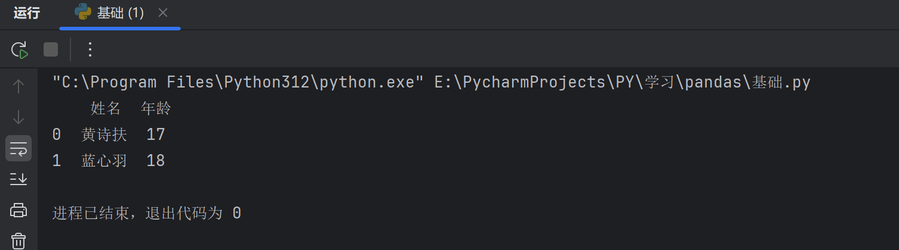

# Pandas库的使用

> Pandas 是一个开源的数据分析和数据处理库，它是基于 Python 编程语言的。
>
> Pandas 提供了易于使用的数据结构和数据分析工具，特别适用于处理结构化数据，如表格型数据（类似于Excel表格）。
>
> Pandas 是数据科学和分析领域中常用的工具之一，用户能够轻松地从各种数据源中导入数据，并对数据进行高效的操作和分析。

### Pandas 特点

**高效的数据结构**：

- **Series**：一维数据结构，类似于列表（List），但拥有更强的功能，支持索引。
- **DataFrame**：二维数据结构，类似于表格或数据库中的数据表，行和列都具有标签（索引）。

**数据清洗与预处理**：

- Pandas 提供了丰富的函数来处理缺失值、重复数据、数据类型转换、字符串操作等，帮助用户轻松清理和转换数据。

**数据操作与分析**：

- 支持高效的数据选择、筛选、切片，按条件提取数据、合并、连接多个数据集、数据分组、汇总统计等操作。
- 可以进行复杂的数据变换，如数据透视表、交叉表、时间序列分析等。

**数据读取与导出**：

- 支持从各种格式的数据源读取数据，如 CSV、Excel、JSON、SQL 数据库等。
- 也可以将处理后的数据导出为不同格式，如 CSV、Excel 等。

**数据可视化**：

- 通过与 Matplotlib 和其他可视化工具的集成，Pandas 可以快速生成折线图、柱状图、散点图等常见图表。

**时间序列分析**：

- 支持强大的时间序列处理功能，包括日期的解析、重采样、时区转换等。

**性能与优化**：

- Pandas 优化了大规模数据处理，提供高效的向量化操作，避免了使用 Python 循环处理数据的低效。
- 还支持一些内存优化技术，比如使用 `category` 类型处理重复的数据。

*****

### Pandas的安装使用

- 进入命令行(`win+r–>cmd`)

```cmd
pip install pandas
```


*****

### 第一个项目

```py
import pandas as pd

# TODO:数据分别对应第一列第二列
data = {
        'name': ['sunhua', 'lihua'],
        'age': ['18', '20']
        }
df = pd.DataFrame(data)
print(df)
df.to_excel('1.xlsx', index=False)
```

- 通过`字典`里面嵌套`列表`,使用pandas将字典转化为`DataFrame`对象,然后再使用`to_excel`方法将数据转化成excel
- 如图:


*****

### Pandas Series

> Series 是 Pandas 中的一个核心数据结构，类似于一个一维的数组，具有数据和索引。
>
> Series 可以存储任何数据类型（整数、浮点数、字符串等），并通过标签（索引）来访问元素。
>
> Series 的数据结构是非常有用的，因为它可以处理各种数据类型，同时保持了高效的数据操作能力，比如可以通过标签来快速访问和操作数据。

### Series 特点：

- **一维数组**：Series 中的每个元素都有一个对应的索引值。
- **索引**： 每个数据元素都可以通过标签（索引）来访问，默认情况下索引是从 0 开始的整数，但你也可以自定义索引。
- **数据类型**： `Series` 可以容纳不同数据类型的元素，包括整数、浮点数、字符串、Python 对象等。
- **大小不变性**：Series 的大小在创建后是不变的，但可以通过某些操作（如 append 或 delete）来改变。
- **操作**：Series 支持各种操作，如数学运算、统计分析、字符串处理等。
- **缺失数据**：Series 可以包含缺失数据，Pandas 使用NaN（Not a Number）来表示缺失或无值。
- **自动对齐**：当对多个 Series 进行运算时，Pandas 会自动根据索引对齐数据，这使得数据处理更加高效。

```py
import pandas as pd
# TODO:创建两个series对象-->和上面等效
serice_name = pd.Series(['黄诗扶', '蓝心羽'])
serice_age = pd.Series(['17', '18'])
df = pd.DataFrame({'姓名': serice_name, '年龄': serice_age})
print(df)
```



##### `索引介绍`

- 默认索引是从0开始依次递增的,可以在`Sercie`第二参数`index`传递自定义的索引
- 在生成execl的时候可以使用`my_index_data_df.to_excel("1.xlsx",index=False)`去掉索引(即上图的`0,1`数字一列)
- `name`参数是用来给列进行命名的

```py
import pandas as pd
# TODO:这里使用name可以在创建DataFrame对象的时候自动为列名赋值
serice = pd.Series([1, 2, 3, 4], name="A")
df = pd.DataFrame(serice)
"""
# 默认索引是从0开始,可以自定义
print(df)
df.to_excel("1.xlsx")
"""
my_index=[4,5,6,7]
my_index_data = pd.Series([1, 2, 3, 4], index=my_index, name='B')  # TODO:这时候索引就变成了my_index指定的了
my_index_data_df = pd.DataFrame(my_index_data)
my_index_data_df.to_excel("1.xlsx")
```


- 取`特定值`

```py
import pandas as pd
a = ["Google", "Runoob", "Wiki"]
myvar = pd.Series(a)
print(myvar[2])  #这儿通过index获取值
print(myvar.iloc[-1]) #这个ilco是通过位置获取值,等同列表的切片方法
```


##### 思考案例

> 假定给与一个列表如何对列表数据进行运算操作呢,如*3

- `方法1`:使用map函数

```py
# 假设有一个列表
s = [1, 2, 3, 4]
# 使用内置的 map 函数
s1 = list(map(lambda x: x * 3, s))
print(s1)
```

- `方法2`:使用for循环遍历

```py
s = [1, 2, 3, 4]
s1 = []
for i in s:
    a = i * 3
s1.append(a)
```

- `方法3`:使用列表推导式

```py
s = [i * 3 for i in range(1, 5)]
print(s)
```


- 同理在上面引入了map内置函数的概念后,同样的,pandas里也有map这个方法,效果也是一样的

- 下面将展示`Serice`常用方法

```py
import pandas as pd

# 创建 Series
data = [1, 2, 3, 4, 5, 6]
index = ['a', 'b', 'c', 'd', 'e', 'f']
s = pd.Series(data, index=index)

# 查看基本信息
print("索引：", s.index)
print("数据：", s.values)
print("数据类型：", s.dtype)
print("前两行数据: " )
print(s.head(2))
```


- 完整代码

```py
import pandas as pd

# 创建 Series
data = [1, 2, 3, 4, 5, 6]
index = ['a', 'b', 'c', 'd', 'e', 'f']
s = pd.Series(data, index=index)

# 查看基本信息
print("索引：", s.index)
print("数据：", s.values)
print("数据类型：", s.dtype)
print("前两行数据: " )
print(s.head(2))

# 使用 map 函数将每个元素加倍
s_doubled = s.map(lambda x: x * 2)
print("元素加倍后：", s_doubled)

# 计算累计和
cumsum_s = s.cumsum()
print("累计求和：", cumsum_s)

# 查找缺失值（这里没有缺失值，所以返回的全是 False）
print("缺失值判断：", s.isnull())

# 排序
sorted_s = s.sort_values()
print("排序后的 Series：", sorted_s)
```

- 运行结果如下

```cmd
"C:\Program Files\Python312\python.exe" E:\PycharmProjects\PY\学习\pandas\Serice.py 
索引： Index(['a', 'b', 'c', 'd', 'e', 'f'], dtype='object')
数据： [1 2 3 4 5 6]
数据类型： int64
前两行数据: 
a    1
b    2
dtype: int64
元素加倍后：
a     2
b     4
c     6
d     8
e    10
f    12
dtype: int64
累计求和： a     1
b     3
c     6
d    10
e    15
f    21
dtype: int64
缺失值判断： a    False
b    False
c    False
d    False
e    False
f    False
dtype: bool
排序后的 Series： a    1
b    2
c    3
d    4
e    5
f    6
dtype: int64

进程已结束，退出代码为 0
```

*****

### Serice常用方法

| **方法名称**                 | **功能描述**                                           |
| :--------------------------- | :----------------------------------------------------- |
| `index`                      | 获取 Series 的索引                                     |
| `values`                     | 获取 Series 的数据部分（返回 NumPy 数组）              |
| `head(n)`                    | 返回 Series 的前 n 行（默认为 5）                      |
| `tail(n)`                    | 返回 Series 的后 n 行（默认为 5）                      |
| `dtype`                      | 返回 Series 中数据的类型                               |
| `shape`                      | 返回 Series 的形状（行数）                             |
| `describe()`                 | 返回 Series 的统计描述（如均值、标准差、最小值等）     |
| `isnull()`                   | 返回一个布尔 Series，表示每个元素是否为 NaN            |
| `notnull()`                  | 返回一个布尔 Series，表示每个元素是否不是 NaN          |
| `unique()`                   | 返回 Series 中的唯一值（去重）                         |
| `value_counts()`             | 返回 Series 中每个唯一值的出现次数                     |
| `map(func)`                  | 将指定函数应用于 Series 中的每个元素                   |
| `apply(func)`                | 将指定函数应用于 Series 中的每个元素，常用于自定义操作 |
| `astype(dtype)`              | 将 Series 转换为指定的类型                             |
| `sort_values()`              | 对 Series 中的元素进行排序（按值排序）                 |
| `sort_index()`               | 对 Series 的索引进行排序                               |
| `dropna()`                   | 删除 Series 中的缺失值（NaN）                          |
| `fillna(value)`              | 填充 Series 中的缺失值（NaN）                          |
| `replace(to_replace, value)` | 替换 Series 中指定的值                                 |
| `cumsum()`                   | 返回 Series 的累计求和                                 |
| `cumprod()`                  | 返回 Series 的累计乘积                                 |
| `shift(periods)`             | 将 Series 中的元素按指定的步数进行位移                 |
| `rank()`                     | 返回 Series 中元素的排名                               |
| `corr(other)`                | 计算 Series 与另一个 Series 的相关性（皮尔逊相关系数） |
| `cov(other)`                 | 计算 Series 与另一个 Series 的协方差                   |
| `to_list()`                  | 将 Series 转换为 Python 列表                           |
| `to_frame()`                 | 将 Series 转换为 DataFrame                             |
| `iloc[]`                     | 通过位置索引来选择数据                                 |
| `loc[]`                      | 通过标签索引来选择数据                                 |

*****

### 更多 Series 说明

**使用列表、字典或数组创建一个默认索引的 Series。**

```py
# 使用列表创建 Series
s = pd.Series([1, 2, 3, 4])

# 使用 NumPy 数组创建 Series
s = pd.Series(np.array([1, 2, 3, 4]))

# 使用字典创建 Series
s = pd.Series({'a': 1, 'b': 2, 'c': 3, 'd': 4})
```

**基本操作：**

```py
# 指定索引创建 Series
s = pd.Series([1, 2, 3, 4], index=['a', 'b', 'c', 'd'])

# 获取值
value = s[2]  # 获取索引为2的值
print(s['a'])  # 返回索引标签 'a' 对应的元素

# 获取多个值
subset = s[1:4]  # 获取索引为1到3的值

# 使用自定义索引
value = s['b']  # 获取索引为'b'的值

# 索引和值的对应关系
for index, value in s.items():
    print(f"Index: {index}, Value: {value}")


# 使用切片语法来访问 Series 的一部分
print(s['a':'c'])  # 返回索引标签 'a' 到 'c' 之间的元素
print(s[:3])  # 返回前三个元素

# 为特定的索引标签赋值
s['a'] = 10  # 将索引标签 'a' 对应的元素修改为 10

# 通过赋值给新的索引标签来添加元素
s['e'] = 5  # 在 Series 中添加一个新的元素，索引标签为 'e'

# 使用 del 删除指定索引标签的元素。
del s['a']  # 删除索引标签 'a' 对应的元素

# 使用 drop 方法删除一个或多个索引标签，并返回一个新的 Series。
s_dropped = s.drop(['b'])  # 返回一个删除了索引标签 'b' 的新 Series
```

**基本运算：**

```py
# 算术运算
result = series * 2  # 所有元素乘以2

# 过滤
filtered_series = series[series > 2]  # 选择大于2的元素

# 数学函数
import numpy as np
result = np.sqrt(series)  # 对每个元素取平方根
```

**计算统计数据：使用 Series 的方法来计算描述性统计。**

```py
print(s.sum())  # 输出 Series 的总和
print(s.mean())  # 输出 Series 的平均值
print(s.max())  # 输出 Series 的最大值
print(s.min())  # 输出 Series 的最小值
print(s.std())  # 输出 Series 的标准差
```

**属性和方法：**

```py
# 获取索引
index = s.index

# 获取值数组
values = s.values

# 获取描述统计信息
stats = s.describe()

# 获取最大值和最小值的索引
max_index = s.idxmax()
min_index = s.idxmin()

# 其他属性和方法
print(s.dtype)   # 数据类型
print(s.shape)   # 形状
print(s.size)    # 元素个数
print(s.head())  # 前几个元素，默认是前 5 个
print(s.tail())  # 后几个元素，默认是后 5 个
print(s.sum())   # 求和
print(s.mean())  # 平均值
print(s.std())   # 标准差
print(s.min())   # 最小值
print(s.max())   # 最大值
```

**使用布尔表达式：根据条件过滤 Series。**

```py
print(s > 2)  # 返回一个布尔 Series，其中的元素值大于 2
```

**查看数据类型：使用 dtype 属性查看 Series 的数据类型。**

```py
print(s.dtype)  # 输出 Series 的数据类型
```

**转换数据类型：使用 astype 方法将 Series 转换为另一种数据类型。**

```py
s = s.astype('float64')  # 将 Series 中的所有元素转换为 float64 类型
```

**注意事项：**

- `Series` 中的数据是有序的。
- 可以将 `Series` 视为带有索引的一维数组。
- 索引可以是唯一的，但不是必须的。
- 数据可以是标量、列表、NumPy 数组等。

*****