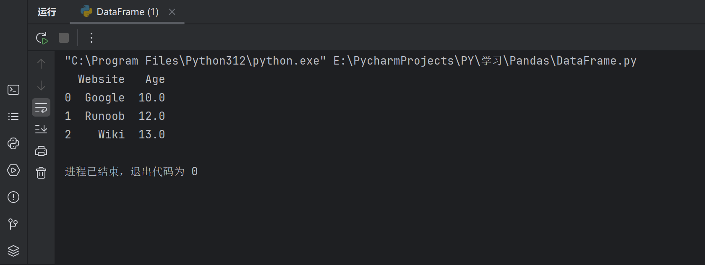
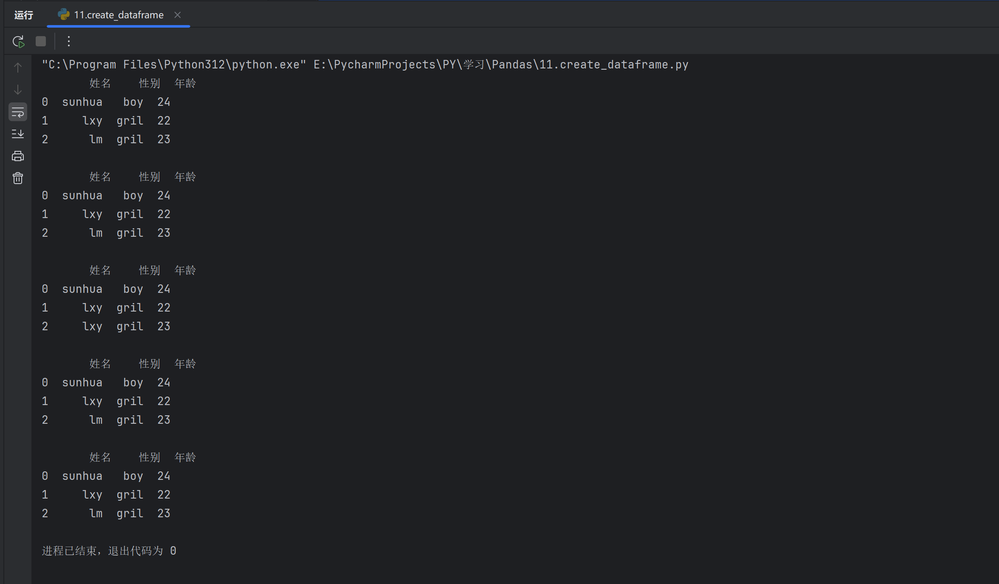

### Pandas DataFrame

> DataFrame 是 Pandas 中的另一个核心数据结构，类似于一个二维的表格或数据库中的数据表。
>
> DataFrame 是一个表格型的数据结构，它含有一组有序的列，每列可以是不同的值类型（数值、字符串、布尔型值）。
>
> DataFrame 既有行索引也有列索引，它可以被看做由 Series 组成的字典（共同用一个索引）。
>
> DataFrame 提供了各种功能来进行数据访问、筛选、分割、合并、重塑、聚合以及转换等操作。
>
> DataFrame 是一个非常灵活且强大的数据结构，广泛用于数据分析、清洗、转换、可视化等任务。

### DataFrame 特点

- **二维结构**： `DataFrame` 是一个二维表格，可以被看作是一个 Excel 电子表格或 SQL 表，具有行和列。可以将其视为多个 `Series` 对象组成的字典。
- **列的数据类型**： 不同的列可以包含不同的数据类型，例如整数、浮点数、字符串或 Python 对象等。
- **索引**：`DataFrame` 可以拥有行索引和列索引，类似于 Excel 中的行号和列标。
- **大小可变**：可以添加和删除列，类似于 Python 中的字典。
- **自动对齐**：在进行算术运算或数据对齐操作时，`DataFrame` 会自动对齐索引。
- **处理缺失数据**：`DataFrame` 可以包含缺失数据，Pandas 使用 `NaN`（Not a Number）来表示。
- **数据操作**：支持数据切片、索引、子集分割等操作。
- **时间序列支持**：`DataFrame` 对时间序列数据有特别的支持，可以轻松地进行时间数据的切片、索引和操作。
- **丰富的数据访问功能**：通过 `.loc`、`.iloc` 和 `.query()` 方法，可以灵活地访问和筛选数据。
- **灵活的数据处理功能**：包括数据合并、重塑、透视、分组和聚合等。
- **数据可视化**：虽然 `DataFrame` 本身不是可视化工具，但它可以与 Matplotlib 或 Seaborn 等可视化库结合使用，进行数据可视化。
- **高效的数据输入输出**：可以方便地读取和写入数据，支持多种格式，如 CSV、Excel、SQL 数据库和 HDF5 格式。
- **描述性统计**：提供了一系列方法来计算描述性统计数据，如 `.describe()`、`.mean()`、`.sum()` 等。
- **灵活的数据对齐和集成**：可以轻松地与其他 `DataFrame` 或 `Series` 对象进行合并、连接或更新操作。
- **转换功能**：可以对数据集中的值进行转换，例如使用 `.apply()` 方法应用自定义函数。
- **滚动窗口和时间序列分析**：支持对数据集进行滚动窗口统计和时间序列分析。

*****

### DataFrame创建

> 使用`列表`创建

```py
import pandas as pd

data = [
    ['Google', 10],
    ['Runoob', 12],
    ['Wiki', 13]
]
df = pd.DataFrame(data, columns=['Website', 'Age'])

# TODO:使用astype设置每列的数据类型
df['Website'] = df['Website'].astype(str)
df['Age'] = df['Age'].astype(float)
print(df)
```

> 使用`字典`创建

```py
import pandas as pd

# TODO:使用字典创建,与上面等效->输出结果一致
dict_data = {
    'Website': ['Google', 'Runoob', 'Wiki'],
    'Age': [10, 12, 13]
}
df_data = pd.DataFrame(dict_data)
df_data['Website'] = df_data['Website'].astype(str)
df_data['Age'] = df_data['Age'].astype(float)
print(df_data)
```

> 使用`np.array`对象创建

```py
np_data = np.array([
    ['Google', 10],
    ['Runoob', 12],
    ['Wiki', 13]
])

# TODO:使用DataFrame构造函数创建数据帧
df_np = pd.DataFrame(np_data, columns=['Website', 'Age'])
df_np['Website'] = df_np['Website'].astype(str)
df_np['Age'] = df_np['Age'].astype(float)
print(df_np)
```

- 几种方法是`等效`的,输出结果一致



- `为了方便记忆,我将常见的五种我能想到的DataFrame创建方式列举出来`

```py
import pandas as pd
import numpy as np

# TODO:使用3种方式创建dataframe对象
# 方法一:列表嵌套列表
data_list = [
    ['sunhua', 'boy', '24'],
    ['lxy', 'gril', '22'],
    ['lm', 'gril', '23']
]
df_list = pd.DataFrame(data_list, columns=['姓名', '性别', '年龄'])
print(df_list,'\n')

# 方法二:字典
data_dict = {
    '姓名': ['sunhua', 'lxy', 'lm'],
    '性别': ['boy', 'gril', 'gril'],
    '年龄': ['24', '22', '23']
}
df_dict = pd.DataFrame(data_dict)
print(df_dict, '\n')

# 方法三:serice创建
serice_name = pd.Series(['sunhua', 'lxy', 'lxy'], name='姓名')
serice_gender = pd.Series(['boy', 'gril', 'gril'], name='性别')
serice_age = pd.Series(['24', '22', '23'], name='年龄')
df_serice = pd.DataFrame({'姓名':serice_name, '性别':serice_gender, '年龄':serice_age})
print(df_serice,'\n')

# 方法四:使用numpy数组创建
data_np = np.array([['sunhua', 'boy', 24], ['lxy', 'gril', 22], ['lm', 'gril', 23]])
df_numpy = pd.DataFrame(data_np, columns=['姓名', '性别', '年龄'])
print(df_numpy,'\n')

# 方法五:使用zip函数创建
data = zip(['sunhua', 'lxy', 'lm'], ['boy', 'gril', 'gril'], [24, 22, 23])
df_zip = pd.DataFrame(data, columns=['姓名', '性别', '年龄'])
print(df_zip)
```



- 以上五种方式创建,是等效的,可参考源码->`11.create_dataframe.py`

*****

### DataFrame 方法

DataFrame 的常用操作和方法如下表所示：

| **方法名称**        | **功能描述**                                                |
| :------------------ | :---------------------------------------------------------- |
| `head(n)`           | 返回 DataFrame 的前 n 行数据（默认前 5 行）                 |
| `tail(n)`           | 返回 DataFrame 的后 n 行数据（默认后 5 行）                 |
| `info()`            | 显示 DataFrame 的简要信息，包括列名、数据类型、非空值数量等 |
| `describe()`        | 返回 DataFrame 数值列的统计信息，如均值、标准差、最小值等   |
| `shape`             | 返回 DataFrame 的行数和列数（行数, 列数）                   |
| `columns`           | 返回 DataFrame 的所有列名                                   |
| `index`             | 返回 DataFrame 的行索引                                     |
| `dtypes`            | 返回每一列的数值数据类型                                    |
| `sort_values(by)`   | 按照指定列排序                                              |
| `sort_index()`      | 按行索引排序                                                |
| `dropna()`          | 删除含有缺失值（NaN）的行或列                               |
| `fillna(value)`     | 用指定的值填充缺失值                                        |
| `isnull()`          | 判断缺失值，返回一个布尔值 DataFrame                        |
| `notnull()`         | 判断非缺失值，返回一个布尔值 DataFrame                      |
| `loc[]`             | 按标签索引选择数据                                          |
| `iloc[]`            | 按位置索引选择数据                                          |
| `at[]`              | 访问 DataFrame 中单个元素（比 `loc[]` 更高效）              |
| `iat[]`             | 访问 DataFrame 中单个元素（比 `iloc[]` 更高效）             |
| `apply(func)`       | 对 DataFrame 或 Series 应用一个函数                         |
| `applymap(func)`    | 对 DataFrame 的每个元素应用函数（仅对 DataFrame）           |
| `groupby(by)`       | 分组操作，用于按某一列分组进行汇总统计                      |
| `pivot_table()`     | 创建透视表                                                  |
| `merge()`           | 合并多个 DataFrame（类似 SQL 的 JOIN 操作）                 |
| `concat()`          | 按行或按列连接多个 DataFrame                                |
| `to_csv()`          | 将 DataFrame 导出为 CSV 文件                                |
| `to_excel()`        | 将 DataFrame 导出为 Excel 文件                              |
| `to_json()`         | 将 DataFrame 导出为 JSON 格式                               |
| `to_sql()`          | 将 DataFrame 导出为 SQL 数据库                              |
| `query()`           | 使用 SQL 风格的语法查询 DataFrame                           |
| `duplicated()`      | 返回布尔值 DataFrame，指示每行是否是重复的                  |
| `drop_duplicates()` | 删除重复的行                                                |
| `set_index()`       | 设置 DataFrame 的索引                                       |
| `reset_index()`     | 重置 DataFrame 的索引                                       |
| `transpose()`       | 转置 DataFrame（行列交换）                                  |

*****

### 实例

```py
import pandas as pd

# TODO:创建DataFrame
data = {
    '姓名': ['张三', '李四', '王五'],
    '年龄': [23, 21, 32],
    '性别': ['男', '女', '男'],
    '城市': ['北京', '上海', '广州']
}

df = pd.DataFrame(data)
# print(df)

# TODO:查看前两行数据
print(df.head(2), '\n')
# TODO:查看DataFrame的基本信息
print(df.info(), '\n')
# TODO:获取描述统计信息
print(df.describe(), '\n')
# TODO:按照年龄排序,ascending=True升序,ascending=False降序,默认升序->True
print(df.sort_values(by='年龄', ascending=False), '\n')
# TODO:选择姓名和城市列->使用[[value1,value2]]
print(df[['姓名', '城市']], '\n')
# TODO:按照索引选择2-3行
print(df.iloc[1:3], '\n')
# TODO:按照标签选择行
print(df.loc[[1, 2]], '\n')
# TODO:计算分组统计,按照性别分组,计算年龄的平均值
print(df.groupby('性别')['年龄'].mean(), '\n')
# TODO:处理缺失值,进行填充
df['城市'] = df['城市'].fillna('未知')
# TODO:导出为csv文件
# df.to_csv('data.csv', index=False)
```

- 运行效果

```py
"C:\Program Files\Python312\python.exe" E:\PycharmProjects\PY\学习\Pandas\DataFrame.py 
   姓名  年龄 性别  城市
0  张三  23  男  北京
1  李四  21  女  上海 

<class 'pandas.core.frame.DataFrame'>
RangeIndex: 3 entries, 0 to 2
Data columns (total 4 columns):
 #   Column  Non-Null Count  Dtype 
---  ------  --------------  ----- 
 0   姓名      3 non-null      object
 1   年龄      3 non-null      int64 
 2   性别      3 non-null      object
 3   城市      3 non-null      object
dtypes: int64(1), object(3)
memory usage: 228.0+ bytes
None 

              年龄
count   3.000000
mean   25.333333
std     5.859465
min    21.000000
25%    22.000000
50%    23.000000
75%    27.500000
max    32.000000 

   姓名  年龄 性别  城市
2  王五  32  男  广州
0  张三  23  男  北京
1  李四  21  女  上海 

   姓名  城市
0  张三  北京
1  李四  上海
2  王五  广州 

   姓名  年龄 性别  城市
1  李四  21  女  上海
2  王五  32  男  广州 

   姓名  年龄 性别  城市
1  李四  21  女  上海
2  王五  32  男  广州 

性别
女    21.0
男    27.5
Name: 年龄, dtype: float64 


进程已结束，退出代码为 0

```

*****

### 更多 DataFrame 说明

#### 创建 DataFrame

#### 实例

**从字典创建**：字典的键成为列名，值成为列数据。

```py
import pandas as pd

# 通过字典创建 DataFrame
df = pd.DataFrame({'Column1': [1, 2, 3], 'Column2': [4, 5, 6]})
```

*****

#### 实例

**从列表的列表创建**：外层列表代表行，内层列表代表列。

```py
# 通过列表的列表创建 DataFrame
df = pd.DataFrame([[1, 2, 3], [4, 5, 6], [7, 8, 9]],
         columns=['Column1', 'Column2', 'Column3'])
```

*****

#### 实例

从 **NumPy** 数组创建：提供一个二维 NumPy 数组。

```py
import numpy as np

# 通过 NumPy 数组创建 DataFrame
df = pd.DataFrame(np.array([[1, 2, 3], [4, 5, 6], [7, 8, 9]]))
```

*****

#### 实例

从 Series 创建 **DataFrame**：通过 **pd.Series()** 创建。

```py
# 从 Series 创建 DataFrame
s1 = pd.Series(['Alice', 'Bob', 'Charlie'])
s2 = pd.Series([25, 30, 35])
s3 = pd.Series(['New York', 'Los Angeles', 'Chicago'])
df = pd.DataFrame({'Name': s1, 'Age': s2, 'City': s3})
```

*****

### DataFrame 的属性和方法

DataFrame 对象有许多属性和方法，用于数据操作、索引和处理，例如：shape、columns、index、head()、tail()、info()、describe()、mean()、sum() 等。

#### 实例

```py
# DataFrame 的属性和方法
print**(df.shape)   # 形状
print**(df.columns)  # 列名
print**(df.index)   # 索引
print**(df.head())   # 前几行数据，默认是前 5 行
print**(df.tail())   # 后几行数据，默认是后 5 行
print**(df.info())   # 数据信息
print**(df.describe())# 描述统计信息
print**(df.mean())   # 求平均值
print**(df.sum())   # 求和
```

*****

#### 访问 DataFrame 元素

**访问列**：使用列名作为属性或通过 **.loc[]**、**.iloc[]** 访问，也可以使用标签或位置索引。

#### 实例

```py
# 通过列名访问
print(df['Column1'])

# 通过属性访问
print(df.Name)   
  
# 通过 .loc[] 访问
print(df.loc[:, 'Column1'])

# 通过 .iloc[] 访问
print(df.iloc[:, 0]) # 假设 'Column1' 是第一列

# 访问单个元素
print(df['Name'][0])
```

*****

#### 实例

**访问行**：使用行的标签和 **.loc[]** 访问。

```py
# 通过行标签访问
print(df.loc[0, 'Column1'])
```

#### 修改 DataFrame

**修改列数据**：直接对列进行赋值。

```py
df['Column1'] = [10, 11, 12]
```

**添加新列**：给新列赋值。

```py
df['NewColumn'] = [100, 200, 300]
```

*****

#### 实例

**添加新行**：使用 loc、append 或 concat 方法。

```py
# 使用 loc 为特定索引添加新行
df.loc[3] = [13, 14, 15, 16]

# 使用 append 添加新行到末尾
new_row = {'Column1': 13, 'Column2': 14, 'NewColumn': 16}
df = df.append(new_row, ignore_index=True)
```

**注意**：append() 方法在 pandas 版本 1.4.0 中已经被标记为弃用，并将在未来的版本中被移除，官方推荐使用 **concat()** 作为替代方法来进行数据的合并操作。

concat() 方法用于合并两个或多个 DataFrame，当你想要添加一行到另一个 DataFrame 时，可以将新行作为一个新的 DataFrame，然后使用 concat()：

*****

#### 实例

```py
# 使用concat添加新行
new_row = pd.DataFrame([[4, 7]], columns=['A', 'B']) # 创建一个只包含新行的DataFrame
df = pd.concat([df, new_row], ignore_index=True) # 将新行添加到原始DataFrame

print(df)
```

*****

#### 删除 DataFrame 元素

**删除列**：使用 drop 方法。

```py
df_dropped = df.drop('Column1', axis=1)
```

**删除行**：同样使用 drop 方法。

```py
df_dropped = df.drop(0)  # 删除索引为 0 的行
```

#### DataFrame 的统计分析

**描述性统计**：使用 **.describe()** 查看数值列的统计摘要。

```py
df.describe()
```

**计算统计数据**：使用聚合函数如 **.sum()、.mean()、.max()** 等。

```py
df['Column1'].sum()
df.mean()
```

#### DataFrame 的索引操作

**重置索引**：使用 **.reset_index()**。

```py
df_reset = df.reset_index(drop=True)
```

**设置索引**：使用 **.set_index()**。

```py
df_set = df.set_index('Column1')
```

#### DataFrame 的布尔索引

**使用布尔表达式**：根据条件过滤 DataFrame。

```py
df[df['Column1'] > 2]
```

#### DataFrame 的数据类型

**查看数据类型**：使用 **dtypes** 属性。

```py
df.dtypes
```

**转换数据类型：**使用 **astype** 方法。

```py
df['Column1'] = df['Column1'].astype('float64')
```

#### DataFrame 的合并与分割

**合并**：使用 **concat** 或 **merge** 方法。

```py
# 纵向合并
pd.concat([df1, df2], ignore_index=True)

# 横向合并
pd.merge(df1, df2, on='Column1')
```

**分割**：使用 **pivot、melt** 或自定义函数。

```py
# 长格式转宽格式
df_pivot = df.pivot(index='Column1', columns='Column2', values='Column3')

# 宽格式转长格式
df_melt = df.melt(id_vars='Column1', value_vars=['Column2', 'Column3'])
```

*****

#### 索引和切片

#### 实例

**DataFrame** 支持对行和列进行索引和切片操作。

```py
# 索引和切片
print(df[['Name', 'Age']]) # 提取多列
print(df[1:3])        # 切片行
print(df.loc[:, 'Name'])   # 提取单列
print(df.loc[1:2, ['Name', 'Age']]) # 标签索引提取指定行列
print(df.iloc[:, 1:])     # 位置索引提取指定列
```

*****

#### 注意事项

- `DataFrame` 是一种灵活的数据结构，可以容纳不同数据类型的列。
- 列名和行索引可以是字符串、整数等。
- `DataFrame` 可以通过多种方式进行数据选择、过滤、修改和分析。
- 通过对 `DataFrame` 的操作，可以进行数据清洗、转换、分析和可视化等工作。

*****
