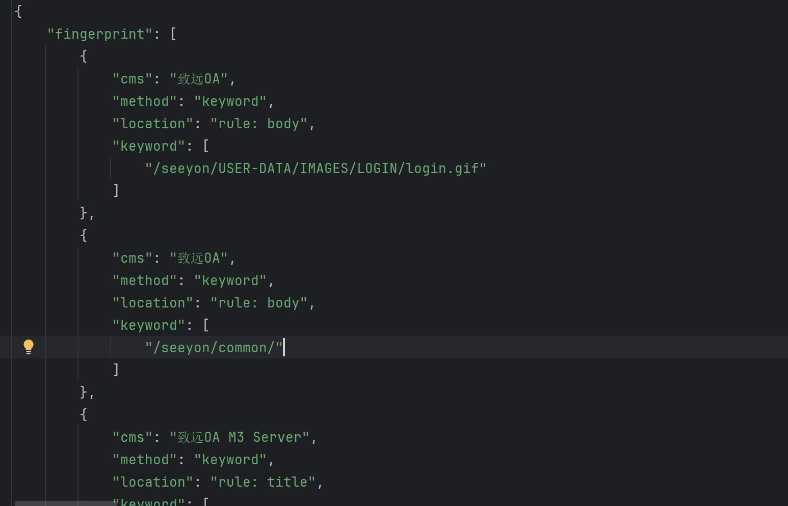
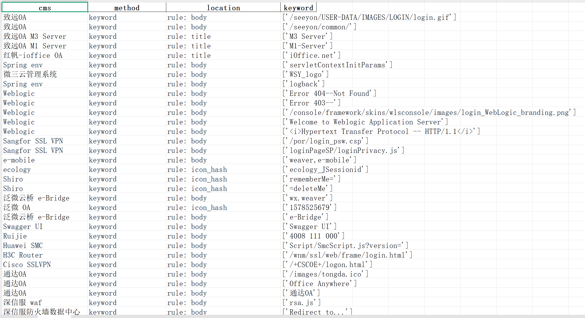

### CSV操作

- 读取所有数据

```py
import pandas as pd

df = pd.read_csv('nba.csv')
# TODO:to_string显示所有数据
print(df.to_string())
```

- 保存为csv文件

```py
import pandas as pd

# 三个字段 name, site, age
nme = ["Google", "Runoob", "Taobao", "Wiki"]
st = ["www.google.com", "www.runoob.com", "www.taobao.com", "www.wikipedia.org"]
ag = [90, 40, 80, 98]

# 字典
dict = {'name': nme, 'site': st, 'age': ag}

df = pd.DataFrame(dict)

# 保存 dataframe
df.to_csv('site.csv')
```

*****

### Excel操作

```py
import pandas as pd

# 读取Excel文件
df = pd.read_excel('test.xlsx')
print(df, '\n')

# 打印工作表
sheet = pd.ExcelFile('test.xlsx')
print(sheet.sheet_names, '\n')

# 打印工作表内容
print(sheet.parse('工作表 1'), '\n')

# 读取指定表单的内容（表单名称）
df = pd.read_excel('test.xlsx', sheet_name='Sheet1')
print(df, '\n')

# 读取多个表单，返回一个字典
dfs = pd.read_excel('test.xlsx', sheet_name=['Sheet1', 'Sheet2'])
print(dfs, '\n')

# 自定义列名并跳过前两行
df = pd.read_excel('test.xlsx', header=None, names=['A', 'B', 'C'], skiprows=2)
print(df, '\n')

# 创建一个简单的 DataFrame
df = pd.DataFrame({
    'Name': ['Alice', 'Bob', 'Charlie'],
    'Age': [25, 30, 35],
    'City': ['New York', 'Los Angeles', 'Chicago']
})

# 将 DataFrame 写入 Excel 文件，写入 'Sheet1' 表单
df.to_excel('output.xlsx', sheet_name='Sheet1', index=False)

# 写入多个表单，使用 ExcelWriter
with pd.ExcelWriter('output.xlsx') as f:
    df.to_excel(f, sheet_name='Sheet1', index=False)
    df.to_excel(f, sheet_name='Sheet2', index=False)
```

- 工作表操作

```py
import pandas as pd
from datetime import datetime, date

# 创建dataframe
df = pd.DataFrame({
    '姓名': ['张三', '李四', '王五', '赵六'],
    '年龄': [20, 25, 30, 35],
    '性别': ['男', '女', '男', '女'],
})

# 写入多个工作表
with pd.ExcelWriter('df_toexcel.xlsx') as writer:
    df.to_excel(writer, sheet_name='工作人员1', index=False)
    df.to_excel(writer, sheet_name='工作人员2', index=False)
# 使用ExcelFile加载文件
excel_file = pd.ExcelFile('df_toexcel.xlsx')
# 查看所有表单名称
print(excel_file.sheet_names)
# 读取`工作人员1`表单
print(excel_file.parse('工作人员1'))
```

*****

### Json操作

- 将json文件转化成表格数据
- 原始json文件如图



```py
import pandas as pd
import json

# {
#             "cms": "致远OA",
#             "method": "keyword",
#             "location": "rule: body",
#             "keyword": [
#                 "/seeyon/USER-DATA/IMAGES/LOGIN/login.gif"
#             ]
#         }
#

# TODO:提取所有字段,cms,method,location,keyword分别作为列名,将json文件转化成excel保存


# 读取 JSON 文件
with open("finger.json", "r", encoding="utf-8") as f:
    data = json.load(f)

# 展开 `fingerprint` 数组中的每个元素
df = pd.json_normalize(data['fingerprint'])

# 将 DataFrame 保存为 Excel 文件
df.to_excel("fingerprint.xlsx", index=False)

# 打印输出确认
print("转换成功，已保存为 fingerprint.xlsx")
```

- 效果如下图



*****