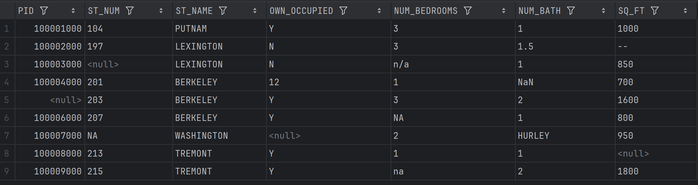
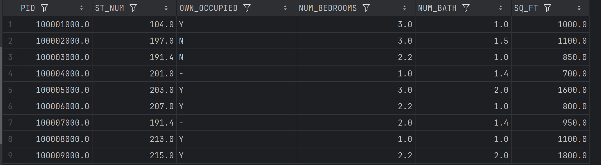

### Pandas 数据清洗

> 数据清洗是对一些没有用的数据进行处理的过程。很多数据集存在数据缺失、数据格式错误、错误数据或重复数据的情况，如果要使数据分析更加准确，就需要对这些没有用的数据进行处理。

数据清洗与预处理的常见步骤：

1. **缺失值处理**：识别并填补缺失值，或删除含缺失值的行/列。
2. **重复数据处理**：检查并删除重复数据，确保每条数据唯一。
3. **异常值处理**：识别并处理异常值，如极端值、错误值。
4. **数据格式转换**：转换数据类型或进行单位转换，如日期格式转换。
5. **标准化与归一化**：对数值型数据进行标准化（如 Z-score）或归一化（如 Min-Max）。
6. **类别数据编码**：将类别变量转换为数值形式，常见方法包括 One-Hot 编码和标签编码。
7. **文本处理**：对文本数据进行清洗，如去除停用词、词干化、分词等。
8. **数据抽样**：从数据集中抽取样本，或通过过采样/欠采样处理类别不平衡。
9. **特征工程**：创建新特征、删除不相关特征、选择重要特征等。

*****

### 案例

- 现在我们有一个存在数据不完整或者说不规范,看起来不舒服的csv文件,如下图



- 我们现在需要对它进行数据清洗处理,然后输出为让人看起来较为舒服的csv,上代码
- `注意`:这里不要看着代码多,但其实仔细看会发现,代码都是做的大致一致的操作,只是字段不一致,真正核心的代码就几步(`下文会介绍简化的操作`)

```py
import pandas as pd

# TODO:读取csv文件
df = pd.read_csv('property-data.csv')
print(df.to_string())

# TODO:读取PID列
PID = df['PID']
# TODO:将PID列中的空值填充为100005000.0
PID = PID.fillna(100005000.0)
# print(PID.to_string())

# TODO:读取ST_NUM列
ST_NUM = df['ST_NUM']
# TODO:将ST_NUM列中的空值填充为平均值
ST_NUM = ST_NUM.fillna(ST_NUM.mean().round(1))
# print(ST_NUM.to_string())

# TODO:读取OWN_OCCUPIED列
OWN_OCCUPIED = df['OWN_OCCUPIED']
# TODO:将OWN_OCCUPIED列中的值不是Y或N的值填充为-
OWN_OCCUPIED = OWN_OCCUPIED.mask(~OWN_OCCUPIED.isin(['Y', 'N']), '-')
# print(OWN_OCCUPIED.to_string())

"""
# TODO:也可以用lambda函数
OWN_OCCUPIED = df['OWN_OCCUPIED']
replace_lambda = lambda x: '-' if x not in ['Y', 'N'] else x
OWN_OCCUPIED = OWN_OCCUPIED.apply(replace_lambda)
print(OWN_OCCUPIED.to_string())
"""

# TODO:读取NUM_BEDROOMS列
NUM_BEDROOMS = df['NUM_BEDROOMS']
# TODO:计算NUM_BEDROOMS列的平均值
NUM_BEDROOMS_value = pd.to_numeric(NUM_BEDROOMS, errors='coerce').mean().round(1)
# TODO:将NUM_BEDROOMS列中非数字值替换成平均值
NUM_BEDROOMS = pd.to_numeric(NUM_BEDROOMS, errors='coerce').fillna(NUM_BEDROOMS_value)
# print(NUM_BEDROOMS.to_string())

# TODO:读取NUM_BATH列
NUM_BATH = df['NUM_BATH']
# TODO:计算NUM_BATH列的平均值
NUM_BATH_value = pd.to_numeric(NUM_BATH, errors='coerce').mean().round(1)
# TODO:将NUM_BATH列中非数字值替换成平均值
NUM_BATH = pd.to_numeric(NUM_BATH, errors='coerce').fillna(NUM_BATH_value)
# print(NUM_BATH.to_string())

# TODO:读取SQ_FT列
SQ_FT = df['SQ_FT']
# TODO:计算SQ_FT列的平均值,保留一位小数
SQ_FT_mean = pd.to_numeric(SQ_FT, errors='coerce').mean().round(1)
# TODO:将SQ_FT列中非数字值替换成平均值
SQ_FT = pd.to_numeric(SQ_FT, errors='coerce').fillna(SQ_FT_mean)
# print(SQ_FT.to_string())

# TODO:将处理后的数据保存到新的csv文件中
df = pd.DataFrame({'PID': PID, 'ST_NUM': ST_NUM, 'OWN_OCCUPIED': OWN_OCCUPIED,
                   'NUM_BEDROOMS': NUM_BEDROOMS, 'NUM_BATH': NUM_BATH, 'SQ_FT': SQ_FT})
df.to_csv('property-data-clean.csv', index=False)
```

- 这里对缺失值进行了填充(平均值),不是乱填,数据还是有说服力的
- 最终呈现的效果



#### 核心的代码讲解

- `read-scv()`读取csv文件
- `to_string()`显示所有数据
- `fillna`填充空值为指定值,适用于填充数据较少的情况,对数据指定填充,复杂的需要加判断语句
- `df[‘column’]`读取指定列
- `mean()`求平均值
- `round()`保留小数多少位
- `~`取反,`mask`m在 Pandas 中用于根据条件替换 DataFrame 或 Series 中的值。具体来说，mask 方法会根据给定的条件将满足条件的值替换为指定的值

```py
OWN_OCCUPIED = OWN_OCCUPIED.mask(~OWN_OCCUPIED.isin(['Y', 'N']), '-')
```

- `apply`可以将一个函数应用到 pandas.Series 的每个元素上。在这个例子中，replace_lambda 是一个 lambda 函数，它会检查每个元素是否在 ['Y', 'N'] 中，并根据条件返回相应的值,就是能接收函数返回值

```py
# TODO:也可以用lambda函数
OWN_OCCUPIED = df['OWN_OCCUPIED']
replace_lambda = lambda x: '-' if x not in ['Y', 'N'] else x
OWN_OCCUPIED = OWN_OCCUPIED.apply(replace_lambda)
print(OWN_OCCUPIED.to_string())
```

-  `to_numeric`处理数据转换
- `to_csv`保存为csv文件

*****

#### 使用函数减少代码冗余

- 在高中我们都学过函数y=kx+b,k和b是常量就是已知的数值,x为自变量,为x赋值可以得到对应的因变量y值.
- python中的函数也是同理,函数我的描述就是,能精确表达一类数的某一规律的表达式
- 下面代码框里的除了传入的列名不一样,其它的都是一样的,那么我们就可以定义一个函数表达出它整体的规律

```py
data['CPU'] = data['CPU'].str.replace(' 分', '', regex=False)
data['CPU'] = pd.to_numeric(data['CPU'], errors='coerce')
```

- 使用`def`定义如下函数,是不是就简单把这样一种规律描述出来了

```py
def clean_data(df,column):
	data[column] = data[column].str.replace(' 分', '', regex=False)
	data[column] = pd.to_numeric(data[column], errors='coerce')
	return data
```

- 然后接下来的操作就是调用函数,函数有两个参数,也就是说我们需要有两个参数传入
- 所以我们需要定义一个`data`参数来读取Excel
- 然后定义一个`列表`,把所有需要进行清洗的列名放入字典,然后遍历传入函数
- 最终完整代码如下:

```py
import pandas as pd

'''
data = pd.read_excel('AnTutu_Top_clean.xlsx')
# print(data)

# 去掉CPU列里的' 分'
data['CPU'] = data['CPU'].str.replace(' 分', '', regex=False)
# 将CPU列转换为数值类型
data['CPU'] = pd.to_numeric(data['CPU'], errors='coerce')

# 去掉GPU列里的' 分'
data['GPU'] = data['GPU'].str.replace(' 分', '', regex=False)
# 将GPU列转换为数值类型
data['GPU'] = pd.to_numeric(data['GPU'], errors='coerce')

# 去掉MEM列里的' 分'
data['MEM'] = data['MEM'].str.replace(' 分', '', regex=False)
# 将MEM列转换为数值类型
data['MEM'] = pd.to_numeric(data['MEM'], errors='coerce')

# 去掉UX列里的' 分'
data['UX'] = data['UX'].str.replace(' 分', '', regex=False)
# 将UX列转换为数值类型
data['UX'] = pd.to_numeric(data['UX'], errors='coerce')

# 去掉Score列里的' 分'
data['Score'] = data['Score'].str.replace(' 分', '', regex=False)
# 将Score列转换为数值类型
data['Score'] = pd.to_numeric(data['Score'], errors='coerce')

print(data)
'''

# TODO:通过观察我们发现,这样写,功能其实都是去掉' 分',但是代码冗余,所以使用函数来操作
data = pd.read_excel('AnTutu_Top_clean.xlsx')


# 统一清理数据的函数
def clean_data(df, column):
    df[column] = df[column].str.replace(' 分', '', regex=False)
    df[column] = pd.to_numeric(df[column], errors='coerce')
    return df  # 返回修改后的 DataFrame


# 定义需要清洗的列
require_columns = ['CPU', 'GPU', 'MEM', 'UX', 'Score']
for require_column in require_columns:
    data = clean_data(data, require_column)

print(data)
```

> 这里还有一个强迫症的版本,优化版吧

```py
# TODO:上面函数写好了,有强迫症的就想把所有代码全部写入一个函数中,最终直接返回一个data,这个也是可以的
def process_data(file_path, columns):
    """读取数据，清理指定列，并返回处理后的 DataFrame"""
    data = pd.read_excel(file_path)

    def clean_data(df, column):
        """对指定的列去掉' 分'并转换为数值类型"""
        df[column] = df[column].str.replace(' 分', '', regex=False)
        df[column] = pd.to_numeric(df[column], errors='coerce')
        return df

    for require_columns in columns:
        data = clean_data(data, require_columns)
    return data


def analysis_data(data):
    """数据分析,求平均值,最大值,最小值,标准差"""
    analysis_result = {}

    # 只对数值类型的列进行分析
    numeric_columns = data.select_dtypes(include='number').columns

    for column in numeric_columns:
        analysis_result[column] = {
            'mean': data[column].mean(),
            'max': data[column].max(),
            'min': data[column].min(),
            'std': data[column].std()
        }

    return analysis_result


if __name__ == '__main__':
    # 数据处理
    program = process_data('AnTutu_Top_clean.xlsx', ['CPU', 'GPU', 'MEM', 'UX', 'Score'])
    print(program)

    # 数据分析
    analysis = analysis_data(program)
    df_analysis = pd.DataFrame(analysis,index=['mean', 'max', 'min', 'std'])
    print(df_analysis)
    df_analysis.to_excel('AnTutu_Top_analysis.xlsx')
```

### 常用方法及说明

数据清洗与预处理的常见方法：

| **操作**               | **方法/步骤**                | **说明**                                                     | **常用函数/方法**                                        |
| :--------------------- | :--------------------------- | :----------------------------------------------------------- | :------------------------------------------------------- |
| **缺失值处理**         | 填充缺失值                   | 使用指定的值（如均值、中位数、众数等）填充缺失值。           | `df.fillna(value)`                                       |
|                        | 删除缺失值                   | 删除包含缺失值的行或列。                                     | `df.dropna()`                                            |
| **重复数据处理**       | 删除重复数据                 | 删除 DataFrame 中的重复行。                                  | `df.drop_duplicates()`                                   |
| **异常值处理**         | 异常值检测（基于统计方法）   | 通过 Z-score 或 IQR 方法识别并处理异常值。                   | 自定义函数（如基于 Z-score 或 IQR）                      |
|                        | 替换异常值                   | 使用合适的值（如均值或中位数）替换异常值。                   | 自定义函数（如替换异常值）                               |
| **数据格式转换**       | 转换数据类型                 | 将数据类型从一个类型转换为另一个类型，如将字符串转换为日期。 | `df.astype()`                                            |
|                        | 日期时间格式转换             | 转换字符串或数字为日期时间类型。                             | `pd.to_datetime()`                                       |
| **标准化与归一化**     | 标准化                       | 将数据转换为均值为0，标准差为1的分布。                       | `StandardScaler()`                                       |
|                        | 归一化                       | 将数据缩放到指定的范围（如 [0, 1]）。                        | `MinMaxScaler()`                                         |
| **类别数据编码**       | 标签编码                     | 将类别变量转换为整数形式。                                   | `LabelEncoder()`                                         |
|                        | 独热编码（One-Hot Encoding） | 将每个类别转换为一个新的二进制特征。                         | `pd.get_dummies()`                                       |
| **文本数据处理**       | 去除停用词                   | 从文本中去除无关紧要的词，如 "the" 、 "is" 等。              | 自定义函数（基于 `nltk` 或 `spaCy`）                     |
|                        | 词干化与词形还原             | 提取词干或恢复单词的基本形式。                               | `nltk.stem.PorterStemmer()`                              |
|                        | 分词                         | 将文本分割成单词或子词。                                     | `nltk.word_tokenize()`                                   |
| **数据抽样**           | 随机抽样                     | 从数据中随机抽取一定比例的样本。                             | `df.sample()`                                            |
|                        | 上采样与下采样               | 通过过采样（复制少数类样本）或欠采样（减少多数类样本）来平衡数据集中的类别分布。 | `SMOTE()`（上采样）； `RandomUnderSampler()`（下采样）   |
| **特征工程**           | 特征选择                     | 选择对目标变量有影响的特征，去除冗余或无关特征。             | `SelectKBest()`                                          |
|                        | 特征提取                     | 从原始数据中创建新的特征，提升模型的预测能力。               | `PolynomialFeatures()`                                   |
|                        | 特征缩放                     | 对数值特征进行缩放，使其具有相同的量级。                     | `MinMaxScaler()` 、 `StandardScaler()`                   |
| **类别特征映射**       | 特征映射                     | 将类别变量映射为对应的数字编码。                             | 自定义映射函数                                           |
| **数据合并与连接**     | 合并数据                     | 将多个 DataFrame 按照某些列合并在一起，支持内连接、外连接、左连接、右连接等。 | `pd.merge()`                                             |
|                        | 连接数据                     | 将多个 DataFrame 进行行或列拼接。                            | `pd.concat()`                                            |
| **数据重塑**           | 数据透视表                   | 将数据根据某些维度进行分组并计算聚合结果。                   | `pd.pivot_table()`                                       |
|                        | 数据变形                     | 改变数据的形状，如从长格式转为宽格式或从宽格式转为长格式。   | `df.melt()` 、 `df.pivot()`                              |
| **数据类型转换与处理** | 字符串处理                   | 对字符串数据进行处理，如去除空格、转换大小写等。             | `str.replace()` 、 `str.upper()` 等                      |
|                        | 分组计算                     | 按照某个特征分组后进行聚合计算。                             | `df.groupby()`                                           |
| **缺失值预测填充**     | 使用模型预测填充缺失值       | 使用机器学习模型（如回归模型）预测缺失值，并填充缺失数据。   | 自定义模型（如 `sklearn.linear_model.LinearRegression`） |
| **时间序列处理**       | 时间序列缺失值填充           | 使用时间序列的方法（如前向填充、后向填充）填充缺失值。       | `df.fillna(method='ffill')`                              |
|                        | 滚动窗口计算                 | 使用滑动窗口进行时间序列数据的统计计算（如均值、标准差等）。 | `df.rolling(window=5).mean()`                            |
| **数据转换与映射**     | 数据映射与替换               | 将数据中的某些值替换为其他值。                               | `df.replace()`                                           |

*****