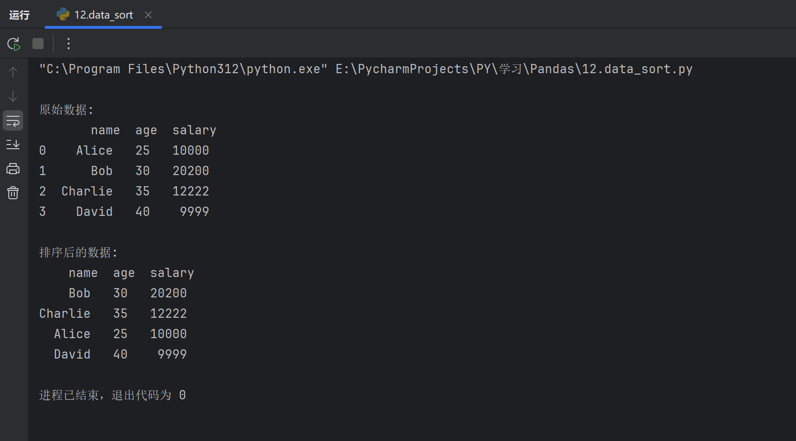

# Pandas 数据排序与聚合

数据排序与聚合是数据分析中非常常见且重要的操作，特别是在大数据集中的数据分析时。

排序帮助我们按特定标准对数据进行排列，而聚合则让我们对数据进行汇总，计算出各种统计量。

Pandas 提供了强大的排序和聚合功能，能够帮助分析人员高效地处理数据。

| **操作**       | **方法**                              | **说明**                                     | **常用函数/方法**                                          |
| :------------- | :------------------------------------ | :------------------------------------------- | :--------------------------------------------------------- |
| **排序**       | `sort_values(by, ascending)`          | 根据某列的值进行排序，`ascending` 控制升降序 | `df.sort_values(by='column')`                              |
| **排序**       | `sort_index(axis)`                    | 根据行或列的索引进行排序                     | `df.sort_index(axis=0)`                                    |
| **分组聚合**   | `groupby(by)`                         | 按照某列进行分组后，应用聚合函数             | `df.groupby('column')`                                     |
| **聚合函数**   | `agg()`                               | 聚合函数，如 `sum()`、`mean()`、`count()` 等 | `df.groupby('column').agg({'value': 'sum'})`               |
| **多重聚合**   | `agg([func1, func2])`                 | 对同一列应用多个聚合函数                     | `df.groupby('column').agg({'value': ['mean', 'sum']})`     |
| **分组后排序** | `apply(lambda x: x.sort_values(...))` | 在分组后进行排序                             | `df.groupby('column').apply(lambda x: x.sort_values(...))` |
| **透视表**     | `pivot_table()`                       | 创建透视表，根据行、列进行数据汇总           |                                                            |

------

### 一、数据排序（Sorting）

**排序**是指将数据按某个列的值进行升序或降序排列。Pandas 提供了两种主要的方法来进行排序：`sort_values()` 和 `sort_index()`。

#### 排序方法

- `sort_values()`：根据列的值进行排序。
- `sort_index()`：根据行或列的索引进行排序。

#### 实例

| **操作**   | **方法**                        | **说明**                                                     | **示例**                                    |
| :--------- | :------------------------------ | :----------------------------------------------------------- | :------------------------------------------ |
| 按值排序   | `df.sort_values(by, ascending)` | 按照指定的列（`by`）排序，`ascending` 控制升序或降序，默认为升序 | `df.sort_values(by='Age', ascending=False)` |
| 按索引排序 | `df.sort_index(axis)`           | 按照行或列的索引排序，`axis` 控制按行或列排序                | `df.sort_index(axis=0)`                     |

```py
import pandas as pd

# 示例数据
name = pd.Series(['Alice', 'Bob', 'Charlie', 'David'])
age = pd.Series([25, 30, 35, 40])
salary = pd.Series([10000, 20200, 12222, 9999])

df = pd.DataFrame({
    'name': name,
    'age': age,
    'salary': salary
})
print()
print('原始数据:\n', df,'\n')

# TODO:使用to_numeric确保salary为数值
df['salary'] = pd.to_numeric(df['salary'])
# 按照salary进行降序
df_sorted = df.sort_values(by='salary', ascending=False)
df_final = df_sorted.to_string(index=False)
print('排序后的数据:\n', df_final)
```



#### 关键代码讲解

- 在对数值型数据进行排序时,需要使用`to_numeric`函数确保对象为数值型数据
- 排序使用`sort_values(by=‘xxx’,ascending=False)降序`默认为`True`
- 使用`to_string(index=False)`去除列索引

*****

### 二、数据聚合（Aggregation）

**聚合**是将数据按某些规则进行汇总，通常是对某些列的数据进行求和、求平均数、求最大值、求最小值等操作。Pandas 提供了`groupby()`方法来对数据进行分组，然后应用不同的聚合函数。

#### 聚合方法

- `groupby()`：按某些列分组。
- 聚合函数：如 `sum()`, `mean()`, `count()`, `min()`, `max()`, `std()` 等。

#### 实例

| **操作**         | **方法**                             | **说明**                                                     | **示例**                                                    |
| :--------------- | :----------------------------------- | :----------------------------------------------------------- | :---------------------------------------------------------- |
| 按列分组并聚合   | `df.groupby(by).agg()`               | 按指定列（`by`）进行分组，`agg()` 可以传入不同的聚合函数，进行多种操作 | `df.groupby('Department').agg({'Salary': 'mean'})`          |
| 多重聚合函数应用 | `df.groupby(by).agg([func1, func2])` | 可以对同一列应用多个聚合函数，返回多种聚合结果               | `df.groupby('Department').agg({'Salary': ['mean', 'sum']})` |

```py
import pandas as pd

# 示例数据
data = {'Department': ['HR', 'Finance', 'HR', 'IT', 'IT'],
    'Employee': ['Alice', 'Bob', 'Charlie', 'David', 'Eve'],
    'Salary': [50000, 60000, 55000, 70000, 75000]}

df = pd.DataFrame(data)

# 按照部门分组，并计算每个部门的平均薪资
grouped = df.groupby('Department')['Salary'].mean()
print(grouped)
```

**输出：**

```py
Department
Finance    60000.0
HR         52500.0
IT         72500.0
Name: Salary, dtype: float64
```

**多重聚合函数应用**:

```py
# 按照部门分组，并计算每个部门的薪资的平均值和总和
grouped_multiple = df.groupby('Department').agg({'Salary': ['mean', 'sum']})
print(grouped_multiple)
```

**输出：**

```py
              Salary           
               mean    sum
Department                  
Finance    60000.0  60000
HR         52500.0  105000
IT         72500.0  145000
```

------

## 三、分组后的排序

聚合后的数据可以进一步按某列的值进行排序，这样可以找出特定组中最重要的值。

### 分组后排序

| **操作**   | **方法**                                                  | **说明**                             | **示例**                                                     |
| :--------- | :-------------------------------------------------------- | :----------------------------------- | :----------------------------------------------------------- |
| 分组后排序 | `df.groupby(by).apply(lambda x: x.sort_values(by='col'))` | 在每个分组内部按照某列的值进行排序。 | `df.groupby('Department').apply(lambda x: x.sort_values(by='Salary', ascending=False))` |

**分组后排序示例**:

```py
# 按照部门分组后，按薪资降序排序
grouped_sorted = df.groupby('Department').apply(**lambda** x: x.sort_values(by='Salary', ascending=False))
print(grouped_sorted)
```

**输出：**

```py
    Department Employee  Salary
Department                     
Finance     Bob   60000
HR          Charlie  55000
HR          Alice  50000
IT          Eve   75000
IT          David  70000
```

------

## 四、透视表

透视表（Pivot Table）是一个特殊的聚合方式，可以让我们通过行、列和聚合函数对数据进行快速汇总，类似于 Excel 中的透视表。

### 实例

| **操作**   | **方法**                                          | **说明**                                                     | **示例**                                                     |
| :--------- | :------------------------------------------------ | :----------------------------------------------------------- | :----------------------------------------------------------- |
| 创建透视表 | `df.pivot_table(values, index, columns, aggfunc)` | 用指定的列进行行、列分类汇总，`values` 是需要聚合的值，`aggfunc` 是聚合函数 | `df.pivot_table(values='Salary', index='Department', aggfunc='mean')` |

**透视表示例**：

```py
# 使用 pivot_table 计算每个部门的薪资平均值
pivot_table = df.pivot_table(values='Salary', index='Department', aggfunc='mean')
print(pivot_table)
```

**输出：**

```py
Department
Finance    60000.0
HR         52500.0
IT         72500.0
Name: Salary, dtype: float64
```

*****