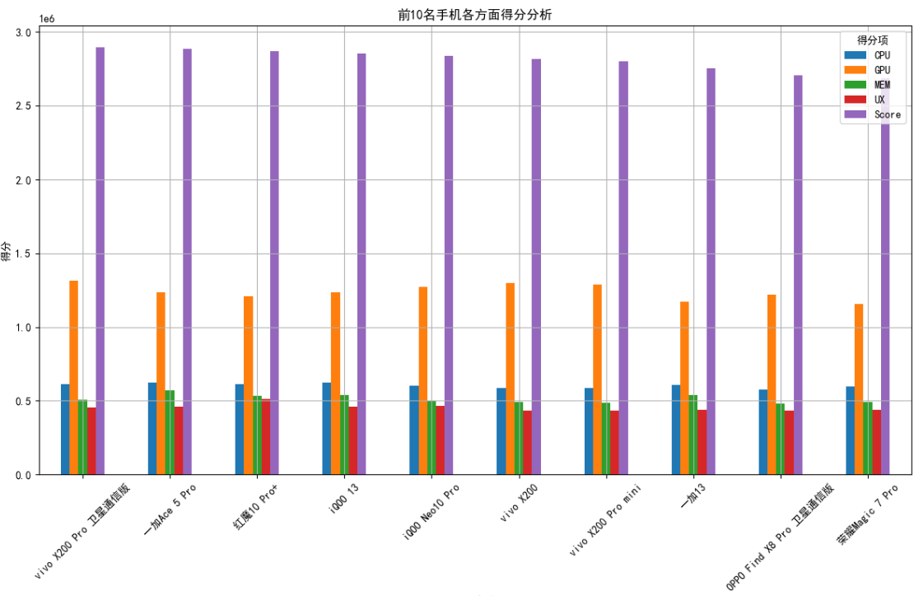
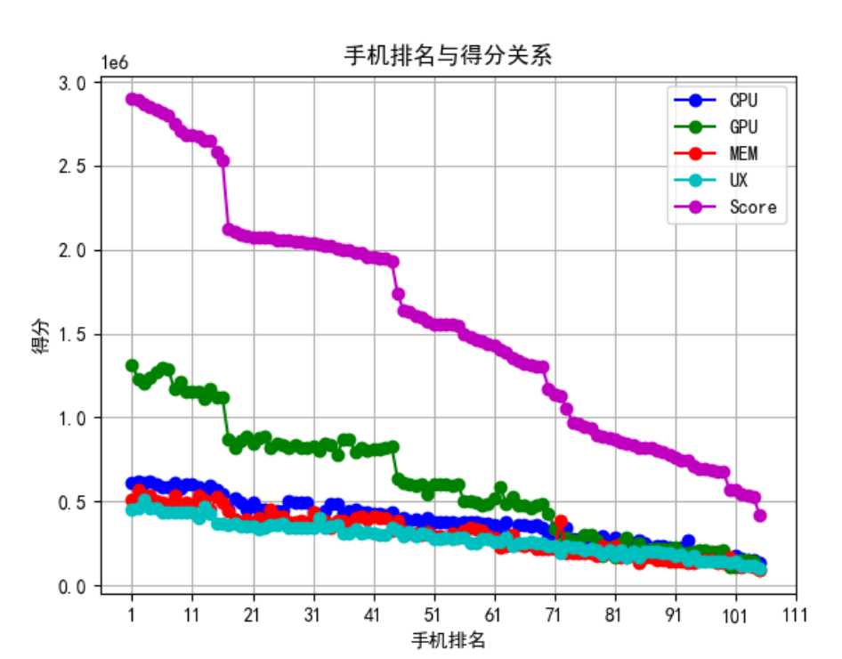

# Pandas 数据可视化

> 数据可视化是数据分析中的重要环节，它帮助我们更好地理解和解释数据的模式、趋势和关系。
>
> 通过图形、图表等形式，数据可视化将复杂的数字和统计信息转化为易于理解的图像，从而便于做出决策。
>
> Pandas 提供了与 [Matplotlib](https://www.runoob.com/matplotlib/matplotlib-tutorial.html) 和 [Seaborn](https://www.runoob.com/matplotlib/seaborn-tutorial.html) 等可视化库的集成，使得数据的可视化变得简单而高效。
>
> 在 Pandas 中，数据可视化功能主要通过 `DataFrame.plot()` 和 `Series.plot()` 方法实现，这些方法实际上是对 Matplotlib 库的封装，简化了图表的绘制过程。

| **图表类型**   | **描述**                               | **方法**                                      |
| :------------- | :------------------------------------- | :-------------------------------------------- |
| **折线图**     | 展示数据随时间或其他连续变量的变化趋势 | `df.plot(kind='line')`                        |
| **柱状图**     | 比较不同类别的数据                     | `df.plot(kind='bar')`                         |
| **水平柱状图** | 比较不同类别的数据，但柱子水平排列     | `df.plot(kind='barh')`                        |
| **直方图**     | 显示数据的分布                         | `df.plot(kind='hist')`                        |
| **散点图**     | 展示两个数值型变量之间的关系           | `df.plot(kind='scatter', x='col1', y='col2')` |
| **箱线图**     | 显示数据分布，包括中位数、四分位数等   | `df.plot(kind='box')`                         |
| **密度图**     | 展示数据的密度分布                     | `df.plot(kind='kde')`                         |
| **饼图**       | 显示不同部分在整体中的占比             | `df.plot(kind='pie')`                         |
| **区域图**     | 展示数据的累计数值                     | `df.plot(kind='area')`                        |

Pandas 数据可视化的基本功能和方法可以满足大多数日常数据可视化的需求，但若要实现更复杂的可视化，可以结合 Matplotlib 和 Seaborn 使用，进行更精细的图表定制。

------

### Pandas 数据可视化概述

Pandas 提供的 `plot()` 方法可以轻松地绘制不同类型的图表，包括折线图、柱状图、直方图、散点图等。`plot()` 方法有很多参数，可以定制图表的样式、颜色、标签等。

#### 1. 基本的 `plot()` 方法

| **参数**  | **说明**                                                     |
| :-------- | :----------------------------------------------------------- |
| `kind`    | 图表类型，支持 `'line'`, `'bar'`, `'barh'`, `'hist'`, `'box'`, `'kde'`, `'density'`, `'area'`, `'pie'` 等类型 |
| `x`       | 设置 x 轴的数据列                                            |
| `y`       | 设置 y 轴的数据列                                            |
| `title`   | 图表的标题                                                   |
| `xlabel`  | x 轴的标签                                                   |
| `ylabel`  | y 轴的标签                                                   |
| `color`   | 设置图表的颜色                                               |
| `figsize` | 设置图表的大小（宽, 高）                                     |
| `legend`  | 是否显示图例                                                 |

#### 2. 常用图表类型

| **图表类型**   | **描述**                                             | **常用用法**                                  |
| :------------- | :--------------------------------------------------- | :-------------------------------------------- |
| **折线图**     | 用于显示随时间变化的数据趋势                         | `df.plot(kind='line')`                        |
| **柱状图**     | 用于显示类别之间的比较数据                           | `df.plot(kind='bar')`                         |
| **水平柱状图** | 与柱状图类似，但柱子是水平的                         | `df.plot(kind='barh')`                        |
| **直方图**     | 用于显示数据的分布（频率分布）                       | `df.plot(kind='hist')`                        |
| **散点图**     | 用于显示两个数值变量之间的关系                       | `df.plot(kind='scatter', x='col1', y='col2')` |
| **箱线图**     | 用于显示数据的分布、异常值及四分位数                 | `df.plot(kind='box')`                         |
| **密度图**     | 用于显示数据的密度分布                               | `df.plot(kind='kde')`                         |
| **饼图**       | 用于显示各部分占总体的比例                           | `df.plot(kind='pie')`                         |
| **区域图**     | 用于显示累计数值的图表（类似于折线图，但填充了颜色） | `df.plot(kind='area')`                        |

****

### 数据可视化示例

- 可视化只做介绍,需要有一定基础

```py
import pandas as pd
import matplotlib.pyplot as plt

# 设置中文字体
plt.rcParams['font.sans-serif'] = ['SimHei']

# 数据读取
df = pd.read_excel('AnTutu_Top.xlsx')
print(df.to_string(index=False))

# 绘制排名TOP和跑分Score折线图
plt.plot(df['Top'], df['CPU'], marker='o', linestyle='-', color='b', label='CPU')
plt.plot(df['Top'], df['GPU'], marker='o', linestyle='-', color='g', label='GPU')
plt.plot(df['Top'], df['MEM'], marker='o', linestyle='-', color='r', label='MEM')
plt.plot(df['Top'], df['UX'], marker='o', linestyle='-', color='c', label='UX')
plt.plot(df['Top'], df['Score'], marker='o', linestyle='-', color='m', label='Score')
plt.title('手机排名与得分关系')
plt.xlabel('手机排名')
plt.ylabel('得分')
# 显示网格
plt.grid(True)
plt.legend()
plt.xticks(range(1, 121, 10))  # 设置横坐标刻度，每隔10个显示一个数字
# 保存图像
plt.savefig('手机排名与得分关系.png')

# 对前10名手机各方面进行分析可视化
top_10_df = df.head(10)

# 绘制前10名手机的各方面得分柱状图
top_10_df.set_index('Top')[['CPU', 'GPU', 'MEM', 'UX', 'Score']].plot(kind='bar', figsize=(12, 8))

# 修改x轴标签为手机名称
plt.xticks(ticks=range(10), labels=top_10_df['Name'], rotation=45)  # 旋转x轴标签以便显示

plt.title('前10名手机各方面得分分析')
plt.xlabel('手机名称')
plt.ylabel('得分')
plt.grid(True)
plt.legend(title="得分项")
plt.tight_layout()  # 调整布局
plt.savefig('前10名手机各方面得分分析.png')
```





*****