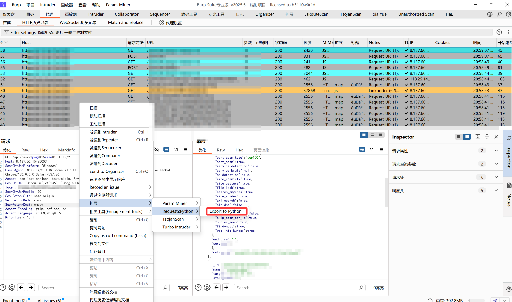
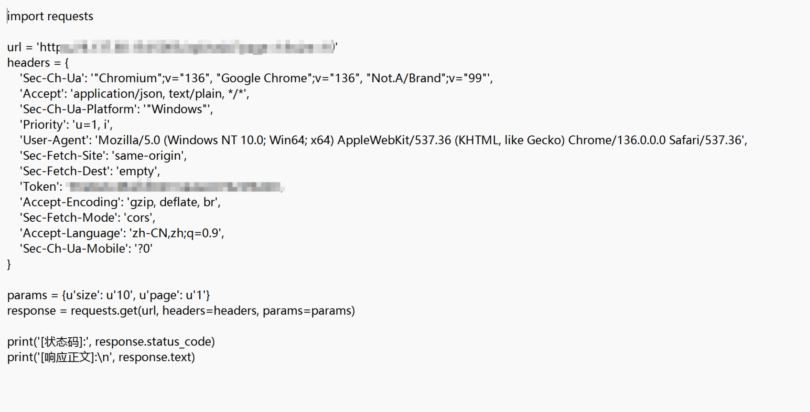
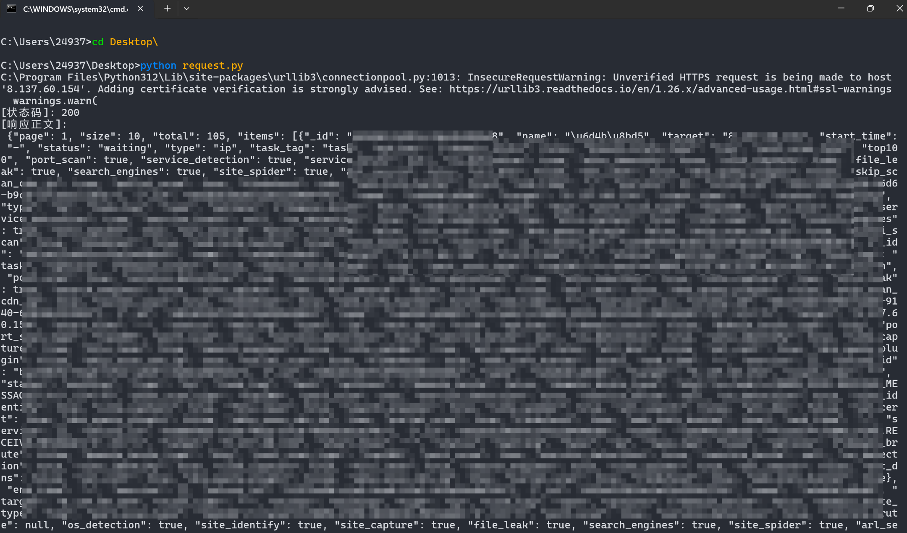
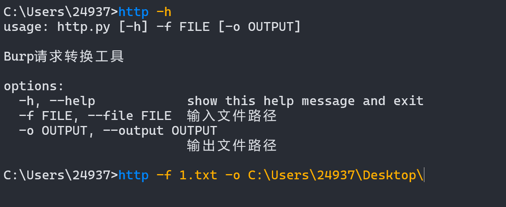
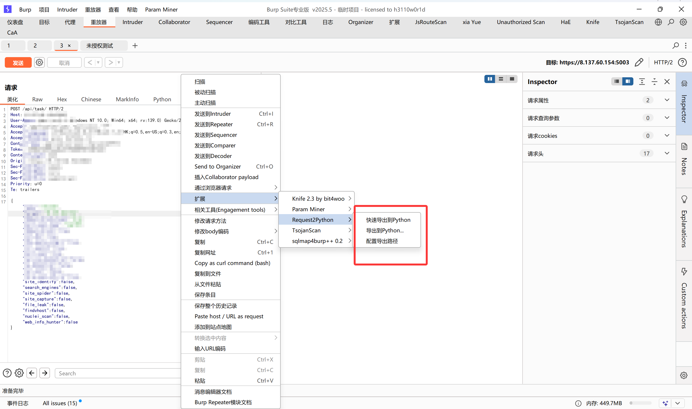
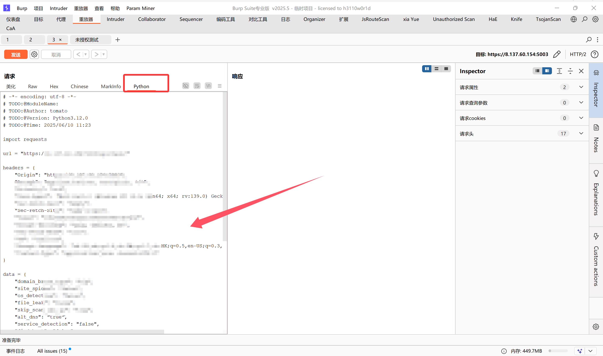
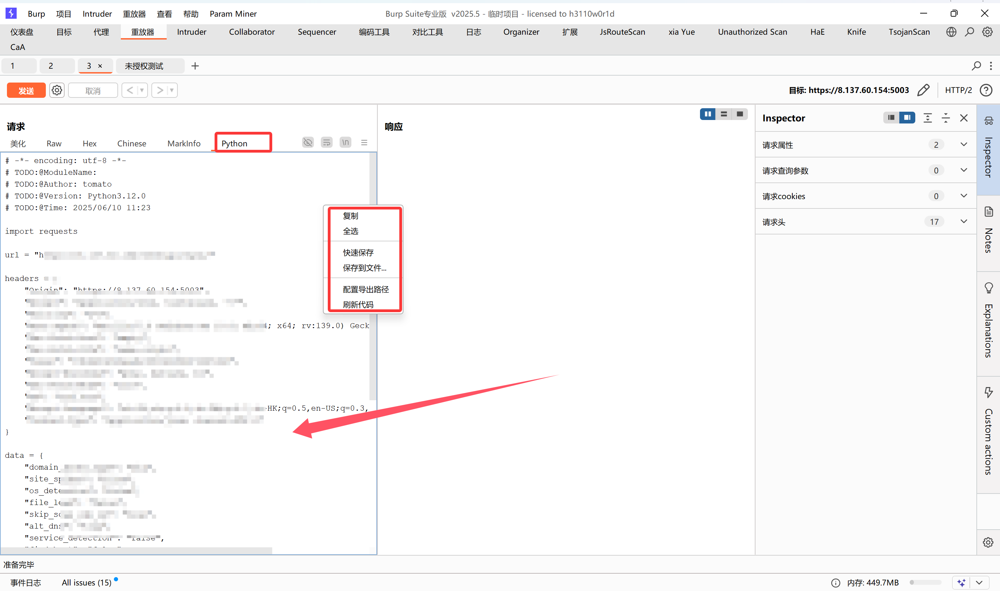

# Request2Python Burp 扩展插件


## 📖 概述

Request2Python 是一款 Burp Suite 扩展插件，可以将选中的 HTTP 请求自动转换为可执行的 Python 脚本。特别适用于：

- **安全测试人员**：快速生成验证漏洞的 PoC 代码
- **开发人员**：快速创建 API 调试脚本
- **自动化测试**：生成基础测试用例框架

## ✨ 核心功能

### 请求转换支持
| 请求类型  | 支持特性                       |
| --------- | ------------------------------ |
| GET 请求  | ✅ URL 参数自动解析             |
| POST 请求 | ✅ 表单数据 / JSON / 二进制数据 |
| 请求头    | ✅ 自动过滤冗余头               |
| HTTPS     | ✅ 自动处理证书验证             |

### 高级特性
- **智能数据处理**
  - 自动识别 `application/json` 内容类型
  - 正确处理 `multipart/form-data` 以外的二进制数据
  - URL 参数自动编码处理

- **代码生成优化**
  - 自动生成 `requests` 库标准调用
  - 支持 Base64 编码的二进制数据传输
  - 中文注释和状态输出

## 🛠️ 安装指南

### 环境要求
- Burp Suite Professional/Community 2023.12+
- Jython 2.7.3 (嵌入在 Burp 中)
- Python 3.6+ (执行生成脚本)

### 安装步骤
1. 下载 `Request2Python.py` 文件
2. 打开 Burp Suite → Extender → Extensions
3. 点击 "Add" → 选择 "Python" 类型
4. 选择下载的 Python 文件
5. 确认控制台输出加载成功信息

## 🚀 使用方法

### 基础使用
1. 在 Proxy/Repeater 模块选中目标请求
2. 右键点击 → 选择 "Export to Python"
3. 选择保存路径 (默认: request.py)
4. 运行生成的脚本：`python request.py`

### 转换示例
#### 生成代码结构
```python
import requests

url = 'https://api.example.com/login'
headers = {
    'User-Agent': 'Mozilla/5.0',
    'Content-Type': 'application/json'
}

# JSON 请求示例
import json
payload = json.loads(r"""{"username": "admin", "password": "P@ssw0rd"}""")
response = requests.post(url, headers=headers, json=payload)

print('[状态码]:', response.status_code)
print('[响应正文]:\n', response.text)
```

#### 支持的数据类型处理

| 数据类型   | 处理方式              | 示例代码片段                     |
| :--------- | :-------------------- | :------------------------------- |
| URL 参数   | `params` 字典自动生成 | `params = {'page': '2'}`         |
| 表单数据   | `data` 字典自动生成   | `data = {'user': 'test'}`        |
| JSON 数据  | 原生 JSON 解析        | `json.loads(r"""{}""")`          |
| 二进制数据 | Base64 编码传输       | `data = base64.b64decode('...')` |

## ⚠️ 注意事项

1. **依赖管理**

   生成的脚本需要安装 `requests` 库：

   ```cmd
   pip install requests
   ```

2. **编码处理**

   遇到特殊字符时建议使用原始字符串

   ```py
   data = r'''raw_content_with_special_chars'''
   ```

3. **HTTPS 证书验证**

   如需跳过证书验证，可在代码中添加：

   ```py
   response = requests.post(url, verify=False)
   ```

4. **二进制文件处理**

   - 超过 1MB 的文件建议使用文件流处理

   ```py
   with open('file.zip', 'rb') as f:
       response = requests.post(url, files={'file': f})
   ```

*****

### 运行效果



- 看看生成的代码



- 运行看看



*****

### http.py

- 这个为项目的初始版本,用户快速接口调试,也可快速将数据包转化为支持python格式的数据请求
- `不支持`导入burp



******

### 版本更新v1.1

> 快速导出

1. 在HTTP请求上右键
2. 选择 `快速导出到Python`
3. 脚本自动保存到配置的路径中



> 选择路径导出

1. 在HTTP请求上右键
2. 选择 `选择路径导出`
3. 在弹出的对话框中选择保存位置

> Python标签页使用

1. 选择任意HTTP请求
2. 在消息编辑器中切换到 `Python` 标签页
3. 实时查看生成的Python代码
4. 右键菜单支持复制、保存等操作



******



> 综述:解决上一个版本的中文乱码问题,新增快速导出功能,在请求数据包支持快速预览功能,实时修改查看预览python代码

******

### 版本更新v1.2-v1.2b

- 主要解决部分编码问题和已知问题

******

### 版本更新v1.3

- 解决部分协议解析出错问题(常见的https解析为http等问题),使用burp api模拟curl bash解析协议
- 解决扩展控制台输出编码乱码等已知问题