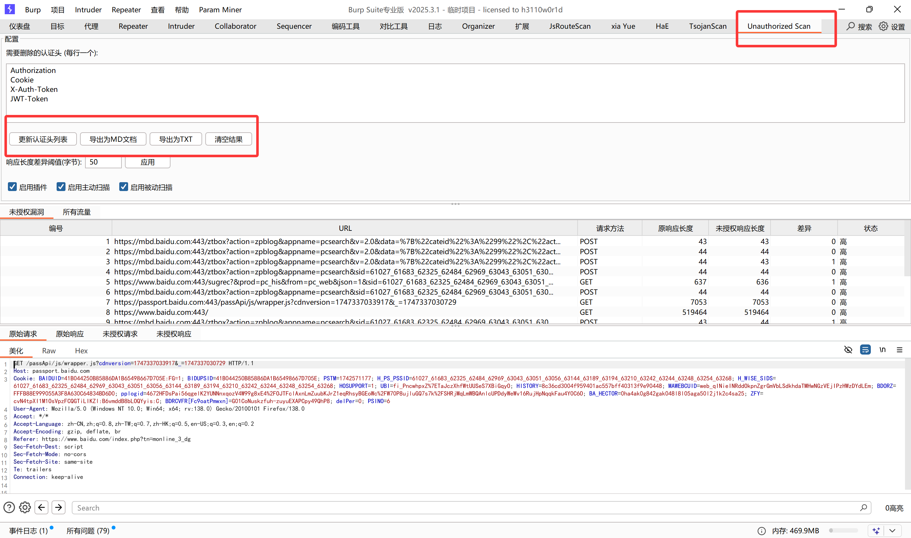
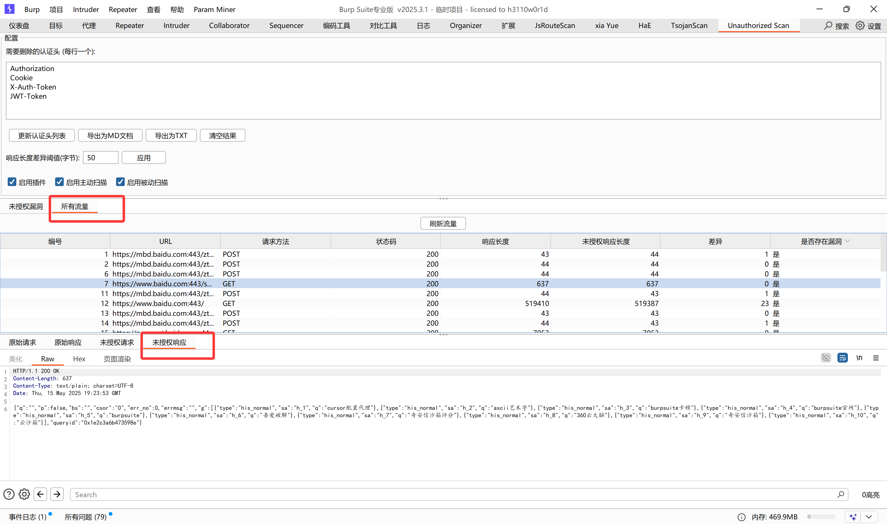
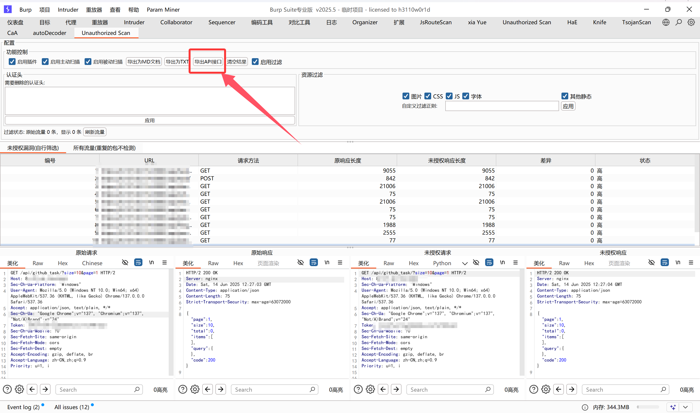
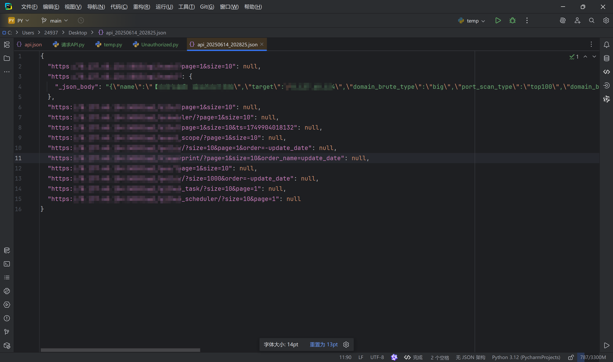

# 未授权访问检测器 (Unauthorized Access Detector)

这是一个Burp Suite扩展工具，用于自动检测Web应用程序中的未授权访问漏洞。

## 功能介绍

未授权访问漏洞是Web应用中常见的安全问题，当应用程序未正确验证用户权限就允许访问敏感资源时，就会出现这类漏洞。本插件通过以下方式检测这类漏洞：

1. **自动移除认证头**：从HTTP请求中移除认证相关的头部信息（如 Authorization、Cookie、X-Auth-Token 等）
2. **比较响应差异**：分析原始响应与未授权响应的内容差异
3. **智能判断漏洞**：根据响应状态码、响应长度等因素自动判断是否存在未授权访问漏洞

## 主要特性

- **主动扫描和被动扫描模式**：支持在Burp主动扫描中使用，也可以被动监控所有流量
- **自定义认证头**：可配置需要移除的认证头列表
- **可调整的检测阈值**：可设置响应长度差异阈值，灵活适应不同应用场景
- **详细的调试信息**：提供完整的请求处理日志，便于排查问题
- **强大的错误处理**：包含请求重试机制，确保检测过程稳定可靠
- **丰富的结果展示**：直观查看检测结果及详细信息
- **导出功能**：支持将检测结果导出为Markdown或文本文件，以及导出API接口为JSON格式
- **流量记录**：记录所有经过的流量，便于后续分析

## 安装方法

1. 下载最新的release版本JAR文件（`unauthorized-access-detector-1.0-shaded.jar`）
2. 打开Burp Suite，进入Extender > Extensions
3. 点击"Add"按钮，选择下载的JAR文件
4. 成功加载后，在顶部标签中会出现"Unauthorized Scan"选项卡

## 使用说明

### 基本配置

1. 在"需要删除的认证头"文本框中配置要移除的认证头（每行一个）
2. 设置响应长度差异阈值（默认50字节）
3. 选择是否启用主动扫描、被动扫描等功能

### 检测未授权访问漏洞

**被动扫描模式**：
- 启用"启用插件"和"启用被动扫描"选项
- 正常浏览目标应用，插件会自动检测所有经过的流量

**主动扫描模式**：
- 启用"启用插件"和"启用主动扫描"选项
- 在Burp Scanner中进行主动扫描时，插件会自动运行检测

### 查看结果

- "未授权漏洞"选项卡显示检测到的漏洞
- "所有流量"选项卡记录所有经过的流量及其未授权测试结果
- 选择列表中的项目可在下方查看详细的请求和响应信息

### 导出结果

- 点击"导出为MD文档"按钮可将结果以Markdown格式导出
- 点击"导出为TXT"按钮可将结果以文本格式导出
- 点击"导出API接口"按钮可将检测到的未授权漏洞接口以JSON格式导出，格式与api.json一致

#### API接口导出格式说明

导出的JSON文件格式如下：
- GET请求：`{"url": null}`
- POST/PUT/DELETE等有请求体的接口：`{"url": {"参数1": "值1", "参数2": "值2"}}`
- 支持多种Content-Type：
  - `application/json`：导出为`_json_body`字段
  - `application/x-www-form-urlencoded`：解析表单参数
  - `multipart/form-data`：导出为`_multipart_body`字段
  - 其他格式：导出为`_raw_body`字段

## 构建方法

如需从源码构建插件：

1. 确保已安装Java JDK 8+和Maven
2. 克隆本仓库到本地
3. 运行`build.bat`或执行以下命令：

```
mvn clean package
```

构建完成后，JAR文件将生成在`target`目录下

## 使用效果



进一步判断



## 注意事项

- 本工具仅用于安全测试和授权的渗透测试
- 使用本工具检测非授权系统可能违反相关法律法规
- 插件可能会增加网络流量，影响Burp Suite性能，请根据需要开启/关闭

## 更新日志

### v1.0 (2025-05-16)
- 首次发布
- 支持主动和被动扫描模式
- 提供可配置的认证头和检测阈值
- 实现详细的日志记录和错误处理
- 增加结果导出和流量记录功能 

### v1.1 (2025-05-27)

- 修复部分bug
- 显示优化,快速对比数据包

### v1.2 (2025-06-14)

- 新增导出api功能,将所有未授权接口导出为json
- 可以通过下面的脚本快速,批量验证未授权漏洞

```py
# -*- encoding: utf-8 -*-
# TODO:@ModuleName: 未授权批量验证
# TODO:@Author: tomato
# TODO:@Version: Python3.12.0
# TODO:@Time: 2025/6/14 20:40
import json
import requests
import urllib3


class Unauthorized:
    # TODO: 关闭警告(部分https不被信任的情况)
    urllib3.disable_warnings(urllib3.exceptions.InsecureRequestWarning)

    def __init__(self, Json_path, Headers):
        self.json_path = Json_path
        self.headers = Headers

    def read_api_json(self):
        with open(self.json_path, 'r', encoding='utf-8') as f:
            api_json = json.load(f)
        return api_json

    def request_api(self):
        api_json = self.read_api_json()
        # TODO: 遍历接口,对键值对进行判断,值为空get请求,否则post
        for url, json_data in api_json.items():
            if json_data is None:
                print(f"[GET]: {url}")
                response = requests.get(url, headers=self.headers, verify=False)
                print(f"响应状态码: {response.status_code}")
                print(f"响应内容: {response.text}")
                print("\n")
            else:
                print(f"[POST]: {url}")
                response = requests.post(url, headers=self.headers, json=json_data, verify=False)
                print(f"响应状态码: {response.status_code}")
                print(f"响应内容: {response.text}")
                print("\n")


if __name__ == '__main__':
    headers = {
        "Sec-Ch-Ua": "\"Google Chrome\";v=\"137\", \"Chromium\";v=\"137\", \"Not/A)Brand\";v=\"24\"",
        "Accept": "application/json, text/plain, */*",
        "Sec-Ch-Ua-Platform": "\"Windows\"",
        "Priority": "u=1, i",
        "User-Agent": "Mozilla/5.0 (Windows NT 10.0; Win64; x64) AppleWebKit/537.36 (KHTML, like Gecko) Chrome/137.0.0.0 Safari/537.36",
        "Sec-Fetch-Site": "same-origin",
        "Sec-Fetch-Dest": "empty",
        "Token": "xxxxxxxxxxxxx",
        "Accept-Encoding": "gzip, deflate, br",
        "Sec-Fetch-Mode": "cors",
        "Accept-Language": "zh-CN,zh;q=0.9",
        "Sec-Ch-Ua-Mobile": "?0"
    }
    json_path = r"C:\Users\xxxx\Desktop\api_20250614_202825.json"
    Unauthorized = Unauthorized(json_path, headers)
    Unauthorized.request_api()
```



- api json导出格式如下(`get`请求`值`为空,`post`请求则存在值,可以根据这一个性质判断get请求还是post请求)




