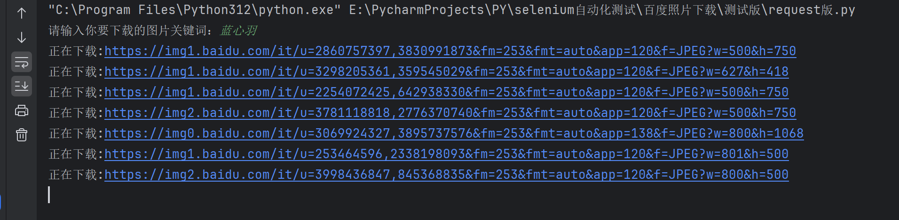
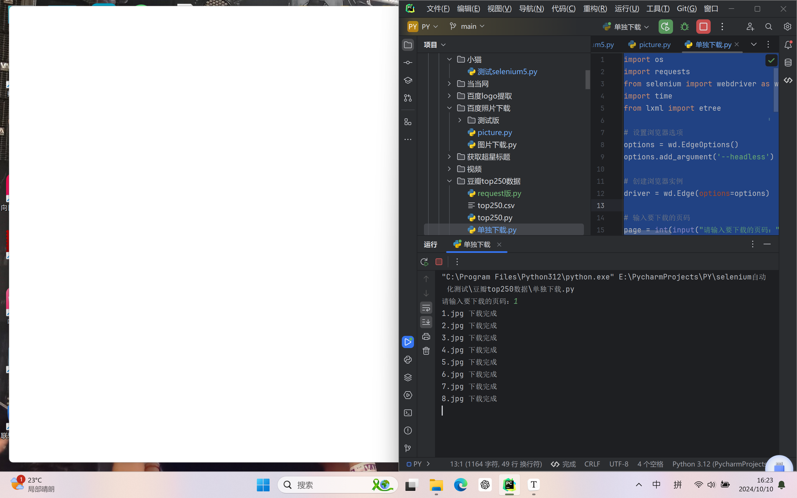
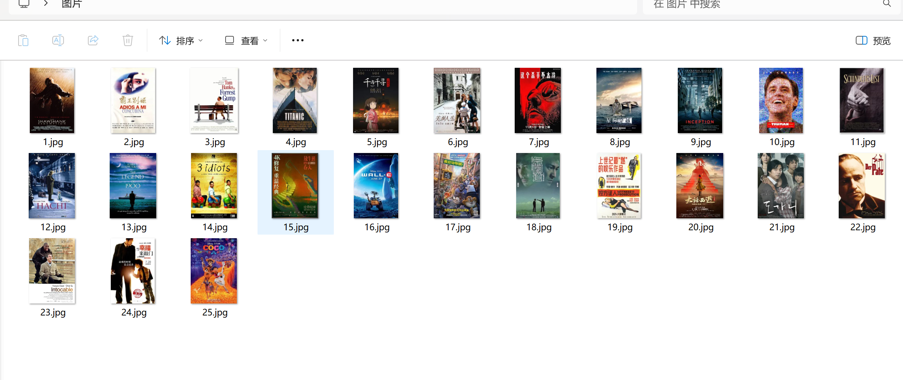

### 图片爬取案例1(搜狐)

```py
import requests
import re

headers = {
    'Connection': 'keep-alive',
    'Pragma': 'no-cache',
    'Cache-Control': 'no-cache',
    'sec-ch-ua': '";Not A Brand";v="99", "Chromium";v="94"',
    'sec-ch-ua-mobile': '?0',
    'sec-ch-ua-platform': '"Windows"',
    'Upgrade-Insecure-Requests': '1',
    'User-Agent': 'Mozilla/5.0 (Windows NT 10.0; WOW64) AppleWebKit/537.36 (KHTML, like Gecko) Chrome/94.0.4606.71 Safari/537.36 SE 2.X MetaSr 1.0',
    'Accept': 'text/html,application/xhtml+xml,application/xml;q=0.9,image/avif,image/webp,image/apng,*/*;q=0.8,application/signed-exchange;v=b3;q=0.9',
    'Sec-Fetch-Site': 'same-origin',
    'Sec-Fetch-Mode': 'navigate',
    'Sec-Fetch-User': '?1',
    'Sec-Fetch-Dest': 'document',
    'Referer': 'https://www.sohu.com/',
    'Accept-Language': 'zh-CN,zh;q=0.9',
    'Cookie': 'IPLOC=CN; SUV=241010141919P4WV; cityIpLocation=111.55.145.64; reqtype=pc; gidinf=x099980109ee199821fbce0140002b75f45afe2835f2; _dfp=s68j8Ud8GOW0/csPXMu+b4+2vkPuvOt/qIYBuWjX2+U=; clt=1728541160; cld=20241010141920; arialoadData=false; beans_new_turn=%7B%22www.sohu.com%22%3A23%7D; t=1728541336391; 15853=2',
}

res = requests.get(
    'https://www.sohu.com/picture/815143309?spm=smpc.home.yule-pics.1.1728541255950wYU2Yfh_1467&_f=index_yulefocus_0_0&scm=thor.543_14-200000.0.10006.',
    headers=headers)
res.encoding = 'utf-8'
# print(res.text)

# https://q8.itc.cn/q_70,c_zoom,h_1200,g_face/images01/20241010/f5424fd159e04cc5931de30656aaf966.png
# https://q6.itc.cn/q_70,c_zoom,h_1200,g_face/images01/20241010/39714dda73a449ebb0030ab5d3f37c98.png
# https://q6.itc.cn/q_70,c_zoom,h_1200,g_face/images01/20241010/5783030352024cc2acb545b48836f1e7.png
# https://q3.itc.cn/q_70,c_zoom,h_1200,g_face/images01/20241010/0314873f5b9e4a1585ce39a05f3a17ea.png
# https://q7.itc.cn/q_70,c_zoom,h_1200,g_face/images01/20241010/30b05926405e4459b08cd4efae804c3a.png

# TODO:使用正则提取所有图片链接,注意观察几张图片的规律
img_url = re.findall(r'//q[0-9].itc.cn/q_70,c_zoom,h_1200,g_face/images01/20241010/.*?.png', res.text)

# TODO:使用集合去重(唯一性)
end_urls = set(img_url)

# TODO:遍历所有图片链接并下载
for count, url in enumerate(end_urls, start=1):
    end_url = 'https:' + url
    print(f"下载图片: {end_url}")

    # TODO:下载
    res = requests.get(end_url, headers=headers)
    # TODO:这儿图片名字提供一个思路,使用bs4的get_text()方法获取所有文本,提取出来是一个列表,而且
    # TODO:是带有 \n\n\n\n 换行符这些的,就是说列表只有一个元素,那么需要指定位置切割字符串,去掉不需要的脏数据
    # TODO:然后在使用for循环遍历列表,把列表元素作为文件名
    with open(f'张纪中-{count}.png', 'wb') as f:
        f.write(res.content)
print("所有图片下载完成！")

```


****

### 图片爬取案例2(百度)

```py
import requests
import re

headers = {
    'Connection': 'keep-alive',
    'Pragma': 'no-cache',
    'Cache-Control': 'no-cache',
    'sec-ch-ua': '";Not A Brand";v="99", "Chromium";v="94"',
    'sec-ch-ua-mobile': '?0',
    'sec-ch-ua-platform': '"Windows"',
    'Upgrade-Insecure-Requests': '1',
    'User-Agent': 'Mozilla/5.0 (Windows NT 10.0; WOW64) AppleWebKit/537.36 (KHTML, like Gecko) Chrome/94.0.4606.71 Safari/537.36 SE 2.X MetaSr 1.0',
    'Accept': 'text/html,application/xhtml+xml,application/xml;q=0.9,image/avif,image/webp,image/apng,*/*;q=0.8,application/signed-exchange;v=b3;q=0.9',
    'Sec-Fetch-Site': 'same-origin',
    'Sec-Fetch-Mode': 'navigate',
    'Sec-Fetch-User': '?1',
    'Sec-Fetch-Dest': 'document',
    'Accept-Language': 'zh-CN,zh;q=0.9',
    'Cookie': 'BIDUPSID=CA74EF0653BF772D70211B74CCF25362; PSTM=1727511518; __bid_n=19232c4678706241644905; ZFY=lzmA6PETQquRaVPRC:BGjIiKoRxkmRKXw1:AWKPGUGm9o:C; BAIDUID=3008522C0F7129BA3E9B40C41D178287:FG=1; BAIDUID_BFESS=3008522C0F7129BA3E9B40C41D178287:FG=1; H_WISE_SIDS=60600_60824; H_PS_PSSID=60600; BDORZ=FFFB88E999055A3F8A630C64834BD6D0; BA_HECTOR=2ga02124252g2g058g8k818022h9d61jgc3nb1v; BDRCVFR[S_ukKV6dOkf]=mk3SLVN4HKm; BDRCVFR[dG2JNJb_ajR]=mk3SLVN4HKm; userFrom=null; BDRCVFR[-pGxjrCMryR]=mk3SLVN4HKm; ab_sr=1.0.1_ZjRkN2ZlMjZkNDM1NDA5NTQzNTAwNzQ4YzZkYjZjOTlkMDFiMGM5YjRjMWE4NzIyZjM0NDgzMTI0YjAzZjhiY2U4NWIwY2E0N2YyMDFhYjU0MTkxNDQ1NTQ2M2U4ZGI1OTE4MDgwZjJlMTA5ZmU3MGNkZGY0Nzc2Yjc0OGQ3Y2NhYmQ3NGMzZDgzMzk0OWQ4NzVkYTBjM2UxYTYzZjQzMWViMWZmYTdjNzc3MTM3ZjRhY2I2NWFmYTU4Zjc3MjgwM2NiYWQ1MmJiZjU3ZDQ1ZmVjZWI1NTcyYmRhOGJlNmM=',
}

word = input('请输入你要下载的图片关键词：')
response = requests.get(
    f'https://image.baidu.com/search/index?tn=baiduimage&ipn=r&ct=201326592&cl=2&lm=&st=-1&fm=index&fr=&hs=0&xthttps=111110&sf=1&fmq=&pv=&ic=0&nc=1&z=&se=&showtab=0&fb=0&width=&height=&face=0&istype=2&ie=utf-8&word={word}',
    headers=headers)
html = response.text
# print(html)
# 找到所有img的url ,"thumbURL": "https://img0.baidu.com/it/u=183576704,正则匹配
img_urls = re.findall('"thumbURL": "(.*?)"', html)
count = 0
for img_url in img_urls:
    print('正在下载:'+img_url)
    count += 1
    with open(f'{word}-{count}.jpg', 'wb') as f:
        f.write(requests.get(img_url, headers=headers).content)
print('下载完成!')
```




****

### 图片爬取案例3(框架版)

```py
import os
import requests
from selenium import webdriver as wd
import time
from lxml import etree

# 设置浏览器选项
options = wd.EdgeOptions()
options.add_argument('--headless')  # 启用无头模式

# 创建浏览器实例
driver = wd.Edge(options=options)

# 输入要下载的页码
page = int(input("请输入要下载的页码："))

# 设置图片保存路径
save_path = "C:/Users/24937/Desktop/图片"

# 创建保存图片的目录
if not os.path.exists(save_path):
    os.makedirs(save_path)

# 计算该页的起始位置
start = (page - 1) * 25

# 生成页面的 URL 并请求页面内容
base_url = f'https://movie.douban.com/top250?start={start}'
driver.get(base_url)
time.sleep(2)  # 增加等待时间以确保页面加载完成

# 获取页面源码
tree = etree.HTML(driver.page_source)

# 获取电影名和图片URL
names = tree.xpath('//*[@id="content"]/div/div[1]/ol/li/div/div[2]/div[1]/a/span[1]/text()')
images = tree.xpath("//ol[@class='grid_view']/li[*]/div[@class='item']/div[@class='pic']/a/img/@src")

# 下载图片并保存
for index in range(len(names)):
    image_url = images[index]
    image_filename = f"{index + 1}.jpg"  # 根据每页的排名从1到25命名图片
    response = requests.get(image_url)
    with open(os.path.join(save_path, image_filename), "wb") as f:
        f.write(response.content)
        print(f"{image_filename} 下载完成")

# 关闭浏览器实例
driver.quit()
```

- 会`模拟打开浏览器`开始下载,这儿可能因为缓存没有加载出来,但是图片实在下载了





