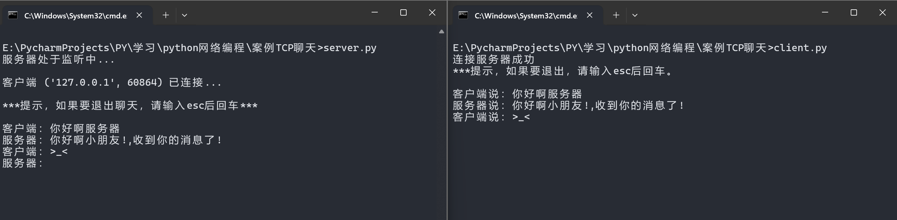
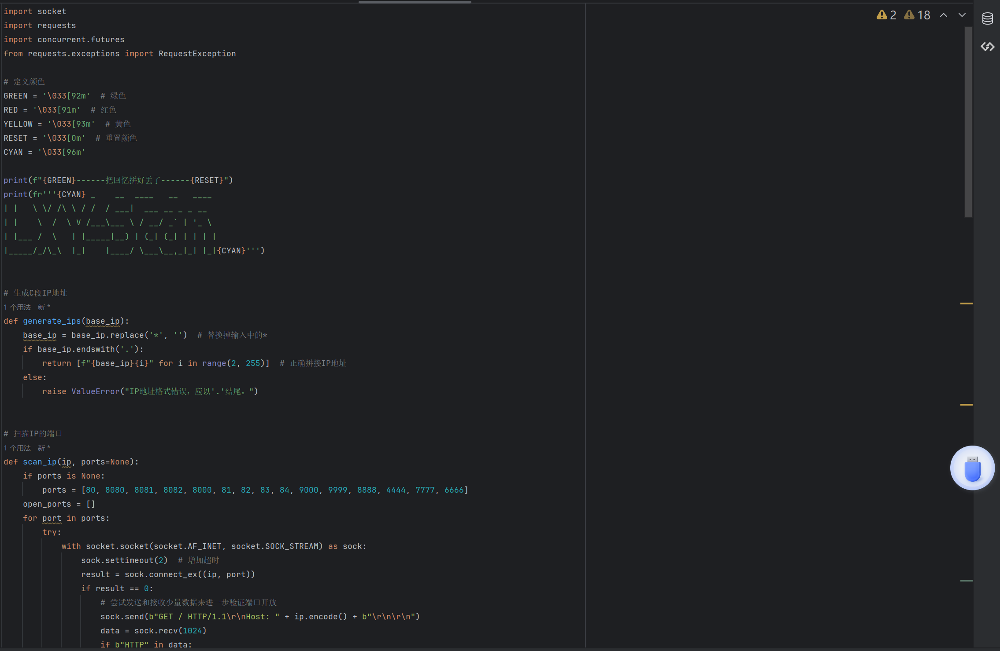
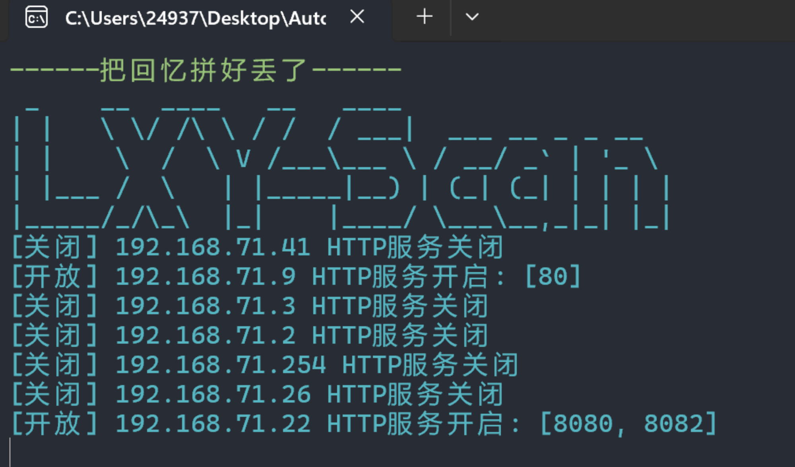
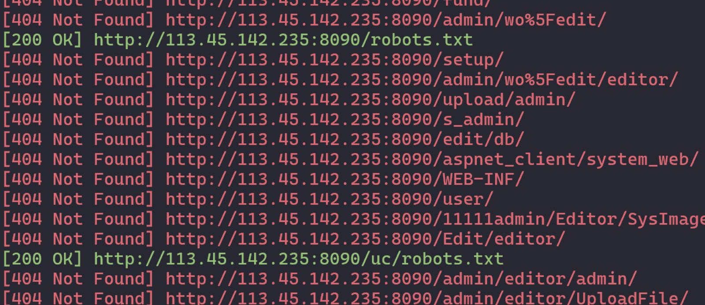

### socket构建TCP聊天

- 服务端

```py
import socket

s = socket.socket()
host = '127.0.0.1'  # 例如 '192.168.1.5'
port = 8888
s.connect((host, port))
print('连接服务器成功')
print('***提示，如果要退出，请输入esc后回车。\r\n')

while True:
    send_data = input('客户端说：')
    s.send(send_data.encode())
    if send_data == 'esc':
        break
    if send_data != 'esc':
        info = s.recv(1024).decode()
        print('服务器说：' + info)

s.close()

```

- 客户端

```py
import socket

host = ''  # 监听所有网络接口
port = 8888

s = socket.socket(socket.AF_INET, socket.SOCK_STREAM)
s.bind((host, port))
s.listen(5)
print('服务器处于监听中...\r\n')
sock, addr = s.accept()
print(f'客户端 {addr} 已连接...\r\n')
print('***提示，如果要退出聊天，请输入esc后回车***\r\n')

while True:
    info = sock.recv(1024).decode()
    if info == 'esc':
        break
    if info:
        print('客户端：' + info)
    send_data = input('服务器：')
    sock.send(send_data.encode())
    if send_data == 'esc':
        break

sock.close()
s.close()
```

### 执行效果



### 端口扫描



仅展示部分源码!

### 执行效果





- 端口扫描出来以后会进行目录扫描
- 然后进行自动化攻击 >_<