# 安全加固

### Windows

- IP协议安全配置
- 其它安全配置
- 账号管理和认证授权
- 日志配置操作

#### 账户

- 默认账户安全,`禁用Guest`账户


- 按照用户分配对应的`用户组`

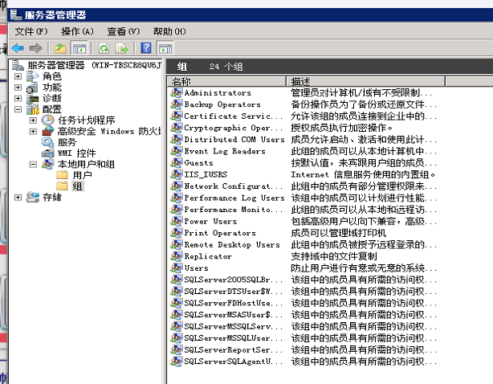

- `定期检查现存`的用户,是否有不明的用户


- 配置`登出后`,不显示`用户名称`

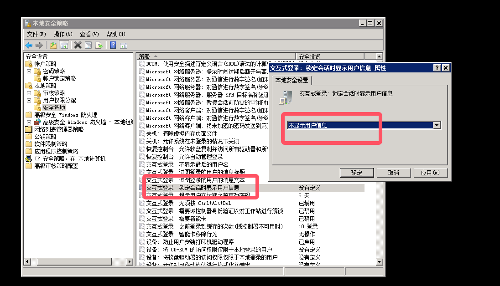

- 设置`密码复杂度`,根据需求进行修改


- `账户锁定`策略


****

#### 授权

- 在本地安全设置中,从远端系统强制关机的权限只分配给`administrators`组


- `授权`账户登录,配置 允许本地登录权限给指定的授权用户

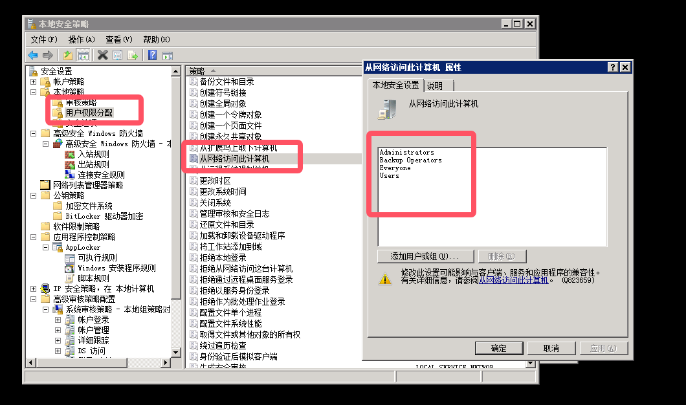

****

#### 日志配置

- `审核登录`,对用户的登录进行记录

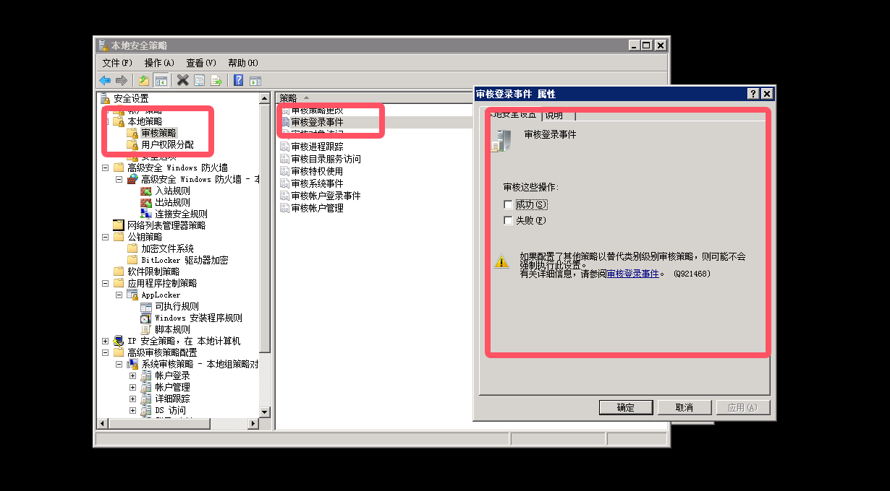

- `审核对象访问`


- `审核特权使用`

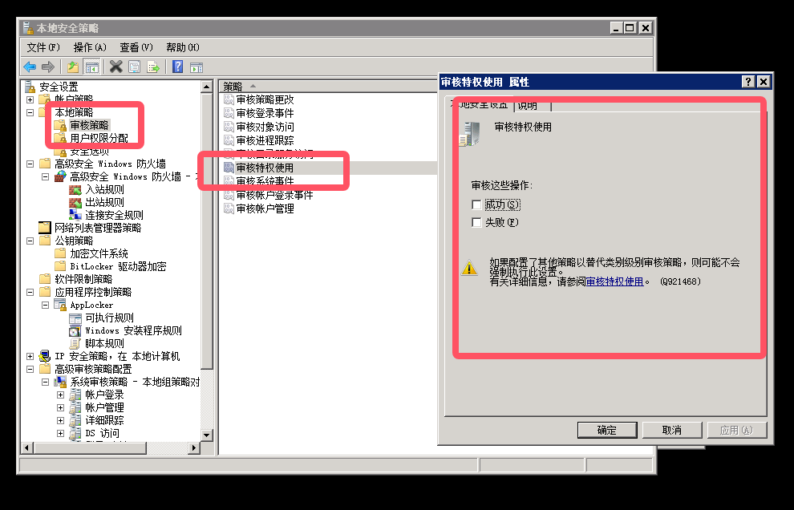

- `审核系统事件`


- `审核账号管理`

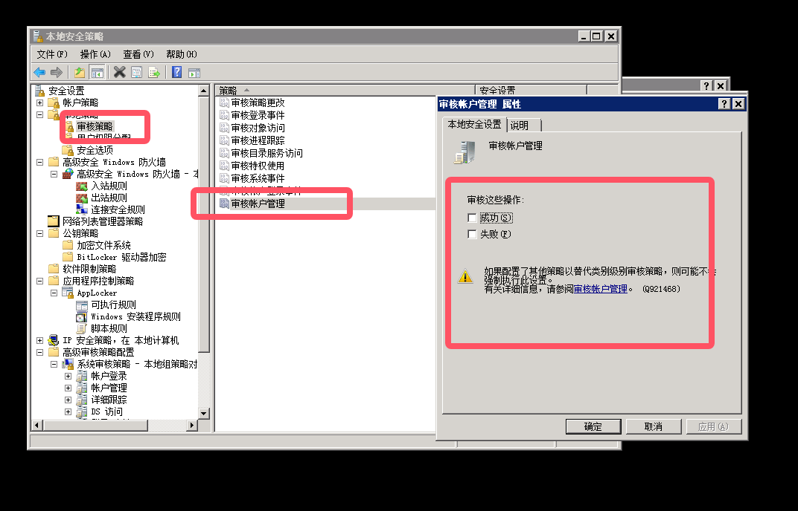

- `审核过程追踪`


- `日志文件大小`

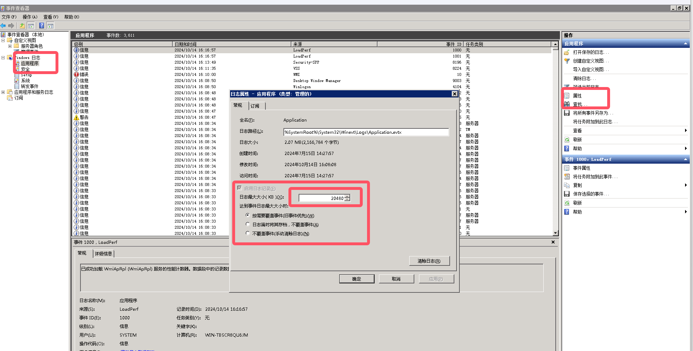

****

#### 其它安全配置

- 安装防`病毒`软件
- 设置`屏幕保护密码`和`开启时间`
- 限制`远程登录空闲断开时间`(对于远程登录的用户,设置不活动超过15分钟自动断开连接)
- 操作系统`补丁`管理

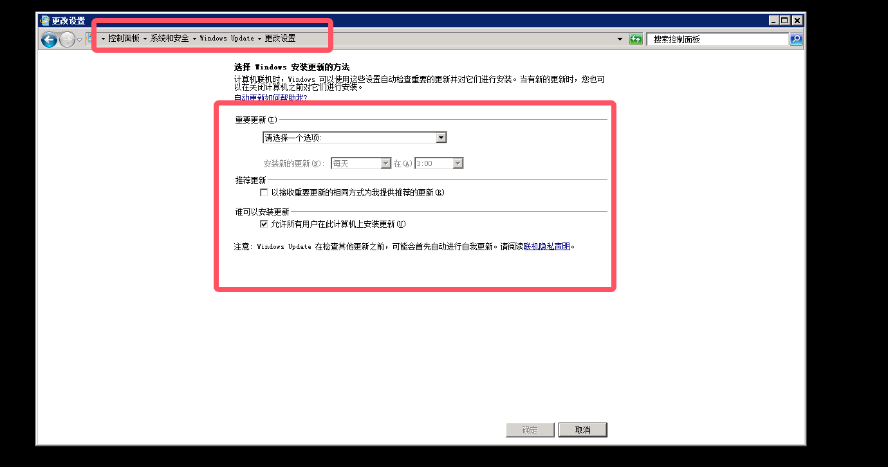

****

### Liunx

- linux服务安全设置
- linux文件权限设置
- 日志文件配置操作
- 账号管理和认证授权

#### 账号和口令

- 使用`userdel [用户名]`删除不必要的用户
- 使用`passwd -l [用户名]`锁定不必要的账号
- 使用`passwd -u [用户名]`解锁必要的账号
- 检查是否存在`空口令`和`root`权限的账号(观察是否有和root用户`相似的`)


- 使用`awk -F: '($2=="")' /etc/shadow`查看空口令的账号

- 使用`awk -F: '($3==0)' /etc/passwd`查看UID为0的用户 


- `加固`空口令账号,使用`passwd [用户名]`为空口令账号设置密码

- 确认`uid`为0的账户只能有`root`

- 限制用户`su`(限制能`su`到`root`的用户)

  ```bash
  # 修改配置文件
  vi /etc/pam.d/su
  
  # 若只允许test组用户su到root,则添加
  auth required pam_wheel.so group=test
  ```

- 禁止`root`用户直接登录	

  ```bash
  # 创建一个普通权限的账号并配置密码,防止无法远程登录
  # 使用命令,修改配置文件,将PermitRootLogin的值改成no
  vi /etc/ssh/sshd_config 
  # 然后重启服务
  service sshd restart
  ```

****

#### 服务

- 关闭不必要的服务,降低风险(`sysremctl disable [服务名]`关闭自启动)

- 对`ssh`服务进行安全加固,防止暴力破解成功

  ```bash
  # 编辑配置文件
  vim /etc/ssh/sshd_config
  
  # 不允许root账户直接登录系统,PermitRootLogin的值为no
  # 修改ssh使用的协议版本,Protocol的版本为2
  # 修改允许密码错误的次数(默认6次)
  # 设置MaxAuthTries的值为3
  # 重启服务
  ```

  

****

#### 日志

- 启用日志功能,并配置日志记录
  - 系统日志(默认) `/var/log/messages`
  - cron日志(默认) `/var/log/cron`
  - 安全日志(默认) `/var/log/secure`
  - 部分系统可能使用`syslog-ng`日志,`/etc/syslog-ng/syslog-ng.conf`

****

### 中间件

- Apache服务安全加固
- Tomcat服务安全加固
- IIS服务安全加固
- 数据库服务安全加固

##### Apache安全加固

- 为`Apache`服务创建用户及用户组,如果没有设置用户和组,则新建用户,并在Apache配置文件中进行指定

```bash
# 创建Apache用户组
groupadd apache

# 创建Apache用户
useradd apache -g apache

# 将下面两个参数加入httpd.conf
User apache
Group apache
```


- `账户设置`

  - 检查httpd.conf配置文件中是否允许使用非专用账户(如root用户)运行Apache服务
  - Linux系统默认使用apache或者nobody用户,Unix系统默认使用daemon

- `授权设置`

  - 严格控制Apache主目录的访问权限,非超级用户不能修改该目录中的内容

  - 1.Apache的主目录对应于Apache Server配置文件httpd.conf中的Server Root控制项

    ```bash
    Server Root /usr/local/apache
    
    # 判定条件:非超级用户不能修改该目录中的内容
    # 检测操作:尝试进行修改,看是否能修改该目录中的内容
    ```

  - 2.严格设置配置文件和日志文件的权限,防止未授权访问

    ```bash
    # 设置配置文件为属主可读写,其它用户无读写权限
    chmod 644 /var/log/httpd/*.log
    
    # /etc/httpd/conf/httpd.conf 配置文件的默认权限是644
    # /var/log/httpd/*.log 日志文件的默认权限644,默认设置即符合要求
    ```

  

  

  

- `日志设置`

  - Apache设备应配置日志功能,对运行错误,用户访问等事件进行记录,记录内容包括时间,用户使用的ip地址等内容

  - 修改配置文件,设置日志记录文件,记录内容,记录格式

  - `错误日志`

    - LogLevel notice #日志的级别
    - ErrorLog /.../logs/erro_log #日志的保存位置(错误日志)

  - `访问日志`

    - LogFormat %h %l %u %t \" %r\" %>s %b "%{Accept}i\"%{Referer}i\" \ "%{User-Agent}i ""
    - combined
    - CustomLog /.../logs/access_log combined (访问日志)

  - `注意`

    - `ErroLog`指令设置错误日志文件名和位置.错误日志是最重要的日志文件.Apache httpd 程序将在这个文件中存放诊断信息和处理请求中出现的错误.若要将错误日志传送到Syslog,则执行`ErrorLog syslog`命令
    - `Customlog`指令指定了保存日志文件的具体位置以及日志的格式.访问日志中会记录服务器所处理的所有请求
    - `LogFormat`命令用于设置日志格式,建议设置为combined格式
    - `LogLevel`命令用于调整记录在错误日志的信息的详细程度,建议设置notice.日志的级别,默认是warn级别,notice级别比较详细,但在实际中由于日志会占用大量硬盘空间

    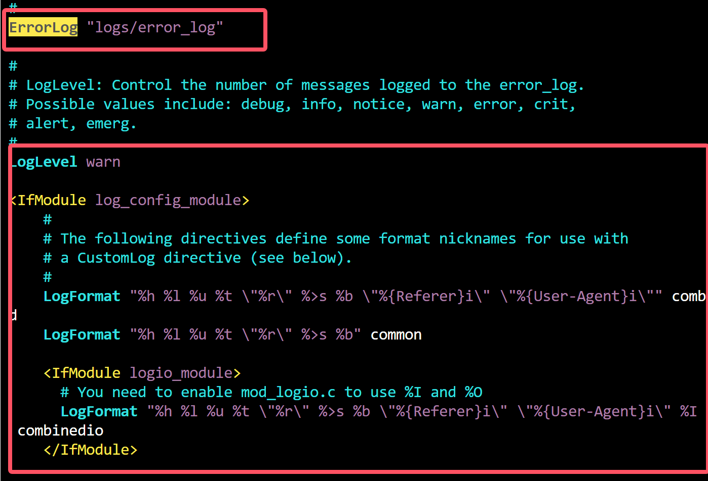

    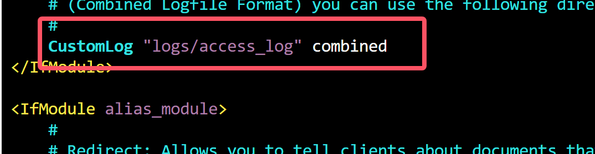

- `禁止外部文件`

  - 修改httpd.conf配置文件

    ```bash
    Order Deny,Allow
    Deny from all
    ```

    

  - 设置可访问的目录

    ```cmd
    Order Allow,Deny
    Allow from /web
    ```

  - 默认配置文件

    ```cmd
    Options FollowSymLinks
    AllowOverride None
    ```

- `禁止目录列出`

  - 目录列出会导致明显信息泄露或下载,建议禁止Apache列表显示文件,在/etc/httpd/httpd.conf配置文件中删除Options的Indexs设置即可

  - 1.修改 httpd.conf 配置文件

    ```cmd
    # Options Indexs FollowSymLinks #删除Indexs
    Options FollowSymLinks
    AllowOverride None
    Order allow,deny
    Allow from all
    ```

  - 2.将`Options Indexs FollowSymLinks 中`的`Indexs`去掉,就可以禁止Apache显示该目录结构,Indexs的作用就是当该目录下没有index.html文件时,自动显示目录结构

- `错误页面重定向`

  - 1.修改httpd.conf配置文件

    ```cmd
    ErrorDocument 400 /custom400.html
    ErrorDocument 401 /custom401.html
    ErrorDocument 403 /custom403.html
    ErrorDocument 404 /custom404.html
    ErrorDocument 405 /custom405.html
    ErrorDocument 500 /custom500.html
    ```

  - 注意:Customxxx.html为要设置的错误页面

  - 2.重新启动Apache服务

- `拒绝服务防范`

  - 根据业务需要,合理设置`session`时间,防止拒绝服务攻击

  - 1.修改 httpd.conf 配置文件

    ```bash
    Timeout 10 #客户端与服务器端建立连接前的时间间隔
    KeepAlive on
    KeepAliveTimeout 15 #限制每个session的保持时间是15秒
    ```

    

  - 2.重新启动Apache服务

- `隐藏Apache版本号`

  - 隐藏版本号及其它敏感信息
  - 修改httpd.conf配置文件
  - `ServerSignature Off ServerTokens Prod`

- `关闭TRACE功能`

  - 关闭TRACE功能,防止TRACE方法被访问者恶意利用
  - 在 /etc/httpd/conf/httpd.conf 配置文件中添加以下设置参数
  - TraceEnable Off

  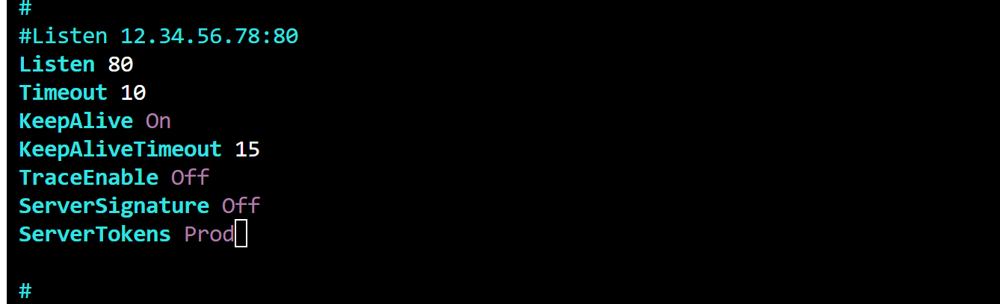

- `禁用CGI`

  - 如果服务器上不需要运行CGI程序,建议禁用
  - 将cgi-bin目录的配置文件和模块都进行注释

  

- `绑定监听地址`

  - 服务器有多个IP地址时,只监听提供服务的IP地址
  - 1.执行命令查看是否绑定IP地址
  - cat /etc/httpd/conf/httpd.conf|grep Listen
  - 2.修改 /etc/httpd/conf/httpd.conf配置文件
  - Listen x.x.x.x:80
  - 监听功能默认监听所有地址,如果服务器只有一个IP地址可不修改该项设置,如果有多个IP可根据需要进行设置

- `删除缺省安装的无用文件`

  - 删除缺省HTML文件
  - rm -rf /usr/local/apache2/htdocs/*
  - 删除缺省的CGI脚本
  - rm -rf /usr/local/apache2/cgi-bin/*
  - 删除Apache的说明文件
  - rm -rf /usr/local/apache2/manual
  - 删除源代码文件
  - rm -rf /path/to/httpd-2.2.4*

- `禁用非法的Http方法`

  - 禁用PUT,DELETE等危险的HTTP方法,修改httpd.conf配置文件,只允许get和post

    ```http
    <location/>
    <LimitExcept GET POST CONNECT OPTIONS>
    Order Allow,Deny
    Deny from all
    </LimitExcept>
    </Location>
    ```

****

##### Tomcat安全加固

- 修改默认后台账户密码
- 网络访问控制,使用`安全组防火墙`功能对管理后台的URL地址进行拦截,或者将部署目录中webapps文件夹中的manager,host-manager文件夹全部删除,并注释掉Tomcat目录中的conf文件夹中的tomcat-users.xml文件中的所有代码
- 修改端口
- 开启访问日志,取消注释相关代码

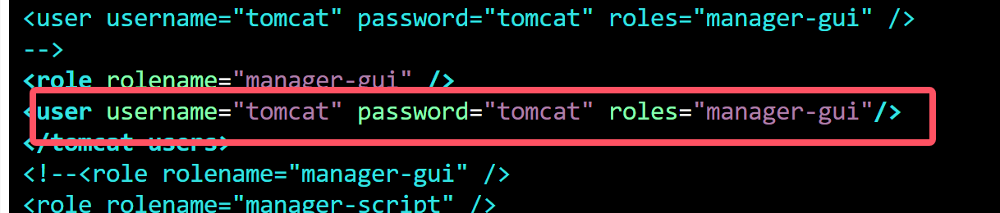

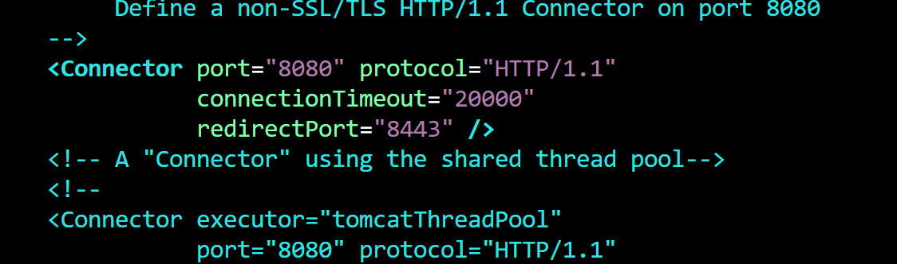

 	->  禁止目录列出


​	-> 删除该目录下所有文件

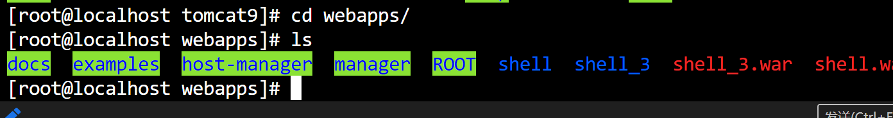

****

##### IIS安全加固

- 管理工具-->IS管理器-->网站-->dvbbs-->右键-->属性(以下配置大多数都在这里修改)

- 修改默认日志路径

- 默认日志路径:c:\windows\system32\logfile，修改到其他路径:d:\dvbbslog，可以设置为system读写,administrator只读权限。

- > 1.修改日志属性
  > 网站-->属性-->高级(日志记录属性):勾选协议版本、勾选cookies(小技巧，查找日志的
  > 关键在于选择关键字，如在日志里面搜索404关键字，因为如果攻击者对网站进行猜后台的时候
  > 肯定会尝试提交不同的目录，没有攻击者提交的文件目录就会返回404错误，因此可以借助日志
  > 信息判断遭受何种攻击)
  > 2.删除所有不必要的映射(扩展名,
  > 主目录--配置--映射(如使用aspx、asp的就仅仅留下这两个，其余的全部删除，如cercdx等[这是为了防止上传网马1)

- > 3.不要向客户端发送详细信息
  > 想客户端不要发送详细信息，应该发送自定义的信息，如可以发送“110网站监控.."主目录-->配置-->选项(调试)
  >
  > 4.IIS权限
  > 不给写入和目录浏览(写入会上传网马，目录浏览会导致目录遍历甚至下载)
  > 5.限制后台登录的IP地址
  > 登录后台地址:admin--右键--属性--目录安全性--允许特定的IP地址或IP地址段
  > 6.删除所有的自定义错误c:lwindwoshelpliishelp

****

##### PHP安全加固

- `启用 PHP 的安全模式`
- PHP 环境提供的安全模式是一个非常重要的内嵌安全机制，PHP 安全模式能有效控制一些 PHP 环境中的函数(例如system()函数)，对大部分的文件操作函数进行权限控制，同时不允许对某些关键文件进行修改(例如 /etc/passwd)。但是，默认的 php.ini配置文件并没有启用安全模式。可以通过修改 `php.ini` 配置文件启用 PHP 安全模式: `1.safe mode=on`
- `用户组安全`
- 当启用安全模式后，如果`safe_mode_gid`选项被关闭，PHP 脚本能够对文件进行访问，且相同用户组的用户也能够对该文件进行访问。
  因此，建议将该选项设置为关闭状态:
  `1.safe mode gid = off`
  `注意`:该选项参数仅适用于 Linux 操作系统。
  如果不进行该设置，您可能无法对服务器网站目录下的文件进行操作。
- `安全模式下执行程序主目录`
- 如果启用了安全模式后，想要执行某些程序的时候，可以指定需要执行程序的主目录，例如:`1.safe_mode_exec_dir=/usr/bin`
  一般情况下，如果不需要执行什么程序，建议您不要指定执行系统程序的目录。您可以指定一个目录,然后把需要执行的程序拷贝到这个目录即可，例如:`2.safe_mode_exec_dir=/temp/cmd`
  但是，更推荐您不要执行任何程序。这种情况下，只需要将执行目录指向网页目录即可:`3.safe_mode_exec_dir=/usr/www`
  `注意`:执行目录的路径以您实际操作系统目录路径为准。
- `安全模式下包含文件`
- 如果您需要在安全模式下包含某些公共文件，您只需要修改以下选项即可:`1.safe_mode_include_dir=/usr/www/include/`一般情况下，PHP 脚本中包含的文件都是在程序已经写好的，可以根据您的具体需要进行设置。
- `控制 PHP脚本能访问的目录`
- 使用`open_basedir`选项能够控制 PHP 脚本只能访问指定的目录，这样能够避免 PHP 脚本访问不应该访问的文件，一定程度下降低了 phpshell 的危害。一般情况下，可以设置为只能访问网站目录:
  `1.open basedir=/usr/www`
- `关闭危险函数`
- 如果启用了安全模式，那么可以不需要设置函数禁止，但为了安全考虑，还是建议您进行相关设置。
  例如，您不希望执行包括`system()`等在内的执行命令的 PHP 函数，以及能够査看 PHP 信息的`phpinfo()`等函数
  那么您可以通过以下设置禁止这些函数:
  `1.disable_functions = system, passthru, exec, shell exec, popen,phpinfo,escapeshellarg,escapeshellcmd,proc_close, proc_open,dl`如果想要禁止对于任何文件和目录的操作，那么您可以关闭以下文件相关操作。`2.disable_functions = chdir, chroot, dir, getcwd, opendir, readdir, scandir, fopen, unlink, delete, copy, mkdir
  rmdir, rename, file, file_get_contents, fputs, fwrite, chgrp,chmod, chown`
  `注意`:以上设置中只列举了部分比较常用的文件处理函数，您也可以将上面的执行命令函数和这些文件处理函数相结合，就能给抵制大部分的phpshell威胁。
- `关闭PHP版本信息在HTTP头中的泄露`
- 为了防止黑客获取服务器中 PHP 版本的信息，您可以禁止该信息在 HTTP 头部内容中泄露:`1.expose_php = off`
  这样设置之后，黑客在执行`telnet <domain>80`尝试连接您的服务器的时候，将无法看到 PHP 的版本信息。
- `关闭注册全局变量`
- 在 PHP 环境中提交的变量，包括使用 POST 或者 GET命令提交的变量，都将自动注册为全局变量，能够被直接访问。这对您的服务器是非常不安全的，因此建议您将注册全局变量的选项关闭，禁止将所提交的变量注册为全局变量。`1.register_globals = off`
  `注意`:该选项参数在 PHP 5.3 以后的版本中已被移除。
  当然，如果这样设置之后，获取对应变量的时候就需要采取合理方式。例如，获取 GET命令提交的变量 var，就需要使用`$_GET['var']`命令来进行获取，在进行 PHP 程序设计时需要注意。
- `SQL注入防护`
- SQL注入是一个非常危险的问题，小则造成网站后台被入侵，重则导致整个服务器沦陷。`magic_quotes_gpc`选项默认是关闭的。如果打开该选项，PHP 将自动把用户提交对 SQL 查询
  的请求进行转换(例如，把’ 转换为\’等)，这对于防止 SQL注入攻击有很大作用，因此建议将该选项设置为:`1.magic quotes gpc=on`注意:该选项参数在 PHP 5.4.0 以后的版本中已被移除
- `错误信息控制`
- 一般 PHP 环境在没有连接到数据库或者其他情况下会有错误提示信息，错误信息中可能包含 PHP 脚本当前的路径信息或者査询的 SQL语句等信息，这类信息如果暴露给黑客是不安全的，因此建议禁止该错误提示:`1.display_errors = Off`如果确实要显示错误信息，一定要设置显示错误信息的级别。例如，只显示警告以上的错
  误信息:`2.error_reporting=E_WARNING &E_ERROR`注意:强烈建议关闭错误提示信息
- `错误日志`
  建议您在关闭错误提示信息后，对于错误信息进行记录，便于排查服务器运行异常的原因:`1.log errors= On`同时，需要设置错误日志存放的目录，建议您将 PHP 错误日志与 Apache 的日志存放在
  同一目录下:`2.error log=/usr/local/apache2/logs/php error.log`注意:该文件必须设置允许 Apache 用户或用户组具有写的权限。

****

### 数据库安全加固

#### MySQL安全加固

- `帐号安全`
- 禁止 Mysql 以管理员帐号权限运行.以普通帐户安全运行 mysqld，禁止以管理员帐号权限运行 MySQL服务。在/etc/my.cnf配置文件中进行以下设置。`1.mysql.server`,`2.user=mysql`

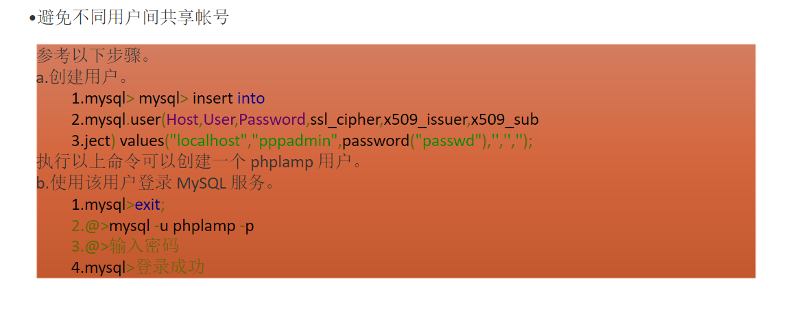

- `删除无关账户`
- DROP USER 语句可用于删除一个或多个 MySQL账户。使用 DROP USER 命令时，必须确保当前账号拥有 MySQL数据库的全局CREATE USER 权限或 DELETE 权限。账户名称的用户和主机部分分别与用户表记录的 User 和 Host 列值相对应。执行`DROP USER user;`语句，您可以取消一个账户和其权限，并删除来自所有授权表的帐户权限记录
- `口令`
- 检查账户默认密码和弱密码。口令长度需要至少八位，并包括数字、小写字母、大写字母和特殊符号四类中的至少两种类型，且五次以内不得设置相同的口令。密码应至少每 90 天进行一次更换。可以通过执行以下命令修改密码:
  `1.mysal> update user set password=passwordl'test!p3' where user='root';`
  `2.mysal> flush privileges;`
- `权限`
- 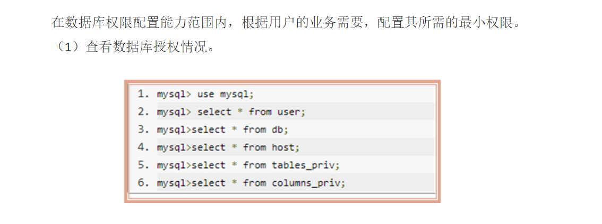

- `授权`
- 
- `开启日志审计功能`


- 

- `安装最新补丁`
- 确保系统安装了最新的安全补丁。注意:在保证业务及网络安全的前提下，并经过兼容性测试后，安装更新补丁
- `禁止远程访问`
- 

- `设置可信ip访问控制`
- 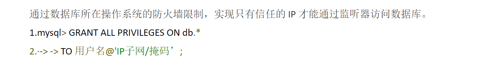

- `连接数设置`
- 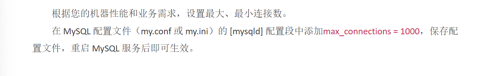

****

#### phpMyadmin安全加固

- 

- `网络访问控制策略`
- 

- `账户与口令安全策略`
- 设置强度复杂的口令，可以有效避免被攻击者轻易猜解成功，设置完毕后无需重启服务，及时生效;根据使用人员角色对数据库账号进行精细化授权，防止运维风险。

****

#### MongoDB安全加固

- 

- `管理员自查`
- 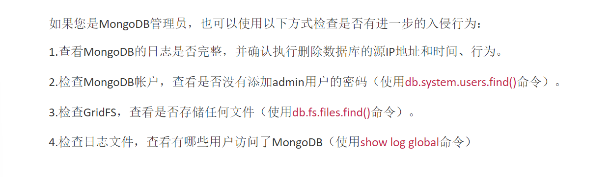

- 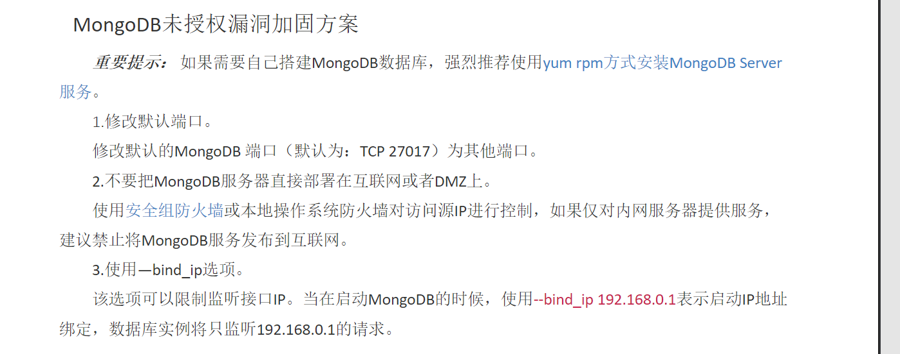

- 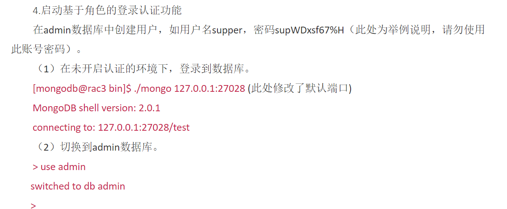

- 

- 

- 

- 


- 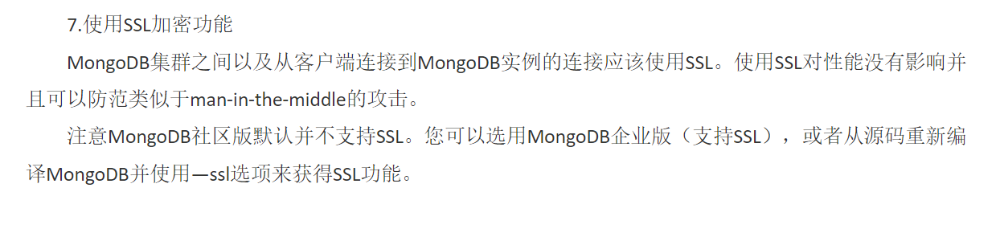

- 

****

#### Redis服务安全加固

- 漏洞描述

```sql
/*
Redis 因配置不当存在未授权访问漏洞，可以被攻击者恶意利用。
在特定条件下，如果 Redis 以 root 身份运行，黑客可以给root 账号写入 SSH 公钥文件，直接通过 SSH登录受害服务器，从而获取服务器权限和数据。一旦入侵成功，攻击者可直接添加账号用于SSH 远程登录控制服务器，给用户的 Redis 运行环境以及 Linux 主机带来安全风险，如删除、泄露或加密重要数据，引发勒索事件等。
```

- 位置:`/etc/redis.conf`,去掉第二个注释


****

- `网络层加固`

```sql
# 取消注释
bind 192.168.1.100 10.0.0.1

# 设置防火墙策略
iptables -A INPUT -s 192.168.1.100 -p tcp --dport 6379 -j ACCEPT

# 设置访问密码
# requirepass foobared
requirepass myStrongPassword123

# 服务运行权限最小化
useradd -M -s /sbin/nologin [用户名]

# 服务精细化授权
rename-command CONFIG ""         # 禁用 CONFIG 命令
rename-command FLUSHALL ""       # 禁用 FLUSHALL 命令
rename-command FLUSHDB ""        # 禁用 FLUSHDB 命令
rename-command SHUTDOWN ""       # 禁用 SHUTDOWN 命令
rename-command DEBUG ""          # 禁用 DEBUG 命令
rename-command CONFIG ""         # 禁用 CONFIG 命令
rename-command SHUTDOWN "nosd"   # 将 SHUTDOWN 重命名为 nosd
rename-command FLUSHALL "naflush" # 将 FLUSHALL 重命名为 naflush

# 安全补丁(升级)
```

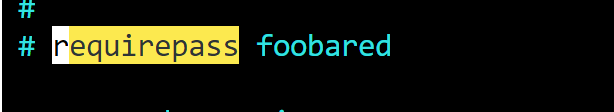

****

