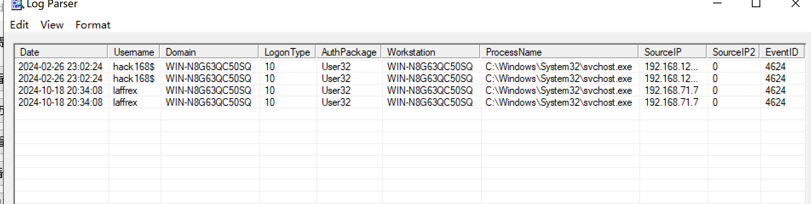

### 应急响应

#### 查看远程用户登录的用户


- 存在可疑用户run,limingzhi,tomato

#### 查看远程登录成功的日志




#### 查看计划任务

```cmd
文件夹: \
主机名:       WIN-N8G63QC50SQ
任务名:       \MicrosoftEdgeUpdateTaskMachineCore1da68be70a8a202
下次运行时间: 2024/10/19 18:43:15
模式:         正在运行
登录状态:     交互方式/后台方式

主机名:       WIN-N8G63QC50SQ
任务名:       \MicrosoftEdgeUpdateTaskMachineCore1da68be70a8a202
下次运行时间: 2024/10/19 18:43:15
模式:         正在运行
登录状态:     交互方式/后台方式

主机名:       WIN-N8G63QC50SQ
任务名:       \MicrosoftEdgeUpdateTaskMachineUA
下次运行时间: 2024/10/18 21:13:15
模式:         就绪
登录状态:     交互方式/后台方式
```

#### 查看网站目录


#### 扫描是否存在可疑端口


- 暂未发现可疑端口

#### 查看注册表


- 未发现可疑启动项