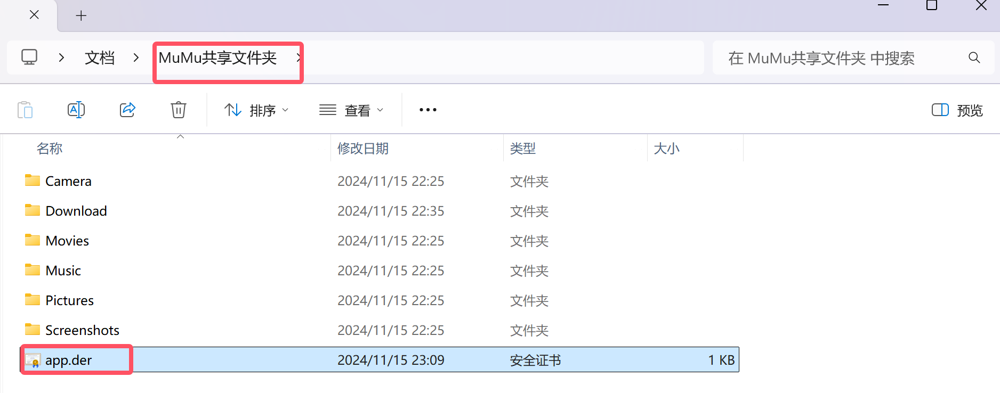

### 移动app渗透

- 获取`adb调试端口`


- 安装需要使用的工具


- 使用`adb`工具将端口转发出来

```cmd
adb connect 127.0.0.1:16384
adb devices
```


- 配置`手动代理`


- 使用`postern`配置代理


- 配置`代理规则`


- 配置`代理监听器`


- `成功抓到`


- `证书配置`


- `导入证书`



- 使用`openssl`将证书转化成`pem`格式

```cmd
openssl x509 -inform DER -in "C:\Users\24937\Documents\MuMu共享文件夹\app.der" -out "C:\Users\24937\Documents\MuMu共享文件夹\app.pem"
```


- 使用`openssl`读取证书的签名信息,获取签名的`hash头`

```cmd
openssl.exe x509 -inform PEM -subject_hash_old -in "C:\Users\24937\Documents\MuMu共享文件夹\app.pem"
```


- 重命名`app.pem`文件名为`9a5ba575.0`

```
copy "C:\Users\24937\Documents\MuMu共享文件夹\app.pem" "C:\Users\24937\Documents\MuMu共享文件夹\9a5ba575.0"
```


- 使用`adb`相关命令进行证书添加

```cmd
adb devices
adb root
```

或者


- 将证书导入到`/system/etc/security/cacerts/`(必须修改为root权限,磁盘共享可写)


- 移动文件就能正常移动了,可以mt在命令行用find查找`0`文件,这里就不展示了


- `渗透基本流程就同web渗透了….`

****

### app渗透实战


- 这里通过数据包提交拦截可以发现,是进行`base64编码`了但是将`=`替换成了`:`


```py
# TODO:读取1.txt,将每一个内容进行base64编码,将编码的'='替换成':'
import base64
# 打开输入文件并读取内容
with open(r'C:\Users\24937\Desktop\100W常用密码\1pass00.txt', 'r', encoding='utf-8') as f:
    lines = f.readlines()
# 对每行内容进行Base64编码并保存到文件
with open(r'C:\Users\24937\Desktop\1.txt', 'a', encoding='utf-8') as f:
    for line in lines:
        encoded = base64.b64encode(line.strip().encode('utf-8')).decode('utf-8').replace('=', '%3A')
        f.write(encoded + '\n')
```


- 尝试`爆破`

….

