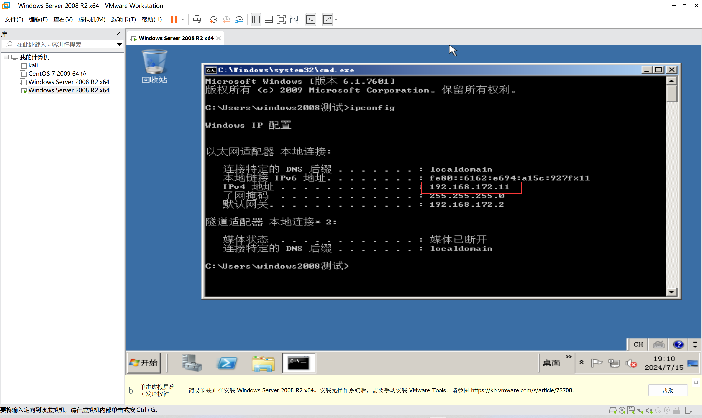
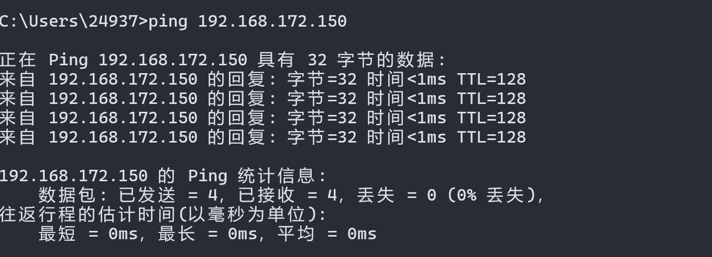
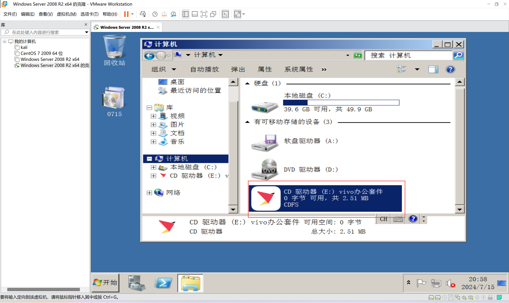

# 作业一:

	根据以上课程,搭建自己的Linux的操作系统:
	
	1.自行选择(Kali Linux),建议安装Kali Linux
	
	2.安装好后使用 Vmware 进行快照建立
	
	3.进行Kali Linux系统克隆


```
选择Linux 版本号为Ubuntu 64位
```


```
命名虚拟机,选择虚拟机存储位置
```


```
打开虚拟机安装Kali镜像
```


```
选择对应的语言
```


```
设置用户名和密码
```


```
在这里选择是
```


```
进入安装
```


```
安装中途弹出启动引导器,选择/dev/sda
```


```
进入登录界面,输入用户名和密码
```


```
创建快照,预先创建好三个文件,1111,222,3333
```


```
运行命令rm -rf ~/Desktop,删除桌面预先创建的文件
```


```
恢复到快照
```


```
克隆kali虚拟机
```


```
这里有两种方式,我们根据需求选择,这里选择创建链接克隆
```


# 作业二:

	拓展实验:搭建一台自己的Windows Server操作系统:
	
	1.通过Vmware建立一台win系统虚拟机
	
	2.设置三种链接方式,测试是否可以通过自己设置让虚拟机链接网络,
	
		并思考三种链接方式的原理
	
	3.通过win虚拟机挂载物理硬盘和USB存储设备

```
新建虚拟机,选Windows Server 2008镜像,设置用户名和密码
```


```
进入安装好的win虚拟机,打开命令行输入命令ipconfig获取ipv4地址:192.168.172.11
```



```
在物理机上打开远程控制,输入ipv4地址连接,将0715补丁发送过去
```


```
点击安装
```


```
安装好了后关闭虚拟机,打开设置,将CD/DVD和软盘修改为使用物理驱动器:自动检测
```


```
然后安装VMware tools工具
```


```
NAT模式
```


```
将网络修改为仅主机模式
```




```
将网络适配器改为桥接模式
```


```
使用win虚拟机挂载物理磁盘
```


```
USB存储设备
```





# 总结

虚拟机可以通过多种方式连接网络，常见的有三种方式：桥接模式、NAT模式和主机模式（Host-Only）。这些模式在虚拟机与宿主机及外部网络之间的网络通信方式和访问权限上有所不同。

1. **桥接模式（Bridged Mode）**：
   - **工作原理**：在桥接模式下，虚拟机的网络适配器会直接连接到宿主机所在的物理网络中，虚拟机会获得一个与物理网络相同子网的IP地址。这使得虚拟机能够像宿主机的另一台设备一样，与局域网内的其他设备进行通信。
   - **特点**：虚拟机在桥接模式下表现为网络上的一个独立节点，拥有自己的MAC地址，并且可以直接被局域网内的其他设备访问和通信。这种模式适合需要虚拟机与局域网内其他设备直接交互的场景。

2. **NAT模式（Network Address Translation）**：
   - **工作原理**：在NAT模式下，虚拟机通过宿主机的网络适配器进行网络连接，但虚拟机内部的IP地址是由虚拟化软件动态分配的，并且通过NAT技术将虚拟机的通信流量转换成宿主机的IP地址进行外部通信。
   - **特点**：虚拟机在NAT模式下无法直接被局域网内其他设备访问，只能通过宿主机进行网络通信。这种模式适合需要虚拟机访问外部网络，但又不希望虚拟机直接暴露在外部网络中的情况。

3. **主机模式（Host-Only Mode）**：
   - **工作原理**：主机模式下，虚拟机只能与宿主机进行通信，而不能访问外部网络。虚拟机和宿主机之间形成一个私有网络，通常由虚拟化软件创建和管理，虚拟机可以通过此网络与宿主机进行数据传输和通信。
   - **特点**：这种模式适合需要虚拟机与宿主机之间安全、隔离的通信场景，例如在开发和测试环境中。

### 比较：
- **桥接模式**提供虚拟机与局域网内其他设备直接交互的能力，虚拟机表现为网络中的独立节点。
- **NAT模式**适合需要虚拟机访问外部网络，但又不希望直接暴露虚拟机在外部网络中的情况。
- **主机模式**适合需要虚拟机与宿主机安全隔离但又需要它们之间通信的情况。

选择适当的网络连接方式取决于具体的需求和安全考虑。


