## 一.命令熟悉

### ipconfig

```
ipconfig 显示当前所有TCP和IP网络配置的数值,并动态刷新主机配置协议(DHCP)和域名系统(DNS)设置
```

### 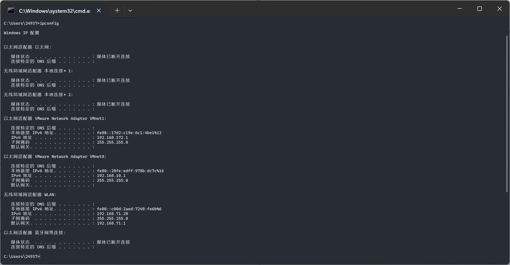

```
ipconfig /release 释放所有网卡当前DHCP配置(通俗的讲就是断开网络连接)
```

```
ipconfig /renew 请求DHCP服务器为所有网卡提供新的IP地址租约

ipconfig /all 显示所有网络适配器的详细信息,包括物理地址(MAC),IP地址,子网掩码,默认网关,DNS服务器
```

### net user

```
net user 显示本地用户的账户信息,例如用户名,全名,描述等
```


```
net user username password /add 创建一个新的本地用户账户,username是用户名,password是密码
```


```
net user username 显示特定账户(username)的详细信息,包括最后一次登录时间等
```

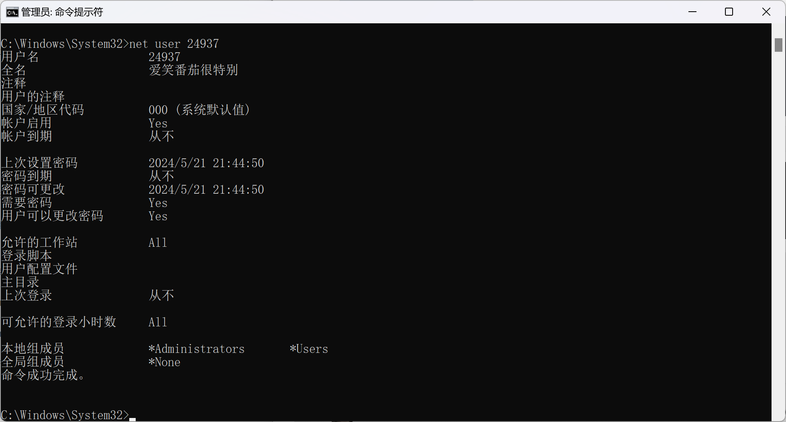

```
net user username /del 删除指定用户(username),删除用户及其相关的文件和设置
```


```
net user username password 更改指定账户密码(password)
net localgroup 显示本地计算机的用户信息,或者用于管理本地用户组
```

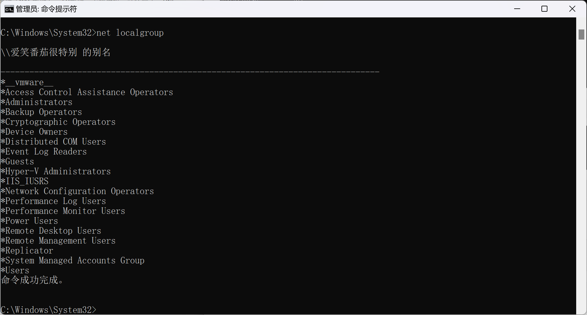

### ping

```
ping -t 持续不断地对目标进行ping测试,直到(ctrl+c)手动停止,用于检测目标主机是否可达,并测量往返时间(RTF)

ping -l 指定发送ICMP数据包是的负载大小.例如ping -l 1000 target_address表示发送负载大小为1000字节的ping数据包到目标地址,最大为65500

ping -n 指定发送ICMP ECHO 请求次数.例如ping -n 5 target_address表示发送5次
```

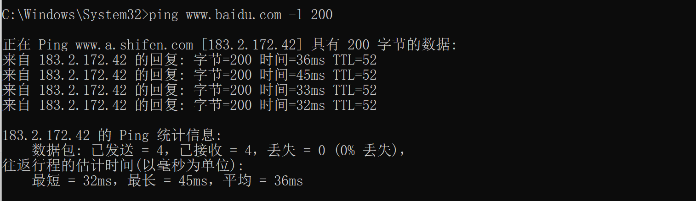

### arp

```
arp -a 查看主机最近通信的ip
```

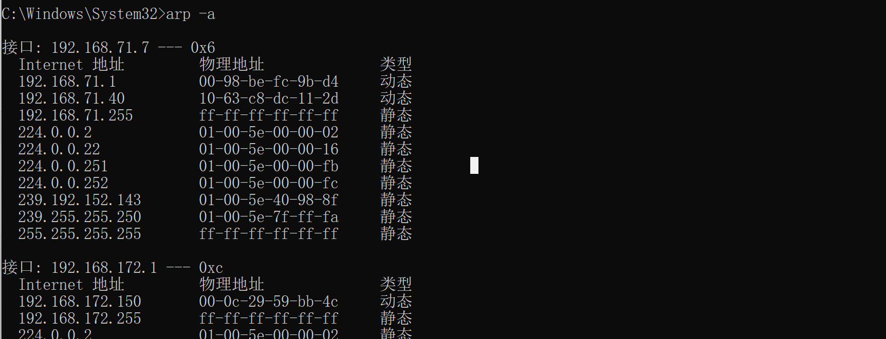

### netstat

```
netstat -ano 查看本机机器网络情况
netstat -a   查看本机开放的端口
netstat -r	 查看当前路由信息
netstat -n	 不对名字进行解析
```

### dir

```
dir 显示当前目录中的文件和子目录列表
mkdir(md) 创建新目录
rmdir(rd) 删除目录
```

### cd

```
cd.. 切换到上级目录
*cd* 更改当前目录为根目录
```

### copy

```
copy 参数1 参数2  #将 参数1 的内容放到 参数2

copy a.txt D:/1.txt
copy a.txt b.txt
```

### del

```
del aaa.txt /f 强制删除文件
del D:/1.txt
```

### rename

```
rename(ren) 1.txt aaa.txt  #将 1.txt 重命名为 aaa.txt
```

### type

```
type aaa.txt  查看内容
```

### echo

```
echo a > a.txt 将 a 写入 a.txt
```

### tasklist

```
tasklist /svc 显示每个进程的服务
```

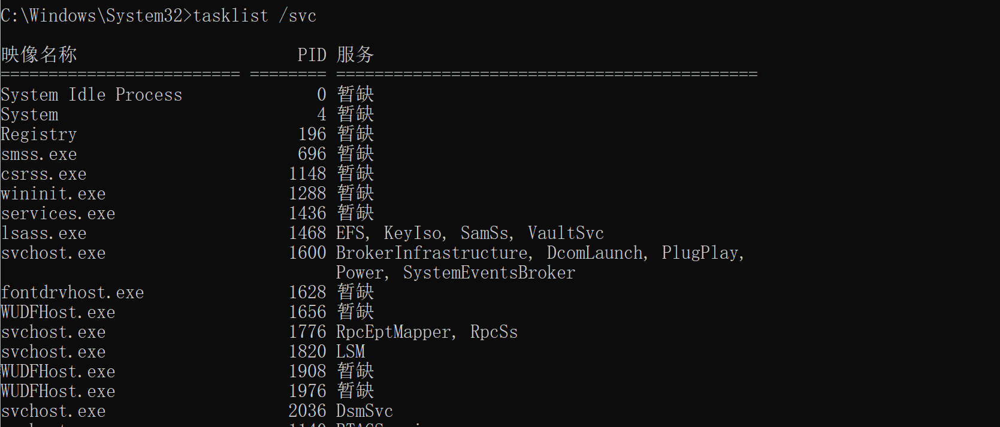

```
tasklist /v 显示详细进程

tasklist /m she1132.dll 查看哪些进程调用了 she1132.dll

tasklist /s ip  /u username /p password /svc 查看ip地址为ip的主机进程信息
```

### taskkill

```
taskkill /pip value  /F 强制关闭指定pip的进程

taskkill /im nodepad.exe /F 关闭指定exe进程
```

### 远程关机

```
shutdown /m //192.168.1.86 /s /t 0 /f
```

### 按键

```
F1 //从往右一个一个字符输入上次命令

F3 //补全上次输入的命令

F7 //查看历史输入命令

tab //自动补全内容,若存在多个可能结果,多次使用xxxxxxxxxx F1F1 //从往右一个一个字符输入上次命令F3 //补全上次输入的命令F7 //查看历史输入命令tab //自动补全内容,若存在多个可能结果,多次使用F3F7TAB
```

### 补充

```
ipconfig /flushdns 刷新DNS缓存
```


```
arp -s 17.17.17.17 00-aa-00-62-c6-09  添加ARP缓存记录

arp -d 17.17.17.17 删除ARP缓存记录

nslookup baidu.com 解析域名的ip地址
```

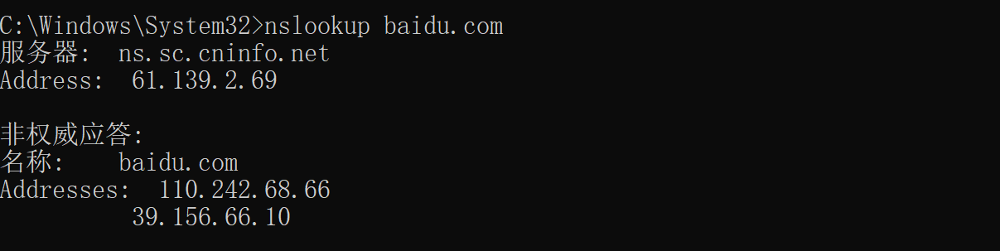

```
tracert www.baidu.com 	跟踪访问路径
```

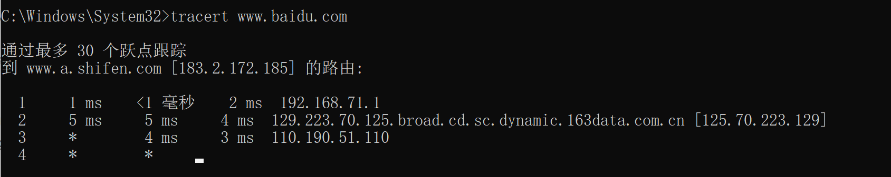

```
netstat -e 查看以太网统计数据
```

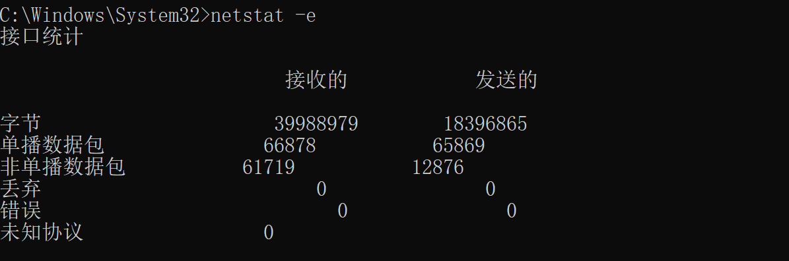

```
net share 	查看文件共享状态
```

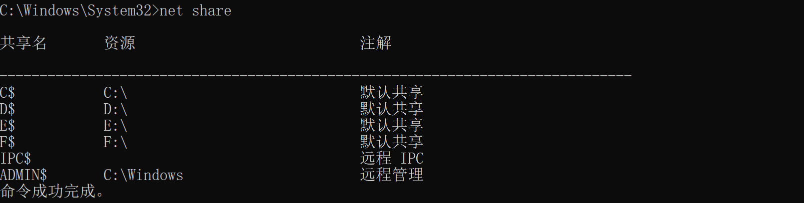

```
net localgroup administrarors 用户名 /add 		将用户添加到本地管理员组

net start value(服务名称) 	启动服务

net stop value(服务名称) 	停止服务

dir /s /b D:/123.txt	递归查找
```


## 二.搭建web服务器(IIS)

```
在虚拟机环境打开服务管理,找到角色栏添加角色服务
```

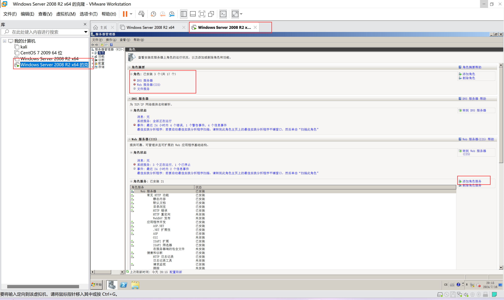

```
检查以下三个服务是否安装
```

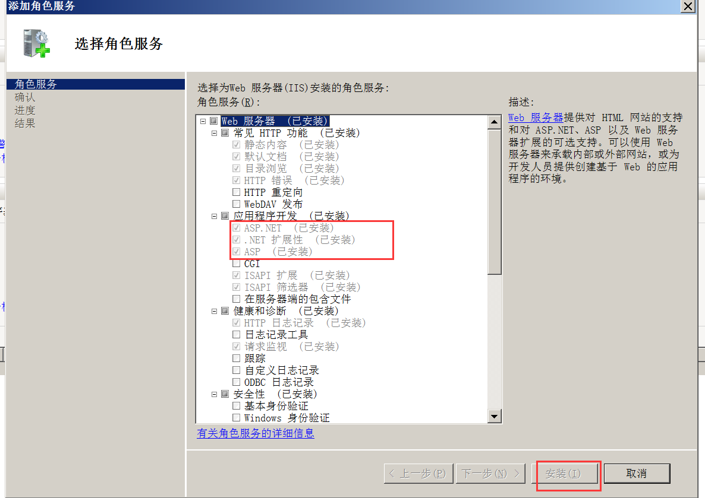

```
找到网站,右键添加网站,填写对应字段
```

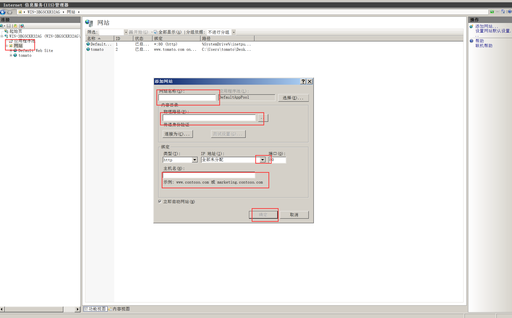

```
找到应用程序池,在smile处右键高级设置,将启用32位应用程序改为 True
```

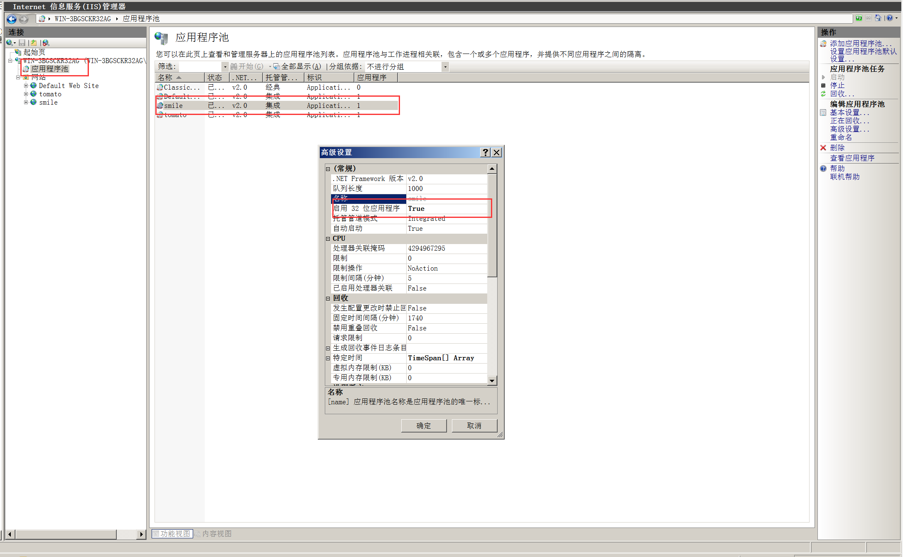

```
点击smile,选择ASP 找到启用父路径 True
```

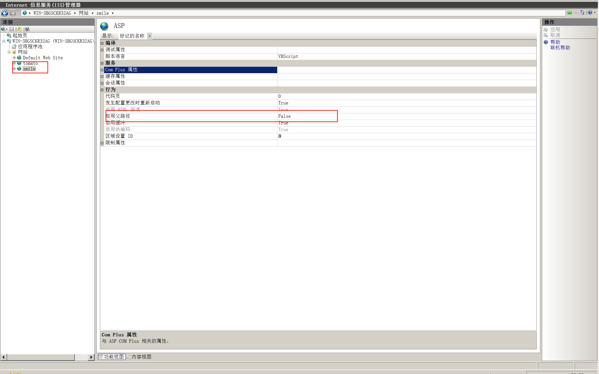

```
配置DNS
```

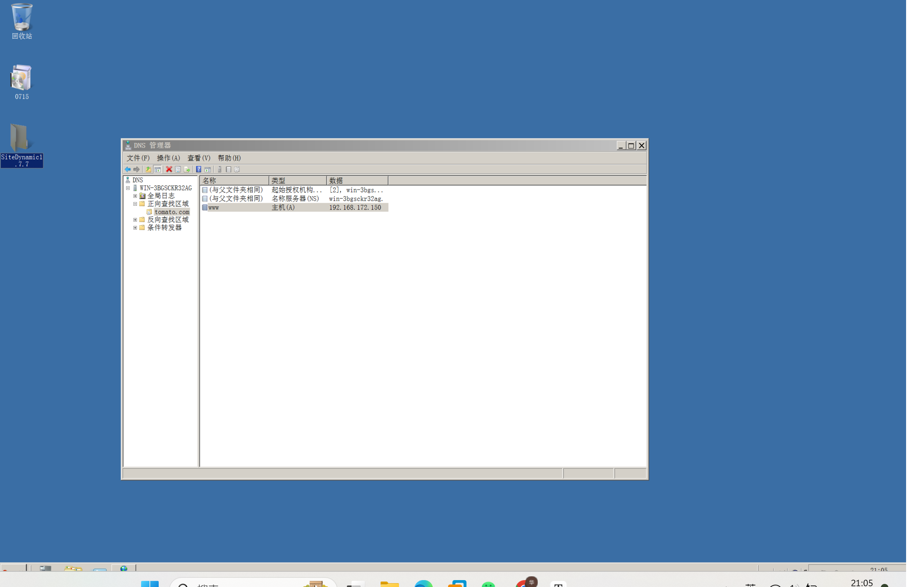

```
更改物理机DNS
```

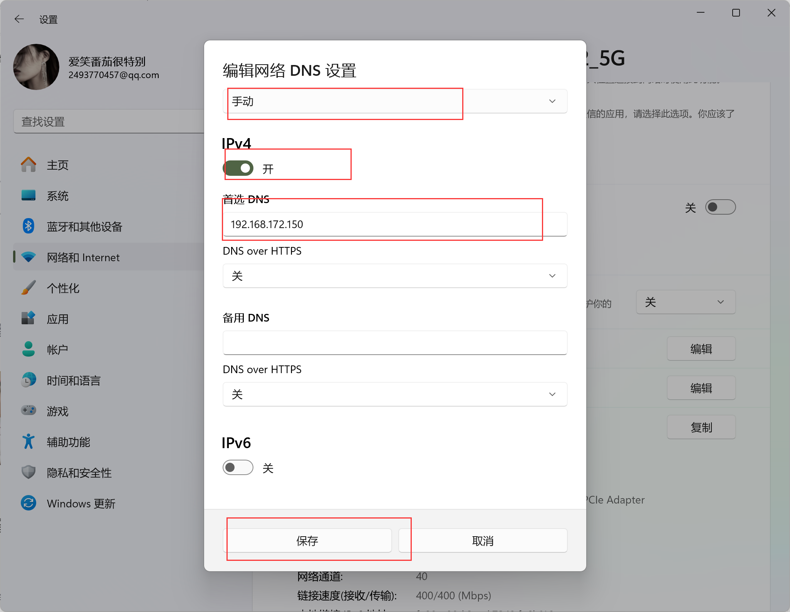

```
虚拟机ipv4修改为如下
```

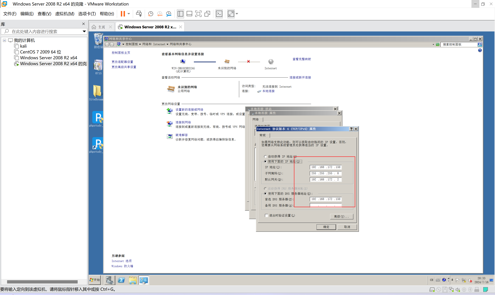

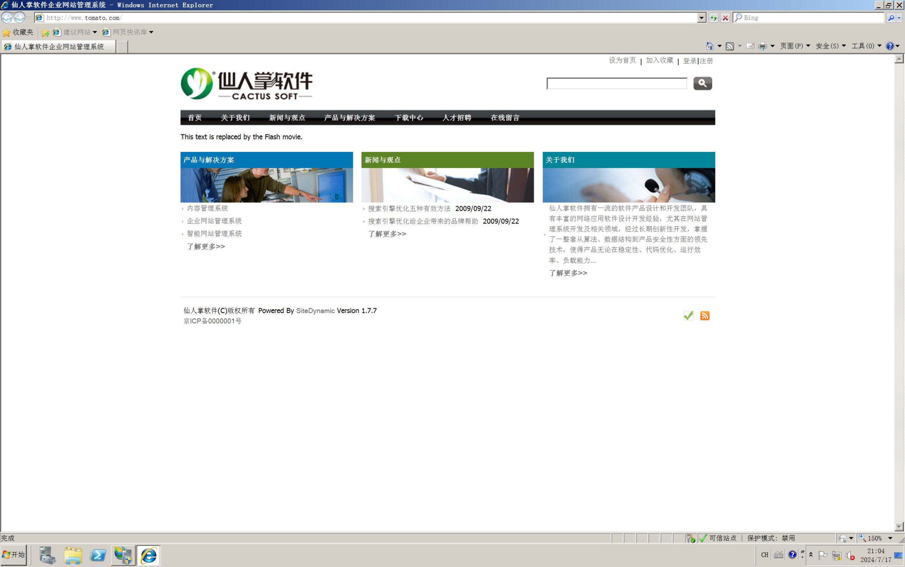
