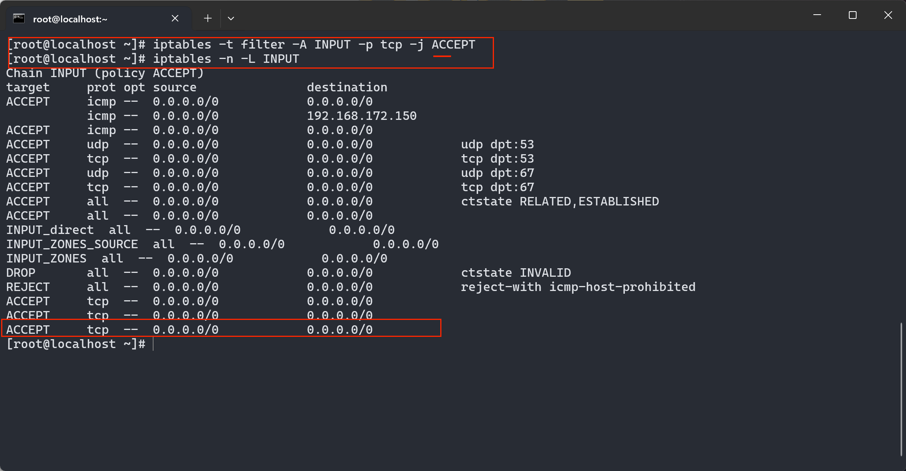
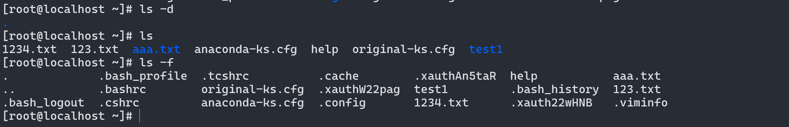

### iptables命令

- -A :在链的末尾追加一条规则
- -I :在链的开头,或只指定序号,插入一条规则
- -d :指定IP地址
- --dport:指定目的端口
- -L:列出所有的规则条目
- -n:以数字的形式显示地址,端口等信息
- --line-numbers:查看规则时,显示的是规则的序号

```
向iptables的filter表的INPUT链末尾添加一条规则，允许所有进入的TCP数据包通过防火墙
iptables -t  filter -A INPUT -p tcp -j ACCEPT

规则查看
iptables -n -L INPUT
```



```
在iptables的INPUT链的顶部插入一条规则，允许所有进入的UDP数据包通过防火墙。
iptables -I INPUT -p udp =j ACCEPT
```


```
在iptables的INPUT链中的第二个位置插入一条规则，允许所有进入的ICMP数据包（通常用于网络诊断）通过防火墙。
iptables -I INPUT 2 -p icmp -j ACCEPT
```


```
查看规则时显示序号
iptales -L --line-numbers
```


```
当有一个ICMP数据包要从本地系统发往IP地址为192.168.172.150的主机时，这条规则会阻止这个数据包的发送。
iptables -t filter -I OUTPUT -p icmp -j REJECT -d 192.168.172.150
```


### Linux常用命令

```
pwd 打印工作目录命令

ls //(list)显示目录内容[-a,-l,-d,-f]
-a 显示所有文件,包括隐藏文件
-l 以长格式显示文件信息,包括文件权限,所有者,文件大小,修改日期等
-d 显示指定目录的信息,而不是目录中的内容(ls -d /path/to/directory)
-f 直接列出目录和文件,而不进行排序
```





### 新建文件夹

```
mkdir -p test1/test2 //在目录下创建目录(=p递归创建目录)
mkdir -m=777 test //创建一个777权限的目录test(自定义目录权限)
```


### 创建文件

- -a:只修改文件的访问时间
- -c:仅修改文件的时间参数(3个时间参数都改变),如果文件不存在则创建
- -d:后面可跟想修改的时间,只修改访问时间和数据修改时间,状态时间变更为当前服务器时间
- -m:只修改文件的数据修改时间
- -t:后面可跟想修改的时间,书写格式YYMMDDhhmm
- -r:复制指定文件的时间戳给新文件

```
touch -r 123.cxk kk.txt //将kk.txt的时间戳修改与123.txt相同

touch -t 202112121212.59 123.txt //修改时间为指定时间
```

```
rm 123.txt //删除文件(-f强制删除,-i在删除前给出提示,-r递归删除)
```


### 显示文件内容

```
-n：显示每一行的行号。
-b：仅对非空行显示行号。
-E：在每行结束处显示 $ 符号。
-s：压缩连续空行到一个空行。
-v：显示不可打印字符，使用 ^ 和 M- 符号。

cat 112.txt

cat aaa.txt > bbb.txt //将aaa.txt的文本内容覆盖到bbb.txt让其显示的与aaa.txt内容一样
```


```
more 可以分页显示为文本的内容,使用者可以逐页阅读文件中的内容
```

```
常见选项和用法：
基本操作：

使用 Space 键向下翻页。
使用 Enter 键向下滚动一行。
使用 b 键向上翻页。
使用 q 键退出 more 命令。
常见选项：

-d：显示更多的提示信息，包括当前显示的行数和文件总行数。
-p：使用正则表达式搜索文件内容，然后显示匹配的行。
-c：清除屏幕，然后开始显示内容。


示例用法：
显示文件内容：
more file.txt	//将 file.txt 文件的内容分页显示在终端上。

显示带行数提示的内容：
more -d file.txt	//显示 file.txt 文件的内容，并显示更多的提示信息，包括当前显示的行数和文件总行数。

搜索并显示匹配行：
more -p "pattern" file.txt	//在 file.txt 文件中搜索包含指定模式 "pattern" 的行，并分页显示匹配的内容。

清除屏幕后显示内容：
more -c file.txt	//清除屏幕内容，然后开始分页显示 file.txt 文件的内容。

注意事项：
more 不支持在文件内容显示过程中修改内容或进行编辑操作，仅用于查看和浏览文件内容。
more 是一个轻量级的分页显示工具，通常用于查看较大文件或需要逐页查看的内容。
```

```
tail 用于查看文件末尾的数据

-n K 这里K指的是行数,表示输出最后K行,-n k 表示从文件的第k行开始输出

-c k 这里的k指的是字节数

-f 输出文件变化后新增加的数据
```

```
grep 用在每一个文件中搜索特定的模式,包含指定字符的每一行内容,但是不会改变文件中的内容

-i：忽略大小写，不区分大小写地搜索。
-v：反向匹配，输出不包含匹配模式的行。
-n：显示匹配行及其行号。
-l：只列出包含匹配模式的文件名，而不显示具体匹配的行。
-r 或 --recursive：递归地在目录及其子目录中搜索文件。
示例用法：

在文件中搜索指定模式：
grep "pattern" file.txt		//在 file.txt 文件中搜索包含 "pattern" 的每一行，并将匹配的行输出到标准输出。

忽略大小写搜索：
grep -i "pattern" file.txt		//在 file.txt 文件中忽略大小写地搜索包含 "pattern" 的每一行。

显示匹配行及行号：
grep -n "pattern" file.txt		//在 file.txt 文件中搜索包含 "pattern" 的每一行，并显示匹配行的行号。

反向匹配，显示不包含指定模式的行：
grep -v "pattern" file.txt		//在 file.txt 文件中搜索不包含 "pattern" 的每一行，并输出这些行。

只列出包含匹配模式的文件名：
grep -l "pattern" *.txt		//在当前目录下的所有 .txt 文件中搜索包含 "pattern" 的文件，并列出这些文件的文件名。

递归搜索目录中的文件：
grep -r "pattern" directory/		//在 directory/ 目录及其子目录中递归搜索包含 "pattern" 的每一行。

注意事项：
grep 默认情况下是区分大小写的，除非使用 -i 选项进行不区分大小写搜索。
grep 可以与管道 | 结合使用，用于更复杂的文本处理和筛选操作。
grep 是在命令行中进行文本搜索和筛选的强大工具，通常用于日志分析、文本处理和文件内容检索等场景。
```


