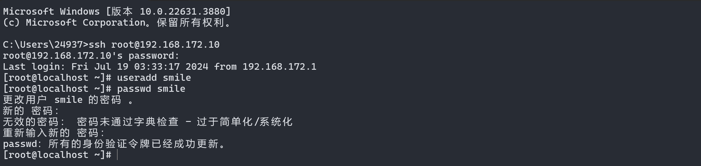
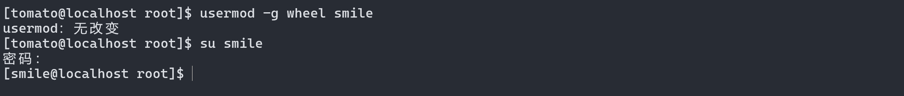
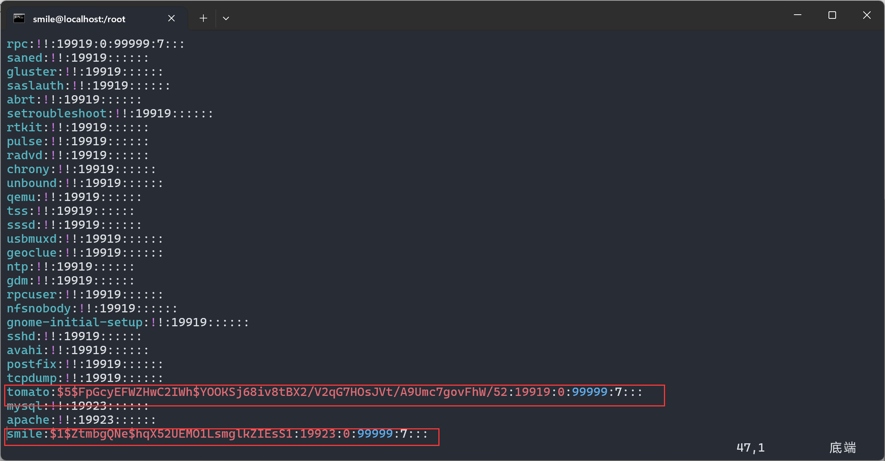
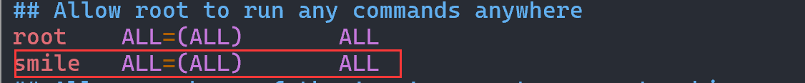
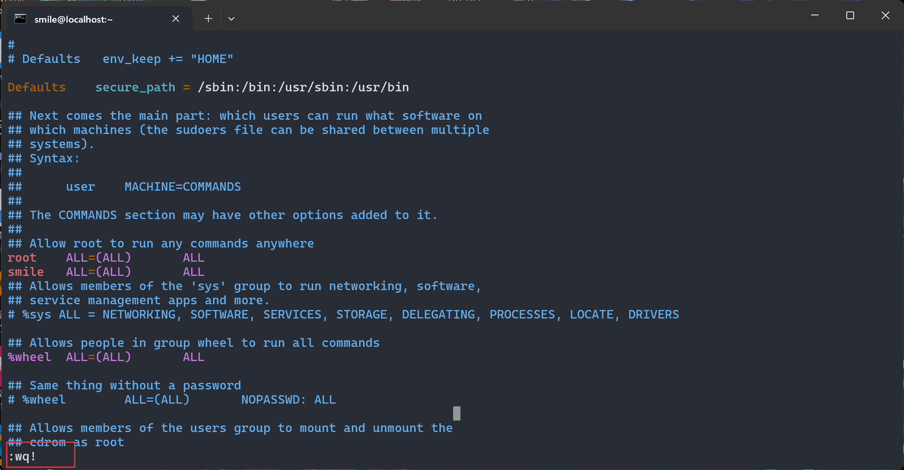
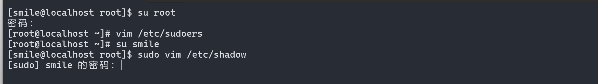
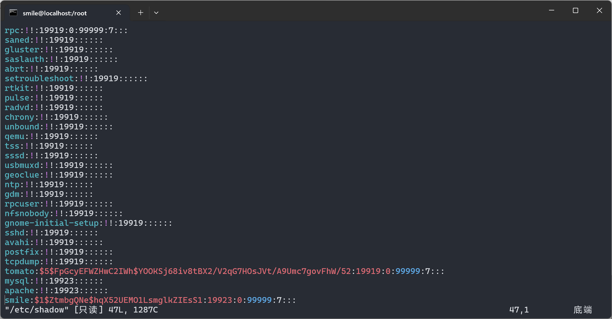
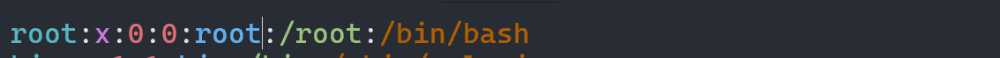
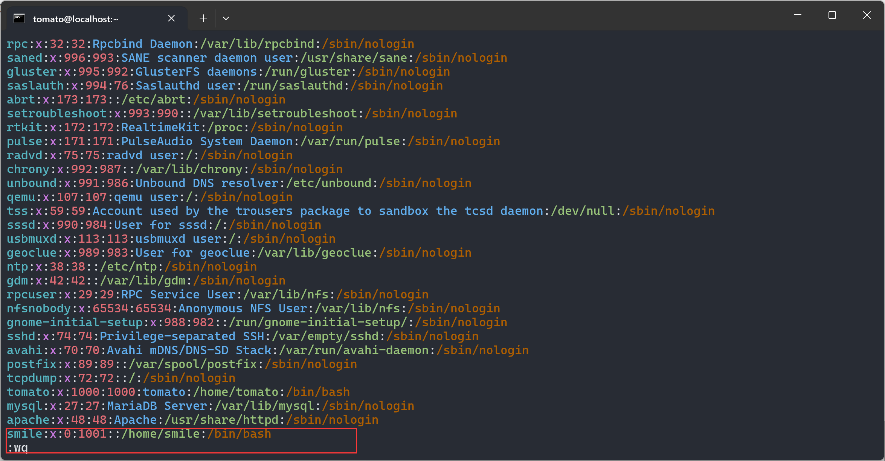
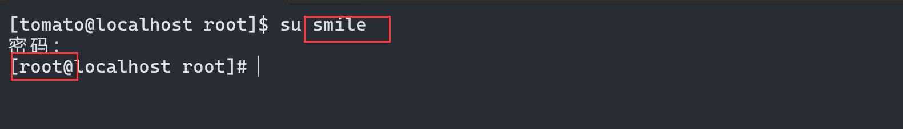

### 使用多种方法创建拥有最高权限的用户

##### 首先先创建好一个普通账号

```
useradd smile	#创建一个用户名为 smile 的账号
passwd smile	#修改 smile 的用户密码
```



##### 方法一:将用户加入 wheel 用户组

```
usermod -g wheel smile	#修改 smile 用户组为 wheel
```



```
#打开 /etc/shadow 试试
sudo vim /etc/shadow
```


```
可以看到有权限打开 /etc/shadow
```




##### 方法二:修改 sudoers 文件

```
vim /etc/sudoers	#在root权限下,打开 /etc/sudoers 文件,加入下面这行
```



```
修改好了以后,按住 shift+; 输入 wq! 保存退出
```



```
保存好了以后我们再查看 /etc/shadow 
```



```
发现能成功访问
```




##### 方法三:修改passwd文件

```
vim /etc/passwd		#在root权限下打开 passwd 文件
```



```
上面我们可以看到 root 权限的uid为0,我们可以把 smile 账户的uid也修改为0
```



```
这里使用前叫 tomato ,使用su smile 会跳转为root权限
```




```
以上三种方法就完成了权限的修改
```


### sudo用法

```
`sudo` 命令在 Linux 和其他类 Unix 操作系统中用于以超级用户（root）权限执行命令。以下是一些常见的 `sudo` 用法示例：

1. 以超级用户权限执行单个命令：sudo command
   例如，更新包列表：sudo apt-get update

2. 在执行命令时使用特定用户身份：sudo -u username command
   例如，以用户 `john` 的身份执行命令：sudo -u john ls /home/john

3. 以 root 权限打开一个新的 shell：
   sudo -i
   或者： sudo su

4. 以超级用户权限编辑文件：
   sudo nano /etc/hosts
   sudo vim /etc/hosts

5. 重启系统：
   sudo reboot

6. 查看当前用户的 sudo 权限：
   sudo -l
L
7. 以root权限运行命令并保存标准输出和错误输出到文件：
   sudo command > outputfile 2>&1
   例如，将 `ls` 命令的输出保存到 `output.txt` 文件：
   sudo ls /root > output.txt 2>&1

8. 命令执行前添加时间限制：sudo timeout 10 command
例如，限制 `sleep 20` 命令执行时间为10秒：sudo timeout 10 sleep 20
```

