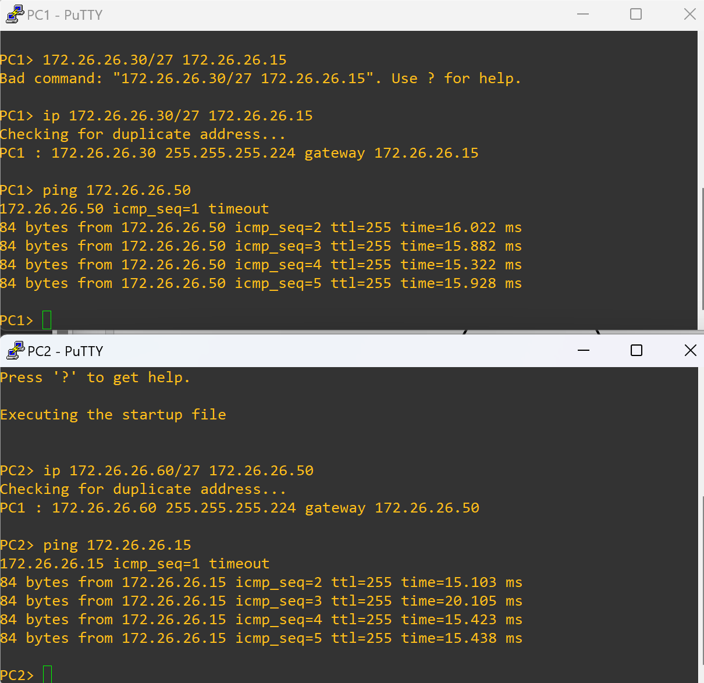
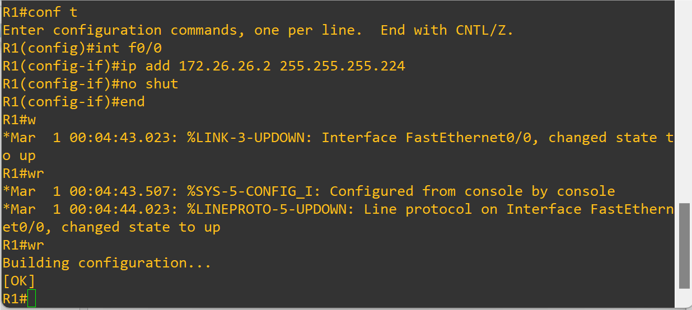

### 使用GNS3进行子网划分

```
打开PC1的console : ip 10.1.1.3/24 10.1.1.1

打开R1的console  :	
conf t	#从用户模式进入全局
int f 0/0	#进入端口进行配置
ip add 10.1.1.1 255.255.255.0
no shutdown	#开启端口,默认是关闭
end	#保存退出
wr
show ip interface brief	#查看各端口的配置
show ip route summary	#查看路由汇总情况
```

```
同理,PC2 : ip 192.168.4.2/24 192.168.4.1/24

打开R1的console  :	
conf t	#从用户模式进入全局
int f 0/1	#进入端口进行配置
ip add 192.168.4.1 255.255.255.0
no shutdown	#开启端口,默认是关闭
end	#保存退出
wr
```


```
同理,PC3 : ip 192.168.3.1/24 192.168.3.2/24

打开R1的console  :	
conf t	#从用户模式进入全局
int f 1/0	#进入端口进行配置
ip add 192.168.3.1 255.255.255.0
no shutdown	#开启端口,默认是关闭
end	#保存退出
wr

no switchport
```


### 作业1:

192.168.1.0/24网段,划分成4个相同大小的子网,互相ping通


```
划分192.168.1.0/24网络为4个相同的子网需要进行一下几个步骤:
1.确定子网掩码:初始网络192.168.1.0/24作为网络部分,
剩余8为位作为主机部分.要将网络划分成4个子网,需要扩展主机位数.

2.确定新的子网掩码:每个子网需要至少2个可用的主机地址(一个用作网络
地址,一个用作广播地址),因此我们需要确定新的子网掩码.

3.初始的子网掩码是/24,对应十进制位255.255.255.0,二进制为
11111111.11111111.11111111.00000000.
要将网络划分成4个子网,我们需要至少2为作为子网部分.2位可表示的4个不同子网(00,01,10,11)
即:新的子网掩码为/26新的子网掩码为255.255.255.192(26个1,即11111111.11111111.11111111.11000000,2^7+2^6=192)

4.确定子网范围:根据新的子网掩码,我们可以计算出每个子网的范围
原始网络的起始地址是 192.168.1.0,新的子网掩码是/26,所以每个子网的范围是64(2^6,32-26=6)个ip地址
分配给每一个子网的范围如下:
子网1:192.168.1.0~192.168.1.63
子网2:192.168.1.64~192.168.1.127
子网3:192.168.1.128~192.168.1.191
子网4:192.168.1.192~192.168.1.255

5.验证每个子网的有效ip范围:每个子网都有除了网络地址和广播地址之外的62个可用地址(2^6-2=64-2=62)


配置PC1: 
PC2> ip 192.168.1.62/26 192.168.1.60

PC2配置：
PC2> ip 192.168.1.126/26 192.168.1.100

PC3配置：
PC3> ip 192.168.1.190/26 192.168.1.150

PC4配置：
PC4> ip 192.168.1.254/26 192.168.1.200
```


```
PC配置方式同理,以上仅展示两个(忘截图了)
```


```
配置路由R1
```


```
测试
```


### 作业2:

172.26.26.0/26,划分为两个相同的子网,互相能ping通

```
172.26.26.0/26划分子网掩码

划分步骤:
1.确定子网掩码:初始网络为172.26.26.0/26作为网络部分,剩余6位作为主机部分
每个子网至少需要2个可用的主机地址

2.初始的子网掩码是/26,对应二进制为11111111.11111111.11111111.11000000,
十进制为255.255.255.192,划分成两个子网需要扩展1个主机位,即:
11111111.11111111.11111111.11100000,新的子网掩码为255.255.255.224(/27)

3.分配每个子网的范围(32-27=5,2^5=32),
子网1:172.26.26.0~172.26.26.31
子网2:172.26.26.32~172.26.26.63


PC1配置：
PC1> ip 172.26.26.30/27 172.26.26.15  #确保172.26.26.x/27和172.26.26.y, x>y(在范围内即可)

PC2配置：
PC2> ip 172.26.26.60/27 172.26.26.50 #确保172.26.26.x/27和172.26.26.y, x>y(在范围内即可)

R1配置:
conf t
int f0/0
ip add 172.26.26.15 255.255.255.224
no shut
end
wr

conf t
int f0/1
ip add 172.26.26.50 255.255.255.224 
no shut
end
wr

```




```
配置R1
```




```
测试
```

