# TCP/IP四个层次

```
展示了TCP/IP协议模型的四个层次，从上到下依次是应用层、传输层、网络层和数据链路层。每个层次都有不同的功能和责任，它们共同构成了整个TCP/IP协议模型。

在应用层（Application Layer），它负责处理应用程序之间的通信，例如浏览器与Web服务器之间的交互。应用层提供了各种协议，如HTTP、FTP和SMTP，用于支持不同的网络服务。

传输层（Transport Layer）负责提供可靠的数据传输，确保数据包正确地从源端传送到目标端。传输层使用TCP（传输控制协议）或UDP（用户数据报协议）来建立连接、管理数据流和错误检测。

网络层（Network Layer）负责将数据包从源端路由到目标端。它使用IP（互联网协议）来确定数据包的最佳路径，并处理分组、寻址和路由等功能。

数据链路层（Data Link Layer）负责在物理媒介上传输数据包，如以太网或Wi-Fi。它处理物理连接、帧同步和错误检测等任务。
```


# 案例

```
假设一台计算器通过浏览器请求一个网页

应用层:浏览器(http协议)生成http请求,传递给传输层
传输层:传输层(tcp协议)将http请求封装成tcp段,传递给网络层
网络层:网络层(IP协议)将TCP段封装成ip包,传递给数据链路层
数据链路层:数据链路层(以太网协议)将ip封装成以太网帧,传递给物理层
物理层:物理层将以太网帧转换成电信号,通过网络传输到目的地

在接收端

物理层:接受电信号并转化成比特流,传递给数据链路层
数据链路层:接收以太网帧,去除头部和尾部,传递ip包给网络层
网络层:接受ip包,去除头部,传递tcp段给传输层
传输层:接收tcp段,去除头部,传递http请求给应用层
应用层:接收http请求,web服务器处理请求并生成响应


路由器(网络层)能进行网络寻址,交换机不能
```


# 子网划分

```
划分192.168.1.0/24网络为4个相同的子网需要进行一下几个步骤:
1.确定子网掩码:初始网络192.168.1.0/24作为网络部分,
剩余8为位作为主机部分.要将网络划分成4个子网,需要扩展主机位数.

2.确定新的子网掩码:每个子网需要至少2个可用的主机地址(一个用作网络
地址,一个用作广播地址),因此我们需要确定新的子网掩码.

3.初始的子网掩码是/24,对应十进制位255.255.255.0,二进制为
11111111.11111111.11111111.00000000.
要将网络划分成4个子网,我们需要至少2为作为子网部分.2位可表示的4个不同子网(00,01,10,11)
即:新的子网掩码为/26新的子网掩码为255.255.255.192(26个1,即11111111.11111111.11111111.11000000,2^7+2^6=192)

4.确定子网范围:根据新的子网掩码,我们可以计算出每个子网的范围
原始网络的起始地址是 192.168.1.0,新的子网掩码是/26,所以每个子网的范围是64(2^6,32-26=6)个ip地址
分配给每一个子网的范围如下:
子网1:192.168.1.0~192.168.1.63
子网2:192.168.1.64~192.168.1.127
子网3:192.168.1.128~192.168.1.191
子网4:192.168.1.192~192.168.1.255

5.验证每个子网的有效ip范围:每个子网都有除了网络地址和广播地址之外的62个可用地址(2^6-2=64-2=62)
```

# ARP缓存表

- 为了实现ip地址与mac地址的查询和转换,arp协议引入了arp缓存表的概念
- 这个表包含了**ip地址**到**mac地址**的**映射关系**,表中记录了<IP地址,MAC地址>对,称之为arp表项
- 当需要发送数据时,主机会根据数据报中的**目标IP地址**信息,然后arp缓存表中查找**对应的MAC地址**,最后通过网卡将数据发送出去
- 注意:arp缓存表中每一项都被设置了生存时间,一般是20分钟,从被创建开始计时,到时则清除(arp -a:可查看arp缓存表)

# icmp协议

icmp介绍

- 它是ipv4协议簇中的一个子协议,用于在ip主机,路由器之间传递**控制消息**
- 控制消息是指**网络通不通**,**主机是否可达**,**路由是否可用**等网络本身信息
- 这些控制消息虽然并**不传输用户数据**,但是对于用户数据的传递起着重要作用

# 交换机工作原理

 当交换机收到一个数据帧后:

- 首先学习帧中的源MAC地址来形成MAC地址表
- 检查帧中的目标MAC地址,并匹配MAC地址表:如果有**匹配项**则**单播**转发;如果**无匹配项**,则除接收端口外,**广播**转发
- MAC地址表的老化时间默认为300s

# 路由表的形成

路由表:

- 路由器中维护的**路由条目的集合**
- 路由器根据路由表做**路径选择**

路由表的形成:

- 直连网段:配置IP地址>端口处于up状态>形成直连路由
- 非直连网段:对于非直连网段,需要**静态路由**或**动态路由**,将网段**添加到路由表**中

静态路由:

- 由管理员手工配置的,是**单向**的,缺乏灵活性

- 数据包如果要到达**非直连网络**需要在路由表中**添加条目**,静态路由需要**手动添加**路由条目

- 静态路由的配置:

  ```
  Router(config)# ip route 目标网段 子网掩码 下一跳IP
  ```


# VLAN技术原理

- 在物理网络上划分出**逻辑网**,对应**OSI模型第二层**
- VLAN划分不受端口物理位置限制,VLAN和普通物理网络有同样属性
- 第二层数据单播,广播只在一个VLAN内转发,不会进入其它VLAN中
- 一个VLAN = 一个广播域 = 一个网段

作用:

- 1.安全性,减少保密信息遭到破坏的可能性
- 2.节约成本,无需昂贵的网络升级
- 3.提高性能,将二层网络划分成多个广播域,减少不必要的数据流
- 4.缩小广播域,减少一个广播域上的设备数量
- 5.提升管理效率

vlan Trunk:

- Trunk是在两个**网络设备之间**,承载**多于一种VLAN**的端到端的连接,将VLAN延申至**整个网络**
- 作用:允许所有vlan数据通过trunk链路
- 方法:通过在数据帧上加标签,来区分不同的VLAN数据

交换机端口链路类型:

- 接入端口:也称为access端口,一般用于**连接pc**,只能属于某一个vlan,也只能传输一个vlan数据
- 中继接口:也成为trunk接口,一般用于**连接其他交换机**,属于**公共端口**,允许所有vlan数据通过

# 添加ACL规则

· access-list 表号 permit/deny 源IP或源网段 反子网掩码

· access-list 1 deny 10.0.0.0 0.255.255.255 //该条目用来拒绝所有源IP为10开头的主机 

· access-list 1 deny 10.1.1.1 0.0.0.0  //该条目用来拒绝所有源IP为10.1.1.1的主机

· Router(config)#access-list 1 deny 172.16.0.0 0.0.255.255 //创建禁止来至172.16.0.0的ACL流量

· 应用接口f0/1的**出方向(入方向in)**上

  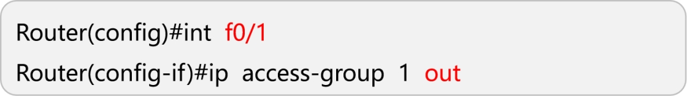

  

10网段禁止访问50网段,其他不受限制
pc2 40.2 禁止访问50网段

R1:
access-list 1 deny 192.168.10.0 0.0.0.255  // 禁止访问192.168.10.0/24网段
access-list 1 deny 192.168.40.2 0.0.0.0   // 禁止访问特定IP地址192.168.40.2
access-list 1 permit any          // 允许所有其他流量通过
int f0/1
ip access-group 1 out            // 将ACL 1应用于F0/1接口的出方向（即从路由器到网络的流量）

R2:
access-list 2 deny 192.168.10.2 0.0.0.0   // 禁止访问特定IP地址192.168.10.2
access-list 2 permit any          // 允许所有其他流量通过
int f0/0
ip access-group 2 in            // 将ACL 2应用于F0/0接口的入方向（即进入路由器的流量）


# 案例

```
首先我们创建如图所示的连接,对每一个pc机添加如图所示的ip,以及路由器的配置(此处我将会简略写,前面做了很多不再赘述)
```

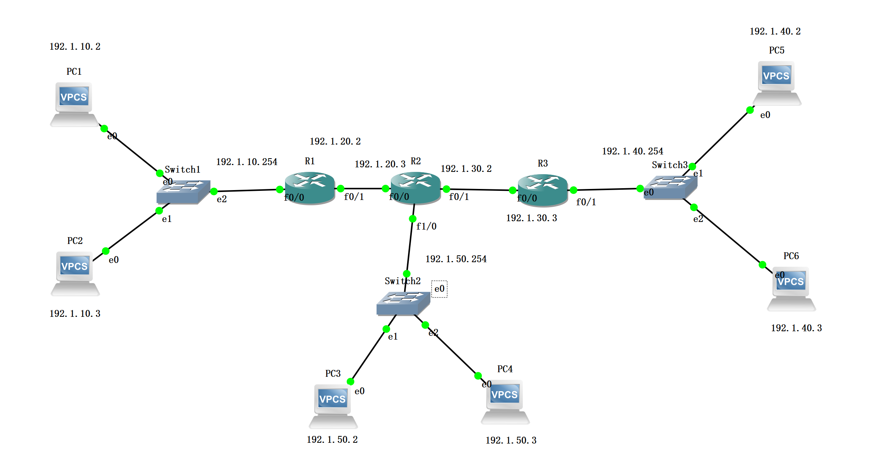

##### 1.配置pc机

```
PC1:
ip 192.1.10.2 192.1.10.254

PC2:
ip 192.1.10.3 192.1.10.254

PC3:
ip 192.1.50.2 192.1.50.254

PC4:
ip 192.1.50.3 192.1.50.254

PC5:
ip 192.1.40.2 192.1.40.254

PC6:
ip 192.1.40.3 192.1.40.254
```

##### 2.配置R1,R2,R3

```
R1:
conf t
int f0/0
ip add 192.1.10.254 255.255.255.0
no shut

int f0/1
ip add 192.1.20.3 255.255.255.0
no shut

R2:
conf t
int f0/0
ip add 192.1.20.3 255.255.255.0
no shut

int f1/0
no switchport
ip add 192.1.50.254 255.255.255.0
no shut

int f0/1 
ip add 192.1.30.2 255.255.255.0
no shut

R3:
conf t
int f0/0
ip add 192.1.30.3 255.255.255.0
no shut

int f0/1
ip add 192.1.40.254 255.255.255.0
no shut
```

##### 3.添加静态路由route

```
R1:
ip route 192.1.50.0 255.255.255.0 192.1.20.3
ip route 192.1.40.0 255.255.255.0 192.1.30.3
ip route 192.1.30.0 255.255.255.0 192.1.20.3

R2:
ip route 192.1.10.0 255.255.255.0 192.1.20.2
ip route 192.1.40.0 255.255.255.0 192.1.30.3

R3:
ip route 192.1.10.0 255.255.255.0 192.1.20.2
ip route 192.1.20.0 255.255.255.0 192.1.30.2
ip route 192.1.50.0 255.255.255.0 192.1.30.2

配置完上面所有命令以后就能ping任意pc了
```

##### 4.添加ACL规则

要求:

- 要求10网段禁止访问整个50网段,访问其它不受限
- 要求40.2禁止访问50网段,其它访问不受限
- 要求10.2禁止访问40网段,其他不受影响

```
R2:
access-list 1 deny 192.1.10.0 0.0.0.255  //禁止192.1.10.0/24网段
access-list 1 deny 192.1.40.2 0.0.0.0 //禁止40.2
access-list 1 permit any //允许其它流量通过
int f1/0
ip access-group 1 out

R3:
access-list 2 deny 192.1.10.2 0.0.0.0
access-list 2 permit any
int f0/0
ip access-group 2 out
```

##### 测试

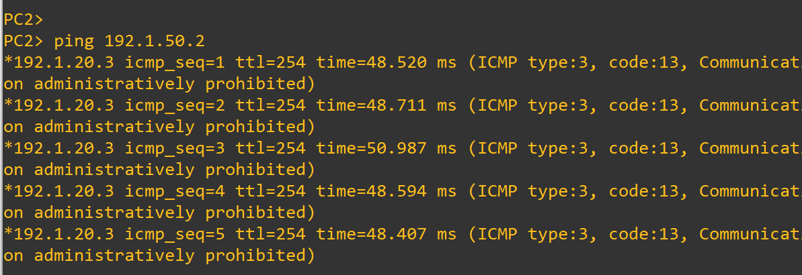

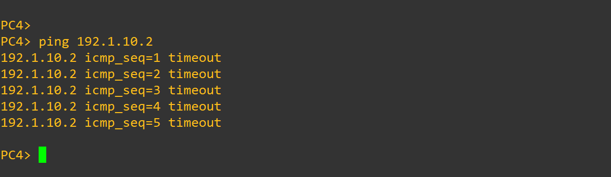


# 作业

```
创建如图所示的并连线.配置静态地址转换
```

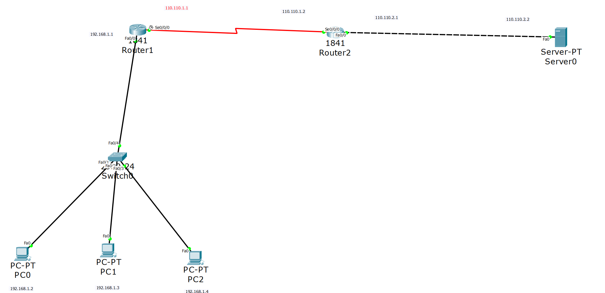

```
然后我们开始配置PC机
PC0:
//配置网关
192.168.1.1
//配置静态路由(static)
192.168.1.2
255.255.255.0

PC1:
//配置网关
192.168.172.1
//配置静态路由(static)
192.168.1.3
255.255.255.0

PC0:
//配置网关
192.168.1.1
//配置静态路由(static)
192.168.1.4
255.255.255.0
```

配置方式都是一样的,为了节省空间,我仅展示pc0的配置,pc1,pc2,server(网关110.110.2.1,static 110.110.2.2)可参考pc0

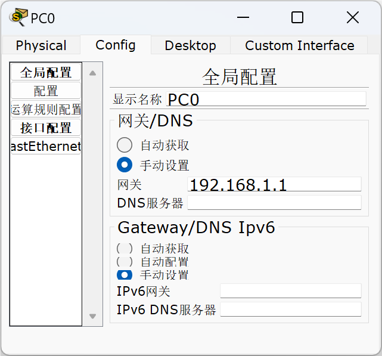

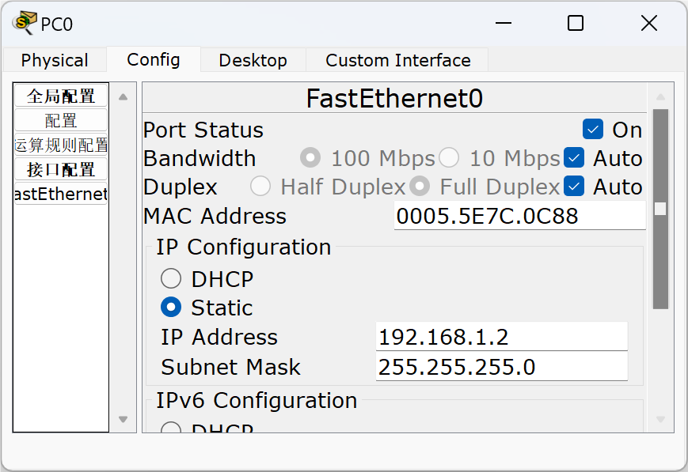

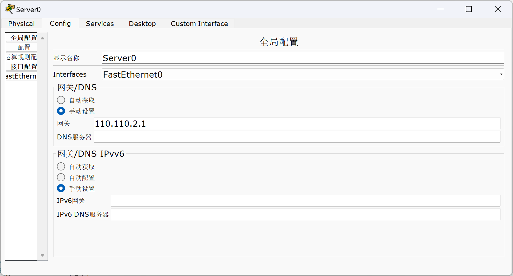

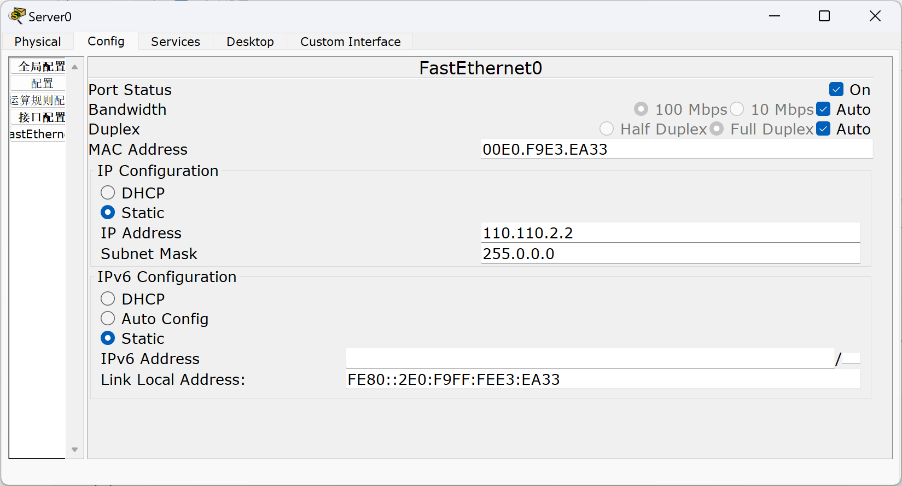

```
配置好pc机后,开始配置路由
R0:
enable
conf t
int f0/0
ip add 192.168.1.1 255.255.255.0
no shut
exit

int s0/0/0
ip add 110.110.1.1 255.255.255.0
no shut
exit

ip route 0.0.0.0 0.0.0.0 110.110.1.2
ip nat inside source static 192.168.1.2 110.110.1.1
int s0/0/0
ip nat outside
exit

int f0/0
ip nat inside


R1:
enable
conf t
int s0/0/0
ip add 110.110.1.2 255.255.255.0
no shut
exit

int f0/0
ip add 110.110.2.1 255.255.255.0
no shut
```

同理,这里R1配置,R2大同小异(输入的时候注意是config还是config-if,是否需要exit)

##### R1配置

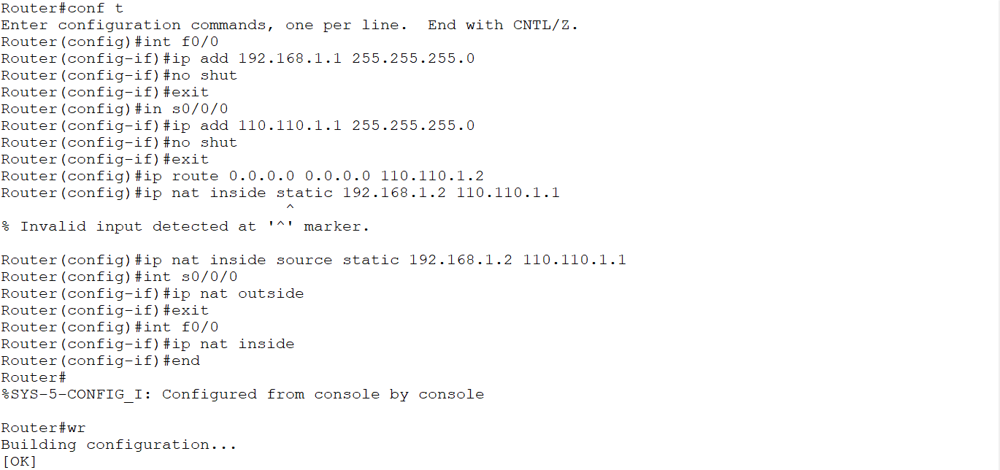

##### R2配置

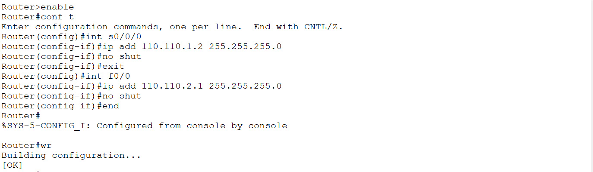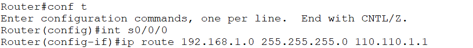

##### 测试

pc机ping服务器

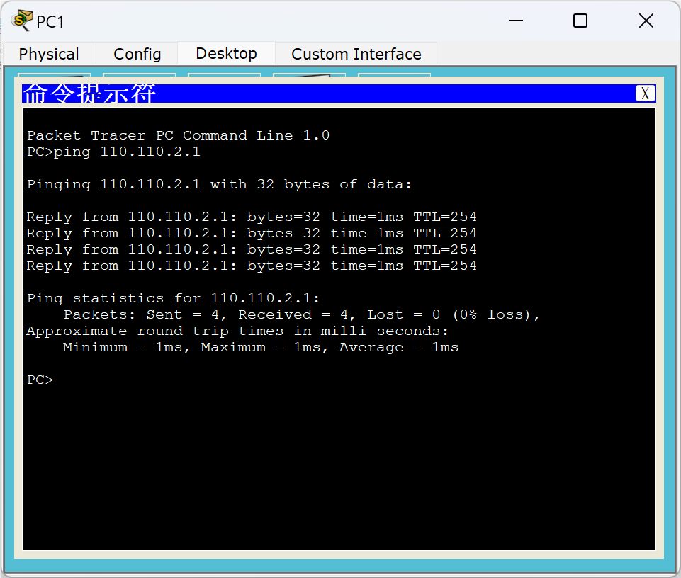

服务器ping pc机

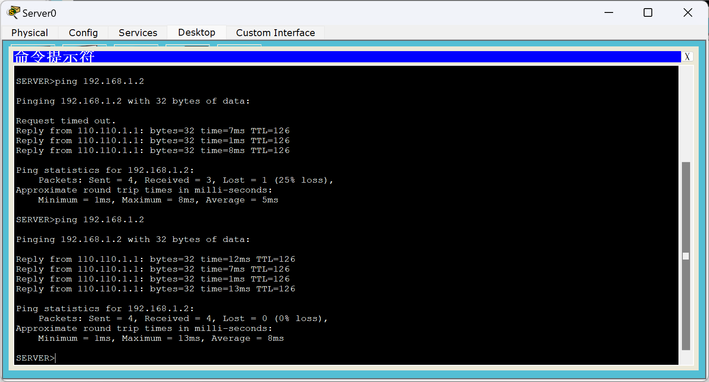


