# 任务1

- 1.给定一个变量num,判断这个数字是否为整数,负数,还是0
- 2.给定两个变量a,b判断并输出较大的那个值
- 3.给定一个变量num,判断它是奇数还是偶数,并输出结果
- 4.给定两个变量a和b,计算他们的和,差,积,商,并输出结果,并且判断a和b的和与商是否相等

```
打开编译器创建两个文件,分别是 test.html 和 test.js
```

### HTML代码

```html
<!DOCTYPE html>
<html lang="en">
<head>
    <meta charset="UTF-8">
    <titel>判断数字类型</titel>
</head>
   <body>
    <!--引用test.js-->
       <script src="test.js"></script>
    </body>
</html>
```

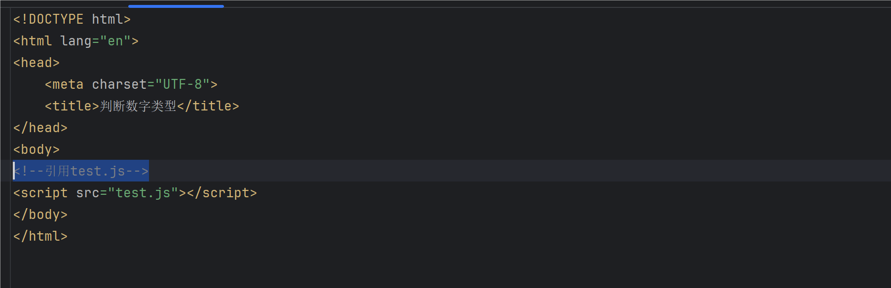

### JS代码

```html
//TODO:1. 给定一个变量num,判断这个数字是否为整数,负数,还是0
//TODO:2. 给定两个变量a,b判断并输出较大的那个值
//TODO:3. 给定一个变量num,判断它是奇数还是偶数,并输出结果
//TODO:4. 给定两个变量a和b,计算他们的和,差,积,商,并输出结果,并且判断a和b的和与商是否相等

function choose(choice) {
    switch (choice) {
// TODO:1. 给定一个变量num1,判断这个数字是否为整数,负数,还是0
        case 1:
            var num1 = prompt("请输入一个数字:")
            num1 = Number(num1)  //转换成数字类型
            if (isNaN(num1)) {
                alert("输入的数字非法!")  //不允许为数字以外的其他数字
            } else if (num1 > 0) {
                alert("这是一个正数!")
            } else if (num1 < 0) {
                alert("这是一个负数!")
            } else {
                alert("这是一个蛋!")
            }
            break;
// TODO:2. 给定两个变量a,b判断并输出较大的那个值
        case 2:
            var a = prompt("请输入第一个数字:")
            var b = prompt("请输入第二个数字:")
            a = Number(a)
            b = Number(b)

            if (isNaN(a) || isNaN(b)) {
                alert("输入的数字不是有效的数字!")
            } else {
                var max = Math.max(a, b)
                alert("较大的数字是:" + max)
            }
            break;

// TODO:3. 给定一个变量num2,判断它是奇数还是偶数,并输出结果
        case 3:
            var num2 = prompt("请输入一个数字:")
            num2 = Number(num2)

            if (isNaN(num2)) {
                alert("输入的数字非法!") //不允许为数字以外的其他数字
            } else if (num2 % 2 === 0){
                alert(num2+"这是一个偶数!")
            }else {
                alert(num2+"这是一个奇数!")
            }
            break;

// TODO:4. 给定两个变量num3和num4,计算他们的和,差,积,商,并输出结果,并且判断a和b的和与商是否相等
        case 4:
            var num3 = prompt("请输入第一个数字:")
            var num4 = prompt("请输入第二个数字:")
            num3 = Number(num3)
            num4 = Number(num4)
            if (isNaN(num3) || isNaN(num4)) {
                alert("输入的数字非法!")
            }else {
                var sum = num3 + num4
                var reduce = num3 - num4
                var cheng = num3 * num4
                var div = num3 / num4
                alert("和:" + sum + "/n差:" + reduce + "/n积:" + cheng + "/n商:" + div)
                if (sum === div) {
                    alert("这两个数的和与商相等!")
                } else {
                    alert("这两个数的和与商不相等!")
                }
            }
            break;
            default:
                    alert("选择无效!")
    }
}

// TODO : 永真循环,可退出
while (true) {
    var choice = prompt("请输入数字选择功能：/n1. 判断数字的正负零/n2. 输出较大的数/n3. 判断数字的奇偶性/n4. 计算两数的和、差、积、商/n/n输入其他任何字符无效。")
    choice = Number(choice);
    if (isNaN(choice) || choice < 1 || choice > 4) {
        alert("请输入有效的数字选择!")  //不允许为数字以外的其他数字
    } else {
        choose(choice);
    }
    var go_on = confirm("是否继续?点击确定继续,点击取消退出");
    if (go_on === false) {
        break;  //用户选择取消退出循环
    }
}
```

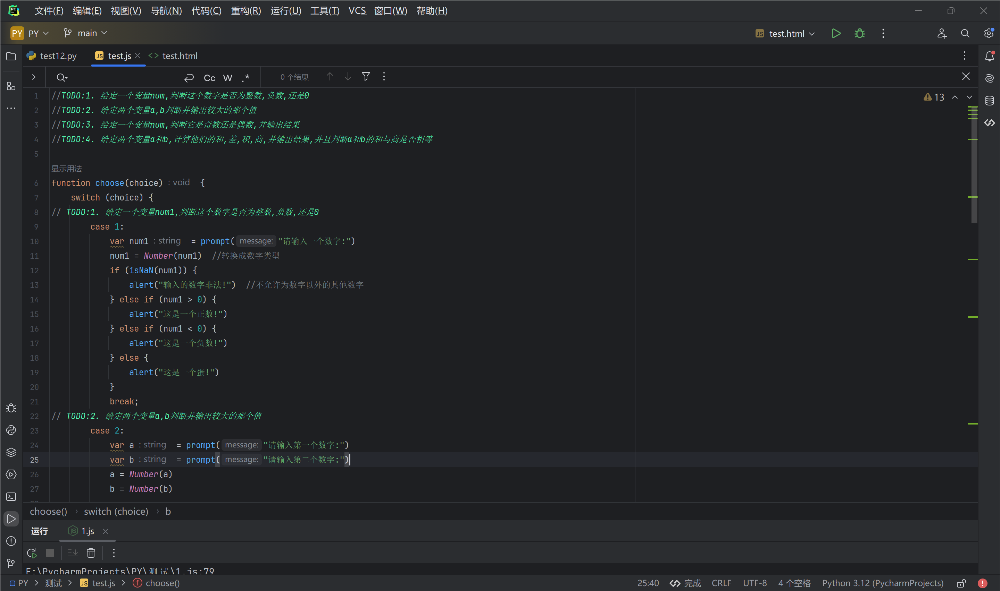

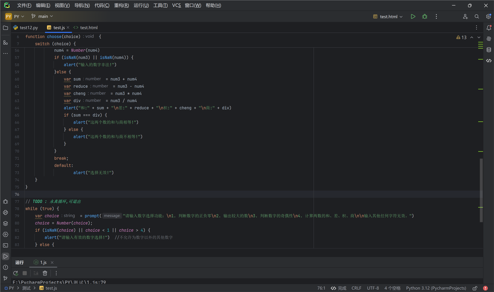

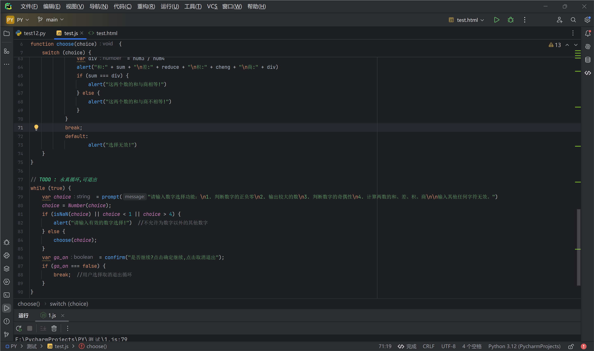

### 执行效果

```
第一个页面,将四个功能集成到一个页面,并对逻辑做了处理,比如说:在没有输入任何数字的情况下点击确定会提示请输入有效的数字选择,以及输入非法,等等...
```

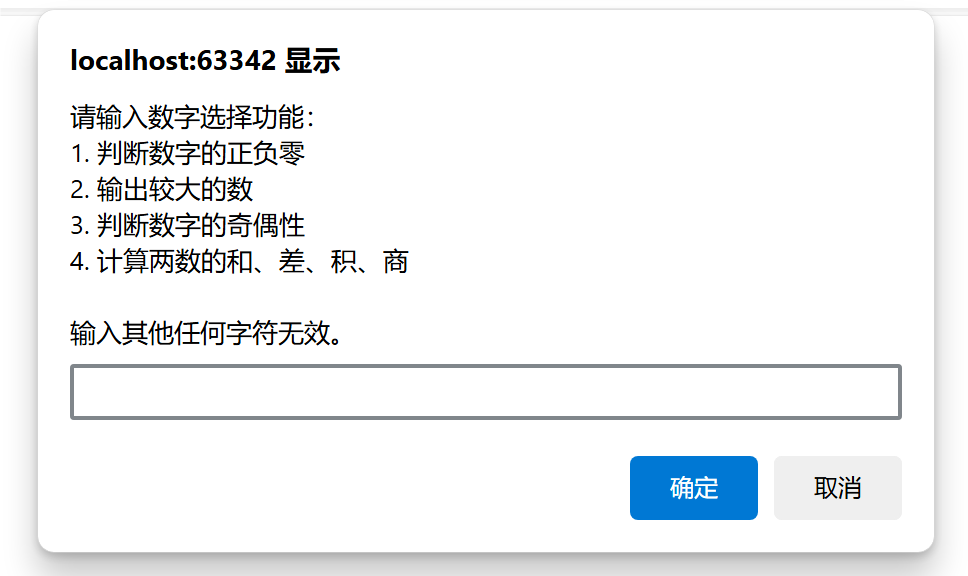

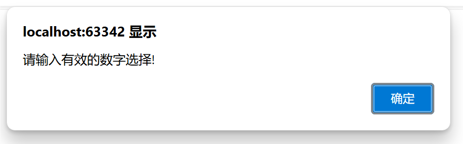

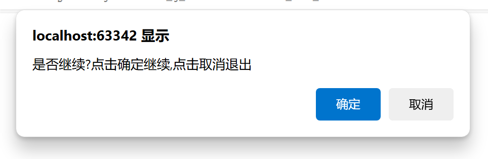

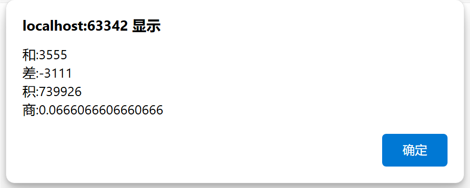

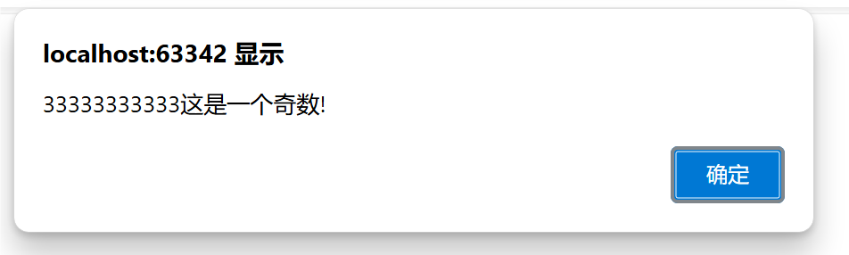

```
功能基本上都实现了,以上是部分样例图展示
```


# 任务2

- 编辑一个登录框

  ```
  创建一个 login(lite).html 的文件,然后导入bootstrap文件,如下图所示
  ```

  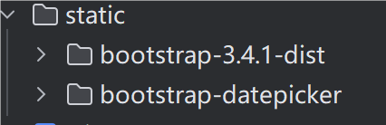

```html
<!DOCTYPE html>
<html lang="en">
<head>
    <meta charset="UTF-8">
    <title>登录</title>
    <!-- 引入Bootstrap的CSS文件 -->
    <link rel="stylesheet" href="static/bootstrap-3.4.1-dist/css/bootstrap.min.css">
    <style>
        .center-container {
            display: flex;
            justify-content: center;
            align-items: center;
            height: 100vh;
        }
        .card {
            width: 400px;
        }
    </style>
</head>
<body>
<div class="container center-container">
    <div class="card">
        <div class="card-body">
                
            <form action="https://www.4399.com/" method="get">
                <div class="form-group">
                    <label for="username">用户名</label>
                    <input type="text" class="form-control" id="username" name="username" value="tomato">
                </div>
                <div class="form-group">
                    <label for="password">密码</label>
                    <input type="password" class="form-control" id="password" name="password" value="smile tomato">
                </div>
                <div class="form-check">
                    <input type="checkbox" class="form-check-input" id="remember" name="remember" value="1" onclick="showmsg1()">
                    <label class="form-check-label" for="remember">记住密码</label>
                    <script>function showmsg1() {alert("你是不是猪?不是你的电脑记住密码干嘛?");}</script>
                </div>
                <div class="form-check">
                    <input type="checkbox" class="form-check-input" id="autologin" name="autologin" value="1" onclick="showms2()">
                    <label class="form-check-label" for="autologin">自动登录</label>
                    <script>function showms2() {alert("大傻X,还想自动登录?");}</script>
                </div>
                <div class="form-group mt-3">
                    <input type="submit" class="btn btn-primary" value="登录" onclick="showmsg3()">
                    <script>function showmsg3(){alert("弱智的小朋友,欢迎你来到4399!")}</script>
               <input type="reset" class="btn btn-secondary" value="忘记密码" onclick="showmsg4()">
                <script>function showmsg4() {alert("你是猪脑子吗?密码都记不得了?");}</script>
                </div>
            </form>
        </div>
    </div>
</div>
</body>
</html>
```

### 执行效果

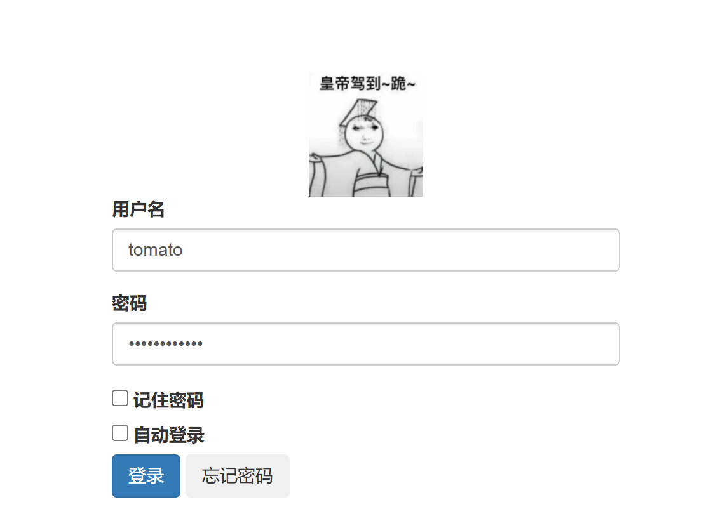

```
登录成功,并跳转4399
```

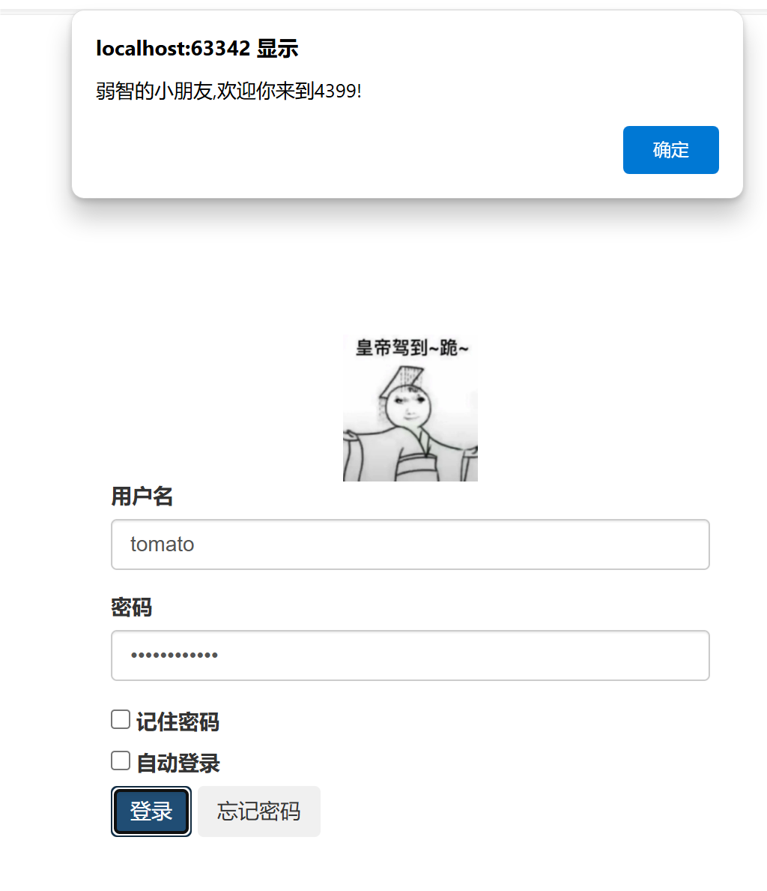


```
点击忘记密码
```

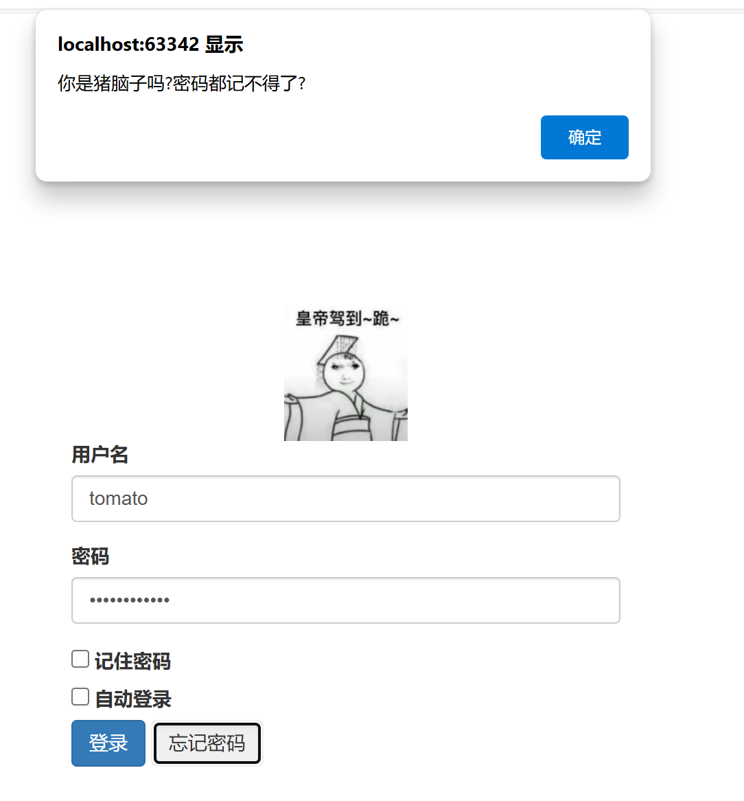

```
点击记住密码
```

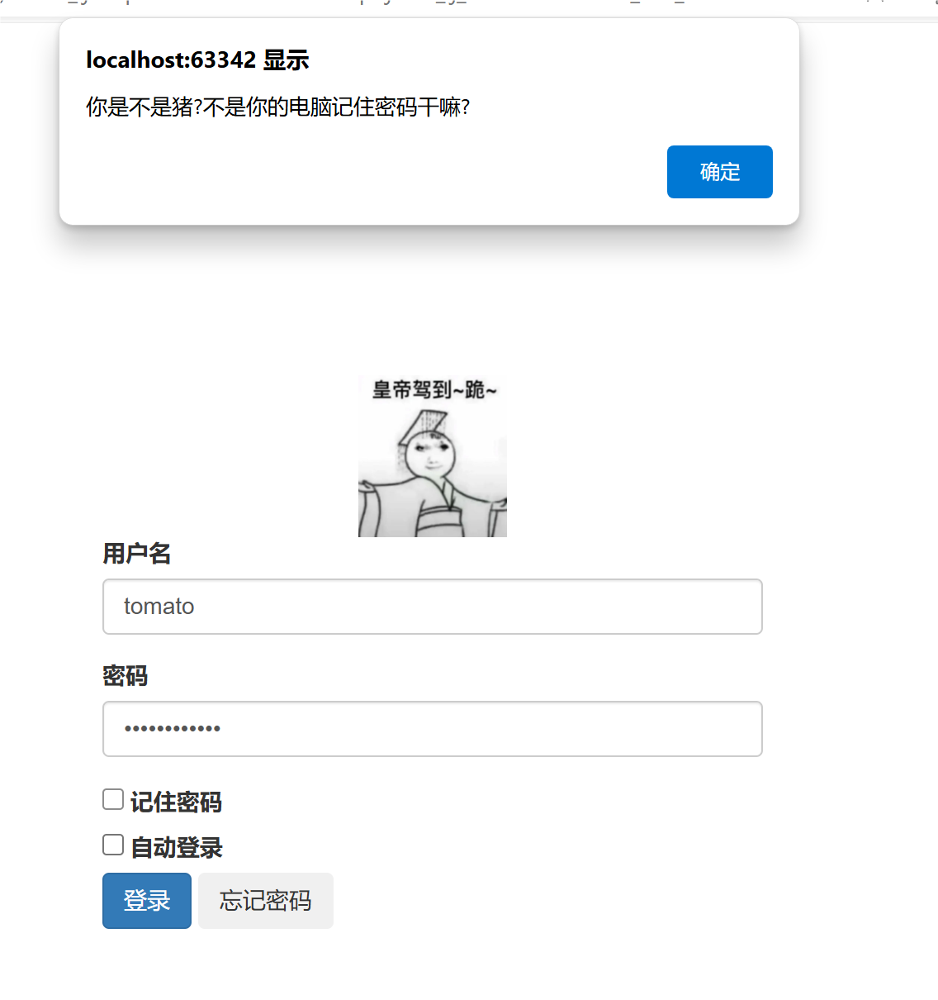

```
点击自动登录
```

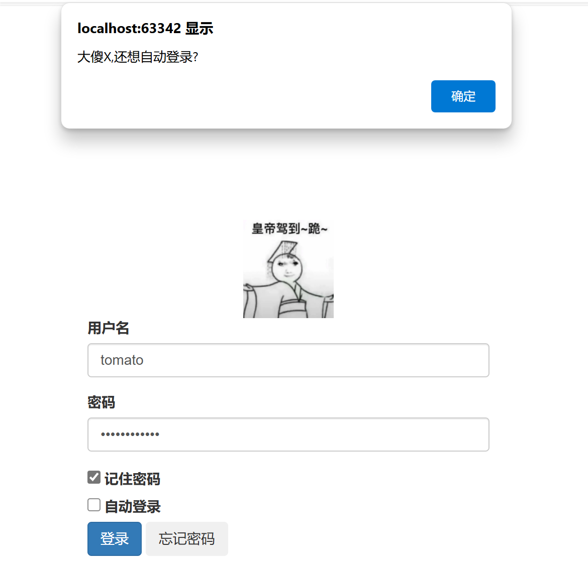
