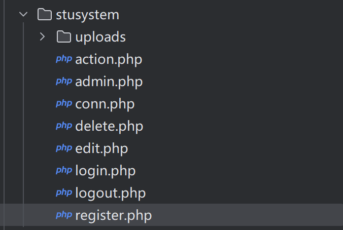
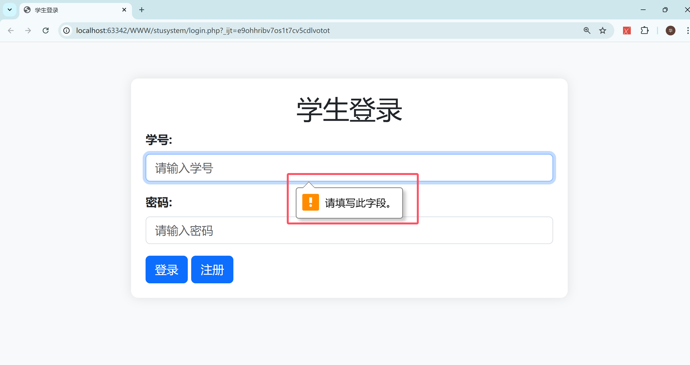
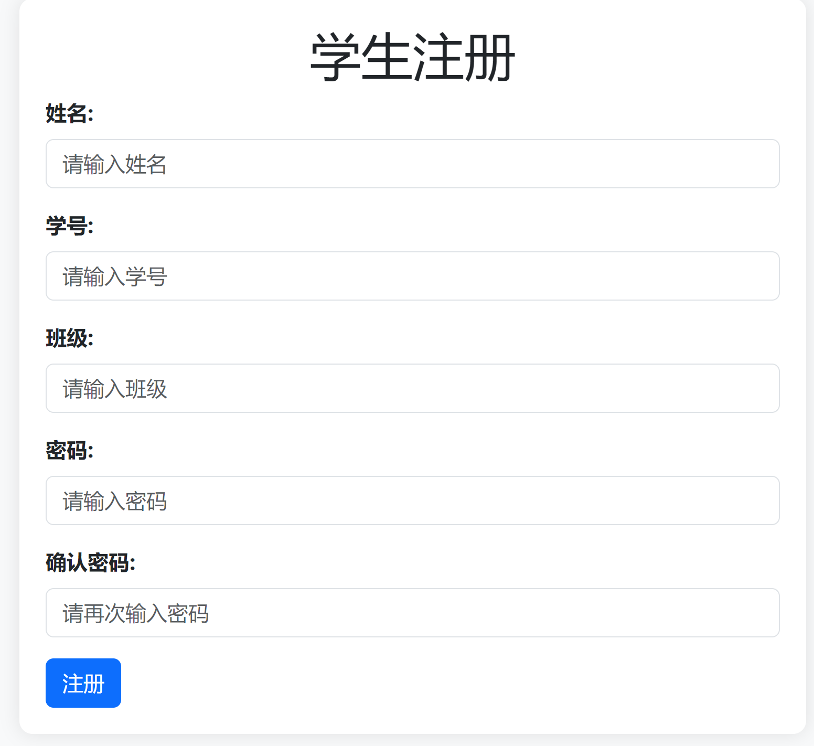
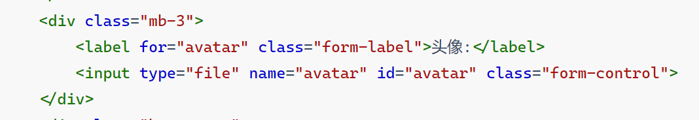
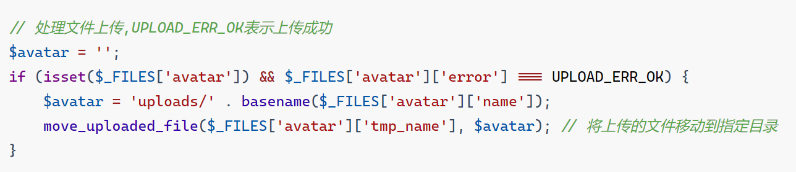
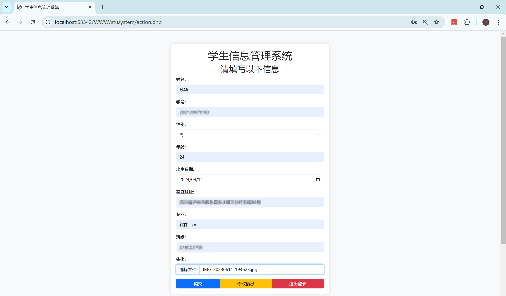
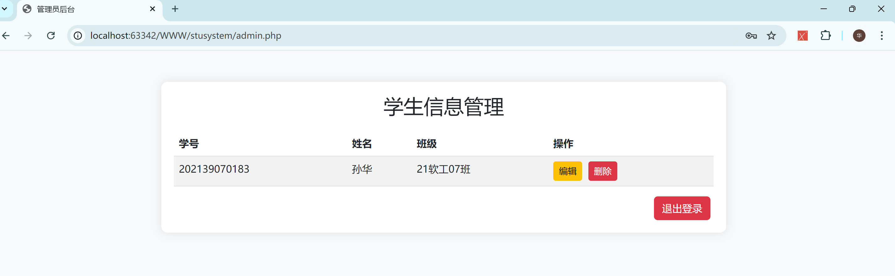

# 学生管理系统

- 思路:咱们还是从常规的思维下手,先做登录页面,然后再按先后逻辑衍生到后续的每一个页面
- 前面在留言板4.0里介绍得比较详细了,这个管理系统相对可能就会介绍的比较粗略些

#### 项目结构



#### 数据库设计

- ``$conn = mysqli_connect('localhost', 'root', 'root', 'student_management');``这样写简洁些,最后一个参数是数据库名称

  不写的化也可以用``mysqli_select_db``传入自己想用的数据库

- 这个部分主要使用到了两张表,``admin_stu``表用于存储登录信息的(主键为:id,自增);``stu``表用于存储用户登录后填写的表单信息
- 在前面我会介绍,代码比较生疏的地方,``->``写法相对比较简单些,但是还是喜欢用``mysqli_``传参数这种,写习惯了
- 建议在创建表的过程中都写上``if not exists....``没有表则创建

```php
<?php
$servername = "localhost";
$username = "root";
$password = "root";
$dbname = "student_management";

$conn = new mysqli($servername, $username, $password, $dbname);

if ($conn->connect_error) {
    die("连接失败：" . $conn->connect_error);
}

$conn->set_charset("utf8");
?>
    
<!--需要用到的两张表-->
<!--CREATE TABLE admin_stu (-->
<!--id INT(11) PRIMARY KEY AUTO_INCREMENT,-->
<!--userid VARCHAR(30) NOT NULL,-->
<!--username VARCHAR(255) NOT NULL,-->
<!--password VARCHAR(255) NOT NULL,-->
<!--class VARCHAR(255)-->
<!--);-->
<!---->
<!--CREATE TABLE stu (-->
<!--id INT(11) PRIMARY KEY AUTO_INCREMENT,-->
<!--userid VARCHAR(30) NOT NULL,-->
<!--username VARCHAR(255) NOT NULL,-->
<!--sex VARCHAR(10),-->
<!--age INT(11),-->
<!--address VARCHAR(255),-->
<!--birthday DATE,-->
<!--major VARCHAR(255),-->
<!--class VARCHAR(255),-->
<!--avatar VARCHAR(255)-->
<!--);-->

```

#### 登录页面设计

- 这个页面主要有以下几个功能:

- 登录校验,检查账号密码是否正确,是否为空值(刚开始我在html写了``required``,要求用户输入不能为空,但是发现可以输入``空格``),所以还是做了校验.

  登录成功后就能进入核心界面,让用户填写表单

- 注册页面跳转,点击注册,提示用户即将跳转注册页面

- 管理员权限:我没有再创建专门放管理员的表,而是直接添加管理员权限,如果用户在登录界面输入的账号是管理员账号可以直接跳转管理员界面

  

```php+HTML
<!DOCTYPE html>
<html lang="zh-CN">
<head>
    <meta charset="UTF-8">
    <meta name="viewport" content="width=device-width, initial-scale=1.0">
    <title>学生登录</title>
    <link href="https://cdn.jsdelivr.net/npm/bootstrap@5.3.0/dist/css/bootstrap.min.css" rel="stylesheet">
    <style>
        body {
            background-color: #f8f9fa;
        }
        .container {
            max-width: 600px;
            margin: 50px auto;
            padding: 20px;
            background-color: white;
            border-radius: 10px;
            box-shadow: 0 0 15px rgba(0, 0, 0, 0.1);
        }
        .form-label {
            font-weight: bold;
        }
        .form-control {
            margin-bottom: 15px;
        }
    </style>
</head>
<body>
<div class="container">
    <h1 class="text-center">学生登录</h1>
    <form action="" method="post">
        <div class="mb-3">
            <label for="userid" class="form-label">学号:</label>
            <input type="text" name="userid" id="userid" class="form-control" placeholder="请输入学号" required>
        </div>
        <div class="mb-3">
            <label for="password" class="form-label">密码:</label>
            <input type="password" name="password" id="password" class="form-control" placeholder="请输入密码" required>
        </div>
        <input type="submit" value="登录" class="btn btn-primary">
        <input type="button" class="btn btn-primary" value="注册"
               onclick="window.location.href='register.php',showmsg4()">
        <script>function showmsg4() {
                //用户点击注册按钮后,弹出提示框
                alert("即将跳转注册页面")
            }</script>
    </form>
</div>
</body>
</html>

<?php
session_start();
include "conn.php";
global $conn;

if ($_SERVER["REQUEST_METHOD"] == "POST") {
    $userid = trim($_POST['userid']);
    $password = trim($_POST['password']);

    if (empty($userid) || empty($password)) {
        echo "<script>alert('请填写学号和密码');</script>";
    } else {
        if (!$conn) {
            die("数据库连接失败: " . mysqli_connect_error());
        }

        $stmt = $conn->prepare("SELECT * FROM admin_stu WHERE userid=?");
        if (!$stmt) {
            die("准备 SQL 语句失败: " . $conn->error);
        }

        $stmt->bind_param("s", $userid);
        $stmt->execute();
        $result = $stmt->get_result();

        if ($userid == 'admin') {
            if ($password == 'admin') {
                echo "<script>alert('你好啊!管理员');location.href='admin.php';</script>";
                exit(); // 确保不再继续执行
            }
        }

        if ($result->num_rows == 1) {
            $row = $result->fetch_assoc(); // 使用 fetch_assoc()
            if (password_verify($password, $row['password'])) {
                $_SESSION['userid'] = $row['userid'];
                $_SESSION['username'] = $row['username'];
                echo "<script>alert('登录成功');location.href='action.php';</script>";
            } else {
                echo "<script>alert('密码错误');</script>";
            }
        } else {
            echo "<script>alert('用户不存在');</script>";
        }
    }
}
?>

```




#### 注册页面

- 当用户点击注册界面后,进入该界面,css样式自己琢磨(我是用模板),样式肯定和登录界面差不多
- 注册界面需要填写姓名,学号,班级,密码以及再次确认密码,只有一个注册按钮,点击注册后就会将数据插入``admin_stu``表,然后跳转回登录页面
- 对密码进行了哈希处理,即使管理员在数据库也不能看到用户密码,只能修改
- 对填写的字符串进行去除空格处理``trim``

```php+HTML
<!DOCTYPE html>
<html lang="zh-CN">
<head>
    <meta charset="UTF-8">
    <meta name="viewport" content="width=device-width, initial-scale=1.0">
    <title>学生注册</title>
    <link href="https://cdn.jsdelivr.net/npm/bootstrap@5.3.0/dist/css/bootstrap.min.css" rel="stylesheet">
    <style>
        body {
            background-color: #f8f9fa;
        }

        .container {
            max-width: 600px;
            margin: 50px auto;
            padding: 20px;
            background-color: white;
            border-radius: 10px;
            box-shadow: 0 0 15px rgba(0, 0, 0, 0.1);
        }

        .form-label {
            font-weight: bold;
        }

        .form-control {
            margin-bottom: 15px;
        }
    </style>
</head>
<body>
<div class="container">
    <h1 class="text-center">学生注册</h1>
    <form action="" method="post">
        <div class="mb-3">
            <label for="username" class="form-label">姓名:</label>
            <input type="text" name="username" id="username" class="form-control" placeholder="请输入姓名" required>
        </div>
        <div class="mb-3">
            <label for="userid" class="form-label">学号:</label>
            <input type="text" name="userid" id="userid" class="form-control" placeholder="请输入学号" required>
        </div>
        <div class="mb-3">
            <label for="class" class="form-label">班级:</label>
            <input type="text" name="class" id="class" class="form-control" placeholder="请输入班级" required>
        </div>
        <div class="mb-3">
            <label for="password" class="form-label">密码:</label>
            <input type="password" name="password" id="password" class="form-control" placeholder="请输入密码" required>
        </div>
        <div class="mb-3">
            <label for="confirm_password" class="form-label">确认密码:</label>
            <input type="password" name="confirm_password" id="confirm_password" class="form-control"
                   placeholder="请再次输入密码" required>
        </div>
        <input type="submit" value="注册" class="btn btn-primary">
    </form>
</div>
</body>
</html>

<?php
include "conn.php";
global $conn;

// 检查用户是否已登录,trim去除字符串两端的空白字符
if ($_SERVER["REQUEST_METHOD"] == "POST") {
    $username = trim($_POST['username']);
    $userid = trim($_POST['userid']);
    $class = trim($_POST['class']);
    $password = trim($_POST['password']);
    $confirm_password = trim($_POST['confirm_password']);

    // 检查是否填写完整,任意为空则提示
    if (empty($username) || empty($userid) || empty($class) || empty($password) || empty($confirm_password)) {
        echo "<script>alert('请填写完整信息');</script>";
    } elseif ($password !== $confirm_password) {
        echo "<script>alert('密码不一致');</script>";
    } else {
        //TODO: password_hash对密码进行哈希加密,PASSWORD_DEFAULT为默认加密方式
        $hashed_password = password_hash($password, PASSWORD_DEFAULT);
        $sql = "INSERT INTO admin_stu (userid, username, password, class) VALUES ('$userid', '$username', '$hashed_password', '$class')";
        $result = mysqli_query($conn, $sql);

        if ($result) {
            echo "<script>alert('注册成功');location.href='login.php';</script>";
        } else {
            echo "<script>alert('注册失败');</script>";
        }
    }
}
?>

```



#### 主页

- 主页就是一个简单的表单填写,主页填写的内容与注册填写的相同但是不冲突,
- 多了一个文件上传(指定文件到当前目录下的一个叫``uploads``的文件夹),需要手动创建
- 重点说一下文件上传处理
- 
- 

- 这段代码包括了一个 HTML 文件上传表单和一个处理文件上传的 PHP 代码。下面是详细的解释：

  ### HTML 部分

  ```html
  <div class="mb-3">
      <label for="avatar" class="form-label">头像:</label>
      <input type="file" name="avatar" id="avatar" class="form-control">
  </div>
  ```

  **解释：**

  1. **`<div class="mb-3">`**：这是一个包含文件上传控件的容器，`class="mb-3"` 是 Bootstrap 的一个类，用于添加底部边距。

  2. **`<label for="avatar" class="form-label">头像:</label>`**：
     - `for="avatar"`：这个属性将标签与 ID 为 `avatar` 的输入框关联起来。点击标签时，浏览器会自动聚焦到对应的输入框。
     - `class="form-label"`：Bootstrap 样式类，用于给标签添加适当的样式。

  3. **`<input type="file" name="avatar" id="avatar" class="form-control">`**：
     - `type="file"`：指定输入框用于选择文件。
     - `name="avatar"`：表单提交时，文件将以 `avatar` 作为字段名发送到服务器。
     - `id="avatar"`：与 `<label>` 标签的 `for` 属性匹配，使得标签点击后会激活此输入框。
     - `class="form-control"`：Bootstrap 样式类，用于给输入框添加适当的样式。

  ### PHP 部分

  ```php
  $avatar = '';
  if (isset($_FILES['avatar']) && $_FILES['avatar']['error'] === UPLOAD_ERR_OK) {
      $avatar = 'uploads/' . basename($_FILES['avatar']['name']);
      move_uploaded_file($_FILES['avatar']['tmp_name'], $avatar); // 将上传的文件移动到指定目录
  }
  ```

  **解释：**

  1. **`$avatar = '';`**：
     - 初始化一个空的变量 `$avatar`，用于存储文件上传后的目标路径。

  2. **`if (isset($_FILES['avatar']) && $_FILES['avatar']['error'] === UPLOAD_ERR_OK)`**：
     - `isset($_FILES['avatar'])`：检查 `$_FILES['avatar']` 是否存在。这表明表单提交时有文件上传。
     - `$_FILES['avatar']['error'] === UPLOAD_ERR_OK`：检查上传过程中是否没有错误。`UPLOAD_ERR_OK` 是一个常量，表示上传成功，没有错误。

  3. **`$avatar = 'uploads/' . basename($_FILES['avatar']['name']);`**：
     - `basename($_FILES['avatar']['name'])`：获取上传文件的原始名称，并去掉路径，只保留文件名。这样做有助于防止路径遍历攻击。
     - `'uploads/' . basename($_FILES['avatar']['name'])`：拼接上传目录路径和文件名，得到文件在服务器上的目标路径。

  4. **`move_uploaded_file($_FILES['avatar']['tmp_name'], $avatar);`**：
     - `$_FILES['avatar']['tmp_name']`：获取上传文件在服务器上的临时文件路径。
     - `move_uploaded_file()`：将上传的临时文件移动到目标路径。如果移动成功，文件将被保存到 `uploads/` 目录下，并且不再存在临时文件夹中。

  ### 小结

  - **HTML 部分**：创建了一个文件上传表单，让用户选择文件。
  - **PHP 部分**：处理文件上传：
    - 检查上传是否成功。
    - 生成目标文件路径。
    - 将文件从临时目录移动到目标目录。

  **注意事项**：
  - 确保 `uploads/` 目录存在，并且有适当的写权限。
  - 在实际应用中，应添加更多的安全措施，比如文件类型检查、文件大小限制等，以防止潜在的安全风险。


```php+HTML
<!DOCTYPE html>
<html lang="zh-CN">
<head>
    <meta charset="UTF-8">
    <meta name="viewport" content="width=device-width, initial-scale=1.0">
    <title>学生信息管理系统</title>
    <link href="https://cdn.jsdelivr.net/npm/bootstrap@5.3.0/dist/css/bootstrap.min.css" rel="stylesheet">
    <style>
        body {
            background-color: #f8f9fa;
        }
        .container {
            max-width: 600px;
            margin: 50px auto;
            padding: 20px;
            background-color: white;
            border-radius: 10px;
            box-shadow: 0 0 15px rgba(0, 0, 0, 0.1);
        }
        .form-label {
            font-weight: bold;
        }
        .form-control {
            margin-bottom: 15px;
        }
        .btn-group {
            display: flex;
            justify-content: space-between;
        }
    </style>
</head>
<body>
<div class="container">
    <h1 class="text-center">学生信息管理系统</h1>
    <h2 class="text-center">请填写以下信息</h2>
    <form action="" method="post" enctype="multipart/form-data">
        <div class="mb-3">
            <label for="username" class="form-label">姓名:</label>
            <input type="text" name="username" id="username" class="form-control" placeholder="请输入姓名" required>
        </div>
        <div class="mb-3">
            <label for="userid" class="form-label">学号:</label>
            <input type="text" name="userid" id="userid" class="form-control" placeholder="请输入学号" required>
        </div>
        <div class="mb-3">
            <label for="sex" class="form-label">性别:</label>
            <select name="sex" id="sex" class="form-select">
                <option value="男">男</option>
                <option value="女">女</option>
            </select>
        </div>
        <div class="mb-3">
            <label for="age" class="form-label">年龄:</label>
            <input type="text" name="age" id="age" class="form-control" placeholder="请输入年龄" required>
        </div>
        <div class="mb-3">
            <label for="birthday" class="form-label">出生日期:</label>
            <input type="date" name="birthday" id="birthday" class="form-control">
        </div>
        <div class="mb-3">
            <label for="address" class="form-label">家庭住址:</label>
            <input type="text" name="address" id="address" class="form-control" placeholder="请输入家庭住址" required>
        </div>
        <div class="mb-3">
            <label for="major" class="form-label">专业:</label>
            <input type="text" name="major" id="major" class="form-control" placeholder="请输入专业" required>
        </div>
        <div class="mb-3">
            <label for="class" class="form-label">班级:</label>
            <input type="text" name="class" id="class" class="form-control" placeholder="请输入班级" required>
        </div>
        <div class="mb-3">
            <label for="avatar" class="form-label">头像:</label>
            <input type="file" name="avatar" id="avatar" class="form-control">
        </div>
        <div class="btn-group">
            <input type="submit" value="提交" name="submit" class="btn btn-primary">
            <input type="submit" value="修改信息" name="mod" class="btn btn-warning">
            <input type="button" value="退出登录" class="btn btn-danger" onclick="location.href='logout.php'">
        </div>
    </form>
</div>
</body>
</html>

<?php
session_start();
include "conn.php";
global $conn;

$username = trim($_POST['username']);
$userid = trim($_POST['userid']);
$sex = trim($_POST['sex']);
$age = trim($_POST['age']);
$birthday = trim($_POST['birthday']);
$address = trim($_POST['address']);
$major = trim($_POST['major']);
$class = trim($_POST['class']);

// 处理文件上传,UPLOAD_ERR_OK表示上传成功
$avatar = '';
if (isset($_FILES['avatar']) && $_FILES['avatar']['error'] === UPLOAD_ERR_OK) {
    $avatar = 'uploads/' . basename($_FILES['avatar']['name']);
    move_uploaded_file($_FILES['avatar']['tmp_name'], $avatar); // 将上传的文件移动到指定目录
}

// 获取已存在的学生信息
$sql_ses = "SELECT * FROM stu WHERE userid='{$_SESSION['userid']}'";
$result_ses = mysqli_query($conn, $sql_ses);
$existing_data = mysqli_fetch_assoc($result_ses);

if ($existing_data) {
    // 显示现有数据
    echo $existing_data['userid'] . '<br>';
    echo $existing_data['username'] . '<br>';
    echo $existing_data['sex'] . '<br>';
    echo $existing_data['age'] . '<br>';
    echo $existing_data['birthday'] . '<br>';
    echo $existing_data['address'] . '<br>';
    echo $existing_data['major'] . '<br>';
    echo $existing_data['class'] . '<br>';
    echo $existing_data['avatar'] . '<br>';

    if (isset($_POST['mod'])) { // 修改信息
        if (empty($username) || empty($userid) || empty($sex) || empty($age) || empty($birthday) || empty($address) || empty($major) || empty($class) || empty($avatar)) {
            echo "<script>alert('请填写完整信息');</script>";
        } else {
            $sql = "UPDATE stu SET username='$username', sex='$sex', age='$age', birthday='$birthday', address='$address', major='$major', class='$class', avatar='$avatar' WHERE userid='$userid'";
            $result = mysqli_query($conn, $sql);
            if ($result) {
                echo "<script>alert('修改成功');</script>";
            } else {
                echo "<script>alert('修改失败');</script>";
            }
        }
    }
} else { // 未填写过信息
    if (isset($_POST['submit'])) {
        if (empty($username) || empty($userid) || empty($sex) || empty($age) || empty($birthday) || empty($address) || empty($major) || empty($class)) {
            echo "<script>alert('请填写完整信息');</script>";
        } else {
            $sql = "INSERT INTO stu (userid, username, sex, age, address, birthday, class, major, avatar) VALUES ('$userid', '$username', '$sex', '$age', '$address', '$birthday', '$class', '$major', '$avatar')";
            $result = mysqli_query($conn, $sql);
            if ($result) {
                echo "<script>alert('填写成功');location.href='login.php';</script>";
            } else {
                echo "<script>alert('填写失败');</script>";
            }
        }
    }
}
?>


```



#### 管理员界面

- 前面我在login.php里写了管理员权限,在登录框输入管理员账户可跳转后台
- 在里面主要展示了两个功能(编辑,删除),需要额外再写一个edit.php(实现编辑),delete(实现删除)
- 在编辑里就包含了显示用户基本信息

```php+HTML
<?php
include "conn.php"; // 包含数据库连接

// 获取所有学生信息
$sql = "SELECT * FROM stu";
$result = mysqli_query($conn, $sql);

if (!$result) {
    die("查询失败：" . mysqli_error($conn));
}
?>

<!DOCTYPE html>
<html lang="zh-CN">
<head>
    <meta charset="UTF-8">
    <meta name="viewport" content="width=device-width, initial-scale=1.0">
    <title>管理员后台</title>
    <link href="https://cdn.jsdelivr.net/npm/bootstrap@5.3.0/dist/css/bootstrap.min.css" rel="stylesheet">
    <style>
        body {
            background-color: #f8f9fa;
        }

        .admin-container {
            max-width: 900px;
            margin: 50px auto;
            padding: 20px;
            background-color: white;
            border-radius: 10px;
            box-shadow: 0 0 15px rgba(0, 0, 0, 0.1);
        }

        .table-responsive {
            margin-top: 20px;
        }

        .btn {
            margin-right: 5px;
        }
    </style>
</head>
<body>
<div class="admin-container">
    <h2 class="text-center">学生信息管理</h2>
    <div class="table-responsive">
        <table class="table table-striped">
            <thead>
            <tr>
                <th>学号</th>
                <th>姓名</th>
                <th>班级</th>
                <th>操作</th>
            </tr>
            </thead>
            <tbody>
            <!--TODO:这里使用while循环来遍历查询结果，并将每行数据插入到表格中-->
            <?php while ($row = mysqli_fetch_assoc($result)) : ?>
                <tr>
                    <!--TODO: htmlspecialchars函数用于防止sql注入-->
                    <td><?php echo htmlspecialchars($row['userid']); ?></td>
                    <td><?php echo htmlspecialchars($row['username']); ?></td>
                    <td><?php echo htmlspecialchars($row['class']); ?></td>
                    <td>
                        <a href="edit.php?id=<?php echo $row['userid']; ?>" class="btn btn-warning btn-sm">编辑</a>
                        <a href="delete.php?id=<?php echo $row['userid']; ?>" class="btn btn-danger btn-sm"
                           onclick="return confirm('确定要删除吗？');">删除</a>
                    </td>
                </tr>
                <!--TODO: endwhile表示结束while循环,跟django用法相似-->
            <?php endwhile; ?>
            </tbody>
        </table>
    </div>
    <div class="d-flex justify-content-end">
        <a href="logout.php" class="btn btn-danger">退出登录</a>
    </div>
</div>
</body>
</html>

<?php
mysqli_close($conn); // 关闭数据库连接
?>

```



#### 管理员编辑界面

- 这个页面样式跟主页大致一样(没什么说的)
- 就稍微修改一下提示词即可,关键字即可

```php+HTML
<?php
include "conn.php";
session_start();

if (!isset($_GET['id'])) {
    die('无效的请求');
}

$conn = mysqli_connect('localhost', 'root', 'root', 'student_management');
$id = mysqli_real_escape_string($conn, $_GET['id']);
$sql = "SELECT * FROM stu WHERE userid='$id'";
$result = mysqli_query($conn, $sql);

if (!$result) {
    die("查询失败：" . mysqli_error($conn));
}

$student = mysqli_fetch_assoc($result);

if ($_SERVER['REQUEST_METHOD'] == 'POST') {
    $username = trim($_POST['username']);
    $sex = trim($_POST['sex']);
    $age = trim($_POST['age']);
    $birthday = trim($_POST['birthday']);
    $address = trim($_POST['address']);
    $major = trim($_POST['major']);
    $class = trim($_POST['class']);
    $avatar = '';

    //TODO:将头像保存到uploads目录
    if (isset($_FILES['avatar']) && $_FILES['avatar']['error'] === UPLOAD_ERR_OK) {
        $avatar = 'uploads/' . basename($_FILES['avatar']['name']);
        move_uploaded_file($_FILES['avatar']['tmp_name'], $avatar);
    } else {
        $avatar = $student['avatar'];
    }

    $sql = "UPDATE stu SET username='$username', sex='$sex', age='$age', birthday='$birthday', address='$address', major='$major', class='$class', avatar='$avatar' WHERE userid='$id'";
    if (mysqli_query($conn, $sql)) {
        echo "<script>alert('信息更新成功'); location.href='admin.php';</script>";
    } else {
        echo "<script>alert('信息更新失败');</script>";
    }
}

mysqli_close($conn);
?>

<!DOCTYPE html>
<html lang="zh-CN">
<head>
    <meta charset="UTF-8">
    <meta name="viewport" content="width=device-width, initial-scale=1.0">
    <title>编辑学生信息</title>
    <link href="https://cdn.jsdelivr.net/npm/bootstrap@5.3.0/dist/css/bootstrap.min.css" rel="stylesheet">
</head>
<body>
<div class="container">
    <h1 class="text-center">编辑学生信息</h1>
    <form action="" method="post" enctype="multipart/form-data">
        <div class="mb-3">
            <label for="username" class="form-label">姓名:</label>
            <input type="text" name="username" id="username" class="form-control"
                   value="<?php echo htmlspecialchars($student['username']); ?>">
        </div>
        <div class="mb-3">
            <label for="sex" class="form-label">性别:</label>
            <select name="sex" id="sex" class="form-select">
                <option value="男" <?php if ($student['sex'] == '男') echo 'selected'; ?>>男</option>
                <option value="女" <?php if ($student['sex'] == '女') echo 'selected'; ?>>女</option>
            </select>
        </div>
        <div class="mb-3">
            <label for="age" class="form-label">年龄:</label>
            <input type="text" name="age" id="age" class="form-control"
                   value="<?php echo htmlspecialchars($student['age']); ?>">
        </div>
        <div class="mb-3">
            <label for="birthday" class="form-label">出生日期:</label>
            <input type="date" name="birthday" id="birthday" class="form-control"
                   value="<?php echo htmlspecialchars($student['birthday']); ?>">
        </div>
        <div class="mb-3">
            <label for="address" class="form-label">家庭住址:</label>
            <input type="text" name="address" id="address" class="form-control"
                   value="<?php echo htmlspecialchars($student['address']); ?>">
        </div>
        <div class="mb-3">
            <label for="major" class="form-label">专业:</label>
            <input type="text" name="major" id="major" class="form-control"
                   value="<?php echo htmlspecialchars($student['major']); ?>">
        </div>
        <div class="mb-3">
            <label for="class" class="form-label">班级:</label>
            <input type="text" name="class" id="class" class="form-control"
                   value="<?php echo htmlspecialchars($student['class']); ?>">
        </div>
        <div class="mb-3">
            <label for="avatar" class="form-label">头像:</label>
            <input type="file" name="avatar" id="avatar" class="form-control">
            <?php if ($student['avatar']) : ?>
                " alt="Avatar" width="100" class="mt-2">
            <?php endif; ?>
        </div>
        <div class="text-center">
            <input type="submit" value="保存" class="btn btn-primary">
            <a href="admin.php" class="btn btn-secondary">取消</a>
        </div>
    </form>
</div>
</body>
</html>

```


#### 删除功能

- 这个功能就是常规的删除,点击删除按钮就能实现,执行sql语句

```php
<?php
include "conn.php";
session_start();

// 检查用户是否已登录,无法直接访问
if (!isset($_GET['id'])) {
    die('无效的请求');
}
$conn = mysqli_connect('localhost', 'root', 'root', 'student_management');
//TODO:防止SQL注入,mysqli_real_escape_string() 函数转义 SQL 语句中使用的字符串中的特殊字符。
$id = mysqli_real_escape_string($conn, $_GET['id']);
$sql = "DELETE FROM stu WHERE userid='$id'";

if (mysqli_query($conn, $sql)) {
    echo "<script>alert('删除成功'); location.href='admin.php';</script>";
} else {
    echo "<script>alert('删除失败'); location.href='admin.php';</script>";
}

mysqli_close($conn);
?>
```