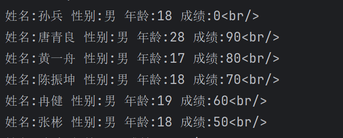

# 作业

- 1.实现两个数比较大小,返回最大值

- 2.实现两个数的值进行交换

  ### 实现两个数比较大小,返回最大值

  ```php
  //TODO:方法一
      class num_compare{
    z  public $num_a;
      public $num_b;
          // __construct 为构造函数 '->'相当于java中的'.' 
      public function __construct($num_a,$num_b){
          $this->num_a=$num_a;
          $this->num_b=$num_b;
      }
          //这里使用了max(number1,number2)比较大小
      public function max_num(){
  		echo "<br/>/n".max($this->num_a,$this->num_b);
      }
  }
  $num_test1=new num_compare(100,200);
  $num_test1->max_num();    
  ```

  ```php
  //TODO:方法二
  class num_compare
  {
      public $num_c;
      public $num_d;
      public function __construct($num_c, $num_d)
      {
          $this->num_c = $num_c;
          $this->num_d = $num_d;
      }
  
      public function max_num()
      {
          //这里用了if分支判断大小
          if ($this->num_c > $this->num_d) {
              echo "<br/>/n" . $this->num_c;
          } else {
              echo "<br/>/n" . $this->num_d;
          }
      }
  }
  $num_test2=new num_compare(200, 400);
  $num_test2->max_num();  
  ```

  ### 实现两个数的值进行交换

  ```php
  //TODO:方法一
  class exchange_num{
      public $num_1;
      public $num_2;
      public function __construct($num_1,$num_2){
          $this->num_1=$num_1;
          $this->num_2=$num_2;
      }
      public function exchange(){
          //这里定义了一个临时变量num_temp进行相互赋值,num_temp->num_1->num_2->num_temp
          $num_temp=$this->num_1;
          $this->num_1=$this->num_2;
          $this->num_2=$num_temp;
          echo "<br/>/n".$this->num_1;
          echo "<br/>/n".$this->num_2;
      }
  }
  $exchange_test1=new exchange_num(200,300);
  $exchange_test1->exchange();
  ```

  ```php
  //TODO:方法二
  class exchange_num{
      public $num_3;
      public $num_4;
      public function __construct($num_3,$num_4){
          $this->num_3=$num_3;
          $this->num_4=$num_4;
      }
      public function exchange(){
          //用了一个变量temp=a+b,然后 a=temp-b 和 b=temp-a 的思想
          $num_temp=$this->num_3+$this->num_4;
          $this->num_3=$num_temp-$this->num_4;
          $this->num_4=$num_temp-$this->num_3;
          echo "<br/>/n".$this->num_3;
          echo "<br/>/n".$this->num_4;
      }
  }
  $exchange_test1=new exchange_num(400,600);
  $exchange_test1->exchange();
  ```

  ### 定义一个cattle_horses类

  ```php
  class cattle_horses
  {
      public $name;
      public $age;
      public $sex;
  
      public function __construct($name, $age, $sex)
      {
          $this->name = $name;
          $this->age = $age;
          $this->sex = $sex;
      }
  
      public function msg()
      {
          echo "姓名:" . $this->name . "<br>/n";
          echo "年龄:" . $this->age . "<br>/n";
          echo "性别:" . $this->sex . "<br>/n";
      }
  
  }
  
  $bull = new cattle_horses("唐青良", 18, "男");
  $house = new cattle_horses("黄一舟", 20, "女");
  $bull->msg();
  $house->msg();
  ```

  

# 知识点

```php
<?php
echo "Hello World!<br/>/n";
echo "This is a test file.<br/>/n";
$color = "red";
echo "My favorite color is  color.<br/>/n";
$COLOR = "blue";
echo "My favorite color is $COLOR.<br/>/n";
$star = "蓝心羽";
echo "$star no secret<br/>/n";

$the_date = date("Y-m-d");
echo "The date is $the_date.<br/>/n";
$bool = true;
var_dump(gettype($the_date));

$x = 10000000;
$y = 343832489;
echo $x + $y;
echo "/n";  //换行,也可以用PHP_EOL,或者<br/>
echo "This is a test file.<br/>/n";

//EOF标记
echo <<<测试
        <h1>我的第一个标题</h1>
        <p>我的第一个段落。</p>
测试;
// 结束需要独立一行且前后不能空格
echo "hello/n";

$z = 1;
echo "<h$z>PHP 很有趣!</h$z>/n";  //输出 <h1>PHP 很有趣!</h1>
echo "fu*****k &*&^%^&$%&&**((*###$$<br/>/n";

$cars = array("BMW", "BYD", "Audi");
//var_dump($cars); //输出数组类型和值
//遍历数组
foreach ($cars as $value) {
    echo "$value <br/>/n";
}

//拼接字符串
$tex1 = "蓝心羽";
$tex2 = "喜欢吃番茄<br/>/n";
echo $tex1 . $tex2;


//$count = 75;
//$grade=($count>=60?"及格/n":"不及格/n");
//echo $grade;

//TODO:九九乘法表
//for ($i=1;$i<=9;$i++){
//    for ($j=1;$j<=$i;$j++){
//        echo "$j X $i= ".$i*$j." ";
//    }
//    echo "<br/>/n";
//}

//TODO:1到100的累加和
$sum = 0;
for ($i = 1; $i <= 100; $i++) {
    $sum += $i;
}
echo "1到100的累加和为:$sum<br/>/n";


//TODO:1到100质数
//for ($i=1;$i<=100;$i++){
//    for ($j=2;$j<$i;$j++){
//        if ($i%$j==0){
//            break;
//        }
//    }
//    if ($j==$i){
//        echo "$i ";
//    }
//}

//TODO:输出2024年有31天的月份
//switch (date("m")){
//    case 1:
//    case 3:
//    case 5:
//    case 7:
//    case 8:
//    case 10:
//    case 12:
//        echo "2024年有31天的月份有：1月、3月、5月、7月、8月、10月、12月<br/>/n";
//        break;
//    case 4:
//    case 6:
//    case 9:
//    case 11:
//        echo "2024年有30天的月份有：4月、6月、9月、11月<br/>/n";
//        break;}


//通过索引访问数组
$cars = array("bicycle", "falali", "lxy", "tomato");
echo "I like " . $cars[0] . "<br/>/n";
echo "she likes " . $cars[1] . "<br/>/n"; //第三人称单数所以likes
echo count($cars); //输出数组元素个数
echo "<br/>/n";
echo sizeof($cars);
echo "<br/>/n";
for ($i = 0; $i < count($cars); $i++) {
    echo $cars[$i] . "<br/>/n"; //输出数组元素
}

$age = array("Peter" => "35", "Ben" => "37", "Joe" => "43");
echo "Peter" . $age['Peter'] . "岁了<br/>/n";
foreach ($age as $key => $value) {
    echo "姓名:" . $key . " 年龄:" . $value . "<br/>/n";
}

//二维数组
$cars= array(
    array("Volvo",22,18),
    array("BMW",15,13),
    array("Saab",5,2),
    array("Land Rover",17,15)
);
echo $cars[0][0];
echo "<br/>/n";

//TODO:创建一个包含学生信息的多维数组,每一个学生都有名字,性别,年龄,成绩,并输出
$student=array(
    array("孙兵","男","18","0"),
    array("唐青良","男","28","90"),
    array("黄一舟","男","17","80"),
    array("陈振坤","男","18","70"),
    array("冉健","男","19","60"),
    array("张彬","男","18","50"),
    );
foreach ($student as $key=>$value){
    echo "姓名:".$value[0]." 性别:".$value[1]." 年龄:".$value[2]." 成绩:".$value[3]."<br/>/n";
}

$student=array(
    array("name"=>"孙兵","age"=>"18","grades"=>"0"),
    array("name"=>"唐青良","age"=>"28","grades"=>"90"),
    array("name"=>"黄一舟","age"=>"17","grades"=>"80"),
    array("name"=>"陈振坤","age"=>"18","grades"=>"70"),
    array("name"=>"冉健","age"=>"19","grades"=>"60"),
    array("name"=>"张彬","age"=>"18","grades"=>"50"),
);
foreach($student as $key=>$value){
    echo "姓名:".$value['name']." 年龄:".$value['age']." 成绩:".$value['grades']."<br/>/n";
}

//通过赋值,增加数组元素
$arrays = array("age" => "25");
$arrays["name"] = "lxy";
print_r($arrays);

//使用array_push()函数追加数组元素(入栈)
$a=array("lxy","tomato","smile");
array_push($a,"bicycle","falali");
//print_r($a); //输出Array ( [0] => lxy [1] => tomato [2] => smile [3] => bicycle [4] => falali )

//使用array_unshift()函数在数组开头插入一个或多个元素(入队)
array_unshift($a,"bicycle","falali");
//print_r($a); //输出Array ( [0] => bicycle [1] => falali [2] => lxy [3] => tomato [4] => smile )

//使用array_pop()函数删除数组最后一个元素(出栈)
$a=array("red","green","blue");
array_pop($a);
//print_r($a); //输出Array ( [0] => red [1] => green )

//使用array_shift()函数删除数组第一个元素(出队)
array_shift($a);
//print_r($a); //输出Array ( [0] => green )

//数组排序
$num_list=array(4,6,2,22,11,2000,111,223,44);
sort($num_list);
print_r($num_list); //升序排序
rsort($num_list);
print_r($num_list); //降序排序
```

### 总结

- $this->num_a的使用和java类似,'->'相当于java中的 '.' , '->' 后面的num_a不需要$
- 注意php使用相对繁琐,记得每一句结尾都要加 ";"
