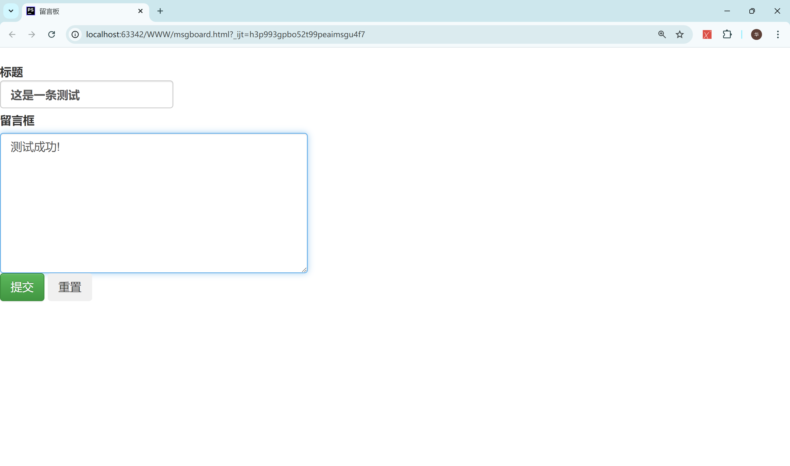

# 常规数据操作

### 步骤 1: 创建数据库和表

首先，我们创建数据库 `genshin_impact` 和表 `characters`，并定义表结构如下：

```sql
-- 创建数据库
create database genshin_impact;

-- 使用创建的数据库
use genshin_impact;

-- 创建表
create table characters (
    id into auto_increment primary key,  #id自增
    name varcahr(255),
    element varchar(50),
    weapon carchar(100),
    level int
);
```

### 步骤 2: 插入数据

接下来，我们向 `characters` 表中插入指定的角色数据：

```sql
-- 插入数据
insert into characters (name, element, weapon, level)
values
    ('刻晴', '雷', '单手剑', 80),
    ('胡桃', '火', '长枪', 90),
    ('莫娜', '水', '法器', 70);
```

### 步骤 3: 查询数据

现在我们来执行几个查询来查看插入的数据：

1. 查询所有角色的信息：

```sql
select * from characters;
```


2. 查询等级大于75的角色：

```sql
select * from characters where level > 75;
```

3. 查询元素为火的角色：

```sql
select * from characters where element = '火';
```

### 步骤 4: 更新数据

接下来，更新角色 `莫娜` 的等级为 80：

```sql
update characters set level = 80 where name = '莫娜';
```

### 步骤 5: 删除数据

最后，删除所有等级低于80的角色：

```sql
delete from characters where level < 80;
```


# 留言板2.0

### html代码

```html
<!DOCTYPE html>
<html lang="en">
<head>
    <meta charset="UTF-8">
    <title>留言板</title>
    <link rel="stylesheet" href="static/bootstrap-3.4.1-dist/css/bootstrap.min.css">
    <link rel="stylesheet" href="static/bootstrap-3.4.1-dist/css/bootstrap-theme.min.css">

</head>
<body>
<form action="msgboard.php" method="post"><br>
    <label for="textarea1">标题
        <input type="text" class="form-control" placeholder="请输入标题" aria-label="title" name="title">
    </label><br>
    <label for="textarea1">留言框</label>
    <textarea name="content" class="form-control" id="textarea1" rows="6" cols="60" placeholder="请输入遗言..." style="height: 171px; width: 374px;"></textarea>

    <button type="submit" class="btn btn-success">提交</button>
    <button type="reset" class="btn btn-light">重置</button>

</form>
</body>
</html>
```

### php代码

```php
<?php

//header是用于设置HTTP响应头，告诉浏览器返回的内容类型是text/html，字符集是UTF-8。
header("Content-Type: text/html; charset=utf-8");
date_default_timezone_set('PRC'); //设置时区为中国

//如果$_POST['title']和$_POST['content']为空，则弹出提示框并返回上一页
if (empty($_POST['title']) || empty($_POST['content'])) {
    echo "<script>alert('标题或内容不能为空！');window.history.back();</script>";
}

//TODO:将留言写入txt文件
//} else {
//    $title = htmlspecialchars($_POST['title'], ENT_QUOTES, 'UTF-8');
//    $content = htmlspecialchars($_POST['content'], ENT_QUOTES, 'UTF-8');
//    $filename = "msgboard.txt";
//    $time = date("Y-m-d H:i:s");
//    $message = '标签: ' . $title . '<br>' . "/n" . '内容: ' . $content . '<br>' . "/n" . '留言时间: ' . $time . '<br>' . "/n";
//
//    if (file_put_contents($filename, $message, FILE_APPEND | LOCK_EX)) {
//        echo "<script>alert('留言成功！');</script>";
//    }
//    // 可选择性地读取并显示文件内容
//    echo "<pre>";
//    readfile($filename);
//    echo "</pre>";
//}

//TODO:将留言插入数据库
else {
    // 建立连接
    $servername = "localhost";
    $username = "root";
    $password = "root";
    $conn = mysqli_connect($servername, $username, $password);

    // 检查连接
    if (!$conn) {
        die("连接失败: " . mysqli_connect_error());
    }

    // 如果不存在则创建数据库
    $sql_create_db = "create database if not exists msgboard";
    mysqli_query($conn, $sql_create_db);

    // 选择数据库
    mysqli_select_db($conn, "msgboard");

    // 如果不存在则创建表格
    $sql_create_table = "create table if not exists msgboard (
        id int(6) unsigned auto_increment primary key ,   # id自增,主键
        title varchar(255)not null ,    #标题,不为空
        content text not null ,       #内容,不为空
        time timestamp default current_timestamp on update current_timestamp  
    )"; //时间戳,默认当前时间
    mysqli_query($conn, $sql_create_table);

    // 将消息插入数据库
    $title = htmlspecialchars($_POST['title'], ENT_QUOTES, 'UTF-8');  // htmlspecialchars函数用于防止SQL注入,ENT_QUOTES参数用于将双引号和单引号转义
    $content = htmlspecialchars($_POST['content'], ENT_QUOTES, 'UTF-8'); 
    $time = date("Y-m-d H:i:s"); //获取当前时间
    $sql = "insert into msgboard (title, content, time) VALUES ('$title', '$content', '$time')"; 

    if ($conn->query($sql) === TRUE) {  //$conn->query($sql)判断sql语句是否执行成功
        echo "<script>alert('留言成功！');</script>";
    } else {
        echo "留言失败!";
    }
    $conn->close();
    echo "<script>window.location.href='msgboard.html';</script>";  //跳转回留言板页面
}


```

### 效果展示

- 页面提交留言



- 查询插入的留言信息


### 总结

- ``header("Content-Type: text/html; charset=utf-8");``这里一定要注意,Content-Type:text/html不要受补全影响,补全给的是text/css运行的时候会出问题

- ``$title = htmlspecialchars($_POST['title'], ENT_QUOTES, 'UTF-8');``这里的'UTF-8'必须是大写,我试过小写的不行

- 步骤:主要分为几个部分,第一步检查用户输入是否为空,然后在开始进行数据入库的操作.数据入库首先需要使用``mysqli_connect()``建立连接,

  里面至少需要传递3个参数,服务名,用户名,密码,(可附加数据库名),然后进行校验检查是否连接成功,连接失败用``mysqli_connect_error()``返回连接错误,接下来就是使用``if not exists``(没有就创建)创建数据库和表,设置合理的字段名和主键.数据库创建好了需要使用``mysqli_select_db``来选择数据库(需要传``mysqli_connect()``和数据库名),使用``mysqli_query``操作sql语句,然后使用``mysqli_connect()->query($sql)``校验是否插入成功,最后断开数据库,返回留言板页面.

  
