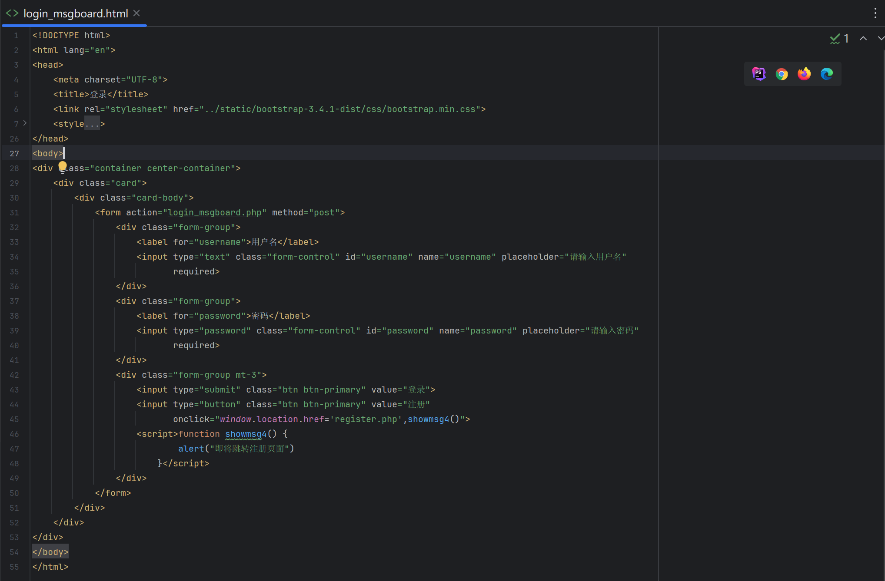

# 留言板4.0

- 前面都着重去写代码了,没有详细写代码写作思路,在代码中css样式部分可以忽略不看,我将详细介绍写作思路,保证拿着代码可以顺利运行

- 我会以正常的逻辑写代码,注释也会详细的去写

### 项目结构

```
首先创建一个文件夹(我这里就叫留言板),下面是写作用到的五个php文件(可以提前创建好)
```


### login_msgboard.html设计

- 先写登陆页面,login_msgboard.php(html和php代码放在一起的,但是实质上我是先写html文件,然后在把html代码粘贴过来),我们先创建一个叫``login_msgboard.html``来写html,写完后复制粘贴然后删了.

  

  ```html
  <!DOCTYPE html>
  <html lang="en">
  <head>
      <meta charset="UTF-8">
      <title>登录</title>
      <!--我个人喜欢用TODO来让代码高亮显示,没有什么具体的作用-->
      <!--TODO:这里你需要在创建留言板的相同目录下创建一个static的文件夹,放入bootstrap的文件(解压后的),对样式不关注的不用写,只是有点难看,但是功能都是实现了的-->
      <link rel="stylesheet" href="../static/bootstrap-3.4.1-dist/css/bootstrap.min.css">
      <style>
          .center-container {
              display: flex;
              justify-content: center;
              align-items: center;
              height: 100vh;
          }
  
          .card {
              width: 400px;
          }
  
          body {
              background-image: url("snow.jpg");
              background-size: cover;
              background-position: center;
              color: white;
          }
      </style>
  </head>
  <body>
  
  <!--TODO:这是用来让登录框居中的-->
  <div class="container center-container">
      <div class="card">
          <div class="card-body">
              <form action="login_msgboard.php" method="post">  <!--TODO:这里需要填写你创建留言板时的php文件名-->
                  <div class="form-group">
                      <label for="username">用户名</label>  <!--label标签的作用是让用户知道这个输入框是干什么的(可以不要,不要会有警告不影响执行)-->
                      <!--placeholder属性的作用是当用户没有输入内容时,显示提示信息,value是具体值-->
                      <input type="text" class="form-control" id="username" name="username" placeholder="请输入用户名"
                             required>
                  </div>
                  <div class="form-group">
                      <label for="password">密码</label>
                      <!--这里type="password"的作用是让密码显示为*,密码一般不会明文显示,required属性的作用是让这个输入框必须填写-->
                      <input type="password" class="form-control" id="password" name="password" placeholder="请输入密码"
                             required>
                  </div>
                  <!--TODO:这个form-group mt-3的作用是让这个div和下一个div之间有一些空隙,submit和button的区别是submit会提交表单,button不会-->
                  <div class="form-group mt-3">
                      <input type="submit" class="btn btn-primary" value="登录">
  
                      <!--这里点击注册按钮后,弹出提示框然后跳转到注册页面-->
                      <input type="button" class="btn btn-primary" value="注册"
                             onclick="window.location.href='register.php',showmsg4()">
                      <script>function showmsg4() {
                          //用户点击注册按钮后,弹出提示框
                          alert("即将跳转注册页面")
                      }</script>
                  </div>
              </form>
          </div>
      </div>
  </div>
  </body>
  </html>
  ```
  
  - 我们看一看效果(图片可以自己去找,bootstrap可以去https://v3.bootcss.com/getting-started/这里下载)
  
    

### login_msgboard.php设计

- 将前面写的登录页的html放入php里,然后把html删了

- 在html下面开始写php

  

  

- 在开始写php代码之前,我们先打开cmd连接数据库创建一个叫``msgboard``的数据库

- 命令 ``create database msgboard;``

  

```php+HTML
<!DOCTYPE html>
<html lang="en">
<head>
    <meta charset="UTF-8">
    <title>登录</title>
    <!--我个人喜欢用TODO来让代码高亮显示,没有什么具体的作用-->
    <!--TODO:这里你需要在创建留言板的相同目录下创建一个static的文件夹,放入bootstrap的文件(解压后的),对样式不关注的不用写,只是有点难看,但是功能都是实现了的-->
    <link rel="stylesheet" href="../static/bootstrap-3.4.1-dist/css/bootstrap.min.css">
    <style>
        .center-container {
            display: flex;
            justify-content: center;
            align-items: center;
            height: 100vh;
        }

        .card {
            width: 400px;
        }

        body {
            background-image: url("snow.jpg");
            background-size: cover;
            background-position: center;
            color: white;
        }
    </style>
</head>
<body>

<!--TODO:这是用来让登录框居中的-->
<div class="container center-container">
    <div class="card">
        <div class="card-body">
            <form action="login_msgboard.php" method="post">  <!--TODO:这里需要填写你创建留言板时的php文件名-->
                <div class="form-group">
                    <label for="username">用户名</label>  <!--label标签的作用是让用户知道这个输入框是干什么的(可以不要,不要会有警告不影响执行)-->
                    <!--placeholder属性的作用是当用户没有输入内容时,显示提示信息,value是具体值-->
                    <input type="text" class="form-control" id="username" name="username" placeholder="请输入用户名"
                           required>
                </div>
                <div class="form-group">
                    <label for="password">密码</label>
                    <!--这里type="password"的作用是让密码显示为*,密码一般不会明文显示,required属性的作用是让这个输入框必须填写-->
                    <input type="password" class="form-control" id="password" name="password" placeholder="请输入密码"
                           required>
                </div>
                <!--TODO:这个form-group mt-3的作用是让这个div和下一个div之间有一些空隙,submit和button的区别是submit会提交表单,button不会-->
                <div class="form-group mt-3">
                    <input type="submit" class="btn btn-primary" value="登录">

                    <!--这里点击注册按钮后,弹出提示框然后跳转到注册页面-->
                    <input type="button" class="btn btn-primary" value="注册"
                           onclick="window.location.href='register.php',showmsg4()">
                    <script>function showmsg4() {
                            //用户点击注册按钮后,弹出提示框
                            alert("即将跳转注册页面")
                        }</script>
                </div>
            </form>
        </div>
    </div>
</div>
</body>
</html>

<?php
session_start();
//$__SERVER["REQUEST_METHOD"] == "POST"表示用户提交了表单
if ($_SERVER["REQUEST_METHOD"] == "POST") {
    $user = $_POST['username'];
    $pwd = $_POST['password'];

    // 连接数据库,这里使用mysqli_connect函数,参数分别是主机名,用户名,密码和数据库名
    $conn = mysqli_connect("localhost", "root", "root", "msgboard");

    // 检查连接
    if (!$conn) {
        die("连接失败: " . mysqli_connect_error());
    }
    //TODO:这里如果不放心是否连接成功,可以添加else分支,单独执行连接的代码(单独创建一个test.php执行),看看是否输出成功
    //    else {
    //        echo "连接成功";
    //    }
    
    // 如果不存在则创建表格
    $sql_create_table = "CREATE TABLE IF NOT EXISTS msgboard (
            id INT(6) UNSIGNED AUTO_INCREMENT PRIMARY KEY,
            title VARCHAR(255) NOT NULL,
            content TEXT NOT NULL,
            time TIMESTAMP DEFAULT CURRENT_TIMESTAMP ON UPDATE CURRENT_TIMESTAMP
        )";

    mysqli_query($conn, $sql_create_table); // TODO:mysql_query函数用于执行SQL语句

    //检查user表是否存在,没有则创建
    $sql = "CREATE TABLE IF NOT EXISTS user (
                id INT(6) UNSIGNED AUTO_INCREMENT PRIMARY KEY,
                username VARCHAR(30) NOT NULL,
                password VARCHAR(30) NOT NULL
            )";
    mysqli_query($conn, $sql);


    // 查询数据库验证用户名和密码
    $sql = "SELECT * FROM user WHERE username = '$user' AND password = '$pwd'";
    $result = mysqli_query($conn, $sql);

    //TODO: 管理员权限,如果登录的是admin的账号直接跳转到管理员专属页面
    if ($user == 'admin' && $pwd == 'admin') {
        $_SESSION['username'] = $user;
        echo "<script>alert('你好啊管理员!');window.location.href='admin.php';</script>";
    }

    // 检查用户名和密码是否匹配,即数据库校验
    if (mysqli_num_rows($result) > 0) {
        //TODO: 登录成功进入留言板页面
        $_SESSION['username'] = $user;
        echo "<script>alert('登录成功！');window.location.href='msgboard.php';</script>";
    } else {
        //TODO: 用户名或密码错误,返回登录页面继续尝试登录
        echo "<script>alert('用户名或密码错误！');window.location.href='login_msgboard.php';</script>";
    }

    mysqli_close($conn);
}
?>

```

- 到这里登录页面就设计好了,有三个页面的跳转
- 1.注册页面的跳转(register.php)
- 2.管理员用户admin的跳转(admin.php)
- 3.登录成功后的留言板页面跳转(msgboard.php)

书写顺序为先写``register.php``(没有注册怎么登录是吧),然后就是``msgboard.php``(必须是这个,没有用户写信息,管理员页面管啥?),最后``admin.php``

### register.html设计

- 注册页面毋庸置疑,样式肯定跟登陆页面差不多,我这里写的不算很好,常规的写法是密码需要输入两次确认是否一致.相对登录页面来说书写简单些

  

```html
<!DOCTYPE html>
<html lang="en">
<head>
    <meta charset="UTF-8">
    <title>注册页面</title>
    <link rel="stylesheet" href="../static/bootstrap-3.4.1-dist/css/bootstrap.min.css">
    <style>
        .center-container {
            display: flex;
            justify-content: center;
            align-items: center;
            height: 100vh;
        }

        .card {
            width: 400px;
        }

        body {
            background-image: url("snow.jpg");
            background-size: cover;
            background-position: center;
            color: white;
        }
    </style>
</head>
<body>
<div class="container center-container">
    <div class="card">
        <div class="card-body">
            <form action="register.php" method="post">
                <div class="form-group">
                    <label for="username">用户名</label>
                    <input type="text" class="form-control" id="username" name="username" placeholder="请输入用户名"
                           required>
                </div>
                <div class="form-group">
                    <label for="password">密码</label>
                    <input type="password" class="form-control" id="password" name="password" placeholder="请输入密码"
                           required>
                </div>
                <!--这里是跳转回登录页面,账号有了可以点击直达登录页面-->
                <a href="login_msgboard.php" style="color: #3f89ec">已有账号，去登录</a>
                <br>
                <button type="submit" class="btn btn-primary" name="submit">注册</button>
                <br>
            </form>
        </div>
    </div>
</div>
</body>
</html>
```

- 看一看效果

  

### register.php设计

- 同理将注册页面的html放入php文件里


- 因为没有对数据库代码进行函数的封装,也没使用``include``,所以代码相对比较冗余,不过比较容易懂

```php+HTML
<!DOCTYPE html>
<html lang="en">
<head>
    <meta charset="UTF-8">
    <title>注册页面</title>
    <link rel="stylesheet" href="../static/bootstrap-3.4.1-dist/css/bootstrap.min.css">
    <style>
        .center-container {
            display: flex;
            justify-content: center;
            align-items: center;
            height: 100vh;
        }

        .card {
            width: 400px;
        }

        body {
            background-image: url("snow.jpg");
            background-size: cover;
            background-position: center;
            color: white;
        }
    </style>
</head>
<body>
<div class="container center-container">
    <div class="card">
        <div class="card-body">
            <form action="register.php" method="post">
                <div class="form-group">
                    <label for="username">用户名</label>
                    <input type="text" class="form-control" id="username" name="username" placeholder="请输入用户名"
                           required>
                </div>
                <div class="form-group">
                    <label for="password">密码</label>
                    <input type="password" class="form-control" id="password" name="password" placeholder="请输入密码"
                           required>
                </div>
                <!--这里是跳转回登录页面,账号有了可以点击直达登录页面-->
                <a href="login_msgboard.php" style="color: #3f89ec">已有账号，去登录</a>
                <br>
                <button type="submit" class="btn btn-primary" name="submit">注册</button>
                <br>
            </form>
        </div>
    </div>
</div>
</body>
</html>

<?php
//连接数据库
$servername = "localhost";
$username = "root";
$password = "root";
$dbname = "msgboard";
$conn = new mysqli($servername, $username, $password, $dbname);
if ($conn->connect_error) {
    die("连接失败: " . $conn->connect_error);
}
// 如果不存在则创建表格
$sql_create_table = "CREATE TABLE IF NOT EXISTS msgboard (
            id INT(6) UNSIGNED AUTO_INCREMENT PRIMARY KEY,
            title VARCHAR(255) NOT NULL,
            content TEXT NOT NULL,
            time TIMESTAMP DEFAULT CURRENT_TIMESTAMP ON UPDATE CURRENT_TIMESTAMP
        )";

mysqli_query($conn, $sql_create_table);
//检查user表是否存在,没有则创建
$sql = "CREATE TABLE IF NOT EXISTS user (
                id INT(6) UNSIGNED AUTO_INCREMENT PRIMARY KEY,
                username VARCHAR(30) NOT NULL,
                password VARCHAR(30) NOT NULL
            )";
mysqli_query($conn, $sql);

//TODO:先在页面做账号密码的检查,看看是否合法,合法了再跟数据库大哥说话
//如果用户点击注册,判断注册的账号密码是否合法或者存在
if (isset($_POST['submit'])) {
    if (empty($_POST['username']) || empty($_POST['password'])) {
        echo "<script>alert('用户名或密码不能为空!');history.back();</script>";
    } else {
        if (strlen($_POST['username']) < 6 || strlen($_POST['password']) < 6) {
            echo "<script>alert('用户名或密码长度不能小于6位!');history.back();</script>";
        } else {
            //检查user表是否存在,没有则创建
            $sql = "CREATE TABLE IF NOT EXISTS user (
                id INT(6) UNSIGNED AUTO_INCREMENT PRIMARY KEY,
                username VARCHAR(30) NOT NULL,
                password VARCHAR(30) NOT NULL
            )";
            mysqli_query($conn, $sql);
            
            //TODO:获取用户提交的账号密码
            $username = $_POST['username'];
            $password = $_POST['password'];
            //查询数据库中是否存在该用户名
            $sql = "SELECT * FROM user WHERE username = '$username'";
            //TODO:也可以这样写,$result=mysqli_query($conn, $sql);
            //TODO:看个人喜欢,为什么>0呢,因为查询结果是一个对象,对象中有一个属性num_rows,表示查询结果中行数,如果大于0,说明存在该用户名
            $result = $conn->query($sql); 
            if ($result->num_rows > 0) {
                echo "<script>alert('该用户名已存在!');history.back();</script>";
            } else {
                //将用户名和密码插入数据库
                $sql = "INSERT INTO user (username, password) VALUES ('$username', '$password')";
                
                //TODO:为什么要这样写呢,因为mysqli_query()函数执行成功返回true,执行失败返回false,所以需要判断返回值是否为true
                if ($conn->query($sql) === TRUE) {
                    //注册成功后就会返回到登录页面
                    echo "<script>alert('注册成功!');window.location.href='login_msgboard.php';</script>";
                } else {
                    echo "<script>alert('注册失败!');history.back();</script>";
                }
            }
        }
    }
}
$conn->close();
?>

```

### msgboard.html设计

- 这个页面没啥含金量,就是一个常规的表单提交,代码看着多也只是做了美化
- 唯一就是多了个登出页面的跳转

```html
<!DOCTYPE html>
<html lang="en">
<head>
    <meta charset="UTF-8">
    <title>留言板</title>
    <link rel="stylesheet" href="https://stackpath.bootstrapcdn.com/bootstrap/4.5.2/css/bootstrap.min.css">
    <style>
        body {
            background-image: url("snow.jpg");
            background-size: cover;
            background-position: center;
            color: #f5f5f5;
            margin: 0;
            height: 100vh;
            font-family: 'Segoe UI', Tahoma, Geneva, Verdana, sans-serif;
            display: flex;
            justify-content: center;
            align-items: center;
        }

        .card {
            background-color: rgba(255, 255, 255, 0.15);
            padding: 30px;
            border-radius: 12px;
            box-shadow: 0 10px 30px rgba(0, 0, 0, 0.2);
            backdrop-filter: blur(10px);
            width: 100%;
            max-width: 400px;
        }

        .form-control {
            background-color: rgba(255, 255, 255, 0.25);
            border: none;
            color: #fff;
        }

        .form-control::placeholder {
            color: #ddd;
        }

        .form-control:focus {
            box-shadow: none;
            background-color: rgba(255, 255, 255, 0.4);
        }

        .btn {
            width: 100%;
            padding: 10px;
            border-radius: 25px;
            font-weight: bold;
        }

        .btn-success {
            background: linear-gradient(135deg, #32a852, #56db7d);
            border: none;
        }

        .btn-light {
            background: linear-gradient(135deg, #ddd, #fff);
            border: none;
            color: #333;
        }

        .btn-danger {
            background: linear-gradient(135deg, #e74c3c, #ff6e6e);
            border: none;
        }

        .btn:hover {
            opacity: 0.9;
        }

        .form-group {
            margin-bottom: 20px;
        }
    </style>
</head>
<body>
<div class="card">
    <form action="msgboard.php" method="post">
        <div class="form-group">
            <label for="title">标题</label>
            <input type="text" class="form-control" placeholder="请输入标题" aria-label="title" name="title">
        </div>
        <div class="form-group">
            <label for="textarea1">留言框</label>
            <textarea name="content" class="form-control" id="textarea1" rows="6"
                      placeholder="请输入遗言..."></textarea>
        </div>
        <button type="submit" class="btn btn-success">提交</button>
        <button type="reset" class="btn btn-light">重置</button>
        <!--TODO:这里多了一个退出按钮,也可以不用写登出的php,直接返回登录页面-->
        <a href="logout_msgboard.php" class="btn btn-danger mt-3" onclick="showmsg5()">退出</a>
        <script>
            function showmsg5() {
                alert("退出成功！");
            }
        </script>
    </form>
</div>
</body>
</html>
```

### msgboard.php设计

- 同样的道理把html放入php


```php+HTML
<!DOCTYPE html>
<html lang="en">
<head>
    <meta charset="UTF-8">
    <title>留言板</title>
    <link rel="stylesheet" href="https://stackpath.bootstrapcdn.com/bootstrap/4.5.2/css/bootstrap.min.css">
    <style>
        body {
            background-image: url("snow.jpg");
            background-size: cover;
            background-position: center;
            color: #f5f5f5;
            margin: 0;
            height: 100vh;
            font-family: 'Segoe UI', Tahoma, Geneva, Verdana, sans-serif;
            display: flex;
            justify-content: center;
            align-items: center;
        }

        .card {
            background-color: rgba(255, 255, 255, 0.15);
            padding: 30px;
            border-radius: 12px;
            box-shadow: 0 10px 30px rgba(0, 0, 0, 0.2);
            backdrop-filter: blur(10px);
            width: 100%;
            max-width: 400px;
        }

        .form-control {
            background-color: rgba(255, 255, 255, 0.25);
            border: none;
            color: #fff;
        }

        .form-control::placeholder {
            color: #ddd;
        }

        .form-control:focus {
            box-shadow: none;
            background-color: rgba(255, 255, 255, 0.4);
        }

        .btn {
            width: 100%;
            padding: 10px;
            border-radius: 25px;
            font-weight: bold;
        }

        .btn-success {
            background: linear-gradient(135deg, #32a852, #56db7d);
            border: none;
        }

        .btn-light {
            background: linear-gradient(135deg, #ddd, #fff);
            border: none;
            color: #333;
        }

        .btn-danger {
            background: linear-gradient(135deg, #e74c3c, #ff6e6e);
            border: none;
        }

        .btn:hover {
            opacity: 0.9;
        }

        .form-group {
            margin-bottom: 20px;
        }
    </style>
</head>
<body>
<div class="card">
    <form action="msgboard.php" method="post">
        <div class="form-group">
            <label for="title">标题</label>
            <input type="text" class="form-control" placeholder="请输入标题" aria-label="title" name="title">
        </div>
        <div class="form-group">
            <label for="textarea1">留言框</label>
            <textarea name="content" class="form-control" id="textarea1" rows="6"
                      placeholder="请输入遗言..."></textarea>
        </div>
        <button type="submit" class="btn btn-success">提交</button>
        <button type="reset" class="btn btn-light">重置</button>
        <!--TODO:这里多了一个退出按钮,也可以不用写登出的php,直接返回登录页面-->
        <a href="logout_msgboard.php" class="btn btn-danger mt-3" onclick="showmsg5()">退出</a>
        <script>
            function showmsg5() {
                alert("退出成功！");
            }
        </script>
    </form>
</div>
</body>
</html>

<?php
session_start();
if ($_SERVER["REQUEST_METHOD"] == "POST") {
    if (empty($_POST['title']) || empty($_POST['content'])) {
        echo "<script>alert('请输入标题和内容！');window.location.href='msgboard.php';</script>";
        exit;
    } else {
        // 建立连接
        $servername = "localhost";
        $username = "root";
        $password = "root";
        $dbname = "msgboard";

        // 创建连接
        $conn = mysqli_connect($servername, $username, $password, $dbname);

        // 检查连接
        if (!$conn) {
            die("连接失败: " . mysqli_connect_error());
        }

        // 如果不存在则创建表格
        $sql_create_table = "CREATE TABLE IF NOT EXISTS msgboard (
            id INT(6) UNSIGNED AUTO_INCREMENT PRIMARY KEY,
            title VARCHAR(255) NOT NULL,
            content TEXT NOT NULL,
            time TIMESTAMP DEFAULT CURRENT_TIMESTAMP ON UPDATE CURRENT_TIMESTAMP  #记录留言时间
        )";

        mysqli_query($conn, $sql_create_table);

        //检查user表是否存在,没有则创建
        $sql = "CREATE TABLE IF NOT EXISTS user (
                id INT(6) UNSIGNED AUTO_INCREMENT PRIMARY KEY,
                username VARCHAR(30) NOT NULL,
                password VARCHAR(30) NOT NULL
            )";
        mysqli_query($conn, $sql);
        
        
        // 将消息插入数据库,ENT_QUOTES防止SQL注入
        $title = htmlspecialchars($_POST['title'], ENT_QUOTES, 'UTF-8');
        $content = htmlspecialchars($_POST['content'], ENT_QUOTES, 'UTF-8');
        $time = date("Y-m-d H:i:s"); //获取当前时间
        $sql = "INSERT INTO msgboard (title, content, time) VALUES ('$title', '$content', '$time')";

        if (mysqli_query($conn, $sql)) {
            $_SESSION['title'] = $title;
            $_SESSION['content'] = $content;
            $_SESSION['time'] = $time;
            //留言成功后,将留言内容写入user表返回留言页面
            echo "<script>alert('留言成功！');window.location.href='msgboard.php';</script>";
        } else {
            echo "留言失败: " . mysqli_error($conn);
        }

        mysqli_close($conn);
    }
}
?>
```

- 写到这里可以发现没啥多新颖的,if判断大相径庭,前面的登陆页面会写了,写这些基本上没啥问题,就是常规的``增删改查``

### admin.php设计(最难)

- 管理员的页面设计相对就有区别了,需要在html里写php代码,所以html只能写在php中了
- 所以直接创建一个php文件,为啥这个页面``最难``?
- 因为你需要把用户信息查询出来,进行修改或删除,有特定需求还要有添加用户.``增删改查``都用上了


先预览一下页面


```php+HTML
<!--管理员操作界面-->
<!DOCTYPE html>
<html lang="en">
<head>
    <meta charset="UTF-8">
    <title>管理员后台</title>
    <link rel="stylesheet" href="https://stackpath.bootstrapcdn.com/bootstrap/4.5.2/css/bootstrap.min.css">
    <style>
        body {
            background-image: url("snow.jpg");
            background-size: cover;
            background-position: center;
            color: #333;
            margin: 0;
            height: 100vh;
            font-family: 'Segoe UI', Tahoma, Geneva, Verdana, sans-serif;
            display: flex;
            justify-content: center;
            align-items: center;
        }

        .container {
            background-color: rgba(255, 255, 255, 0.85);
            padding: 30px;
            border-radius: 12px;
            box-shadow: 0 10px 30px rgba(0, 0, 0, 0.2);
            backdrop-filter: blur(10px);
            max-width: 800px;
            width: 100%;
        }

        .btn {
            padding: 10px 15px;
            border-radius: 25px;
            font-weight: bold;
        }

        .btn-primary {
            background: linear-gradient(135deg, #3498db, #5dade2);
            border: none;
        }

        .btn-danger {
            background: linear-gradient(135deg, #e74c3c, #ff6e6e);
            border: none;
        }

        .btn:hover {
            opacity: 0.9;
        }

        table {
            width: 100%;
            margin-top: 20px;
        }

        table, th, td {
            border: 1px solid #ddd;
            border-collapse: collapse;
        }

        th, td {
            padding: 10px;
            text-align: center;
        }

        th {
            background-color: #f4f4f4;
        }
    </style>
</head>
<body>
<div class="container">
    <h2 class="text-center">管理员后台</h2>
    <form method="post" action="">
        <input type="hidden" name="action" value="add_user">
        <div class="form-group">
            <label for="username">用户名</label>
            <input type="text" class="form-control" id="username" name="username" required>
        </div>
        <div class="form-group">
            <label for="password">密码</label>
            <input type="password" class="form-control" id="password" name="password" required>
        </div>
        <button type="submit" class="btn btn-primary">添加用户</button>
    </form>

<!--这里是管理员操作界面,table展示用户信息,包括用户ID和用户名,以及编辑和删除按钮-->
    <table>
        <thead>
        <tr>
            <th>用户ID</th>
            <th>用户名</th>
            <th>操作</th>
        </tr>
        </thead>
        <tbody>
        <?php
        // 获取用户数据
        $conn = mysqli_connect("localhost", "root", "root", "msgboard");
        $sql = "SELECT id, username FROM user";
        $result = mysqli_query($conn, $sql);
        
        // 当>0时,输出用户信息
        if (mysqli_num_rows($result) > 0) {
            // while循环输出用户信息
            while ($row = mysqli_fetch_assoc($result)) {
                echo "<tr>
                        <td>{$row['id']}</td>
                        <td>{$row['username']}</td>
                        <td>
                            <form method='post' action='' style='display:inline-block;'>
                                <input type='hidden' name='action' value='edit_user'>
                                <input type='hidden' name='id' value='{$row['id']}'>
                                <input type='text' name='username' value='{$row['username']}' required>
                                <input type='password' name='password' placeholder='更新密码' required>
                                <button type='submit' class='btn btn-primary'>编辑</button>
                            </form>
                            <a href='?action=delete_user&id={$row['id']}' class='btn btn-danger' onclick='return confirm(/"确认删除该用户吗？/");'>删除</a>
                        </td>
                      </tr>";
            }
        } else {
            // 当没有用户时,输出提示信息
            echo "<tr><td colspan='3'>暂无用户</td></tr>";
        }
        ?>
        </tbody>
    </table>
</div>
</body>
</html>

<?php
session_start();

// 连接数据库
$conn = mysqli_connect("localhost", "root", "root", "msgboard");
if (!$conn) {
    die("连接失败: " . mysqli_connect_error());
}

// 处理用户添加请求
if ($_SERVER["REQUEST_METHOD"] == "POST" && isset($_POST['action']) && $_POST['action'] == 'add_user') {
    $username = htmlspecialchars($_POST['username'], ENT_QUOTES, 'UTF-8');
    $password = htmlspecialchars($_POST['password'], ENT_QUOTES, 'UTF-8');

    $sql = "INSERT INTO user (username, password) VALUES ('$username', '$password')";
    if (mysqli_query($conn, $sql)) {
        echo "<script>alert('用户添加成功！');</script>";
    } else {
        echo "添加用户失败: " . mysqli_error($conn);
    }
}

// 处理用户编辑请求
if ($_SERVER["REQUEST_METHOD"] == "POST" && isset($_POST['action']) && $_POST['action'] == 'edit_user') {
    $id = $_POST['id'];
    $username = htmlspecialchars($_POST['username'], ENT_QUOTES, 'UTF-8');
    $password = htmlspecialchars($_POST['password'], ENT_QUOTES, 'UTF-8');

    $sql = "UPDATE user SET username='$username', password='$password' WHERE id=$id";
    if (mysqli_query($conn, $sql)) {
        echo "<script>alert('用户更新成功！');</script>";
    } else {
        echo "更新用户失败: " . mysqli_error($conn);
    }
}

// 处理用户删除请求,isset判断是否设置,判断是否为get请求,判断是否为delete_user
if ($_SERVER["REQUEST_METHOD"] == "GET" && isset($_GET['action']) && $_GET['action'] == 'delete_user') {
    $id = $_GET['id'];

    $sql = "DELETE FROM user WHERE id=$id";
    if (mysqli_query($conn, $sql)) {
        echo "<script>alert('用户删除成功！');</script>";
    } else {
        echo "删除用户失败: " . mysqli_error($conn);
    }
}
?>

```

admin.php这个设计没啥说的,就是集合了增删改查,虽然代码看起来比较多,但是都是能看懂的.到这里就完成了设计,详情见源码.


